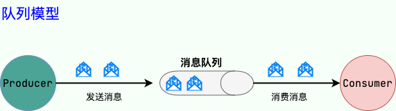

“RabbitMQ？”“Kafka？”“RocketMQ？”...在日常学习与开发过程中，我们常常听到消息队列这个关键词。我也在我的多篇文章中提到了这个概念。可能你是熟练使用消息队列的老手，又或者你是不懂消息队列的新手，不论你了不了解消息队列，本文都将带你搞懂消息队列的一些基本理论。

如果你是老手，你可能从本文学到你之前不曾注意的一些关于消息队列的重要概念，如果你是新手，相信本文将是你打开消息队列大门的一板砖。

## 什么是消息队列？

我们可以把消息队列看作是一个存放消息的容器，当我们需要使用消息的时候，直接从容器中取出消息供自己使用即可。由于队列 Queue 是一种先进先出的数据结构，所以消费消息时也是按照顺序来消费的。

参与消息传递的双方称为生产者和消费者，生产者负责发送消息，消费者负责处理消息。

我们知道操作系统中的进程通信的一种很重要的方式就是消息队列。我们这里提到的消息队列稍微有点区别，更多指的是各个服务以及系统内部各个组件/模块之前的通信，属于一种中间件。

随着分布式和微服务系统的发展，消息队列在系统设计中有了更大的发挥空间，使用消息队列可以降低系统耦合性、实现任务异步、有效地进行流量削峰，是分布式和微服务系统中重要的组件之一。

## 消息队列有什么用？

通常来说，使用消息队列能为我们的系统带来下面三点好处：

1. **通过异步处理提高系统性能（减少响应所需时间）。**
2. **削峰/限流**
3. **降低系统耦合性。**

如果在面试的时候你被面试官问到这个问题的话，一般情况是你在你的简历上涉及到消息队列这方面的内容，这个时候推荐你结合你自己的项目来回答。

### 通过异步处理提高系统性能（减少响应所需时间）

将用户的请求数据存储到消息队列之后就立即返回结果。随后，系统再对消息进行消费。

因为用户请求数据写入消息队列之后就立即返回给用户了，但是请求数据在后续的业务校验、写数据库等操作中可能失败。因此，**使用消息队列进行异步处理之后，需要适当修改业务流程进行配合**，比如用户在提交订单之后，订单数据写入消息队列，不能立即返回用户订单提交成功，需要在消息队列的订单消费者进程真正处理完该订单之后，甚至出库后，再通过电子邮件或短信通知用户订单成功，以免交易纠纷。这就类似我们平时手机订火车票和电影票。

### 削峰/限流

**先将短时间高并发产生的事务消息存储在消息队列中，然后后端服务再慢慢根据自己的能力去消费这些消息，这样就避免直接把后端服务打垮掉。**

举例：在电子商务一些秒杀、促销活动中，合理使用消息队列可以有效抵御促销活动刚开始大量订单涌入对系统的冲击。如下图所示：

### 降低系统耦合性

使用消息队列还可以降低系统耦合性。我们知道如果模块之间不存在直接调用，那么新增模块或者修改模块就对其他模块影响较小，这样系统的可扩展性无疑更好一些。还是直接上图吧：

生产者（客户端）发送消息到消息队列中去，接受者（服务端）处理消息，需要消费的系统直接去消息队列取消息进行消费即可而不需要和其他系统有耦合，这显然也提高了系统的扩展性。

**消息队列使用发布-订阅模式工作，消息发送者（生产者）发布消息，一个或多个消息接受者（消费者）订阅消息。** 从上图可以看到**消息发送者（生产者）和消息接受者（消费者）之间没有直接耦合**，消息发送者将消息发送至分布式消息队列即结束对消息的处理，消息接受者从分布式消息队列获取该消息后进行后续处理，并不需要知道该消息从何而来。**对新增业务，只要对该类消息感兴趣，即可订阅该消息，对原有系统和业务没有任何影响，从而实现网站业务的可扩展性设计**。

消息接受者对消息进行过滤、处理、包装后，构造成一个新的消息类型，将消息继续发送出去，等待其他消息接受者订阅该消息。因此基于事件（消息对象）驱动的业务架构可以是一系列流程。

另外，为了避免消息队列服务器宕机造成消息丢失，会将成功发送到消息队列的消息存储在消息生产者服务器上，等消息真正被消费者服务器处理后才删除消息。在消息队列服务器宕机后，生产者服务器会选择分布式消息队列服务器集群中的其他服务器发布消息。

**备注：** 不要认为消息队列只能利用发布-订阅模式工作，只不过在解耦这个特定业务环境下是使用发布-订阅模式的。除了发布-订阅模式，还有点对点订阅模式（一个消息只有一个消费者），我们比较常用的是发布-订阅模式。另外，这两种消息模型是 JMS 提供的，AMQP 协议还提供了 5 种消息模型。

## 使用消息队列哪些问题？

- **系统可用性降低：** 系统可用性在某种程度上降低，为什么这样说呢？在加入 MQ 之前，你不用考虑消息丢失或者说 MQ 挂掉等等的情况，但是，引入 MQ 之后你就需要去考虑了！
- **系统复杂性提高：** 加入 MQ 之后，你需要保证消息没有被重复消费、处理消息丢失的情况、保证消息传递的顺序性等等问题！
- **一致性问题：** 我上面讲了消息队列可以实现异步，消息队列带来的异步确实可以提高系统响应速度。但是，万一消息的真正消费者并没有正确消费消息怎么办？这样就会导致数据不一致的情况了!

## JMS 和 AMQP

### JMS 是什么？

JMS（JAVA Message Service,java 消息服务）是 java 的消息服务，JMS 的客户端之间可以通过 JMS 服务进行异步的消息传输。**JMS（JAVA Message Service，Java 消息服务）API 是一个消息服务的标准或者说是规范**，允许应用程序组件基于 JavaEE 平台创建、发送、接收和读取消息。它使分布式通信耦合度更低，消息服务更加可靠以及异步性。

JMS 定义了五种不同的消息正文格式以及调用的消息类型，允许你发送并接收以一些不同形式的数据：

- StreamMessage：Java 原始值的数据流
- MapMessage：一套名称-值对
- TextMessage：一个字符串对象
- ObjectMessage：一个序列化的 Java 对象
- BytesMessage：一个字节的数据流

**ActiveMQ（已被淘汰） 就是基于 JMS 规范实现的。**

### JMS 两种消息模型

#### 点到点（P2P）模型

使用**队列（Queue）**作为消息通信载体；满足**生产者与消费者模式**，一条消息只能被一个消费者使用，未被消费的消息在队列中保留直到被消费或超时。比如：我们生产者发送 100 条消息的话，两个消费者来消费一般情况下两个消费者会按照消息发送的顺序各自消费一半（也就是你一个我一个的消费。）

#### 发布/订阅（Pub/Sub）模型

发布订阅模型（Pub/Sub） 使用**主题（Topic）**作为消息通信载体，类似于**广播模式**；发布者发布一条消息，该消息通过主题传递给所有的订阅者，**在一条消息广播之后才订阅的用户则是收不到该条消息的**。

### AMQP 是什么？

AMQP，即 Advanced Message Queuing Protocol，一个提供统一消息服务的应用层标准 **高级消息队列协议**（二进制应用层协议），是应用层协议的一个开放标准，为面向消息的中间件设计，兼容 JMS。基于此协议的客户端与消息中间件可传递消息，并不受客户端/中间件同产品，不同的开发语言等条件的限制。

**RabbitMQ 就是基于 AMQP 协议实现的。**

### JMS vs AMQP

|   对比方向   | JMS                                     | AMQP                                                         |
| :----------: | :-------------------------------------- | :----------------------------------------------------------- |
|     定义     | Java API                                | 协议                                                         |
|    跨语言    | 否                                      | 是                                                           |
|    跨平台    | 否                                      | 是                                                           |
| 支持消息类型 | 提供两种消息模型：①Peer-2-Peer;②Pub/sub | 提供了五种消息模型：①direct exchange；②fanout exchange；③topic change；④headers exchange；⑤system exchange。本质来讲，后四种和 JMS 的 pub/sub 模型没有太大差别，仅是在路由机制上做了更详细的划分； |
| 支持消息类型 | 支持多种消息类型 ，我们在上面提到过     | byte[]（二进制）                                             |

**总结：**

- AMQP 为消息定义了线路层（wire-level protocol）的协议，而 JMS 所定义的是 API 规范。在 Java 体系中，多个 client 均可以通过 JMS 进行交互，不需要应用修改代码，但是其对跨平台的支持较差。而 AMQP 天然具有跨平台、跨语言特性。
- JMS 支持 TextMessage、MapMessage 等复杂的消息类型；而 AMQP 仅支持 byte[] 消息类型（复杂的类型可序列化后发送）。
- 由于 Exchange 提供的路由算法，AMQP 可以提供多样化的路由方式来传递消息到消息队列，而 JMS 仅支持 队列 和 主题/订阅 方式两种。

## 消息队列技术选型

### 常见的消息队列有哪些？

#### Kafka

Kafka 是 LinkedIn 开源的一个分布式流式处理平台，已经成为 Apache 顶级项目，早期被用来用于处理海量的日志，后面才慢慢发展成了一款功能全面的高性能消息队列。

流式处理平台具有三个关键功能：

1. **消息队列**：发布和订阅消息流，这个功能类似于消息队列，这也是 Kafka 也被归类为消息队列的原因。
2. **容错的持久方式存储记录消息流**： Kafka 会把消息持久化到磁盘，有效避免了消息丢失的风险。
3. **流式处理平台：** 在消息发布的时候进行处理，Kafka 提供了一个完整的流式处理类库。

Kafka 是一个分布式系统，由通过高性能 TCP 网络协议进行通信的服务器和客户端组成，可以部署在在本地和云环境中的裸机硬件、虚拟机和容器上。

在 Kafka 2.8 之前，Kafka 最被大家诟病的就是其重度依赖于 Zookeeper 做元数据管理和集群的高可用。在 Kafka 2.8 之后，引入了基于 Raft 协议的 KRaft 模式，不再依赖 Zookeeper，大大简化了 Kafka 的架构，让你可以以一种轻量级的方式来使用 Kafka。

不过，要提示一下：**如果要使用 KRaft 模式的话，建议选择较高版本的 Kafka，因为这个功能还在持续完善优化中。Kafka 3.3.1 版本是第一个将 KRaft（Kafka Raft）共识协议标记为生产就绪的版本。**

Kafka 官网：http://kafka.apache.org/

Kafka 更新记录（可以直观看到项目是否还在维护）：https://kafka.apache.org/downloads

#### RocketMQ

RocketMQ 是阿里开源的一款云原生“消息、事件、流”实时数据处理平台，借鉴了 Kafka，已经成为 Apache 顶级项目。

RocketMQ 的核心特性（摘自 RocketMQ 官网）：

- 云原生：生与云，长与云，无限弹性扩缩，K8s 友好
- 高吞吐：万亿级吞吐保证，同时满足微服务与大数据场景。
- 流处理：提供轻量、高扩展、高性能和丰富功能的流计算引擎。
- 金融级：金融级的稳定性，广泛用于交易核心链路。
- 架构极简：零外部依赖，Shared-nothing 架构。
- 生态友好：无缝对接微服务、实时计算、数据湖等周边生态。

根据官网介绍：

> Apache RocketMQ 自诞生以来，因其架构简单、业务功能丰富、具备极强可扩展性等特点被众多企业开发者以及云厂商广泛采用。历经十余年的大规模场景打磨，RocketMQ 已经成为业内共识的金融级可靠业务消息首选方案，被广泛应用于互联网、大数据、移动互联网、物联网等领域的业务场景。

RocketMQ 官网：https://rocketmq.apache.org/ （文档很详细，推荐阅读）

RocketMQ 更新记录（可以直观看到项目是否还在维护）：https://github.com/apache/rocketmq/releases

#### RabbitMQ

RabbitMQ 是采用 Erlang 语言实现 AMQP(Advanced Message Queuing Protocol，高级消息队列协议）的消息中间件，它最初起源于金融系统，用于在分布式系统中存储转发消息。

RabbitMQ 发展到今天，被越来越多的人认可，这和它在易用性、扩展性、可靠性和高可用性等方面的卓著表现是分不开的。RabbitMQ 的具体特点可以概括为以下几点：

- **可靠性：** RabbitMQ 使用一些机制来保证消息的可靠性，如持久化、传输确认及发布确认等。
- **灵活的路由：** 在消息进入队列之前，通过交换器来路由消息。对于典型的路由功能，RabbitMQ 己经提供了一些内置的交换器来实现。针对更复杂的路由功能，可以将多个交换器绑定在一起，也可以通过插件机制来实现自己的交换器。这个后面会在我们讲 RabbitMQ 核心概念的时候详细介绍到。
- **扩展性：** 多个 RabbitMQ 节点可以组成一个集群，也可以根据实际业务情况动态地扩展集群中节点。
- **高可用性：** 队列可以在集群中的机器上设置镜像，使得在部分节点出现问题的情况下队列仍然可用。
- **支持多种协议：** RabbitMQ 除了原生支持 AMQP 协议，还支持 STOMP、MQTT 等多种消息中间件协议。
- **多语言客户端：** RabbitMQ 几乎支持所有常用语言，比如 Java、Python、Ruby、PHP、C#、JavaScript 等。
- **易用的管理界面：** RabbitMQ 提供了一个易用的用户界面，使得用户可以监控和管理消息、集群中的节点等。在安装 RabbitMQ 的时候会介绍到，安装好 RabbitMQ 就自带管理界面。
- **插件机制：** RabbitMQ 提供了许多插件，以实现从多方面进行扩展，当然也可以编写自己的插件。感觉这个有点类似 Dubbo 的 SPI 机制

RabbitMQ 官网：https://www.rabbitmq.com/ 。

RabbitMQ 更新记录（可以直观看到项目是否还在维护）：https://www.rabbitmq.com/news.html

#### Pulsar

Pulsar 是下一代云原生分布式消息流平台，最初由 Yahoo 开发 ，已经成为 Apache 顶级项目。

Pulsar 集消息、存储、轻量化函数式计算为一体，采用计算与存储分离架构设计，支持多租户、持久化存储、多机房跨区域数据复制，具有强一致性、高吞吐、低延时及高可扩展性等流数据存储特性，被看作是云原生时代实时消息流传输、存储和计算最佳解决方案。

Pulsar 的关键特性如下（摘自官网）：

- 是下一代云原生分布式消息流平台。
- Pulsar 的单个实例原生支持多个集群，可跨机房在集群间无缝地完成消息复制。
- 极低的发布延迟和端到端延迟。
- 可无缝扩展到超过一百万个 topic。
- 简单的客户端 API，支持 Java、Go、Python 和 C++。
- 主题的多种订阅模式（独占、共享和故障转移）。
- 通过 Apache BookKeeper 提供的持久化消息存储机制保证消息传递 。
- 由轻量级的 serverless 计算框架 Pulsar Functions 实现流原生的数据处理。
- 基于 Pulsar Functions 的 serverless connector 框架 Pulsar IO 使得数据更易移入、移出 Apache Pulsar。
- 分层式存储可在数据陈旧时，将数据从热存储卸载到冷/长期存储（如 S3、GCS）中。

Pulsar 官网：https://pulsar.apache.org/

Pulsar 更新记录（可以直观看到项目是否还在维护）：https://github.com/apache/pulsar/releases

#### ActiveMQ

目前已经被淘汰，不推荐使用，不建议学习。

### 如何选择？

> 参考《Java 工程师面试突击第 1 季-中华石杉老师》

| 对比方向 | 概要                                                         |
| -------- | ------------------------------------------------------------ |
| 吞吐量   | 万级的 ActiveMQ 和 RabbitMQ 的吞吐量（ActiveMQ 的性能最差）要比十万级甚至是百万级的 RocketMQ 和 Kafka 低一个数量级。 |
| 可用性   | 都可以实现高可用。ActiveMQ 和 RabbitMQ 都是基于主从架构实现高可用性。RocketMQ 基于分布式架构。 Kafka 也是分布式的，一个数据多个副本，少数机器宕机，不会丢失数据，不会导致不可用 |
| 时效性   | RabbitMQ 基于 Erlang 开发，所以并发能力很强，性能极其好，延时很低，达到微秒级，其他几个都是 ms 级。 |
| 功能支持 | Pulsar 的功能更全面，支持多租户、多种消费模式和持久性模式等功能，是下一代云原生分布式消息流平台。 |
| 消息丢失 | ActiveMQ 和 RabbitMQ 丢失的可能性非常低， Kafka、RocketMQ 和 Pulsar 理论上可以做到 0 丢失。 |

**总结：**

- ActiveMQ 的社区算是比较成熟，但是较目前来说，ActiveMQ 的性能比较差，而且版本迭代很慢，不推荐使用，已经被淘汰了。
- RabbitMQ 在吞吐量方面虽然稍逊于 Kafka 、RocketMQ 和 Pulsar，但是由于它基于 Erlang 开发，所以并发能力很强，性能极其好，延时很低，达到微秒级。但是也因为 RabbitMQ 基于 Erlang 开发，所以国内很少有公司有实力做 Erlang 源码级别的研究和定制。如果业务场景对并发量要求不是太高（十万级、百万级），那这几种消息队列中，RabbitMQ 或许是你的首选。
- RocketMQ 和 Pulsar 支持强一致性，对消息一致性要求比较高的场景可以使用。
- RocketMQ 阿里出品，Java 系开源项目，源代码我们可以直接阅读，然后可以定制自己公司的 MQ，并且 RocketMQ 有阿里巴巴的实际业务场景的实战考验。
- Kafka 的特点其实很明显，就是仅仅提供较少的核心功能，但是提供超高的吞吐量，ms 级的延迟，极高的可用性以及可靠性，而且分布式可以任意扩展。同时 kafka 最好是支撑较少的 topic 数量即可，保证其超高吞吐量。Kafka 唯一的一点劣势是有可能消息重复消费，那么对数据准确性会造成极其轻微的影响，在大数据领域中以及日志采集中，这点轻微影响可以忽略这个特性天然适合大数据实时计算以及日志收集。如果是大数据领域的实时计算、日志采集等场景，用 Kafka 是业内标准的，绝对没问题，社区活跃度很高，绝对不会黄，何况几乎是全世界这个领域的事实性规范。

## 参考

- KRaft: Apache Kafka Without ZooKeeper：https://developer.confluent.io/learn/kraft/
