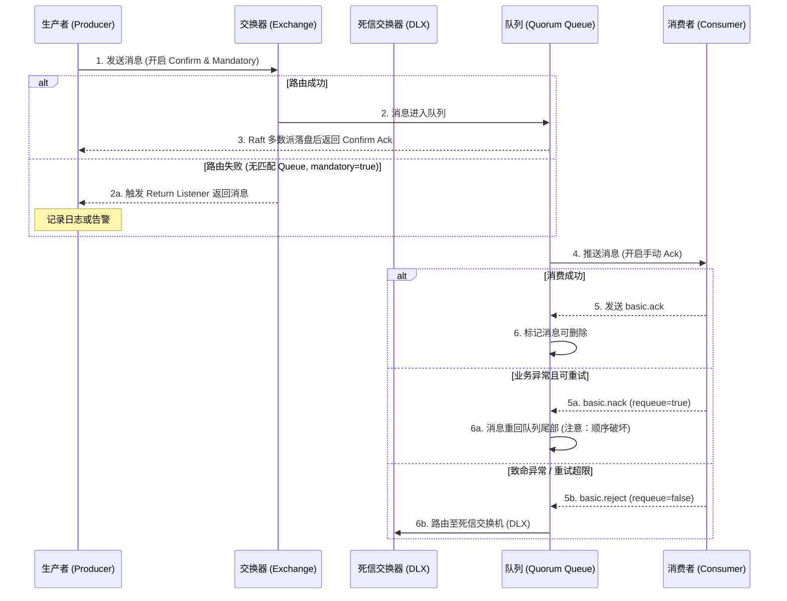

RabbitMQ 作为老牌消息中间件，凭借其成熟的路由机制、丰富的协议支持和完善的可靠性保障，在企业级应用中占据重要地位。但自 RabbitMQ 3.8 引入 Quorum Queue、3.9 引入 Streams、4.0 移除镜像队列以来，其技术架构发生了重大变化，许多传统的最佳实践已不再适用。

本文已针对 RabbitMQ 4.0 进行全面更新，明确标注各特性的版本依赖，特别强调了镜像队列（已移除）、Quorum Queue（推荐）和 Streams（3.9+）的选型差异。

## RabbitMQ 是什么？

RabbitMQ 是一个在 AMQP（Advanced Message Queuing Protocol ）基础上实现的，可复用的企业消息系统。它可以用于大型软件系统各个模块之间的高效通信，支持高并发，支持可扩展。它支持多种客户端如：Python、Ruby、.NET、Java、JMS、C、PHP、ActionScript、XMPP、STOMP 等，支持 AJAX，持久化，用于在分布式系统中存储转发消息，在易用性、扩展性、高可用性等方面表现不俗。

RabbitMQ 是使用 Erlang 编写的一个开源的消息队列，本身支持很多的协议：AMQP、XMPP、SMTP、STOMP，也正是如此，**使得它变得**非常重量级，更适合于企业级的开发。它同时实现了一个 Broker 构架，这意味着消息在发送给客户端时先在中心队列排队，对路由（Routing）、负载均衡（Load Balance）或者数据持久化都有很好的支持。

## RabbitMQ 特点

- **可靠性**：RabbitMQ 使用一些机制来保证可靠性，如持久化、传输确认及发布确认等。
- **灵活的路由**：在消息进入队列之前，通过交换器来路由消息。对于典型的路由功能，RabbitMQ **已经**提供了一些内置的交换器来实现。针对更复杂的路由功能，可以将多个交换器绑定在一起，也可以通过插件机制来实现自己的交换器。
- **扩展性**：多个 RabbitMQ 节点可以组成一个集群，也可以根据实际业务情况动态地扩展集群中的节点。
- **高可用性**：Quorum Queue 基于 Raft 协议实现数据复制，Streams 支持多节点副本，在部分节点出现问题的情况下队列仍然可用。
- **多种协议**：RabbitMQ 除了原生支持 AMQP 协议，还支持 STOMP、MQTT 等多种消息中间件协议。
- **多语言客户端**：RabbitMQ 几乎支持所有常用语言，比如 Java、Python、Ruby、PHP、C#、JavaScript 等。
- **管理界面**：RabbitMQ 提供了一个易用的用户界面，使得用户可以监控和管理消息、集群中的节点等。
- **插件机制**：RabbitMQ 提供了许多插件，以实现从多方面进行扩展，当然也可以编写自己的插件。

## RabbitMQ 核心概念？

RabbitMQ 整体上是一个生产者与消费者模型，主要负责接收、存储和转发消息。可以把消息传递的过程想象成：当你将一个包裹送到邮局，邮局会暂存并最终将邮件通过邮递员送到收件人的手上，RabbitMQ 就好比由邮局、邮箱和邮递员组成的一个系统。从计算机术语层面来说，RabbitMQ 模型更像是一种交换机模型。

RabbitMQ 的整体模型架构如下：


下面我会一一介绍上图中的一些概念。

### Producer(生产者) 和 Consumer(消费者)

- **Producer(生产者)** :生产消息的一方（邮件投递者）
- **Consumer(消费者)** :消费消息的一方（邮件收件人）

消息一般由 2 部分组成：**消息头**（或者说是标签 Label）和 **消息体**。消息体也可以称为 **payload**，消息体是不透明的，而消息头则由一系列的可选属性组成，这些属性包括 routing-key（路由键）、priority（相对于其他消息的优先权）、delivery-mode（指出该消息可能需要持久性存储）等。生产者把消息交由 RabbitMQ 后，RabbitMQ 会根据消息头把消息发送给感兴趣的 Consumer(消费者)。

### Exchange(交换器)

在 RabbitMQ 中，消息并不是直接被投递到 **Queue(消息队列)** 中的，中间还必须经过 **Exchange(交换器)** 这一层，**Exchange(交换器)** 会把我们的消息分配到对应的 **Queue(消息队列)** 中。

**Exchange(交换器)** 用来接收生产者发送的消息并将这些消息路由给服务器中的队列中，如果路由不到，或许会返回给 **Producer(生产者)** ，或许会被直接丢弃掉 。这里可以将 RabbitMQ 中的交换器看作一个简单的实体。

**RabbitMQ 的 Exchange(交换器) 有 4 种类型，不同的类型对应着不同的路由策略**：**direct**，**fanout**, **topic**, 和 **headers**，不同类型的 Exchange 转发消息的策略有所区别。这个会在介绍 **Exchange Types(交换器类型)** 的时候介绍到。

> 注意：AMQP 规范定义了一个默认交换器（Default Exchange），它是一个 pre-declared 的 direct 类型交换器，但创建新交换器时必须显式指定类型，不能省略。

生产者将消息发给交换器的时候，一般会指定一个 **RoutingKey(路由键)**，用来指定这个消息的路由规则，而这个 **RoutingKey 需要与交换器类型和绑定键(BindingKey)联合使用才能最终生效**。

RabbitMQ 中通过 **Binding(绑定)** 将 **Exchange(交换器)** 与 **Queue(消息队列)** 关联起来，在绑定的时候一般会指定一个 **BindingKey(绑定键)** ,这样 RabbitMQ 就知道如何正确将消息路由到队列了,如下图所示。一个绑定就是基于路由键将交换器和消息队列连接起来的路由规则，所以可以将交换器理解成一个由绑定构成的路由表。Exchange 和 Queue 的绑定可以是多对多的关系。

生产者将消息发送给交换器时，需要一个 RoutingKey,当 BindingKey 和 RoutingKey 相匹配时，消息会被路由到对应的队列中。在绑定多个队列到同一个交换器的时候，这些绑定允许使用相同的 BindingKey。BindingKey 并不是在所有的情况下都生效，它依赖于交换器类型，比如 fanout 类型的交换器就会无视，而是将消息路由到所有绑定到该交换器的队列中。

### Queue(消息队列)

**Queue(消息队列)** 用来保存消息直到发送给消费者。它是消息的容器，也是消息的终点。一个消息可投入一个或多个队列。消息一直在队列里面，等待消费者连接到这个队列将其取走。

**RabbitMQ** 在经典架构中，消息只能存储在 **队列** 中，这一点和 **Kafka** 这种消息中间件相反。Kafka 将消息存储在 **topic（主题）** 这个逻辑层面，而相对应的队列逻辑只是 topic 实际存储文件中的位移标识。RabbitMQ 的生产者生产消息并最终投递到队列中，消费者可以从队列中获取消息并消费。

> **版本说明（3.9+ 重要更新）**：从 RabbitMQ 3.9 版本开始，官方引入了 **Streams** 数据结构。Streams 提供了一种类似 Kafka 的 append-only 日志存储模型，支持非破坏性消费、大规模消息堆积以及基于 Offset 的历史数据重放（Replay）。
>
> **架构选型建议**：
>
> - **普通队列**：适用于传统消息队列场景，消息被消费后即删除
> - **Streams**：适用于需要高频重放、海量堆积或事件溯源的场景
> - **核心瓶颈差异**：使用 Stream 时，磁盘 I/O 吞吐量（MB/s）取代了传统的每秒入队率（msg/s）成为核心瓶颈指标

**多个消费者可以订阅同一个队列**，默认情况下队列中的消息会被平均分摊（Round-Robin，即轮询）给多个消费者进行处理，而不是每个消费者都收到所有的消息并处理，这样避免消息被重复消费。

> 注意：实际分发策略受 `prefetch_count` 参数影响。默认行为（`prefetch_count=0`）会尽可能多地分发消息给各 Consumer，可能导致负载不均。推荐设置 `prefetch_count=1` 或更高值，让 Consumer 确认后再发送下一条，实现公平分发。

**RabbitMQ** 不支持队列层面的广播消费,如果有广播消费的需求，需要在其上进行二次开发,这样会很麻烦，不建议这样做。

### Broker（消息中间件的服务节点）

对于 RabbitMQ 来说，一个 RabbitMQ Broker 可以简单地看作一个 RabbitMQ 服务节点，或者 RabbitMQ 服务实例。大多数情况下也可以将一个 RabbitMQ Broker 看作一台 RabbitMQ 服务器。

### Exchange Types(交换器类型)

RabbitMQ 常用的 Exchange Type 有 **fanout**、**direct**、**topic**、**headers** 这四种（AMQP 规范里还提到两种 Exchange Type，分别为 system 与自定义，这里不予以描述）。


**1、fanout（广播模式）**

- **路由规则**：把所有发送到该 Exchange 的消息路由到所有与它绑定的 Queue 中，**忽略 BindingKey**
- **特点**：不需要做任何判断操作，是所有交换机类型里面速度最快的
- **典型使用场景**：
  - 系统配置更新广播（如配置中心推送）
  - 实时排行榜同步（多实例数据同步）
  - 缓存失效广播（如 Redis 缓存清理通知）
  - 日志分发（将日志同时发送到多个存储系统）

**2、direct（直连模式）**

- **路由规则**：把消息路由到那些 BindingKey 与 RoutingKey **完全匹配**的 Queue 中
- **特点**：精确匹配，路由效率高
- **典型使用场景**：
  - **基础点对点任务分发**：根据任务级别路由（如 `error`、`warning`、`info`）
  - 优先级队列：高优先级任务分配更多资源
  - 按服务类型分发（如 `order-service`、`payment-service`）

**示例**：以上图为例，如果发送消息时设置路由键为 `"warning"`，消息会路由到 Queue1 和 Queue2；如果设置路由键为 `"info"` 或 `"debug"`，消息只会路由到 Queue2。

**3、topic（主题模式）**

- **路由规则**：基于 BindingKey 和 RoutingKey 的**模糊匹配**
- **匹配规则**：
  - RoutingKey 为点号 `"."` 分隔的字符串（如 `com.rabbitmq.client`、`order.china.beijing`）
  - BindingKey 中可以使用两种通配符：
    - `"*"`：匹配**一个单词**
    - `"#"`：匹配**零个或多个单词**
- **典型使用场景**：
  - **按地域或业务模块过滤**（如 `order.china.*` 匹配中国所有地区订单）
  - 多级路由（如 `com.rabbitmq.client`、`java.util.concurrent`）
  - 发布订阅系统（分类通知、按标签订阅）

**示例**：

- 路由键为 `"com.rabbitmq.client"` 的消息会同时路由到绑定 `"*.rabbitmq.*"` 和 `"#.client.#"` 的队列
- 路由键为 `"order.china.beijing"` 的消息会路由到绑定 `"order.china.*"` 的队列

**4、headers（不推荐）**

- **路由规则**：根据消息内容中的 headers 键值对进行匹配
- **特点**：
  - 不依赖 RoutingKey，支持 `x-match=all`（全部匹配）或 `x-match=any`（任一匹配）
  - **性能较差**，匹配效率远低于其他三种类型
- **典型使用场景**：
  - 几乎不使用，面试时可提到"因为匹配性能较差，生产环境建议用 Topic 替代"
  - 仅适用于极其复杂的路由规则且消息量极小的场景

## AMQP 是什么?

RabbitMQ 就是 AMQP 协议的 `Erlang` 的实现(当然 RabbitMQ 还支持 `STOMP`、`MQTT` 等协议)。AMQP 的模型架构 和 RabbitMQ 的模型架构是一样的，生产者将消息发送给交换器，交换器和队列绑定。

RabbitMQ 中的交换器、交换器类型、队列、绑定、路由键等都是遵循的 AMQP 协议中**相应**的概念。

> **版本说明**：
>
> - **AMQP 0-9-1**：RabbitMQ 的传统协议，广泛使用，功能完整
> - **AMQP 1.0**：RabbitMQ 4.x 已将其提升为一等公民协议，显著优化了原生 AMQP 1.0 的解析效率，不再需要像旧版本那样通过复杂的插件转换。这提升了与其他消息中间件（如 ActiveMQ、Service Bus）的互操作性，适合需要跨平台集成的场景
> - 新项目可考虑使用 AMQP 1.0 以获得更好的跨平台兼容性

**AMQP 协议的三层**：

- **Module Layer**:协议最高层，主要定义了一些客户端调用的命令，客户端可以用这些命令实现自己的业务逻辑。
- **Session Layer**:中间层，主要负责客户端命令发送给服务器，再将服务端应答返回客户端，提供可靠性同步机制和错误处理。
- **TransportLayer**:最底层，主要传输二进制数据流，提供帧的处理、信道复用、错误检测和数据表示等。

**AMQP 模型的三大组件**：

- **交换器 (Exchange)**：消息代理服务器中用于把消息路由到队列的组件。
- **队列 (Queue)**：用来存储消息的数据结构，位于硬盘或内存中。
- **绑定 (Binding)**：一套规则，告知交换器消息应该将消息投递给哪个队列。

## 说说生产者 Producer 和消费者 Consumer

**生产者**：

- 消息生产者，就是投递消息的一方。
- 消息一般包含两个部分：**消息体**（payload）和**消息头**（Label/Headers）。

**消费者**：

- 消费消息，也就是接收消息的一方。
- 消费者连接到 RabbitMQ 服务器，并订阅到队列上。消费消息时只消费消息体，丢弃标签。

## 说说 Broker 服务节点、Queue 队列、Exchange 交换器？

- **Broker**：可以看做 RabbitMQ 的服务节点。一般情况下一个 Broker 可以看做一个 RabbitMQ 服务器。
- **Queue**：RabbitMQ 的内部对象，用于存储消息。多个消费者可以订阅同一队列，这时队列中的消息会被平摊（轮询）给多个消费者进行处理。
- **Exchange**：生产者将消息发送到交换器，由交换器将消息路由到一个或者多个队列中。当路由不到时，或返回给生产者或直接丢弃。

## 什么是死信队列？如何导致的？

DLX，全称为 `Dead-Letter-Exchange`（死信交换器），当消息在一个队列中变成死信（`dead message`）之后，它能被重新发送到另一个交换器中，这个交换器就是 DLX，绑定 DLX 的队列就称之为死信队列。

**导致的死信的几种原因**：

- 消息被拒（`Basic.Reject` 或 `Basic.Nack`）且 `requeue = false`。
- 消息 TTL 过期。
- 队列满了，无法再添加。

## 什么是延迟队列？RabbitMQ 怎么实现延迟队列？

延迟队列指的是存储对应的延迟消息，消息被发送以后，并不想让消费者立刻拿到消息，而是等待特定时间后，消费者才能拿到这个消息进行消费。

RabbitMQ 本身是没有延迟队列的，要实现延迟消息，一般有两种方式：

1. 通过 RabbitMQ 本身队列的特性来实现，需要使用 RabbitMQ 的死信交换机（Exchange）和消息的存活时间 TTL（Time To Live）。

   - 缺点：消息按队列过期而非单消息级别（除非给每个消息单独队列）

2. 在 RabbitMQ 3.5.7 及以上的版本提供了一个插件（rabbitmq-delayed-message-exchange）来实现延迟队列功能。同时，插件依赖 Erlang/OTP 18.0 及以上。
   - 原理：将消息暂存在 Mnesia 表中，定时轮询并投递到目标交换器
   - **容量边界警告（严重）**：该插件将延迟消息全部暂存在 Erlang 的 Mnesia 内部数据库中，**不具备良好的磁盘换页（Paging）能力**。如果单节点堆积**数十万到上百万级别**的延迟消息，会导致 Broker 内存剧增甚至触发**内存高水位（Memory Watermark）告警**，进而产生 **全局背压（Global Backpressure）** 阻塞所有生产者的 TCP 连接。
   - **生产建议**：针对海量延迟（千万级以上），必须退化使用外部定时任务（如时间轮、SchedulerX、XXL-JOB）调度或死信链表方案

也就是说，AMQP 协议以及 RabbitMQ 本身没有直接支持延迟队列的功能，但是可以通过 TTL 和 DLX 模拟出延迟队列的功能。

## 什么是优先级队列？

RabbitMQ 自 V3.5.0 有优先级队列实现，优先级高的**消息**会先被消费，而非队列本身有优先级区分。优先级队列是指同一个队列内部的消息按优先级排序，优先级高的消息会被优先投递给消费者。

可以通过`x-max-priority`参数来实现优先级队列。不过，当消费速度大于生产速度且 Broker 没有堆积的情况下，优先级显得没有意义。

## RabbitMQ 有哪些工作模式？

- 简单模式
- work 工作模式
- pub/sub 发布订阅模式
- Routing 路由模式
- Topic 主题模式

## RabbitMQ 消息怎么传输？

由于 TCP 链接的创建和销毁开销较大（三次握手、慢启动等），且并发数受系统资源限制，会造成性能瓶颈，所以 RabbitMQ 使用信道的方式来传输数据。信道（Channel）是生产者、消费者与 RabbitMQ 通信的渠道，信道是建立在 TCP 链接上的虚拟链接。

> 注意：
>
> - 单个 TCP 连接可承载多个 Channel，但官方建议不超过 100-200 个/连接
> - 每个 Channel 有独立的编号，但共享同一 TCP 连接的流量控制
> - **Channel 不是线程安全的**，多线程应使用不同 Channel 实例

## 如何保证消息的可靠性？


消息可能在三个环节丢失：生产者 → Broker、Broker 存储期间、Broker → 消费者

**1. 生产者 → Broker**

保证生产者端零丢失需要**双重机制兜底**：

- **Publisher Confirms**（异步确认）：确认消息是否到达 Broker

  ```java
  channel.confirmSelect();
  channel.addConfirmListener((sequenceNumber, multiple) -> {
      // 消息已到达 Broker 并落盘/同步到镜像
  }, (sequenceNumber, multiple) -> {
      // 消息未到达 Broker，记录日志并重试
  });
  ```

- **Mandatory + Return Listener**（路由失败处理）：捕获消息到达 Exchange 但无法路由到 Queue 的情况

  ```java
  // 开启 mandatory 模式
  channel.basicPublish("exchange", "routingKey",
      true,  // mandatory=true
      null,
      messageBody);

  // 配置 Return Listener
  channel.addReturnListener((replyCode, replyText, exchange, routingKey, properties, body) -> {
      // 消息到达 Exchange 但路由失败，记录日志或发送到备用交换器
      log.error("Message returned: {}", replyText);
  });
  ```

> **关键警告**：若仅开启 Confirm 未处理 Return，配置漂移（如误删队列或绑定）会导致生产者认为发送成功，但消息在 Broker 内部被静默丢弃，形成**消息黑洞**。

- **事务机制**（不推荐）：同步阻塞，**性能显著下降（官方文档未给出具体倍数，实际影响取决于消息大小和网络延迟）**
  - 注意：事务机制和 Confirm 机制是互斥的，两者不能共存

**2. Broker 存储期间**

- **消息持久化**：`delivery_mode=2`，消息写入磁盘
- **队列持久化**：`durable=true`，重启后队列重建
- **集群模式**：
  - **镜像队列**（Classic Queue Mirroring，已于 4.0 移除）：主从同步，仅用于老版本维护
  - **Quorum Queue**（3.8+ 推荐，4.0 后为默认）：基于 Raft 协议，支持更严格的仲裁写入（N/2 + 1）
  - **Streams**（3.9+）：适用于事件溯源和高频重放场景

**3. Broker → 消费者**

- **手动 Ack**：`basicAck(deliveryTag, multiple)`，确保消费成功后再确认
- **重试机制**：消费失败时 `basicNack` 或 `basicReject` 并 `requeue=true`
- **死信队列**：达到最大重试次数后路由到 DLQ 人工介入
- **幂等性保障**：业务层实现，避免重复消费导致的数据不一致。幂等性具体实现方案参考这篇文章：[接口幂等方案总结](https://javaguide.cn/high-availability/idempotency.html)。

以下时序图展示了从生产者到消费者的完整消息流转及各环节的异常处理策略：



**关键路径说明**：

- **Confirm + Returns**（互为补充）：
  - Confirm 确认消息是否到达 Broker 并落盘/同步
  - Mandatory + Return Listener 捕获路由失败事件（消息到达 Exchange 但无法进入 Queue）
- **Quorum Queue**：Raft 多数派确认后才返回 Ack，保证数据不丢
- **手动 Ack**：确保消费成功后才删除消息
- **DLQ 兜底**：重试超限后路由到死信队列，避免消息无限重试

> **注意**：Alternate Exchange（备用交换器）是另一种独立的路由失败处理机制，与 Mandatory + Return Listener 互斥。配置 Alternate Exchange 后，路由失败的消息会被转发到备用交换器，生产者收到的是正常的 Confirm Ack 而非 Return。

## 如何保证 RabbitMQ 消息的顺序性？

RabbitMQ 仅保证**单个 Queue 内的 FIFO 顺序**，但多消费者场景下可能出现乱序。解决方案：

**1. 单 Consumer 模式**

- 一个 Queue 只绑定一个 Consumer
- 优点：保证顺序
- 缺点：成为瓶颈，吞吐量受限

**2. 分区有序**（推荐，但需注意失效模式）

- 按业务 key（如订单ID）哈希到不同 Queue
- 每个 Queue 独立 Consumer
- 优点：既保证顺序又提高吞吐量

> **失效模式警告**：
>
> - **拓扑变更乱序**：当后端队列扩缩容导致哈希环发生变化时，同一个业务 Key 的新老消息可能进入不同队列
> - **重试乱序**：若消费者内部处理失败执行 Nack 并 Requeue，该消息会被重新推入队列**尾部**，导致后续消息先被消费
> - **应用层防护**：极端严格顺序场景下，消费者业务表必须设计基于**状态机**或**版本号**的幂等与防并发覆盖机制

**3. 内部内存队列**（慎重）

- 单一 Consumer 内部维护内存队列分发到 Worker 线程池
- 需处理：
  - Consumer 挂掉时内存队列丢失风险
  - 需实现背压机制防止 OOM
  - 增加 ack 复杂度（需追踪具体 Worker 处理状态）
- 生产环境慎用此方案

## 如何保证 RabbitMQ 高可用的？

RabbitMQ 是比较有代表性的，因为是基于主从（非分布式）做高可用性的，我们就以 RabbitMQ 为例子讲解第一种 MQ 的高可用性怎么实现。RabbitMQ 有四种模式：单机模式、普通集群模式、镜像集群模式（已废弃）、Quorum Queue（推荐）。

> **版本演进说明**：
>
> - **3.8 前**：镜像队列（Classic Queue Mirroring）是主要高可用方案
> - **3.8+**：Quorum Queue 作为推荐替代方案，镜像队列被标记为 deprecated
> - **3.13**：镜像队列仍可用但已废弃
> - **4.0+**：镜像队列**完全移除**，Quorum Queue 成为默认高可用方案
>
> **网络分区警告（严重）**：无论是普通集群还是早期的镜像集群，均依赖 Erlang 内部的分布式同步机制，对网络抖动极度敏感。在多机房或跨可用区部署时，极易发生**网络分区（Split-brain）**。必须在 `rabbitmq.conf` 中明确配置分区恢复策略：
>
> - `pause_minority`：少数派节点自动暂停服务以防数据分化（推荐）
> - `autoheal`：自动选择一方继续运行（有数据丢失风险）
> - 对于 3.8 以上版本，强烈建议直接使用基于 Raft 一致性算法的 Quorum Queue，从根本上解决网络分区导致的消息丢失与状态不一致问题

**单机模式**

Demo 级别的，一般就是你本地启动了玩玩儿的，没人生产用单机模式。

**普通集群模式**

意思就是在多台机器上启动多个 RabbitMQ 实例，每个机器启动一个。你创建的 queue，只会放在一个 RabbitMQ 实例上，但是每个实例都同步 queue 的元数据（元数据可以认为是 queue 的一些配置信息，通过元数据，可以找到 queue 所在实例）。

你消费的时候，实际上如果连接到了另外一个实例，那么那个实例会从 queue 所在实例上拉取数据过来。这方案主要是提高吞吐量的，就是说让集群中多个节点来服务某个 queue 的读写操作。

**镜像集群模式**（Classic Queue Mirroring，已废弃）

> ⚠️ **重要警告**：镜像队列已在 RabbitMQ 4.0 中被**完全移除**。RabbitMQ 3.8 引入 Quorum Queue 作为推荐替代方案，3.13 版本镜像队列仍可用但已废弃，4.0 版本正式移除。新项目请使用 Quorum Queue 或 Streams。

这种模式是 RabbitMQ 早期版本的高可用方案。跟普通集群模式不一样的是，在镜像集群模式下，你创建的 queue，无论元数据还是 queue 里的消息都会存在于多个实例上，每个 RabbitMQ 节点都有这个 queue 的一个完整镜像，包含 queue 的全部数据。每次写消息到 queue 的时候，都会自动把消息同步到多个实例的 queue 上。

**工作原理**：

- Queue 主节点接收消息，同步到 N 个镜像节点
- 主节点宕机时，最老的镜像节点升级为主节点
- 通过管理控制台新增策略，指定数据同步到所有节点或指定数量的节点

**优点**：

- 任何机器宕机，其他节点包含该 queue 的完整数据
- Consumer 可以切换到其他节点继续消费

**缺点**：

- 性能开销大，消息需要同步到所有机器上
- 网络带宽压力和消耗重
- 不是真正的分布式架构，是主从复制

**Quorum Queue**（3.8+ 推荐，4.0 后为默认高可用方案）

基于 Raft 协议的复制队列，是 RabbitMQ 3.8+ 推荐的高可用方案，4.0 后成为默认选项：

- **基于 Raft 协议**：通过日志复制和选举实现一致性
- **仲裁写入**：需要多数节点确认（N/2 + 1）才认为写入成功
- **更严格的一致性**：避免镜像队列的脑裂风险
- **适用场景**：对可靠性要求高的场景

**声明方式（客户端）**：

Java：

```java
// Java 客户端声明 Quorum Queue
Map<String, Object> args = new HashMap<>();
args.put("x-queue-type", "quorum");  // 关键参数，必须在声明时指定
channel.queueDeclare("my-queue", true, false, false, args);
```

Python：

```python
# Python (pika) 客户端声明 Quorum Queue
channel.queue_declare(
    queue='my-queue',
    durable=True,
    arguments={'x-queue-type': 'quorum'}  # 关键参数
)
```

> **重要提示**：`x-queue-type` 参数必须在队列声明时由客户端提供，**不能通过 Policy 设置或修改**。Policy 只能配置 max-length、delivery-limit 等运行时参数。

## 如何解决消息队列的延时以及过期失效问题？

RabbitMQ 可以设置消息过期时间（TTL）。如果消息在 queue 中积压超过一定的时间就会被 RabbitMQ 清理掉，导致数据丢失。

**批量重导方案**（适用于数据可恢复的场景）：

当大量消息积压或过期时，可采取以下步骤：

1. **临时丢弃**：高峰期直接丢弃无法及时处理的数据，保证系统可用性
2. **低峰期恢复**：在业务低峰期（如凌晨），编写临时程序从数据库中查询丢失的数据
3. **重新投递**：将查询到的数据重新发送到 MQ 中进行补偿

**示例场景**：

- 假设 1 万个订单积压在 MQ 中未处理
- 其中 1000 个订单因 TTL 过期被丢弃
- 处理方案：编写临时程序从数据库查询这 1000 个订单，手动重新发送到 MQ 补偿

**注意事项**：

- 确保数据源（如数据库）中有完整的历史数据
- 补偿过程需要做好幂等性处理，避免重复消费
- 建议设置监控告警，及时发现消息积压情况

## 生产环境最佳实践与监控告警

### 核心监控指标

**1. 内存水位线告警（严重）**

- 监控 `rabbitmq_memory_limit` 占比
- 告警阈值：默认高水位为 0.4（40%）
- **影响**：一旦达到高水位，RabbitMQ 会直接 block 所有生产者的 TCP Socket（全局背压）
- 建议配置：
  ```erlang
  {rabbit, [
    {vm_memory_high_watermark, 0.4},  % 内存高水位 40%
    {vm_memory_high_watermark_paging_ratio, 0.5}  % 开始分页的比例
  ]}
  ```

**2. 文件句柄消耗**

- 监控 File Descriptors 使用率
- **风险**：连接数风暴或海量未确认消息会耗尽句柄导致节点 Crash
- 建议值：系统限制至少 100,000+（`ulimit -n 100000`）

**3. Channel Churn Rate**

- 监控信道的创建与销毁速率
- **风险**：高频创建销毁（而非复用）会导致 Erlang 进程抖动，引发 CPU 飙升
- 生产建议：单连接 Channel 数建议 50-100，避免频繁创建/销毁

**4. 消息积压深度**

- 监控 Queue 消息数量和 Consumer Lag
- 告警阈值：根据业务定义（如 > 10,000 条）
- 工具：RabbitMQ Management UI、Prometheus + Grafana

**5. 磁盘空间与 I/O**

- 监控磁盘剩余空间和 IOPS
- **告警阈值**：磁盘剩余 < 20% 触发告警
- Quorum Queue 对磁盘 I/O 要求较高，建议使用 NVMe SSD

### 常见生产误区与避坑指南

**误区 1：Quorum Queue 是银弹，能解决所有问题**

- **真相**：Quorum Queue 的 Raft 日志在 flush 时会 fsync，且 Confirm 需等待多数节点 fsync 后才返回。如果底层不是高性能 NVMe SSD，其吞吐量会受到影响
- **限制**：Quorum Queue 会将所有消息（包括 `delivery_mode=1` 的非持久化消息）强制持久化存储到磁盘
- **选型建议**：
  - 高吞吐量场景：考虑 Classic Queue（非镜像，单节点）或 Streams（3.9+）
  - 高可靠性场景：使用 Quorum Queue（3.8+）

**误区 2：Prefetch Count 设置越大越好**

- **真相**：客户端批量拉取大量消息但在本地卡死，导致服务端队列看似空闲，实则消息全部处于 Unacked 状态，拖垮客户端本地内存并阻碍其他消费者接盘
- **生产建议**：核心业务初始值设为 **10 到 50** 之间，根据处理耗时调整
  ```java
  channel.basicQos(20);  // 推荐起始值
  ```

**误区 3：延迟队列插件可以无限制使用**

- **真相**：延迟插件将所有延迟消息存储在 Mnesia 内存表中，**不支持磁盘换页**
- **风险**：单节点堆积百万级延迟消息会触发 OOM 或全局背压
- **替代方案**：海量延迟场景使用外部定时任务系统（如 XXL-JOB、SchedulerX）

**误区 4：网络分区不会发生在我们环境**

- **真相**：跨机房部署或网络抖动都会触发 Erlang 的网络分区检测
- **后果**：Split-brain 导致消息丢失、状态不一致
- **防护**：
  - 3.8+ 使用 Quorum Queue（基于 Raft，天然抗分区）
  - 配置分区恢复策略：`cluster_partition_handling = pause_minority`

**误区 5：开启了事务机制就万无一失**

- **真相**：事务机制是同步阻塞模式，性能显著低于 Publisher Confirms（官方文档未给出具体倍数，实际影响取决于消息大小和网络延迟）
- **替代方案**：使用 Publisher Confirms + Mandatory Returns（异步且高性能）

### 生产配置参考

> **重要说明**：RabbitMQ 3.7+ 使用新的 `rabbitmq.conf` 格式（sysctl 风格），而非旧的 `advanced.config`（Erlang 术语格式）。以下配置适用于 `rabbitmq.conf`：

```ini
# rabbitmq.conf 生产环境推荐配置

# 内存管理
vm_memory_high_watermark.relative = 0.4
vm_memory_high_watermark_paging_ratio = 0.5

# 磁盘管理
disk_free_limit.absolute = 5GB

# 连接与通道
channel_max = 200
connection_max = infinity

# 心跳检测（秒）
heartbeat = 60

# 网络分区处理（重要）
cluster_partition_handling = pause_minority

# 默认用户（生产环境请修改或删除）
default_user = guest
default_pass = guest
loopback_users = none

# 管理插件监听端口
management.tcp.port = 15672
```

如需使用 Erlang 术语格式（高级配置），请使用 `advanced.config` 文件，但**不要与 `rabbitmq.conf` 混用**。

## 总结

本文系统梳理了 RabbitMQ 的核心知识点，从基础概念到生产实践，涵盖了面试和实际应用中最重要的内容。让我们回顾一下关键要点：

### 核心技术架构演进

| 版本里程碑 | 重要变化                                | 生产影响                               |
| ---------- | --------------------------------------- | -------------------------------------- |
| **3.8 前** | 镜像队列（Classic Queue Mirroring）时代 | 主从复制，脑裂风险                     |
| **3.8+**   | Quorum Queue 引入                       | 基于 Raft，推荐用于高可靠场景          |
| **3.9+**   | Streams 引入                            | Kafka-like 架构，支持事件溯源          |
| **4.0+**   | 镜像队列完全移除                        | 新项目必须使用 Quorum Queue 或 Streams |

### 面试高频考点

**必知必会**：

1. **AMQP 模型**：Exchange、Queue、Binding 三大核心组件
2. **Exchange 类型及典型场景**：
   - **Direct**：点对点任务分发、按优先级路由
   - **Fanout**：广播通知、配置更新、缓存失效
   - **Topic**：按地域/业务模块过滤（如 `order.china.*`）
   - **Headers**：几乎不使用，性能差
3. **消息可靠性**：Publisher Confirms + Mandatory Returns + 手动 Ack + DLQ
4. **幂等性实现**：数据库唯一键、Redis SETNX、状态机判断
5. **消息顺序性**：单 Queue 内 FIFO，多消费者需分区有序或单 Consumer
6. **高可用方案**：Quorum Queue（3.8+）替代镜像队列（4.0 已移除）

**常见追问**：

- 为什么镜像队列被移除？（脑裂问题、主从复制非分布式）
- Quorum Queue 和 Classic Queue 如何选型？（可靠性 vs 吞吐量）
- 如何保证消息不丢失？（三环节：生产者→Broker→消费者）
- 如何保证消息顺序？（单 Queue、分区有序、慎用内存队列）
- **如何实现幂等性？**（数据库唯一键、Redis SETNX、状态机判断，详见[接口幂等方案总结](https://javaguide.cn/high-availability/idempotency.html)）
- **Exchange 类型如何选择？**（Direct 用于精确路由，Topic 用于灵活过滤，Fanout 用于广播，Headers 不推荐）

### 生产环境关键决策

**1. 队列类型选型**

```
高可靠性需求 → Quorum Queue（默认推荐）
高吞吐量需求 → Classic Queue（单节点）或 Streams（3.9+）
事件溯源需求 → Streams（支持非破坏性消费）
```

**2. 消息可靠性配置**

```java
// 生产者端：双重保障
channel.confirmSelect();           // Confirm
channel.basicPublish(exchange, routingKey, true, ...);  // Mandatory
channel.addReturnListener(...);   // Return Listener

// 消费者端：手动确认
channel.basicQos(20);              // Fair dispatch
channel.basicConsume(queue, false, ...);  // Manual ack
```

**3. 高可用配置要点**

```ini
# 网络分区处理（跨机房部署必配）
cluster_partition_handling = pause_minority

# 使用 Quorum Queue（客户端声明）
arguments.put("x-queue-type", "quorum");
```

**4. 监控告警指标**

- **内存水位线**：触发全局背压的阈值（默认 40%）
- **磁盘剩余空间**：低于 20% 触发告警
- **消息积压深度**：Queue 消息数量和 Consumer Lag
- **Channel Churn Rate**：高频创建销毁会导致 CPU 飙升

---

<!-- @include: @article-footer.snippet.md -->
