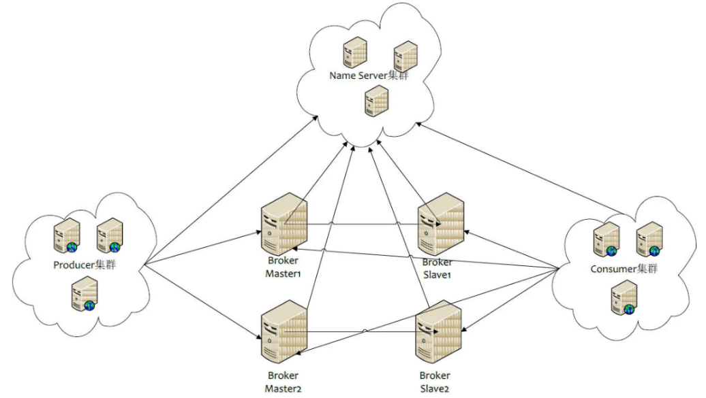

> 本文由Lucas（eddie-lucas）贡献，文章写的不好的地方，请大家积极反应，帮助我改正！

NameServer是整个RocketMQ的大脑，它主要负责RocketMQ的路由管理，服务注册，服务发现。

消息中间件一般基于主题的发布订阅机制，生产者发送某一主题的消息到MQ，MQ负责该消息的持久化存储，消费者订阅感兴趣的主题，对消息进行消费

为了避免单个MQ瘫痪而导致整个系统瘫痪，通常会采用MQ集群，那么生产者如何知道消息要发往哪个MQ？如果某一台MQ宕机了，生产者如何在不重启服务的情况下感知？

NameServer就是为了解决上述问题设计的



MQ在启动时，向所有的NameServer注册，消息生产者在发送消息之前先从NameServer获取Broker服务器（MQ）的地址列表，然后根据负载算法从列表中选择一台消息服务器发送消息。NameServer与每台Broker服务器保持长连接，并**间隔10s检测Broker是否存活**，如果检测到Broker宕机，则从路由注册表中将其移除，但是路由变化不会马上通知消息生产者

NameServer本身的高可用性可通过部署多台NameServer服务器来实现，但**彼此之间互不通信**。虽然NameServer服务器之间在某一时刻的数据并不会完全相同，但对消息发送不会造成重大影响，无非就是短暂造成消息发送不均衡


- Broker每隔30s向NameServer集群的每一台机器发送心跳包，包含自身创建的topic路由等信息。
- 消息客户端每隔30s向NameServer更新对应topic的路由信息。
- NameServer收到Broker发送的心跳包时会记录时间戳。
- NameServer每隔10s会扫描一次brokerLiveTable（存放心跳包的时间戳信息），如果在120s内没有收到心跳包，则认为Broker失效，更新topic的路由信息，将失效的Broker信息移除。

## 启动流程

当NameServer启动的时候，具体做了哪些事情？在NameServer的启动类中，主要做了两件事情：

1. 创建了一个NameSrvController，即NameServer控制器
2. 启动NameSrvController

```java
public static NamesrvController main0(String[] args) {

            //创建一个NamesrvController
            NamesrvController controller = createNamesrvController(args);
            //启动NamesrvController
            start(controller);
    		//打印启动成功提示。。。
            return controller;

    }
```

### 实例化NameSrvController

```java
    public static NamesrvController createNamesrvController(String[] args) throws IOException, JoranException {

        //NameServer的业务参数
        final NamesrvConfig namesrvConfig = new NamesrvConfig();
        //NameServer的网络参数
        final NettyServerConfig nettyServerConfig = new NettyServerConfig();
        //默认端口
        nettyServerConfig.setListenPort(9876);
        //可以通过-c指定nameserver的配置文件
        if (commandLine.hasOption('c')) {
            String file = commandLine.getOptionValue('c');
            if (file != null) {
                InputStream in = new BufferedInputStream(new FileInputStream(file));
                properties = new Properties();
                properties.load(in);
                MixAll.properties2Object(properties, namesrvConfig);
                MixAll.properties2Object(properties, nettyServerConfig);
                //将默认路径修改为指定的路径
                namesrvConfig.setConfigStorePath(file);

                System.out.printf("load config properties file OK, %s%n", file);
                in.close();
            }
        }

        //可以通过-p打印当前加载的配置
        if (commandLine.hasOption('p')) {
            InternalLogger console = InternalLoggerFactory.getLogger(LoggerName.NAMESRV_CONSOLE_NAME);
            MixAll.printObjectProperties(console, namesrvConfig);
            MixAll.printObjectProperties(console, nettyServerConfig);
            System.exit(0);
        }

        MixAll.properties2Object(ServerUtil.commandLine2Properties(commandLine), namesrvConfig);

        if (null == namesrvConfig.getRocketmqHome()) {
            System.out.printf("Please set the %s variable in your environment to match the location of the RocketMQ installation%n", MixAll.ROCKETMQ_HOME_ENV);
            System.exit(-2);
        }

        //日志相关配置
        LoggerContext lc = (LoggerContext) LoggerFactory.getILoggerFactory();
        JoranConfigurator configurator = new JoranConfigurator();
        configurator.setContext(lc);
        lc.reset();
        configurator.doConfigure(namesrvConfig.getRocketmqHome() + "/conf/logback_namesrv.xml");

        log = InternalLoggerFactory.getLogger(LoggerName.NAMESRV_LOGGER_NAME);

        MixAll.printObjectProperties(log, namesrvConfig);
        MixAll.printObjectProperties(log, nettyServerConfig);

        //通过业务参数和网络参数创建一个NamesrvController
        final NamesrvController controller = new NamesrvController(namesrvConfig, nettyServerConfig);

        //记住所有属性，防止丢弃
        controller.getConfiguration().registerConfig(properties);

        return controller;
    }
```

可以看出，主要是通过`业务参数`和`网络参数`来创建一个controller，那么业务参数和网络参数有哪些？

业务参数：

```java
public class NamesrvConfig {
    /**rocketmq的主目录，有两种方式设置
     * 1. -D rocketmq.home.dir=path（优先级更高）
     * 2. 设置环境变量ROCKETMQ_HOME
     * */
    private String rocketmqHome;
    /**NameServer存储KV配置属性的持久化路径*/
    private String kvConfigPath;
    /**nameserver默认配置文件路径，可以通过-c指定*/
    private String configStorePath;
    private String productEnvName = "center";
    private boolean clusterTest = false;
    /**是否支持顺序消息，默认不支持*/
    private boolean orderMessageEnable = false;
}
```

网络参数：

```java
public class NettyServerConfig implements Cloneable {
    //监听端口
    private int listenPort;
    //业务线程池线程数
    private int serverWorkerThreads = 8;

    //public任务线程池线程个数
    /**
     * Netty⽹络会根据业务类型创建不同的线程池，⽐如处
     * 理消息发送、消息消费、⼼跳检测等。如果该业务类型
     * （RequestCode）未注册线程池，则由public线程池执⾏。
     * */
    private int serverCallbackExecutorThreads = 0;
    /**
     * I/O线程池线程个数，主要是
     * NameServer、Broker端解析请求、返回相应的线程个数。这类线程
     * 主要⽤于处理⽹络请求，先解析请求包，然后转发到各个业务线程池
     * 完成具体的业务操作，最后将结果返回给调⽤⽅
     */
    private int serverSelectorThreads = 3;
    /**
     * send oneway消息请求的并发度（Broker端参数）
     */
    private int serverOnewaySemaphoreValue = 256;
    /**
     * 异步消息发送的最⼤并发度（Broker端参数）
     */
    private int serverAsyncSemaphoreValue = 64;
    /**
     * ⽹络连接最⼤空闲时间，默认为120s。如果连接空闲时间超过该参数设置的值，连接将被关闭
     */
    private int serverChannelMaxIdleTimeSeconds = 120;
    /**
     * ⽹络socket发送缓存区⼤⼩，默认为64KB
     */
    private int serverSocketSndBufSize = NettySystemConfig.socketSndbufSize;
    /**
     * ⽹络socket接收缓存区⼤⼩，默认为64KB
     */
    private int serverSocketRcvBufSize = NettySystemConfig.socketRcvbufSize;
    /**
     * ：ByteBuffer是否开启缓存，建议开启
     */
    private boolean serverPooledByteBufAllocatorEnable = true;
    /**
     * 是否启⽤Epoll I/O模型，Linux环境下建议开启
     */
    private boolean useEpollNativeSelector = false;
}
```

### 初始化NameSrvController

```java
public static NamesrvController start(final NamesrvController controller) throws Exception {

        //初始化NamesrvController
        boolean initResult = controller.initialize();

        //注册JVM钩⼦函数并启动服务器，以便监听Broker、消息⽣产者的⽹络请求
        Runtime.getRuntime().addShutdownHook(new ShutdownHookThread(log, new Callable<Void>() {
            @Override
            public Void call() throws Exception {
                controller.shutdown();
                return null;
            }
        }));

        controller.start();

        return controller;
    }
```

可以看出`initialize()`是初始化的核心内容

```java
public boolean initialize() {
        //加载kv配置
        this.kvConfigManager.load();
        //创建一个网络处理对象
        this.remotingServer = new NettyRemotingServer(this.nettyServerConfig, this.brokerHousekeepingService);

        this.remotingExecutor =
            Executors.newFixedThreadPool(nettyServerConfig.getServerWorkerThreads(), new ThreadFactoryImpl("RemotingExecutorThread_"));

        this.registerProcessor();

        //定时任务：每隔10s检测brokerLiveTable中的broker心跳,移除不可用broker和相关的channel
        this.scheduledExecutorService.scheduleAtFixedRate(new Runnable() {

            @Override
            public void run() {
                NamesrvController.this.routeInfoManager.scanNotActiveBroker();
            }
        }, 5, 10, TimeUnit.SECONDS);

        //定时任务：每隔10min打印⼀次KV配置
        this.scheduledExecutorService.scheduleAtFixedRate(new Runnable() {

            @Override
            public void run() {
                NamesrvController.this.kvConfigManager.printAllPeriodically();
            }
        }, 1, 10, TimeUnit.MINUTES);

        //如果支持tls(SSL)安全通信方式
        if (TlsSystemConfig.tlsMode != TlsMode.DISABLED) {
            // Register a listener to reload SslContext
        }
        return true;
}
```

在初始化阶段，启动了**两个定时任务**，一个定时检测心跳，一个定时打印kv配置

```java
public void scanNotActiveBroker() {
        //遍历broker状态表，看看有没有要移除的broker
        Iterator<Entry<String, BrokerLiveInfo>> it = this.brokerLiveTable.entrySet().iterator();
        while (it.hasNext()) {
            Entry<String, BrokerLiveInfo> next = it.next();
            long last = next.getValue().getLastUpdateTimestamp();
            //比较当前时间与上一次时间，如果超过120s就认为broker不可用，从brokerLiveTable中移除
            if ((last + BROKER_CHANNEL_EXPIRED_TIME) < System.currentTimeMillis()) {
                RemotingUtil.closeChannel(next.getValue().getChannel());
                it.remove();
                log.warn("The broker channel expired, {} {}ms", next.getKey(), BROKER_CHANNEL_EXPIRED_TIME);
                //维护路由表以及其他信息（具体步骤）
                this.onChannelDestroy(next.getKey(), next.getValue().getChannel());
            }
        }
    }
```

### 总结

在NameServer启动阶段，主要做了两个事情：

- 实例化NameSrvController（根据业务参数和网络参数实例化）

- 初始化NameSrvController
  - 加载kv配置，这里的kv配置来源于业务参数中`kvConfigPath`路径的json文件
  - 检测心跳定时任务（每10s）
  - 打印配置定时任务（每10min）
  - 注册JVM钩⼦函数并启动服务器，以便监听Broker、消息⽣产者的⽹络请求

## 路由注册

NameServer的主要作用是为生产者和消费者提供关于topic的路由信息，那么NameServer就需要存储路由的基础信息，并且能够管理broker节点，包括路由注册，路由删除等功能

> NameServer存储了哪些信息？

```java
public class RouteInfoManager {
    private final static long BROKER_CHANNEL_EXPIRED_TIME = 1000 * 60 * 2;

    private final ReadWriteLock lock = new ReentrantReadWriteLock();
    /**
     * topic消息队列的路由信息，消息发送时根据路由表进⾏负载均衡
     */
    private final HashMap<String/* topic */, List<QueueData>> topicQueueTable;
    /**
     * 主从broker地址表，存放主从Broker基础信息，包含brokerName、所属集群名称、主从Broker地址
     */
    private final HashMap<String/* brokerName */, BrokerData> brokerAddrTable;
    /**
     * 集群地址表，存放Broker集群信息，存储集群中所有主从架构Broker的名称
     * 一个集群中会有很多个主从broker架构，依据brokerName区分，同一主从架构中，依据brokerId区分主从节点
     */
    private final HashMap<String/* clusterName */, Set<String/* brokerName */>> clusterAddrTable;
    /**
     * broker状态表，存放Broker状态信息，NameServer每次收到⼼跳包时会替换该信息
     */
    private final HashMap<String/* brokerAddr */, BrokerLiveInfo> brokerLiveTable;
    /**
     * Broker上的FilterServer列表，⽤于类模式消息过滤。类模式过滤机制在4.4及以后版本被废弃
     */
    private final HashMap<String/* brokerAddr */, List<String>/* Filter Server */> filterServerTable;

}
```

> 如何进行路由注册的？

### broker发送心跳

路由注册由broker和NameServer共同完成，RocketMQ路由注册是通过Broker与NameServer的⼼跳功能实现的。Broker启动时，**每隔30s向集群中所有的NameServer发送心跳包**，NameServer收到Broker⼼跳包时会先更新`brokerLiveTable`缓存中`BrokerLiveInfo`的lastUpdateTimestamp，然后每隔10s扫描⼀次brokerLiveTable，如果连续120s没有收到⼼跳包，NameServer将移除该Broker的路由信息，同时关闭连接


从上图可以看出，broker端启动定时任务，**每隔30s发送心跳包**，broker发送心跳的核心代码位于`BrokerOuterAPI`类中

```java
public List<RegisterBrokerResult> registerBrokerAll(
            //集群名称
        final String clusterName,
        //broker地址
        final String brokerAddr,
        //broker名称
        final String brokerName,
        //broker的id
        final long brokerId,
        //主节点地址，初次请求时该值为空
        final String haServerAddr,
        final TopicConfigSerializeWrapper topicConfigWrapper,
        final List<String> filterServerList,
        final boolean oneway,
        final int timeoutMills,
        final boolean compressed) {

        //准备一个list，接收结果
        final List<RegisterBrokerResult> registerBrokerResultList = Lists.newArrayList();
        //获取nameserver的地址
        List<String> nameServerAddressList = this.remotingClient.getNameServerAddressList();
        if (nameServerAddressList != null && nameServerAddressList.size() > 0) {

            //请求头信息
            final RegisterBrokerRequestHeader requestHeader = new RegisterBrokerRequestHeader();
            requestHeader.setBrokerAddr(brokerAddr);
            requestHeader.setBrokerId(brokerId);
            requestHeader.setBrokerName(brokerName);
            requestHeader.setClusterName(clusterName);
            requestHeader.setHaServerAddr(haServerAddr);
            requestHeader.setCompressed(compressed);

            //请求体信息
            RegisterBrokerBody requestBody = new RegisterBrokerBody();
            requestBody.setTopicConfigSerializeWrapper(topicConfigWrapper);
            requestBody.setFilterServerList(filterServerList);
            final byte[] body = requestBody.encode(compressed);
            final int bodyCrc32 = UtilAll.crc32(body);
            requestHeader.setBodyCrc32(bodyCrc32);
            //减法计数器
            final CountDownLatch countDownLatch = new CountDownLatch(nameServerAddressList.size());
            for (final String namesrvAddr : nameServerAddressList) {
                brokerOuterExecutor.execute(new Runnable() {
                    @Override
                    public void run() {
                            RegisterBrokerResult result = registerBroker(namesrvAddr,oneway, timeoutMills,requestHeader,body);
                            if (result != null) {
                                registerBrokerResultList.add(result);
                            }
                            countDownLatch.countDown();
                    }
                });
            }
            countDownLatch.await(timeoutMills, TimeUnit.MILLISECONDS);
        }
        return registerBrokerResultList;
    }
```

该⽅法遍历NameServer列表，Broker依次向NameServer发送⼼跳包

### NameServer处理心跳

RocketMQ网络传输基于Netty，在注册broker时，broker**调用的是同步方法，即心跳包请求串行执行**，对于每⼀个请求，RocketMQ都会定义⼀个RequestCode，对于注册broker，发送心跳，请求码为`RequestCode.REGISTER_BROKER`（值为103）


对于这种请求，最终会被交给`RouteInfoManager`类处理，核心代码如下：

```java
public RegisterBrokerResult registerBroker(
        final String clusterName,
        final String brokerAddr,
        final String brokerName,
        final long brokerId,
        final String haServerAddr,
        final TopicConfigSerializeWrapper topicConfigWrapper,
        final List<String> filterServerList,
        final Channel channel) {
        RegisterBrokerResult result = new RegisterBrokerResult();
        try {
            try {
                //加锁，防止并发修改
                this.lock.writeLock().lockInterruptibly();
                //clusterAddrTable信息维护
                // ⾸先判断Broker所属集群是否存在，如果不存在，则创建集群，然后将broker名加⼊集群Broker集合
                Set<String> brokerNames = this.clusterAddrTable.get(clusterName);
                if (null == brokerNames) {
                    brokerNames = new HashSet<String>();
                    this.clusterAddrTable.put(clusterName, brokerNames);
                }
                brokerNames.add(brokerName);


                //brokerData信息维护
                //是否是第一次注册
                boolean registerFirst = false;
                BrokerData brokerData = this.brokerAddrTable.get(brokerName);
                //没有找到brokerData，说明是第一次注册
                if (null == brokerData) {
                    registerFirst = true;
                    brokerData = new BrokerData(clusterName, brokerName, new HashMap<Long, String>());
                    this.brokerAddrTable.put(brokerName, brokerData);
                }
                Map<Long, String> brokerAddrsMap = brokerData.getBrokerAddrs();
                //Switch slave to master: first remove <1, IP:PORT> in namesrv, then add <0, IP:PORT>
                //The same IP:PORT must only have one record in brokerAddrTable
                Iterator<Entry<Long, String>> it = brokerAddrsMap.entrySet().iterator();
                while (it.hasNext()) {
                    Entry<Long, String> item = it.next();
                    if (null != brokerAddr && brokerAddr.equals(item.getValue()) && brokerId != item.getKey()) {
                        it.remove();
                    }
                }
                //不是第一次注册，即发送的是后续的心跳包的时候，直接替换原来的broker的信息
                String oldAddr = brokerData.getBrokerAddrs().put(brokerId, brokerAddr);
                registerFirst = registerFirst || (null == oldAddr);

                //topicQueueTable的维护
                //如果broker是主节点
                if (null != topicConfigWrapper
                    && MixAll.MASTER_ID == brokerId) {
                    //Broker的topic配置信息发⽣变化或者是初次注册
                    if (this.isBrokerTopicConfigChanged(brokerAddr, topicConfigWrapper.getDataVersion())
                        || registerFirst) {
                        ConcurrentMap<String, TopicConfig> tcTable =
                            topicConfigWrapper.getTopicConfigTable();
                        if (tcTable != null) {
                            for (Map.Entry<String, TopicConfig> entry : tcTable.entrySet()) {
                                //则需要创建或更新topic路由元数据，并填充topicQueueTable，其实就是为默认主题⾃动注册路由信息
                                this.createAndUpdateQueueData(brokerName, entry.getValue());
                            }
                        }
                    }
                }
                //更新BrokerLiveInfo，存储状态正常的Broker信息表，BrokeLiveInfo是执⾏路由删除操作的重要依据
                BrokerLiveInfo prevBrokerLiveInfo = this.brokerLiveTable.put(brokerAddr,
                    new BrokerLiveInfo(
                        System.currentTimeMillis(),
                        topicConfigWrapper.getDataVersion(),
                        channel,
                        haServerAddr));
                if (null == prevBrokerLiveInfo) {
                    log.info("new broker registered, {} HAServer: {}", brokerAddr, haServerAddr);
                }

                //注册Broker的过滤器Server地址列表，⼀个Broker上会关联多个FilterServer消息过滤服务器
                if (filterServerList != null) {
                    if (filterServerList.isEmpty()) {
                        this.filterServerTable.remove(brokerAddr);
                    } else {
                        this.filterServerTable.put(brokerAddr, filterServerList);
                    }
                }
                // 如果此Broker为从节点，则需要查找该Broker的主节点信息，并更新对应的masterAddr属性
                if (MixAll.MASTER_ID != brokerId) {
                    String masterAddr = brokerData.getBrokerAddrs().get(MixAll.MASTER_ID);
                    if (masterAddr != null) {
                        BrokerLiveInfo brokerLiveInfo = this.brokerLiveTable.get(masterAddr);
                        if (brokerLiveInfo != null) {
                            result.setHaServerAddr(brokerLiveInfo.getHaServerAddr());
                            result.setMasterAddr(masterAddr);
                        }
                    }
                }
            } finally {
                this.lock.writeLock().unlock();
            }
        } catch (Exception e) {
            log.error("registerBroker Exception", e);
        }

        return result;
    }
```

### 设计亮点

NameServer与Broker保持长连接，Broker的状态信息存储在brokerLiveTable中，NameServer每收到⼀个心跳包，将更新brokerLiveTable中关于Broker的状态信息以及路由表（topicQueueTable、brokerAddrTable、brokerLiveTable、filterServerTable）。更新上述路由表（HashTable）使⽤了锁粒度较小的读写锁，允许多个消息发送者并发读操作，保证消息发送时的高并发。同⼀时刻NameServer只处理⼀个Broker心跳包，多个心跳包请求串行执行

## 路由删除

上面谈到了如何发送心跳，但是如果broker宕机了，NameServer无法收到心跳包，NameServer如何删除无效的broker呢？

### 定时扫描删除

在NameServer的初始化阶段，会启动一个定时任务，每隔10s扫描`brokerLiveTable（broker状态表）`中的broker，如果超过120s没有发送心跳包，就会将broker从`brokerLiveTable`中删除

```java
public void scanNotActiveBroker() {
        //遍历broker状态表，看看有没有要移除的broker
        Iterator<Entry<String, BrokerLiveInfo>> it = this.brokerLiveTable.entrySet().iterator();
        while (it.hasNext()) {
            Entry<String, BrokerLiveInfo> next = it.next();
            long last = next.getValue().getLastUpdateTimestamp();
            //比较当前时间与上一次时间，如果超过120s就认为broker不可用，从brokerLiveTable中移除
            if ((last + BROKER_CHANNEL_EXPIRED_TIME) < System.currentTimeMillis()) {
                RemotingUtil.closeChannel(next.getValue().getChannel());
                it.remove();
                log.warn("The broker channel expired, {} {}ms", next.getKey(), BROKER_CHANNEL_EXPIRED_TIME);
                //维护路由表以及其他信息（具体步骤）
                this.onChannelDestroy(next.getKey(), next.getValue().getChannel());
            }
        }
    }
```

具体的步骤代码如下：

```java
public void onChannelDestroy(String remoteAddr, Channel channel) {
        String brokerAddrFound = null;
        if (channel != null) {
            try {
                try {
                    //加锁
                    this.lock.readLock().lockInterruptibly();
                    Iterator<Entry<String, BrokerLiveInfo>> itBrokerLiveTable =
                        this.brokerLiveTable.entrySet().iterator();
                    //遍历，从broker状态表中找到要移除的broker的地址
                    while (itBrokerLiveTable.hasNext()) {
                        Entry<String, BrokerLiveInfo> entry = itBrokerLiveTable.next();
                        if (entry.getValue().getChannel() == channel) {
                            brokerAddrFound = entry.getKey();
                            break;
                        }
                    }
                } finally {
                    //释放锁
                    this.lock.readLock().unlock();
                }
            } catch (Exception e) {
                log.error("onChannelDestroy Exception", e);
            }
        }

        if (null == brokerAddrFound) {
            brokerAddrFound = remoteAddr;
        } else {
            log.info("the broker's channel destroyed, {}, clean it's data structure at once", brokerAddrFound);
        }
        //上面的代码就是找到要移除的broker的地址，重点在这里
        //有要移除的broker
        if (brokerAddrFound != null && brokerAddrFound.length() > 0) {

            try {
                try {
                    //加锁
                    this.lock.writeLock().lockInterruptibly();
                    //从broker状态表中移除该broker相关信息
                    this.brokerLiveTable.remove(brokerAddrFound);
                    //从filterServerTable中移除该broker相关信息
                    this.filterServerTable.remove(brokerAddrFound);

                    //维护主从broker地址表
                    String brokerNameFound = null;
                    boolean removeBrokerName = false;
                    Iterator<Entry<String, BrokerData>> itBrokerAddrTable =
                        this.brokerAddrTable.entrySet().iterator();
                    //遍历主从broker地址表中的每一个主从架构的信息
                    while (itBrokerAddrTable.hasNext() && (null == brokerNameFound)) {
                        //每一个主从架构的broker的信息
                        BrokerData brokerData = itBrokerAddrTable.next().getValue();

                        Iterator<Entry<Long, String>> it = brokerData.getBrokerAddrs().entrySet().iterator();
                        //遍历当前的主从架构中所有的broker
                        while (it.hasNext()) {
                            Entry<Long, String> entry = it.next();
                            Long brokerId = entry.getKey();
                            String brokerAddr = entry.getValue();
                            //找到要移除的broker，然后移除
                            if (brokerAddr.equals(brokerAddrFound)) {
                                brokerNameFound = brokerData.getBrokerName();
                                it.remove();
                                log.info("remove brokerAddr[{}, {}] from brokerAddrTable, because channel destroyed",
                                    brokerId, brokerAddr);
                                break;
                            }
                        }
                        //如果没有这个主从架构了，就说明需要移除主从broker地址表中的brokerName，因为brokerName相同的属于同一个主从架构
                        if (brokerData.getBrokerAddrs().isEmpty()) {
                            //标志位，表示是否移除了这个主从结构
                            removeBrokerName = true;
                            itBrokerAddrTable.remove();
                            log.info("remove brokerName[{}] from brokerAddrTable, because channel destroyed",
                                brokerData.getBrokerName());
                        }
                    }
                    //移除主从架构，也需要从集群地址表中移除这个主从架构
                    if (brokerNameFound != null && removeBrokerName) {
                        Iterator<Entry<String, Set<String>>> it = this.clusterAddrTable.entrySet().iterator();
                        while (it.hasNext()) {
                            Entry<String, Set<String>> entry = it.next();
                            String clusterName = entry.getKey();
                            Set<String> brokerNames = entry.getValue();
                            boolean removed = brokerNames.remove(brokerNameFound);
                            if (removed) {
                                log.info("remove brokerName[{}], clusterName[{}] from clusterAddrTable, because channel destroyed",
                                    brokerNameFound, clusterName);
                                //如果移除了这个主从架构之后，集群为空了，那么也需要移除这个集群
                                if (brokerNames.isEmpty()) {
                                    log.info("remove the clusterName[{}] from clusterAddrTable, because channel destroyed and no broker in this cluster",
                                        clusterName);
                                    it.remove();
                                }

                                break;
                            }
                        }
                    }
                    //如果移除了主从结构，根据BrokerName，遍历所有主题的队列，如果队列中
                    //包含当前Broker的队列，则移除，如果topic只包含待移除Broker的
                    //队列，从路由表中删除该topic，
                    if (removeBrokerName) {
                        Iterator<Entry<String, List<QueueData>>> itTopicQueueTable =
                            this.topicQueueTable.entrySet().iterator();
                        while (itTopicQueueTable.hasNext()) {
                            Entry<String, List<QueueData>> entry = itTopicQueueTable.next();
                            String topic = entry.getKey();
                            List<QueueData> queueDataList = entry.getValue();

                            Iterator<QueueData> itQueueData = queueDataList.iterator();
                            while (itQueueData.hasNext()) {
                                QueueData queueData = itQueueData.next();
                                if (queueData.getBrokerName().equals(brokerNameFound)) {
                                    itQueueData.remove();
                                    log.info("remove topic[{} {}], from topicQueueTable, because channel destroyed",
                                        topic, queueData);
                                }
                            }

                            if (queueDataList.isEmpty()) {
                                itTopicQueueTable.remove();
                                log.info("remove topic[{}] all queue, from topicQueueTable, because channel destroyed",
                                    topic);
                            }
                        }
                    }
                } finally {
                    //释放锁
                    this.lock.writeLock().unlock();
                }
            } catch (Exception e) {
                log.error("onChannelDestroy Exception", e);
            }
        }
    }
```

### broker正常关闭删除

broker正常关闭的删除逻辑和定时扫描删除调用的方法是一样的，只不过，broker正常关闭时会调用会执行`unregisterBroker`指令
