> [本文由 FrancisQ 投稿！](https://mp.weixin.qq.com/s?__biz=Mzg2OTA0Njk0OA==&mid=2247485969&idx=1&sn=6bd53abde30d42a778d5a35ec104428c&chksm=cea245daf9d5cccce631f93115f0c2c4a7634e55f5bef9009fd03f5a0ffa55b745b5ef4f0530&token=294077121&lang=zh_CN#rd) 相比原文主要进行了下面这些完善：
>
> - [分析了 RocketMQ 高性能读写的原因和顺序消费的具体实现](https://github.com/Snailclimb/JavaGuide/pull/2133)
> - [增加了消息类型、消费者类型、消费者组和生产者组的介绍](https://github.com/Snailclimb/JavaGuide/pull/2134)
> - [RocketMQ 5.x 支持按消息粒度分配](https://github.com/Snailclimb/JavaGuide/issues/2778)

## 消息队列扫盲

消息队列顾名思义就是存放消息的队列，队列我就不解释了，别告诉我你连队列都不知道是啥吧？

所以问题并不是消息队列是什么，而是 **消息队列为什么会出现？消息队列能用来干什么？用它来干这些事会带来什么好处？消息队列会带来副作用吗？**

### 消息队列为什么会出现？

消息队列算是作为后端程序员的一个必备技能吧，因为**分布式应用必定涉及到各个系统之间的通信问题**，这个时候消息队列也应运而生了。可以说分布式的产生是消息队列的基础，而分布式怕是一个很古老的概念了吧，所以消息队列也是一个很古老的中间件了。

### 消息队列能用来干什么？

#### 异步

你可能会反驳我，应用之间的通信又不是只能由消息队列解决，好好的通信为什么中间非要插一个消息队列呢？我不能直接进行通信吗？

很好 👍，你又提出了一个概念，**同步通信**。就比如现在业界使用比较多的 Dubbo 就是一个适用于各个系统之间同步通信的 RPC 框架。

我来举个 🌰 吧，比如我们有一个购票系统，需求是用户在购买完之后能接收到购买完成的短信。


我们省略中间的网络通信时间消耗，假如购票系统处理需要 150ms ，短信系统处理需要 200ms ，那么整个处理流程的时间消耗就是 150ms + 200ms = 350ms。

当然，乍看没什么问题。可是仔细一想你就感觉有点问题，我用户购票在购票系统的时候其实就已经完成了购买，而我现在通过同步调用非要让整个请求拉长时间，而短信系统这玩意又不是很有必要，它仅仅是一个辅助功能增强用户体验感而已。我现在整个调用流程就有点 **头重脚轻** 的感觉了，购票是一个不太耗时的流程，而我现在因为同步调用，非要等待发送短信这个比较耗时的操作才返回结果。那我如果再加一个发送邮件呢？


这样整个系统的调用链又变长了，整个时间就变成了 550ms。

当我们在学生时代需要在食堂排队的时候，我们和食堂大妈就是一个同步的模型。

我们需要告诉食堂大妈：“姐姐，给我加个鸡腿，再加个酸辣土豆丝，帮我浇点汁上去，多打点饭哦 😋😋😋” 咦~~~ 为了多吃点，真恶心。

然后大妈帮我们打饭配菜，我们看着大妈那颤抖的手和掉落的土豆丝不禁咽了咽口水。

最终我们从大妈手中接过饭菜然后去寻找座位了...

回想一下，我们在给大妈发送需要的信息之后我们是 **同步等待大妈给我配好饭菜** 的，上面我们只是加了鸡腿和土豆丝，万一我再加一个番茄牛腩，韭菜鸡蛋，这样是不是大妈打饭配菜的流程就会变长，我们等待的时间也会相应的变长。

那后来，我们工作赚钱了有钱去饭店吃饭了，我们告诉服务员来一碗牛肉面加个荷包蛋 **(传达一个消息)** ，然后我们就可以在饭桌上安心的玩手机了 **(干自己其他事情)** ，等到我们的牛肉面上了我们就可以吃了。这其中我们也就传达了一个消息，然后我们又转过头干其他事情了。这其中虽然做面的时间没有变短，但是我们只需要传达一个消息就可以干其他事情了，这是一个 **异步** 的概念。

所以，为了解决这一个问题，聪明的程序员在中间也加了个类似于服务员的中间件——消息队列。这个时候我们就可以把模型给改造了。


这样，我们在将消息存入消息队列之后我们就可以直接返回了(我们告诉服务员我们要吃什么然后玩手机)，所以整个耗时只是 150ms + 10ms = 160ms。

> 但是你需要注意的是，整个流程的时长是没变的，就像你仅仅告诉服务员要吃什么是不会影响到做面的速度的。

#### 解耦

回到最初同步调用的过程，我们写个伪代码简单概括一下。


那么第二步，我们又添加了一个发送邮件，我们就得重新去修改代码，如果我们又加一个需求：用户购买完还需要给他加积分，这个时候我们是不是又得改代码？


如果你觉得还行，那么我这个时候不要发邮件这个服务了呢，我是不是又得改代码，又得重启应用？


这样改来改去是不是很麻烦，那么 **此时我们就用一个消息队列在中间进行解耦** 。你需要注意的是，我们后面的发送短信、发送邮件、添加积分等一些操作都依赖于上面的 `result` ，这东西抽象出来就是购票的处理结果呀，比如订单号，用户账号等等，也就是说我们后面的一系列服务都是需要同样的消息来进行处理。既然这样，我们是不是可以通过 **“广播消息”** 来实现。

我上面所讲的“广播”并不是真正的广播，而是接下来的系统作为消费者去 **订阅** 特定的主题。比如我们这里的主题就可以叫做 `订票` ，我们购买系统作为一个生产者去生产这条消息放入消息队列，然后消费者订阅了这个主题，会从消息队列中拉取消息并消费。就比如我们刚刚画的那张图，你会发现，在生产者这边我们只需要关注 **生产消息到指定主题中** ，而 **消费者只需要关注从指定主题中拉取消息** 就行了。


> 如果没有消息队列，每当一个新的业务接入，我们都要在主系统调用新接口、或者当我们取消某些业务，我们也得在主系统删除某些接口调用。有了消息队列，我们只需要关心消息是否送达了队列，至于谁希望订阅，接下来收到消息如何处理，是下游的事情，无疑极大地减少了开发和联调的工作量。

#### 削峰

我们再次回到一开始我们使用同步调用系统的情况，并且思考一下，如果此时有大量用户请求购票整个系统会变成什么样？


如果，此时有一万的请求进入购票系统，我们知道运行我们主业务的服务器配置一般会比较好，所以这里我们假设购票系统能承受这一万的用户请求，那么也就意味着我们同时也会出现一万调用发短信服务的请求。而对于短信系统来说并不是我们的主要业务，所以我们配备的硬件资源并不会太高，那么你觉得现在这个短信系统能承受这一万的峰值么，且不说能不能承受，系统会不会 **直接崩溃** 了？

短信业务又不是我们的主业务，我们能不能 **折中处理** 呢？如果我们把购买完成的信息发送到消息队列中，而短信系统 **尽自己所能地去消息队列中取消息和消费消息** ，即使处理速度慢一点也无所谓，只要我们的系统没有崩溃就行了。

留得江山在，还怕没柴烧？你敢说每次发送验证码的时候是一发你就收到了的么？

### 消息队列能带来什么好处？

其实上面我已经说了。**异步、解耦、削峰。** 哪怕你上面的都没看懂也千万要记住这六个字，因为他不仅是消息队列的精华，更是编程和架构的精华。

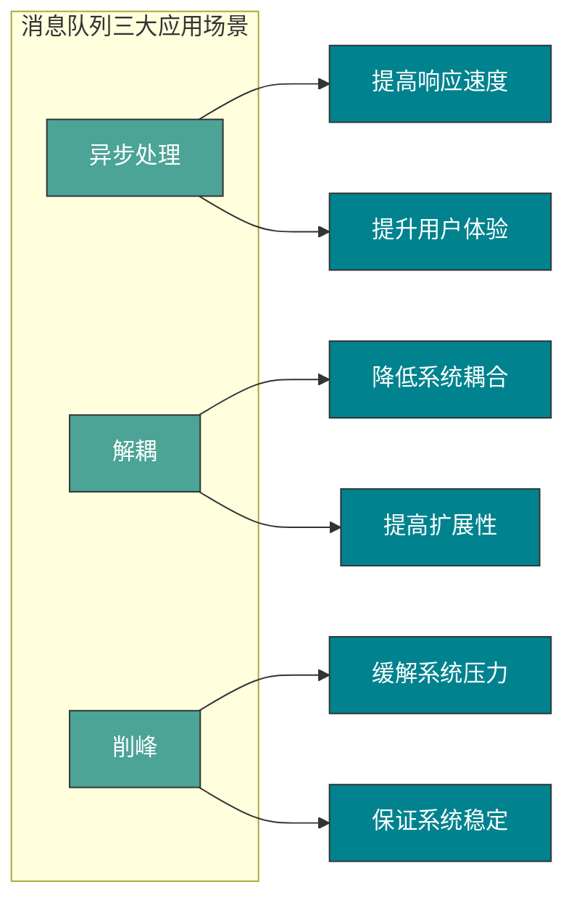

### 消息队列会带来副作用吗？

没有哪一门技术是“银弹”，消息队列也有它的副作用。

比如，本来好好的两个系统之间的调用，我中间加了个消息队列，如果消息队列挂了怎么办呢？是不是 **降低了系统的可用性** ？

那这样是不是要保证 HA(高可用)？是不是要搞集群？那么我 **整个系统的复杂度是不是上升了** ？

抛开上面的问题不讲，万一我发送方发送失败了，然后执行重试，这样就可能产生重复的消息。

或者我消费端处理失败了，请求重发，这样也会产生重复的消息。

对于一些微服务来说，消费重复消息会带来更大的麻烦，比如增加积分，这个时候我加了多次是不是对其他用户不公平？

那么，又 **如何解决重复消费消息的问题** 呢？

如果我们此时的消息需要保证严格的顺序性怎么办呢？比如生产者生产了一系列的有序消息(对一个 id 为 1 的记录进行删除增加修改)，但是我们知道在发布订阅模型中，对于主题是无顺序的，那么这个时候就会导致对于消费者消费消息的时候没有按照生产者的发送顺序消费，比如这个时候我们消费的顺序为修改删除增加，如果该记录涉及到金额的话是不是会出大事情？

那么，又 **如何解决消息的顺序消费问题** 呢？

就拿我们上面所讲的分布式系统来说，用户购票完成之后是不是需要增加账户积分？在同一个系统中我们一般会使用事务来进行解决，如果用 `Spring` 的话我们在上面伪代码中加入 `@Transactional` 注解就好了。但是在不同系统中如何保证事务呢？总不能这个系统我扣钱成功了你那积分系统积分没加吧？或者说我这扣钱明明失败了，你那积分系统给我加了积分。

那么，又如何 **解决分布式事务问题** 呢？

我们刚刚说了，消息队列可以进行削峰操作，那如果我的消费者如果消费很慢或者生产者生产消息很快，这样是不是会将消息堆积在消息队列中？

那么，又如何 **解决消息堆积的问题** 呢？

可用性降低，复杂度上升，又带来一系列的重复消费，顺序消费，分布式事务，消息堆积的问题，这消息队列还怎么用啊 😵？


别急，办法总是有的。

## RocketMQ 是什么？


哇，你个混蛋！上面给我抛出那么多问题，你现在又讲 RocketMQ ，还让不让人活了？！🤬

别急别急，话说你现在清楚 `MQ` 的构造吗，我还没讲呢，我们先搞明白 `MQ` 的内部构造，再来看看如何解决上面的一系列问题吧，不过你最好带着问题去阅读和了解喔。

RocketMQ 是一个 **队列模型** 的消息中间件，具有**高性能、高可靠、高实时、分布式** 的特点。它是一个采用 Java 语言开发的分布式的消息系统，由阿里巴巴团队开发，在 2016 年底贡献给 Apache，成为了 Apache 的一个顶级项目。 在阿里内部，RocketMQ 很好地服务了集团大大小小上千个应用，在每年的双十一当天，更有不可思议的万亿级消息通过 RocketMQ 流转。

废话不多说，想要了解 RocketMQ 历史的同学可以自己去搜寻资料。听完上面的介绍，你只要知道 RocketMQ 很快、很牛、而且经历过双十一的实践就行了！

## 队列模型和主题模型是什么？

在谈 RocketMQ 的技术架构之前，我们先来了解一下两个名词概念——**队列模型** 和 **主题模型** 。

首先我问一个问题，消息队列为什么要叫消息队列？

你可能觉得很弱智，这玩意不就是存放消息的队列嘛？不叫消息队列叫什么？

的确，早期的消息中间件是通过 **队列** 这一模型来实现的，可能是历史原因，我们都习惯把消息中间件成为消息队列。

但是，如今例如 RocketMQ、Kafka 这些优秀的消息中间件不仅仅是通过一个 **队列** 来实现消息存储的。

### 队列模型

就像我们理解队列一样，消息中间件的队列模型就真的只是一个队列。


队列模型的特点：**一个消息只能被一个消费者消费**。

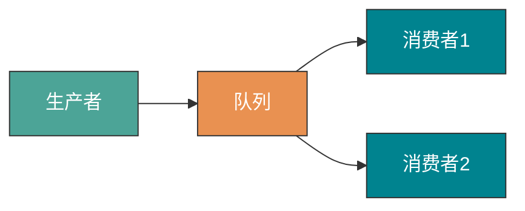

在一开始我跟你提到了一个 **"广播"** 的概念，也就是说如果我们此时我们需要将一个消息发送给多个消费者(比如此时我需要将信息发送给短信系统和邮件系统)，这个时候单个队列即不能满足需求了。

当然你可以让 Producer 生产消息放入多个队列中，然后每个队列去对应每一个消费者。问题是可以解决，创建多个队列并且复制多份消息是会很影响资源和性能的。而且，这样子就会导致生产者需要知道具体消费者个数然后去复制对应数量的消息队列，这就违背我们消息中间件的 **解耦** 这一原则。

### 主题模型

那么有没有好的方法去解决这一个问题呢？有，那就是 **主题模型** 或者可以称为 **发布订阅模型** 。

> 感兴趣的同学可以去了解一下设计模式里面的观察者模式并且手动实现一下，我相信你会有所收获的。

在主题模型中，消息的生产者称为 **发布者(Publisher)** ，消息的消费者称为 **订阅者(Subscriber)** ，存放消息的容器称为 **主题(Topic)** 。

其中，发布者将消息发送到指定主题中，订阅者需要 **提前订阅主题** 才能接受特定主题的消息。


主题模型的特点：**一个消息可以被多个消费者消费**。

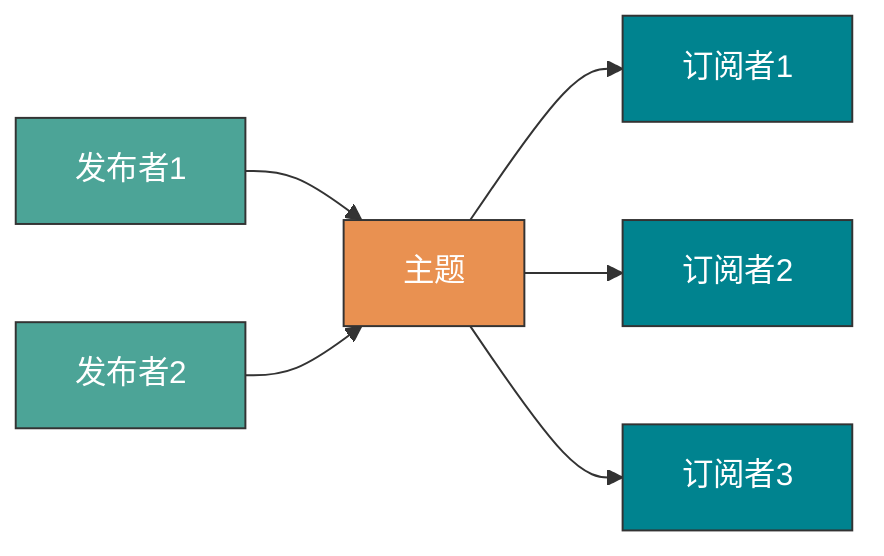

### RocketMQ 中的消息模型

RocketMQ 中的消息模型就是按照 **主题模型** 所实现的。你可能会好奇这个 **主题** 到底是怎么实现的呢？你上面也没有讲到呀！

其实对于主题模型的实现来说每个消息中间件的底层设计都是不一样的，就比如 Kafka 中的 **分区** ，RocketMQ 中的 **队列** ，RabbitMQ 中的 Exchange 。我们可以理解为 **主题模型/发布订阅模型** 就是一个标准，那些中间件只不过照着这个标准去实现而已。

所以，RocketMQ 中的 **主题模型** 到底是如何实现的呢？首先我画一张图，大家尝试着去理解一下。


我们可以看到在整个图中有 `Producer Group`、Topic、`Consumer Group` 三个角色，我来分别介绍一下他们。

- `Producer Group` 生产者组：代表某一类的生产者，比如我们有多个秒杀系统作为生产者，这多个合在一起就是一个 `Producer Group` 生产者组，它们一般生产相同的消息。
- `Consumer Group` 消费者组：代表某一类的消费者，比如我们有多个短信系统作为消费者，这多个合在一起就是一个 `Consumer Group` 消费者组，它们一般消费相同的消息。
- Topic 主题：代表一类消息，比如订单消息，物流消息等等。

你可以看到图中生产者组中的生产者会向主题发送消息，而 **主题中存在多个队列**，生产者每次生产消息之后是指定主题中的某个队列发送消息的。

每个主题中都有多个队列(分布在不同的 Broker中，如果是集群的话，Broker又分布在不同的服务器中)，集群消费模式下，一个消费者集群多台机器共同消费一个 `topic` 的多个队列。

**负载均衡策略对比**

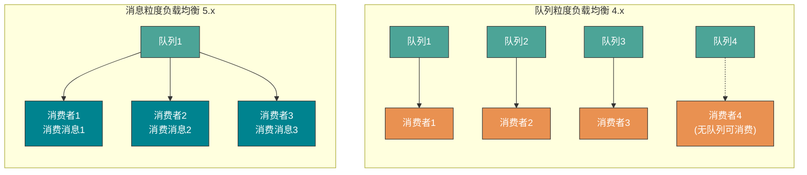

- **队列粒度负载均衡（4.x 默认策略）**：一个队列只会被一个消费者消费。如果某个消费者挂掉，分组内其它消费者会接替挂掉的消费者继续消费。就像上图中 `Consumer1` 和 `Consumer2` 分别对应着两个队列，而 `Consumer3` 是没有队列对应的，所以一般来讲要控制 **消费者组中的消费者个数和主题中队列个数相同** 。
- **消息粒度负载均衡（5.x 新增策略）**：同一消费者分组内的多个消费者将按照消息粒度平均分摊主题中的所有消息，即同一个队列中的消息，可被平均分配给多个消费者共同消费。消费者获取某条消息后，服务端会将该消息加锁，保证这条消息对其他消费者不可见，直到该消息消费成功或消费超时。因此，即使多个消费者同时消费同一队列的消息，服务端也可保证消息不会被多个消费者重复消费。

当然也可以消费者个数小于队列个数，只不过不太建议。如下图。


**每个消费组在每个队列上维护一个消费位置** ，为什么呢？

因为我们刚刚画的仅仅是一个消费者组，我们知道在发布订阅模式中一般会涉及到多个消费者组，而每个消费者组在每个队列中的消费位置都是不同的。如果此时有多个消费者组，那么消息被一个消费者组消费完之后是不会删除的(因为其它消费者组也需要呀)，它仅仅是为每个消费者组维护一个 **消费位移(offset)** ，每次消费者组消费完会返回一个成功的响应，然后队列再把维护的消费位移加一，这样就不会出现刚刚消费过的消息再一次被消费了。


可能你还有一个问题，**为什么一个主题中需要维护多个队列** ？

答案是 **提高并发能力** 。的确，每个主题中只存在一个队列也是可行的。你想一下，如果每个主题中只存在一个队列，这个队列中也维护着每个消费者组的消费位置，这样也可以做到 **发布订阅模式** 。如下图。


但是，这样我生产者是不是只能向一个队列发送消息？又因为需要维护消费位置所以一个队列只能对应一个消费者组中的消费者，这样是不是其他的 Consumer 就没有用武之地了？从这两个角度来讲，并发度一下子就小了很多。

所以总结来说，RocketMQ 通过**使用在一个 Topic 中配置多个队列并且每个队列维护每个消费者组的消费位置** 实现了 **主题模式/发布订阅模式** 。

## RocketMQ 架构

讲完了消息模型，我们理解起 RocketMQ 的技术架构起来就容易多了。

RocketMQ 由 **Broker、NameServer、Producer、Consumer** 四大组件组成。

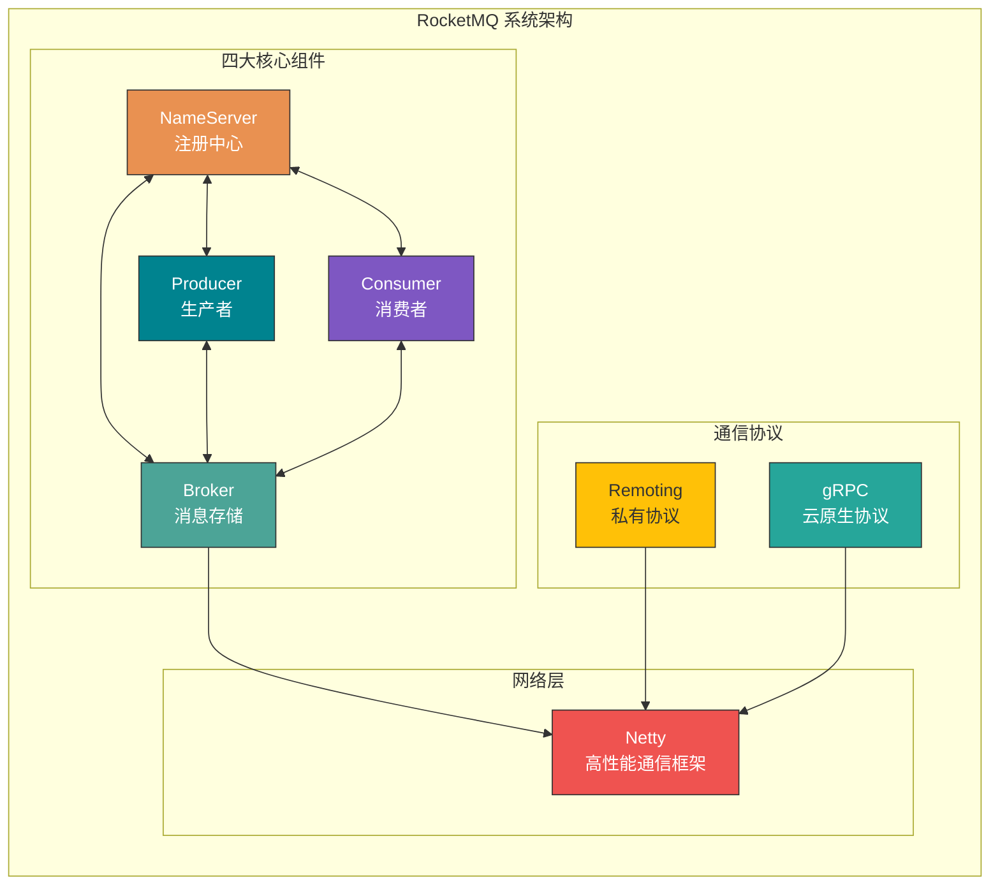

### 四大组件核心要点

| 组件           | 技术要点                     |
| -------------- | ---------------------------- |
| **NameServer** | 轻量级注册中心               |
| **Broker**     | 消息存储                     |
| **Producer**   | 同步、异步、单向多种发送方式 |
| **Consumer**   | Push/Pull 双模式             |

### NameServer（注册中心）

NameServer 负责元数据的存储，扮演着集群"中枢神经系统"的角色，其核心作用是为生产者和消费者提供路由信息，帮助它们找到对应的 Broker 地址。

**核心功能：**

1. **Broker 管理**：Broker 启动时主动连接 NameServer，上报元数据信息。
2. **路由信息管理**：生产者和消费者从 NameServer 获取 Broker 路由表。

**心跳机制：**

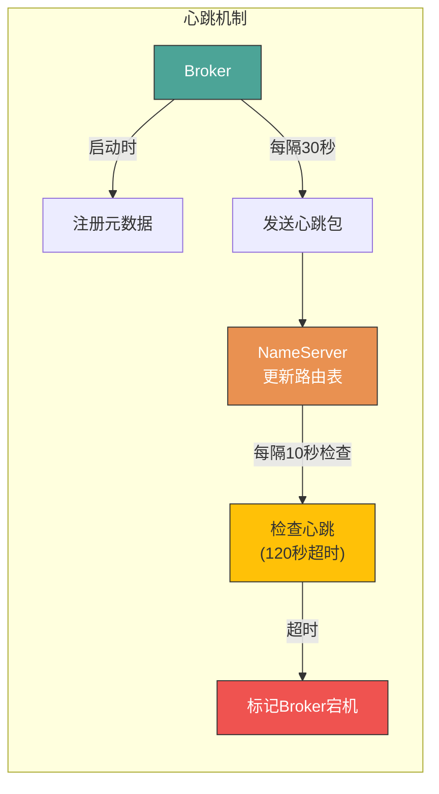

**元数据包含：**

- Broker 的地址、名称、BrokerId
- 主节点地址
- 该 Broker 上的所有 Topic 的队列配置

### Broker（消息存储）

Broker 负责消息的存储、投递和查询以及服务高可用保证。

**存储机制：**

1. **消息写入**：收到消息后顺序追加到 CommitLog 文件
2. **文件分割**：文件超过固定大小（默认1G）生成新文件
3. **逻辑分片**：MessageQueue 是逻辑分片，ConsumeQueue 是消息索引

**一个 Topic 分布在多个 Broker 上，一个 Broker 可以配置多个 Topic ，它们是多对多的关系**。

如果某个 Topic 消息量很大，应该给它多配置几个队列(上文中提到了提高并发能力)，并且 **尽量多分布在不同 Broker上，以减轻某个 Broker的压力** 。

Topic消息量都比较均匀的情况下，如果某个Broker上的队列越多，则该 Broker 压力越大。


### Producer（生产者）

**发送流程：**

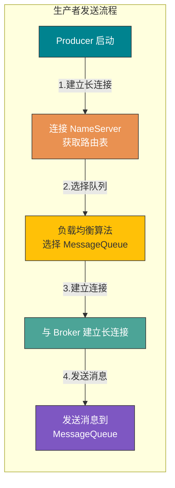

**三种发送方式：**

- **单向发送（Oneway）**：发送后立即返回，不关心是否成功
- **同步发送（Sync）**：发送后等待响应
- **异步发送（Async）**：发送后立即返回，在回调方法中处理响应

### Consumer（消费者）

**消费流程：**

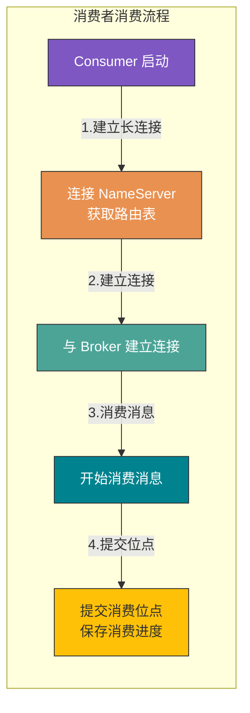

**三种消费模式：**

- **拉取模式（Pull）**：消费者主动向 Broker 发送拉取请求
- **推模式（Push）**：长轮询机制，Broker 有消息时才返回
- **无状态模式（Pop）**：RocketMQ 5.0 新增，服务端管理重平衡和位点

### 网络协议

RocketMQ 支持两种协议：

| 协议           | Remoting（私有协议） | gRPC（云原生）            |
| -------------- | -------------------- | ------------------------- |
| **性能**       | 极致（私有协议优化） | 稍低（HTTP/2 头部开销）   |
| **多语言支持** | 高成本（需重复实现） | 低成本（官方/社区实现）   |
| **云原生集成** | 困难（需额外适配）   | 原生支持（Istio/K8s）     |
| **可观测性**   | 需额外开发           | 原生支持（OpenTelemetry） |
| **适用场景**   | 内部高性能场景       | 面向用户和云原生          |

### 网络模块（基于 Netty）

RocketMQ 的 RPC 通信采用 Netty 作为底层通信库，基于 Reactor 多线程模型进行了深度扩展和优化。

**线程模型总结：**

- **Reactor 主线程**：1 个，负责监听连接
- **Reactor 线程池**：默认 3 个，负责网络数据处理
- **业务线程池**：动态调整，根据 CPU 核心数

### 为什么必须要 NameServer？

听完了上面的解释你可能会觉得，这玩意好简单。不就是这样的么？


嗯？你可能会发现一个问题，这老家伙 NameServer 干啥用的，这不多余吗？直接 Producer、Consumer 和 Broker 直接进行生产消息，消费消息不就好了么？

但是，我们上文提到过 Broker 是需要保证高可用的，如果整个系统仅仅靠着一个 Broker 来维持的话，那么这个 Broker 的压力会不会很大？所以我们需要使用多个 Broker 来保证 **负载均衡** 。

如果说，我们的消费者和生产者直接和多个 Broker 相连，那么当 Broker 修改的时候必定会牵连着每个生产者和消费者，这样就会产生耦合问题，而 NameServer 注册中心就是用来解决这个问题的。

当然，RocketMQ 中的技术架构肯定不止前面那么简单，因为上面图中的四个角色都是需要做集群的。我给出一张官网的架构图，大家尝试理解一下。


其实和我们最开始画的那张乞丐版的架构图也没什么区别，主要是一些细节上的差别。听我细细道来 🤨。

第一、我们的 Broker **做了集群并且还进行了主从部署** ，由于消息分布在各个 Broker 上，一旦某个 Broker 宕机，则该Broker 上的消息读写都会受到影响。所以 RocketMQ 提供了 `master/slave` 的结构，`salve` 定时从 `master` 同步数据(同步刷盘或者异步刷盘)，如果 `master` 宕机，**则 `slave` 提供消费服务，但是不能写入消息** (后面我还会提到哦)。

第二、为了保证 HA，我们的 NameServer 也做了集群部署，但是请注意它是 **去中心化** 的。也就意味着它没有主节点，你可以很明显地看出 NameServer 的所有节点是没有进行 `Info Replicate` 的，在 RocketMQ 中是通过 **单个 Broker 和所有 NameServer 保持长连接** ，并且在每隔 30 秒 Broker 会向所有 `Nameserver` 发送心跳，心跳包含了自身的 Topic 配置信息，这个步骤就对应这上面的 `Routing Info` 。

第三、在生产者需要向 Broker 发送消息的时候，**需要先从 NameServer 获取关于 Broker 的路由信息**，然后通过 **轮询** 的方法去向每个队列中生产数据以达到 **负载均衡** 的效果。

第四、消费者通过 NameServer 获取所有 Broker 的路由信息后，向 Broker 发送 `Pull` 请求来获取消息数据。Consumer 可以以两种模式启动—— **广播（Broadcast）和集群（Cluster）**。广播模式下，一条消息会发送给 **同一个消费组中的所有消费者** ，集群模式下消息只会发送给一个消费者。

## RocketMQ 消息

### 普通消息

普通消息一般应用于微服务解耦、事件驱动、数据集成等场景，这些场景大多数要求数据传输通道具有可靠传输的能力，且对消息的处理时机、处理顺序没有特别要求。以在线的电商交易场景为例，上游订单系统将用户下单支付这一业务事件封装成独立的普通消息并发送至 RocketMQ 服务端，下游按需从服务端订阅消息并按照本地消费逻辑处理下游任务。每个消息之间都是相互独立的，且不需要产生关联。另外还有日志系统，以离线的日志收集场景为例，通过埋点组件收集前端应用的相关操作日志，并转发到 RocketMQ 。

**普通消息生命周期**


- 初始化：消息被生产者构建并完成初始化，待发送到服务端的状态。
- 待消费：消息被发送到服务端，对消费者可见，等待消费者消费的状态。
- 消费中：消息被消费者获取，并按照消费者本地的业务逻辑进行处理的过程。 此时服务端会等待消费者完成消费并提交消费结果，如果一定时间后没有收到消费者的响应，RocketMQ 会对消息进行重试处理。
- 消费提交：消费者完成消费处理，并向服务端提交消费结果，服务端标记当前消息已经被处理（包括消费成功和失败）。RocketMQ 默认支持保留所有消息，此时消息数据并不会立即被删除，只是逻辑标记已消费。消息在保存时间到期或存储空间不足被删除前，消费者仍然可以回溯消息重新消费。
- 消息删除：RocketMQ 按照消息保存机制滚动清理最早的消息数据，将消息从物理文件中删除。

### 定时/延时消息

> **备注：定时消息和延时消息本质相同，都是服务端根据消息设置的定时时间在某一固定时刻将消息投递给消费者消费。**

在分布式定时调度触发、任务超时处理等场景，需要实现精准、可靠的定时事件触发。使用 RocketMQ 的定时消息可以简化定时调度任务的开发逻辑，实现高性能、可扩展、高可靠的定时触发能力。

**典型场景一：分布式定时调度**

在分布式定时调度场景下，需要实现各类精度的定时任务，例如每天5点执行文件清理，每隔2分钟触发一次消息推送等需求。传统基于数据库的定时调度方案在分布式场景下，性能不高，实现复杂。

**典型场景二：任务超时处理**

以电商交易场景为例，订单下单后暂未支付，此时不可以直接关闭订单，而是需要等待一段时间后才能关闭订单。使用 RocketMQ 定时消息可以实现超时任务的检查触发。

基于定时消息的超时任务处理具备如下优势：

- **精度高、开发门槛低**：基于消息通知方式不存在定时阶梯间隔。可以轻松实现任意精度事件触发，无需业务去重。
- **高性能可扩展**：传统的数据库扫描方式较为复杂，需要频繁调用接口扫描，容易产生性能瓶颈。RocketMQ 的定时消息具有高并发和水平扩展的能力。

**定时时间设置原则**

RocketMQ 定时消息设置的定时时间是一个预期触发的系统时间戳，延时时间也需要转换成当前系统时间后的某一个时间戳，而不是一段延时时长。

- **时间格式**：毫秒级的 Unix 时间戳
- **定时时长最大值**：默认为24小时，不支持自定义修改
- **定时时间必须设置在当前时间之后**，否则定时不生效，服务端会立即投递消息

**示例**：

- 定时消息：当前系统时间为 2022-06-09 17:30:00，希望消息在 19:20:00 投递，则定时时间戳为 1654773600000
- 延时消息：当前系统时间为 2022-06-09 17:30:00，希望延时 1 小时后投递，则定时时间戳为 1654770600000

**4.x 版本与 5.x 版本的区别**

- **4.x 版本**：只支持延时消息，默认分为 18 个等级（1s 5s 10s 30s 1m 2m 3m 4m 5m 6m 7m 8m 9m 10m 20m 30m 1h 2h），也可以在配置文件中增加自定义的延时等级和时长。
- **5.x 版本**：支持任意精度的定时消息，通过设置定时时间戳（毫秒级）来实现。

**定时消息生命周期**

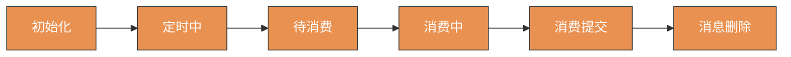

- **初始化**：消息被生产者构建并完成初始化，待发送到服务端的状态。
- **定时中**：消息被发送到服务端，和普通消息不同的是，服务端不会直接构建消息索引，而是会将定时消息**单独存储在定时存储系统中**，等待定时时刻到达。
- **待消费**：定时时刻到达后，服务端将消息重新写入普通存储引擎，对下游消费者可见，等待消费者消费的状态。
- **消费中**：消息被消费者获取，并按照消费者本地的业务逻辑进行处理的过程。此时服务端会等待消费者完成消费并提交消费结果，如果一定时间后没有收到消费者的响应，RocketMQ 会对消息进行重试处理。
- **消费提交**：消费者完成消费处理，并向服务端提交消费结果，服务端标记当前消息已经被处理（包括消费成功和失败）。RocketMQ 默认支持保留所有消息，此时消息数据并不会立即被删除，只是逻辑标记已消费。消息在保存时间到期或存储空间不足被删除前，消费者仍然可以回溯消息重新消费。
- **消息删除**：Apache RocketMQ 按照消息保存机制滚动清理最早的消息数据，将消息从物理文件中删除。

**使用限制**

1. **消息类型一致性**：定时消息仅支持在 MessageType 为 Delay 的主题内使用
2. **定时精度约束**：定时时长参数精确到毫秒级，但默认精度为 1000ms（秒级精度）

**使用建议**

定时消息的实现逻辑需要先经过定时存储等待触发，定时时间到达后才会被投递给消费者。因此，如果将大量定时消息的定时时间设置为同一时刻，则到达该时刻后会有大量消息同时需要被处理，会造成系统压力过大，导致消息分发延迟，影响定时精度。

### 顺序消息

**什么是顺序消息**

顺序消息是 Apache RocketMQ 提供的一种高级消息类型，支持消费者按照发送消息的先后顺序获取消息，从而实现业务场景中的顺序处理。

**应用场景**

在有序事件处理、撮合交易、数据实时增量同步等场景下，异构系统间需要维持强一致的状态同步，上游的事件变更需要按照顺序传递到下游进行处理。

- **撮合交易**：以证券、股票交易撮合场景为例，对于出价相同的交易单，坚持按照先出价先交易的原则，下游处理订单的系统需要严格按照出价顺序来处理订单。
- **数据实时增量同步**：以数据库变更增量同步场景为例，上游源端数据库按需执行增删改操作，将二进制操作日志作为消息，通过 RocketMQ 传输到下游搜索系统，下游系统按顺序还原消息数据，实现状态数据按序刷新。

**如何保证消息的顺序性**

RocketMQ 的消息顺序性分为两部分：**生产顺序性**和**消费顺序性**。

**生产顺序性**

如需保证消息生产的顺序性，则必须满足以下条件：

1. **单一生产者**：消息生产的顺序性仅支持单一生产者
2. **串行发送**：生产者使用多线程并行发送时，不同线程间产生的消息将无法判定其先后顺序

满足以上条件的生产者，将顺序消息发送至 RocketMQ 后，会保证设置了同一**消息组**的消息，按照发送顺序存储在同一队列中。

**消息组（MessageGroup）**

RocketMQ 顺序消息的顺序关系通过消息组（MessageGroup）判定和识别，发送顺序消息时需要为每条消息设置归属的消息组。

- **相同消息组**的多条消息之间遵循先进先出的顺序关系
- **不同消息组**、无消息组的消息之间不涉及顺序性

基于消息组的顺序判定逻辑，支持按照业务逻辑做细粒度拆分，可以在满足业务局部顺序的前提下提高系统的并行度和吞吐能力。

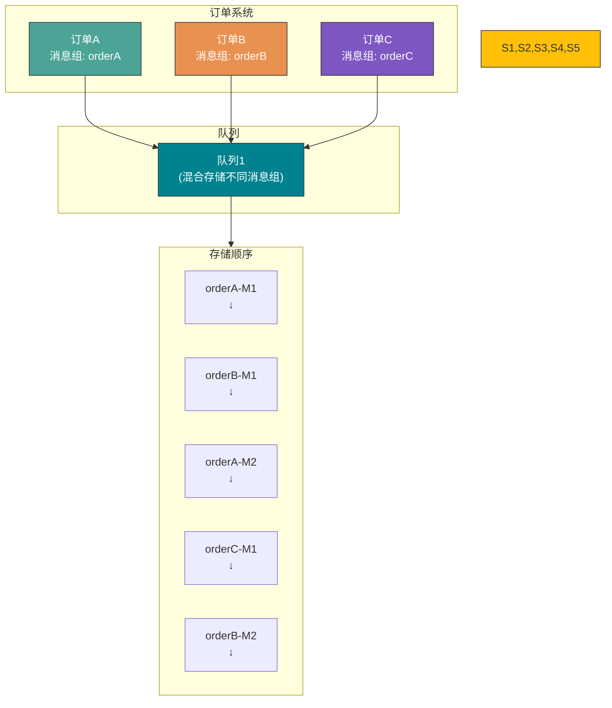

**说明**：

- orderA 消息组的 M1、M2 保持顺序
- orderB 消息组的 M1、M2 保持顺序
- 不同消息组可以混合存储在同一个队列中

**消费顺序性**

如需保证消息消费的顺序性，则必须满足以下条件：

1. **投递顺序**：RocketMQ 通过客户端 SDK 和服务端通信协议保障消息按照服务端存储顺序投递
2. **有限重试**：顺序消息投递仅在重试次数限定范围内，超过最大重试次数后将不再重试，跳过这条消息消费

**消费者类型对顺序消费的影响**

- **PushConsumer**：RocketMQ 保证消息按照存储顺序一条一条投递给消费者
- **SimpleConsumer**：消费者可能一次拉取多条消息，此时消息消费的顺序性需要由业务方自行保证

**生产顺序性和消费顺序性组合**

| 生产顺序                     | 消费顺序 | 顺序性效果                       |
| ---------------------------- | -------- | -------------------------------- |
| 设置消息组，保证消息顺序发送 | 顺序消费 | 按照消息组粒度，严格保证消息顺序 |
| 设置消息组，保证消息顺序发送 | 并发消费 | 并发消费，尽可能按时间顺序处理   |
| 未设置消息组，消息乱序发送   | 顺序消费 | 按队列存储粒度，严格顺序         |
| 未设置消息组，消息乱序发送   | 并发消费 | 并发消费，尽可能按照时间顺序处理 |

**使用限制**

1. **消息类型一致性**：顺序消息仅支持在 MessageType 为 FIFO 的主题内使用
2. 顺序消息消费失败进行消费重试时，为保障消息的顺序性，后续消息不可被消费，必须等待前面的消息消费完成后才能被处理

**使用建议**

1. **串行消费**：消息消费建议串行处理，避免一次消费多条消息导致乱序
2. **消息组尽可能打散**：建议将业务以消息组粒度进行拆分，例如将订单ID、用户ID作为消息组关键字，可实现同一终端用户的消息按照顺序处理，不同用户的消息无需保证顺序

### 事务消息

**什么是事务消息**

事务消息是 Apache RocketMQ 提供的一种高级消息类型，支持在分布式场景下保障消息生产和本地事务的最终一致性。简单来讲，就是将本地事务（数据库的 DML 操作）与发送消息合并在同一个事务中。

**应用场景**

在分布式系统调用的特点为一个核心业务逻辑的执行，同时需要调用多个下游业务进行处理。如何保证核心业务和多个下游业务的执行结果完全一致，是分布式事务需要解决的主要问题。

以电商交易场景为例，用户支付订单这一核心操作的同时会涉及到下游物流发货、积分变更、购物车状态清空等多个子系统的变更：

- **主分支订单系统状态更新**：由未支付变更为支付成功
- **物流系统状态新增**：新增待发货物流记录，创建订单物流记录
- **积分系统状态变更**：变更用户积分，更新用户积分表
- **购物车系统状态变更**：清空购物车，更新用户购物车记录

**传统方案的问题**

- **传统 XA 事务方案**：基于 XA 协议的分布式事务系统可以实现一致性，但多分支环境下资源锁定范围大，并发度低
- **基于普通消息方案**：普通消息和订单事务无法保证一致，容易出现消息发送成功但订单没有执行成功、订单执行成功但消息没有发送成功等情况

**RocketMQ 事务消息方案**

RocketMQ 事务消息的方案，具备高性能、可扩展、业务开发简单的优势，支持二阶段的提交能力，将二阶段提交和本地事务绑定，实现全局提交结果的一致性。

**事务消息处理流程**

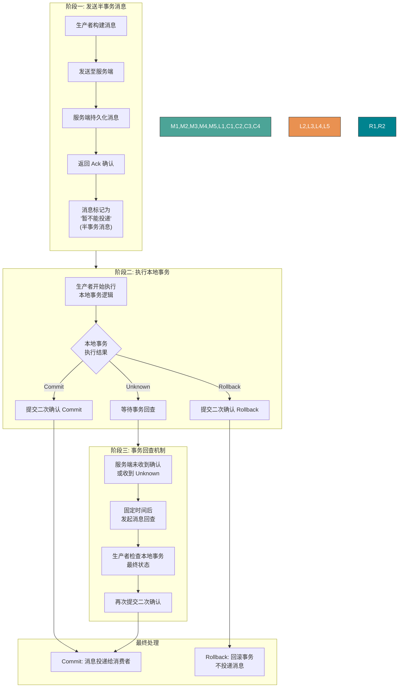

1. 生产者将消息发送至 RocketMQ 服务端
2. 服务端将消息持久化成功之后，向生产者返回 Ack 确认消息已经发送成功，此时消息被标记为"暂不能投递"，这种状态下的消息即为**半事务消息**
3. 生产者开始执行本地事务逻辑
4. 生产者根据本地事务执行结果向服务端提交二次确认结果（Commit 或 Rollback）
5. 如果服务端未收到二次确认结果，或收到的结果为 Unknown，经过固定时间后，服务端将对消息生产者发起**消息回查**
6. 生产者收到消息回查后，需要检查对应消息的本地事务执行的最终结果
7. 生产者根据检查到的本地事务的最终状态再次提交二次确认

**事务消息生命周期**

- **初始化**：半事务消息被生产者构建并完成初始化，待发送到服务端的状态
- **事务待提交**：半事务消息被发送到服务端，并不会直接被服务端持久化，而是会被单独存储到事务存储系统中，等待第二阶段本地事务返回执行结果后再提交。此时消息对下游消费者不可见
- **消息回滚**：第二阶段如果事务执行结果明确为回滚，服务端会将半事务消息回滚，该事务消息流程终止
- **提交待消费**：第二阶段如果事务执行结果明确为提交，服务端会将半事务消息重新存储到普通存储系统中，此时消息对下游消费者可见
- **消费中**：消息被消费者获取，并按照消费者本地的业务逻辑进行处理的过程
- **消费提交**：消费者完成消费处理，并向服务端提交消费结果
- **消息删除**：RocketMQ 按照消息保存机制滚动清理最早的消息数据

**使用限制**

1. **消息类型一致性**：事务消息仅支持在 MessageType 为 Transaction 的主题内使用
2. **消费事务性**：RocketMQ 事务消息保证本地主分支事务和下游消息发送事务的一致性，但不保证消息消费结果和上游事务的一致性
3. **中间状态可见性**：事务消息为最终一致性，即消息提交到下游消费端处理完成之前，下游分支和上游事务之间的状态会不一致
4. **事务超时机制**：事务消息的生命周期存在超时机制，半事务消息被生产者发送服务端后，如果在指定时间内服务端无法确认提交或者回滚状态，则消息默认会被回滚

**使用建议**

1. **避免大量未决事务导致超时**：生产者应该尽量避免本地事务返回未知结果，大量的事务检查会导致系统性能受损
2. **正确处理"进行中"的事务**：消息回查时，对于正在进行中的事务不要返回 Rollback 或 Commit 结果，应继续保持 Unknown 的状态

### 关于发送消息

#### 不建议单一进程创建大量生产者

Apache RocketMQ 的生产者和主题是多对多的关系，支持同一个生产者向多个主题发送消息。对于生产者的创建和初始化，建议遵循够用即可、最大化复用原则，如果有需要发送消息到多个主题的场景，无需为每个主题都创建一个生产者。

#### 不建议频繁创建和销毁生产者

Apache RocketMQ 的生产者是可以重复利用的底层资源，类似数据库的连接池。因此不需要在每次发送消息时动态创建生产者，且在发送结束后销毁生产者。这样频繁的创建销毁会在服务端产生大量短连接请求，严重影响系统性能。

正确示例：

```java
Producer p = ProducerBuilder.build();
for (int i =0;i<n;i++){
    Message m= MessageBuilder.build();
    p.send(m);
 }
p.shutdown();
```

## 消费者分类

### PushConsumer（推模式消费者）

**核心特点：**

高度封装的消费者类型，消费消息仅仅通过消费监听器监听并返回结果。消息的获取、消费状态提交以及消费重试都通过 RocketMQ 的客户端 SDK 完成。

**适用场景：**

- 消息处理时间可预估
- 无异步化、高级定制需求
- 希望快速开发的场景

**使用示例：**

```java
public static void main(String[] args) throws InterruptedException, MQClientException {
    // 创建 Push 模式消费者
    DefaultMQPushConsumer consumer = new DefaultMQPushConsumer("CID_JODIE_1");

    // 订阅主题
    consumer.subscribe("TopicTest", "*");

    // 设置从哪里开始消费
    consumer.setConsumeFromWhere(ConsumeFromWhere.CONSUME_FROM_FIRST_OFFSET);

    // 注册消息监听器
    consumer.registerMessageListener(new MessageListenerConcurrently() {
        @Override
        public ConsumeConcurrentlyStatus consumeMessage(
                List<MessageExt> msgs,
                ConsumeConcurrentlyContext context) {
            System.out.printf("Receive New Messages: %s %n", msgs);
            // 业务处理逻辑
            return ConsumeConcurrentlyStatus.CONSUME_SUCCESS;
        }
    });

    consumer.start();
}
```

**消费监听器执行结果：**

- **返回消费成功**：表示该消息处理成功，服务端按照消费结果更新消费进度
- **返回消费失败**：表示该消息处理失败，需要根据消费重试逻辑判断是否进行重试消费
- **抛出异常**：按消费失败处理，需要根据消费重试逻辑判断是否进行重试消费

**使用注意事项：**

PushConsumer 消费时，不允许使用以下方式处理消息：

1. **错误方式一**：消息还未处理完成，就提前返回消费成功结果。此时如果消息消费失败，RocketMQ 服务端是无法感知的，因此不会进行消费重试。

2. **错误方式二**：在消费监听器内将消息再次分发到自定义的其他线程，消费监听器提前返回消费结果。此时如果消息消费失败，RocketMQ 服务端同样无法感知，因此也不会进行消费重试。

**Push 模式工作原理：**

1. **负载均衡**：RebalanceService 线程根据队列数量和消费者个数做负载均衡，将分配到的队列发布 pullRequest 到 pullRequestQueue
2. **消息拉取**：PullMessageService 线程不断从 pullRequestQueue 获取 pullRequest，从 Broker 拉取消息并缓存到 ProcessQueue
3. **消息消费**：ConsumeMessageService 线程从 ProcessQueue 获取消息，调用监听器处理业务逻辑
4. **位点提交**：消费完成后自动提交消费位点
5. **流控保护**：拉取前检查缓存阈值（1000 消息或 100M），超过则延迟拉取

### SimpleConsumer

SimpleConsumer 是一种接口原子型的消费者类型，消息的获取、消费状态提交以及消费重试都是通过消费者业务逻辑主动发起调用完成。

一个来自官网的例子：

```java
// 消费示例：使用 SimpleConsumer 消费普通消息，主动获取消息处理并提交。
ClientServiceProvider provider = ClientServiceProvider.loadService();
String topic = "YourTopic";
FilterExpression filterExpression = new FilterExpression("YourFilterTag", FilterExpressionType.TAG);
SimpleConsumer simpleConsumer = provider.newSimpleConsumerBuilder()
        // 设置消费者分组。
        .setConsumerGroup("YourConsumerGroup")
        // 设置接入点。
        .setClientConfiguration(ClientConfiguration.newBuilder().setEndpoints("YourEndpoint").build())
        // 设置预绑定的订阅关系。
        .setSubscriptionExpressions(Collections.singletonMap(topic, filterExpression))
        // 设置从服务端接受消息的最大等待时间
        .setAwaitDuration(Duration.ofSeconds(1))
        .build();
try {
    // SimpleConsumer 需要主动获取消息，并处理。
    List<MessageView> messageViewList = simpleConsumer.receive(10, Duration.ofSeconds(30));
    messageViewList.forEach(messageView -> {
        System.out.println(messageView);
        // 消费处理完成后，需要主动调用 ACK 提交消费结果。
        try {
            simpleConsumer.ack(messageView);
        } catch (ClientException e) {
            logger.error("Failed to ack message, messageId={}", messageView.getMessageId(), e);
        }
    });
} catch (ClientException e) {
    // 如果遇到系统流控等原因造成拉取失败，需要重新发起获取消息请求。
    logger.error("Failed to receive message", e);
}
```

SimpleConsumer 适用于以下场景：

- 消息处理时长不可控：如果消息处理时长无法预估，经常有长时间耗时的消息处理情况。建议使用 SimpleConsumer 消费类型，可以在消费时自定义消息的预估处理时长，若实际业务中预估的消息处理时长不符合预期，也可以通过接口提前修改。
- 需要异步化、批量消费等高级定制场景：SimpleConsumer 在 SDK 内部没有复杂的线程封装，完全由业务逻辑自由定制，可以实现异步分发、批量消费等高级定制场景。
- 需要自定义消费速率：SimpleConsumer 是由业务逻辑主动调用接口获取消息，因此可以自由调整获取消息的频率，自定义控制消费速率。

**SimpleConsumer 工作原理：**

1. **主动获取消息**：业务方调用 receive() 接口主动获取消息
2. **业务处理**：获取到的消息由业务方自行处理
3. **主动提交 ACK**：消费处理完成后，业务方主动调用 ack() 接口提交消费结果
4. **高可控性**：业务方可完全控制消息处理时机和消费速率

### PullConsumer（拉模式消费者）

**核心特点：**

Pull 模式下，**应用程序对消息的拉取过程参与度高，可控性强**，可以自主决定何时进行消息拉取，从什么位置 offset 拉取消息。

**与 Push 模式的对比：**

| 特性           | Push 模式            | Pull 模式        |
| -------------- | -------------------- | ---------------- |
| **控制权**     | 客户端 SDK 自动拉取  | 应用程序主动拉取 |
| **可控性**     | 可控性不足           | 可控性高         |
| **开发复杂度** | 简单，只需实现监听器 | 需要管理拉取过程 |
| **适用场景**   | 消息处理可预估       | 需要精细控制拉取 |

**使用示例（DefaultMQPullConsumer）：**

```java
@Test
public void testPullConsumer() throws Exception {
    DefaultMQPullConsumer consumer = new DefaultMQPullConsumer("group1_pull");
    consumer.setNamesrvAddr(this.nameServer);
    String topic = "topic1";
    consumer.start();

    // 获取 Topic 对应的消息队列
    Set<MessageQueue> messageQueues = consumer.fetchSubscribeMessageQueues(topic);
    int maxNums = 10; // 每次拉取消息的最大数量

    while (true) {
        boolean found = false;
        for (MessageQueue messageQueue : messageQueues) {
            // 获取消费位置
            long offset = consumer.fetchConsumeOffset(messageQueue, false);
            // 拉取消息
            PullResult pullResult = consumer.pull(messageQueue, "tag8", offset, maxNums);

            switch (pullResult.getPullStatus()) {
                case FOUND:
                    found = true;
                    List<MessageExt> msgs = pullResult.getMsgFoundList();
                    System.out.println("收到消息，数量----" + msgs.size());
                    // 处理消息
                    for (MessageExt msg : msgs) {
                        System.out.println("处理消息——" + msg.getMsgId());
                    }
                    // 更新消费位置
                    long nextOffset = pullResult.getNextBeginOffset();
                    consumer.updateConsumeOffset(messageQueue, nextOffset);
                    break;
                case NO_NEW_MSG:
                    System.out.println("没有新消息");
                    break;
                case NO_MATCHED_MSG:
                    System.out.println("没有匹配的消息");
                    break;
                case OFFSET_ILLEGAL:
                    System.err.println("offset 错误");
                    break;
            }
        }
        if (!found) {
            // 没有队列中有新消息，则暂停一会
            TimeUnit.MILLISECONDS.sleep(5000);
        }
    }
}
```

**使用示例（DefaultLitePullConsumer - 推荐）：**

```java
DefaultLitePullConsumer litePullConsumer =
        new DefaultLitePullConsumer("lite_pull_consumer_test");
litePullConsumer.setConsumeFromWhere(ConsumeFromWhere.CONSUME_FROM_FIRST_OFFSET);
litePullConsumer.subscribe("TopicTest", "*");
litePullConsumer.start();

try {
    while (running) {
        // 应用程序主动调用 poll 方法拉取消息
        List<MessageExt> messageExts = litePullConsumer.poll();
        System.out.printf("%s%n", messageExts);
    }
} finally {
    litePullConsumer.shutdown();
}
```

**适用场景：**

- **需要精细控制拉取时机**：可以根据业务需求自主决定何时拉取消息
- **需要控制消费速率**：可以灵活调整拉取频率
- **批量消费场景**：可以一次性拉取大量消息进行批量处理
- **特殊消费需求**：如需要从特定 offset 开始消费、需要暂停消费等

**Pull 模式工作原理：**

1. **负载均衡**：RebalanceService 线程发现消费快照发生变化时，启动消息拉取线程
2. **消息拉取**：PullTaskImpl 拉取到消息后，把消息放到 consumeRequestCache
3. **消息消费**：应用程序调用 poll 方法，不停地从 consumeRequestCache 拉取消息进行业务处理

### 三种消费者类型对比

| 对比项         | PushConsumer                                                             | SimpleConsumer                                       | PullConsumer                                       |
| -------------- | ------------------------------------------------------------------------ | ---------------------------------------------------- | -------------------------------------------------- |
| 接口方式       | 使用监听器回调接口返回消费结果，消费者仅允许在监听器范围内处理消费逻辑。 | 业务方自行实现消息处理，并主动调用接口返回消费结果。 | 业务方自行按队列拉取消息，并可选择性地提交消费结果 |
| 消费并发度管理 | 由SDK管理消费并发度。                                                    | 由业务方消费逻辑自行管理消费线程。                   | 由业务方消费逻辑自行管理消费线程。                 |
| 负载均衡粒度   | 5.0 SDK是消息粒度，更均衡，早期版本是队列维度                            | 消息粒度，更均衡                                     | 队列粒度，吞吐攒批性能更好，但容易不均衡           |
| 接口灵活度     | 高度封装，不够灵活。                                                     | 原子接口，可灵活自定义。                             | 原子接口，可灵活自定义。                           |
| 适用场景       | 适用于无自定义流程的业务消息开发场景。                                   | 适用于需要高度自定义业务流程的业务开发场景。         | 仅推荐在流处理框架场景下集成使用                   |

**选择建议：**

- **普通场景**：优先使用 **PushConsumer**，开发简单，SDK 自动管理拉取和提交
- **消息处理时长不可控**：使用 **SimpleConsumer**，可以自定义处理时长
- **需要精细控制**：使用 **PullConsumer**，完全自主控制拉取过程

**注意**：生产环境中相同的 ConsumerGroup 下严禁混用 PullConsumer 和其他两种消费者，否则会导致消息消费异常。

## 消费者分组和生产者分组

### 生产者分组

RocketMQ 服务端 5.x 版本开始，**生产者是匿名的**，无需管理生产者分组（ProducerGroup）；对于历史版本服务端 3.x 和 4.x 版本，已经使用的生产者分组可以废弃无需再设置，且不会对当前业务产生影响。

### 消费者分组

消费者分组是多个消费行为一致的消费者的负载均衡分组。消费者分组不是具体实体而是一个逻辑资源。通过消费者分组实现消费性能的水平扩展以及高可用容灾。

**消费者组的核心作用：**

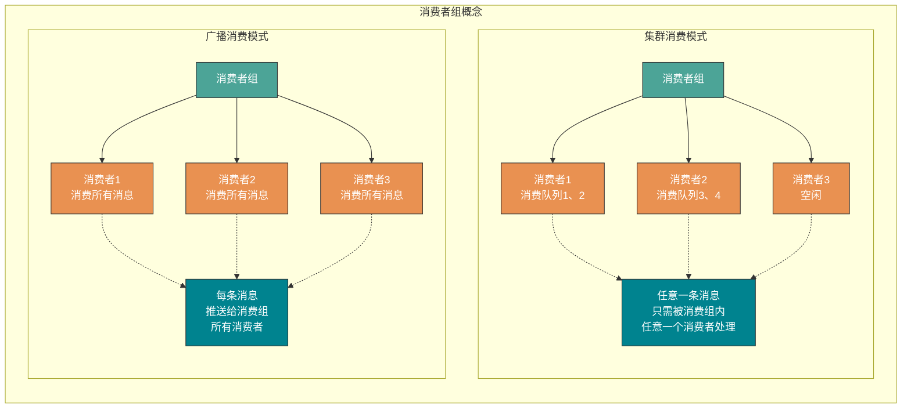

消费者分组中的订阅关系、投递顺序性、消费重试策略是一致的。

- 订阅关系：Apache RocketMQ 以消费者分组的粒度管理订阅关系，实现订阅关系的管理和追溯。
- 投递顺序性：Apache RocketMQ 的服务端将消息投递给消费者消费时，支持顺序投递和并发投递，投递方式在消费者分组中统一配置。
- 消费重试策略： 消费者消费消息失败时的重试策略，包括重试次数、死信队列设置等。

RocketMQ 服务端 5.x 版本：上述消费者的消费行为从关联的消费者分组中统一获取，因此，同一分组内所有消费者的消费行为必然是一致的，客户端无需关注。

RocketMQ 服务端 3.x/4.x 历史版本：上述消费逻辑由消费者客户端接口定义，因此，您需要自己在消费者客户端设置时保证同一分组下的消费者的消费行为一致。(来自官方网站)

**两种消费模式对比：**

| 对比维度     | 集群消费模式                                   | 广播消费模式                         |
| ------------ | ---------------------------------------------- | ------------------------------------ |
| **消息消费** | 任意一条消息只需被消费组内的任意一个消费者处理 | 每条消息推送给消费组所有消费者       |
| **扩缩容**   | 可通过扩缩消费者数量来提升或降低消费能力       | 扩缩消费者数量无法提升或降低消费能力 |
| **适用场景** | 需要提升消费能力、避免重复消费                 | 需要所有消费者都收到消息             |

## 如何解决顺序消费和重复消费？

其实，这些东西都是我在介绍消息队列带来的一些副作用的时候提到的，也就是说，这些问题不仅仅挂钩于 RocketMQ ，而是应该每个消息中间件都需要去解决的。

在上面我介绍 RocketMQ 的技术架构的时候我已经向你展示了 **它是如何保证高可用的** ，这里不涉及运维方面的搭建，如果你感兴趣可以自己去官网上照着例子搭建属于你自己的 RocketMQ 集群。

> 其实 Kafka 的架构基本和 RocketMQ 类似，只是它注册中心使用了 Zookeeper、它的 **分区** 就相当于 RocketMQ 中的 **队列** 。还有一些小细节不同会在后面提到。

### 顺序消费

在上面的技术架构介绍中，我们已经知道了 **RocketMQ 在主题上是无序的、它只有在队列层面才是保证有序** 的。

这又扯到两个概念——**普通顺序** 和 **严格顺序** 。

所谓普通顺序是指 消费者通过 **同一个消费队列收到的消息是有顺序的** ，不同消息队列收到的消息则可能是无顺序的。普通顺序消息在 Broker **重启情况下不会保证消息顺序性** (短暂时间) 。

所谓严格顺序是指 消费者收到的 **所有消息** 均是有顺序的。严格顺序消息 **即使在异常情况下也会保证消息的顺序性** 。

但是，严格顺序看起来虽好，实现它可会付出巨大的代价。如果你使用严格顺序模式，Broker 集群中只要有一台机器不可用，则整个集群都不可用。你还用啥？现在主要场景也就在 `binlog` 同步。

一般而言，我们的 `MQ` 都是能容忍短暂的乱序，所以推荐使用普通顺序模式。

那么，我们现在使用了 **普通顺序模式** ，我们从上面学习知道了在 Producer 生产消息的时候会进行轮询(取决你的负载均衡策略)来向同一主题的不同消息队列发送消息。那么如果此时我有几个消息分别是同一个订单的创建、支付、发货，在轮询的策略下这 **三个消息会被发送到不同队列** ，因为在不同的队列此时就无法使用 RocketMQ 带来的队列有序特性来保证消息有序性了。


那么，怎么解决呢？

其实很简单，我们需要处理的仅仅是将同一语义下的消息放入同一个队列(比如这里是同一个订单)，那我们就可以使用 **Hash 取模法** 来保证同一个订单在同一个队列中就行了。

**4.x 版本：使用 MessageQueueSelector**

RocketMQ 4.x 版本通过继承 `MessageQueueSelector` 来实现自定义队列选择逻辑：

```java
SendResult sendResult = producer.send(msg, new MessageQueueSelector() {
    @Override
    public MessageQueue select(List<MessageQueue> mqs, Message msg, Object arg) {
        //根据订单ID等业务关键字计算队列索引
        Integer orderId = (Integer) arg;
        int index = orderId % mqs.size();
        return mqs.get(index);
    }
}, orderId);
```

**5.x 版本：使用消息组（MessageGroup）**

RocketMQ 5.x 版本引入了**消息组**的概念，通过设置消息组来保证同一组内消息的顺序性：

```java
Message message = messageBuilder.setTopic("topic")
        .setTag("messageTag")
        //设置顺序消息的排序分组
        .setMessageGroup("fifoGroup001")  // 比如使用订单ID作为消息组
        .setBody("messageBody".getBytes())
        .build();
```

**队列选择算法**

RocketMQ 实现了两种队列选择算法：

- **轮询算法**（默认）：向消息指定的 topic 所在队列中依次发送消息，保证消息均匀分布
- **最小投递延迟算法**：每次消息投递的时候统计消息投递的延迟，选择队列时优先选择消息延时小的队列

```java
// 启用最小投递延迟算法
producer.setSendLatencyFaultEnable(true);
```

### 特殊情况处理

#### 发送异常

选择队列后会与 Broker 建立连接，通过网络请求将消息发送到 Broker 上，如果 Broker 挂了或者网络波动发送消息超时此时 RocketMQ 会进行重试。

重新选择其他 Broker 中的消息队列进行发送，默认重试两次，可以手动设置。

```java
producer.setRetryTimesWhenSendFailed(5);
```

#### 消息过大

消息超过 4k 时 RocketMQ 会将消息压缩后在发送到 Broker 上，减少网络资源的占用。

### 重复消费

emmm，就两个字—— **幂等** 。在编程中一个*幂等* 操作的特点是其任意多次执行所产生的影响均与一次执行的影响相同。比如说，这个时候我们有一个订单的处理积分的系统，每当来一个消息的时候它就负责为创建这个订单的用户的积分加上相应的数值。可是有一次，消息队列发送给订单系统 FrancisQ 的订单信息，其要求是给 FrancisQ 的积分加上 500。但是积分系统在收到 FrancisQ 的订单信息处理完成之后返回给消息队列处理成功的信息的时候出现了网络波动(当然还有很多种情况，比如 Broker 意外重启等等)，这条回应没有发送成功。

那么，消息队列没收到积分系统的回应会不会尝试重发这个消息？问题就来了，我再发这个消息，万一它又给 FrancisQ 的账户加上 500 积分怎么办呢？

所以我们需要给我们的消费者实现 **幂等** ，也就是对同一个消息的处理结果，执行多少次都不变。

那么如何给业务实现幂等呢？这个还是需要结合具体的业务的。你可以使用 **写入 `Redis`** 来保证，因为 `Redis` 的 `key` 和 `value` 就是天然支持幂等的。当然还有使用 **数据库插入法** ，基于数据库的唯一键来保证重复数据不会被插入多条。

不过最主要的还是需要 **根据特定场景使用特定的解决方案** ，你要知道你的消息消费是否是完全不可重复消费还是可以忍受重复消费的，然后再选择强校验和弱校验的方式。毕竟在 CS 领域还是很少有技术银弹的说法。

而在整个互联网领域，幂等不仅仅适用于消息队列的重复消费问题，这些实现幂等的方法，也同样适用于，**在其他场景中来解决重复请求或者重复调用的问题** 。比如将 HTTP 服务设计成幂等的，**解决前端或者 APP 重复提交表单数据的问题** ，也可以将一个微服务设计成幂等的，解决 RPC 框架自动重试导致的 **重复调用问题** 。

## RocketMQ 如何实现分布式事务？

如何解释分布式事务呢？事务大家都知道吧？**要么都执行要么都不执行** 。在同一个系统中我们可以轻松地实现事务，但是在分布式架构中，我们有很多服务是部署在不同系统之间的，而不同服务之间又需要进行调用。比如此时我下订单然后增加积分，如果保证不了分布式事务的话，就会出现 A 系统下了订单，但是 B 系统增加积分失败或者 A 系统没有下订单，B 系统却增加了积分。前者对用户不友好，后者对运营商不利，这是我们都不愿意见到的。

那么，如何去解决这个问题呢？

如今比较常见的分布式事务实现有 2PC、TCC 和事务消息(half 半消息机制)。每一种实现都有其特定的使用场景，但是也有各自的问题，**都不是完美的解决方案**。

在 RocketMQ 中使用的是 **事务消息加上事务反查机制** 来解决分布式事务问题的。我画了张图，大家可以对照着图进行理解。


**事务消息处理流程详解**

1. **发送半事务消息**：生产者将消息发送至 RocketMQ 服务端
2. **服务端确认**：服务端将消息持久化成功之后，向生产者返回 Ack 确认消息已经发送成功，此时消息被标记为"暂不能投递"，这种状态下的消息即为**半事务消息**
3. **执行本地事务**：生产者开始执行本地事务逻辑
4. **提交二次确认**：生产者根据本地事务执行结果向服务端提交二次确认结果（Commit 或 Rollback）
5. **事务回查**：如果服务端未收到二次确认结果，或收到的结果为 Unknown，经过固定时间后，服务端将对消息生产者发起**消息回查**
6. **检查本地事务**：生产者收到消息回查后，需要检查对应消息的本地事务执行的最终结果
7. **再次提交确认**：生产者根据检查到的本地事务的最终状态再次提交二次确认

在第一步发送的 half 消息 ，它的意思是 **在事务提交之前，对于消费者来说，这个消息是不可见的** 。

> 那么，如何做到写入消息但是对用户不可见呢？RocketMQ 事务消息的做法是：如果消息是 half 消息，将备份原消息的主题与消息消费队列，然后 **改变主题** 为 RMQ_SYS_TRANS_HALF_TOPIC。由于消费组未订阅该主题，故消费端无法消费 half 类型的消息，**然后 RocketMQ 会开启一个定时任务，从 Topic 为 RMQ_SYS_TRANS_HALF_TOPIC 中拉取消息进行消费**，根据生产者组获取一个服务提供者发送回查事务状态请求，根据事务状态来决定是提交或回滚消息。

你可以试想一下，如果没有从第 5 步开始的 **事务回查机制** ，如果出现网路波动第 4 步没有发送成功，这样就会产生 MQ 不知道是不是需要给消费者消费的问题。在 RocketMQ 中就是使用的上述的事务回查来解决的，而在 Kafka 中通常是直接抛出一个异常让用户来自行解决。

你还需要注意的是，在 `MQ Server` 指向系统 B 的操作已经和系统 A 不相关了，也就是说在消息队列中的分布式事务是——**本地事务和存储消息到消息队列才是同一个事务**。这样也就产生了事务的**最终一致性**，因为整个过程是异步的，**每个系统只要保证它自己那一部分的事务就行了**。

实践中会遇到的问题：事务消息需要一个事务监听器来监听本地事务是否成功，并且事务监听器接口只允许被实现一次。那就意味着需要把各种事务消息的本地事务都写在一个接口方法里面，必将会产生大量的耦合和类型判断。采用函数 Function 接口来包装整个业务过程，作为一个参数传递到监听器的接口方法中。再调用 Function 的 apply() 方法来执行业务，事务也会在 apply() 方法中执行。让监听器与业务之间实现解耦，使之具备了真实生产环境中的可行性。

1.模拟一个添加用户浏览记录的需求

```java
@PostMapping("/add")
@ApiOperation("添加用户浏览记录")
public Result<TransactionSendResult> add(Long userId, Long forecastLogId) {

        // 函数式编程:浏览记录入库
        Function<String, Boolean> function = transactionId -> viewHistoryHandler.addViewHistory(transactionId, userId, forecastLogId);

        Map<String, Long> hashMap = new HashMap<>();
        hashMap.put("userId", userId);
        hashMap.put("forecastLogId", forecastLogId);
        String jsonString = JSON.toJSONString(hashMap);

        // 发送事务消息;将本地的事务操作,用函数Function接口接收,作为一个参数传入到方法中
        TransactionSendResult transactionSendResult = mqProducerService.sendTransactionMessage(jsonString, MQDestination.TAG_ADD_VIEW_HISTORY, function);
        return Result.success(transactionSendResult);
}
```

2.发送事务消息的方法

```java
/**
 * 发送事务消息
 *
 * @param msgBody
 * @param tag
 * @param function
 * @return
 */
public TransactionSendResult sendTransactionMessage(String msgBody, String tag, Function<String, Boolean> function) {
    // 构建消息体
    Message<String> message = buildMessage(msgBody);

    // 构建消息投递信息
    String destination = buildDestination(tag);

    TransactionSendResult result = rocketMQTemplate.sendMessageInTransaction(destination, message, function);
    return result;
}
```

3.生产者消息监听器,只允许一个类去实现该监听器

```java
@Slf4j
@RocketMQTransactionListener
public class TransactionMsgListener implements RocketMQLocalTransactionListener {

    @Autowired
    private RedisService redisService;

    /**
     * 执行本地事务（在发送消息成功时执行）
     *
     * @param message
     * @param o
     * @return commit or rollback or unknown
     */
    @Override
    public RocketMQLocalTransactionState executeLocalTransaction(Message message, Object o) {

        // 1、获取事务ID
        String transactionId = null;
        try {
            transactionId = message.getHeaders().get("rocketmq_TRANSACTION_ID").toString();
            // 2、判断传入函数对象是否为空，如果为空代表没有要执行的业务直接抛弃消息
            if (o == null) {
                //返回ROLLBACK状态的消息会被丢弃
                log.info("事务消息回滚，没有需要处理的业务 transactionId={}", transactionId);
                return RocketMQLocalTransactionState.ROLLBACK;
            }
            // 将Object o转换成Function对象
            Function<String, Boolean> function = (Function<String, Boolean>) o;
            // 执行业务 事务也会在function.apply中执行
            Boolean apply = function.apply(transactionId);
            if (apply) {
                log.info("事务提交，消息正常处理 transactionId={}", transactionId);
                //返回COMMIT状态的消息会立即被消费者消费到
                return RocketMQLocalTransactionState.COMMIT;
            }
        } catch (Exception e) {
            log.info("出现异常 返回ROLLBACK transactionId={}", transactionId);
            return RocketMQLocalTransactionState.ROLLBACK;
        }
        return RocketMQLocalTransactionState.ROLLBACK;
    }

    /**
     * 事务回查机制，检查本地事务的状态
     *
     * @param message
     * @return
     */
    @Override
    public RocketMQLocalTransactionState checkLocalTransaction(Message message) {

        String transactionId = message.getHeaders().get("rocketmq_TRANSACTION_ID").toString();

        // 查redis
        MqTransaction mqTransaction = redisService.getCacheObject("mqTransaction:" + transactionId);
        if (Objects.isNull(mqTransaction)) {
            return RocketMQLocalTransactionState.ROLLBACK;
        }
        return RocketMQLocalTransactionState.COMMIT;
    }
}
```

4.模拟的业务场景,这里的方法必须提取出来,放在别的类里面.如果调用方与被调用方在同一个类中,会发生事务失效的问题.

```java
@Component
public class ViewHistoryHandler {

    @Autowired
    private IViewHistoryService viewHistoryService;

    @Autowired
    private IMqTransactionService mqTransactionService;

    @Autowired
    private RedisService redisService;

    /**
     * 浏览记录入库
     *
     * @param transactionId
     * @param userId
     * @param forecastLogId
     * @return
     */
    @Transactional
    public Boolean addViewHistory(String transactionId, Long userId, Long forecastLogId) {
        // 构建浏览记录
        ViewHistory viewHistory = new ViewHistory();
        viewHistory.setUserId(userId);
        viewHistory.setForecastLogId(forecastLogId);
        viewHistory.setCreateTime(LocalDateTime.now());
        boolean save = viewHistoryService.save(viewHistory);

        // 本地事务信息
        MqTransaction mqTransaction = new MqTransaction();
        mqTransaction.setTransactionId(transactionId);
        mqTransaction.setCreateTime(new Date());
        mqTransaction.setStatus(MqTransaction.StatusEnum.VALID.getStatus());

        // 1.可以把事务信息存数据库
        mqTransactionService.save(mqTransaction);

        // 2.也可以选择存redis,4个小时有效期,'4个小时'是RocketMQ内置的最大回查超时时长,过期未确认将强制回滚
        redisService.setCacheObject("mqTransaction:" + transactionId, mqTransaction, 4L, TimeUnit.HOURS);

        // 放开注释,模拟异常,事务回滚
        // int i = 10 / 0;

        return save;
    }
}
```

5.消费消息,以及幂等处理

```java
@Service
@RocketMQMessageListener(topic = MQDestination.TOPIC, selectorExpression = MQDestination.TAG_ADD_VIEW_HISTORY, consumerGroup = MQDestination.TAG_ADD_VIEW_HISTORY)
public class ConsumerAddViewHistory implements RocketMQListener<Message> {
    // 监听到消息就会执行此方法
    @Override
    public void onMessage(Message message) {
        // 幂等校验
        String transactionId = message.getTransactionId();

        // 查redis
        MqTransaction mqTransaction = redisService.getCacheObject("mqTransaction:" + transactionId);

        // 不存在事务记录
        if (Objects.isNull(mqTransaction)) {
            return;
        }

        // 已消费
        if (Objects.equals(mqTransaction.getStatus(), MqTransaction.StatusEnum.CONSUMED.getStatus())) {
            return;
        }

        String msg = new String(message.getBody());
        Map<String, Long> map = JSON.parseObject(msg, new TypeReference<HashMap<String, Long>>() {
        });
        Long userId = map.get("userId");
        Long forecastLogId = map.get("forecastLogId");

        // 下游的业务处理
        // TODO 记录用户喜好,更新用户画像

        // TODO 更新'证券预测文章'的浏览量,重新计算文章的曝光排序

        // 更新状态为已消费
        mqTransaction.setUpdateTime(new Date());
        mqTransaction.setStatus(MqTransaction.StatusEnum.CONSUMED.getStatus());
        redisService.setCacheObject("mqTransaction:" + transactionId, mqTransaction, 4L, TimeUnit.HOURS);
        log.info("监听到消息：msg={}", JSON.toJSONString(map));
    }
}
```

## 如何解决消息堆积问题？

在上面我们提到了消息队列一个很重要的功能——**削峰** 。那么如果这个峰值太大了导致消息堆积在队列中怎么办呢？

其实这个问题可以将它广义化，因为产生消息堆积的根源其实就只有两个——生产者生产太快或者消费者消费太慢。

我们可以从多个角度去思考解决这个问题，当流量到峰值的时候是因为生产者生产太快，我们可以使用一些 **限流降级** 的方法，当然你也可以增加多个消费者实例去水平扩展增加消费能力来匹配生产的激增。如果消费者消费过慢的话，我们可以先检查 **是否是消费者出现了大量的消费错误** ，或者打印一下日志查看是否是哪一个线程卡死，出现了锁资源不释放等等的问题。

> 当然，最快速解决消息堆积问题的方法还是增加消费者实例，不过 **同时你还需要增加每个主题的队列数量** 。
>
> **注意**：在 RocketMQ 4.x 及之前的版本中，**一个队列只会被一个消费者消费**，如果你仅仅是增加消费者实例就会出现我一开始给你画架构图的那种情况（部分消费者没有队列可消费）。
>
> 但在 RocketMQ 5.x 及之后的版本中，引入了**消息粒度负载均衡策略**，同一消费者分组内的多个消费者可以按照消息粒度共同消费同一个队列中的消息，因此即使消费者数量多于队列数量，所有消费者也能参与到消费中。


## 什么是回溯消费？

回溯消费是指 Consumer 已经消费成功的消息，由于业务上需求需要重新消费，在RocketMQ 中， Broker 在向Consumer 投递成功消息后，**消息仍然需要保留** 。并且重新消费一般是按照时间维度，例如由于 Consumer 系统故障，恢复后需要重新消费 1 小时前的数据，那么 Broker 要提供一种机制，可以按照时间维度来回退消费进度。RocketMQ 支持按照时间回溯消费，时间维度精确到毫秒。

这是官方文档的解释，我直接照搬过来就当科普了 😁😁😁。

## RocketMQ 如何保证高性能读写

### 传统 IO 方式


传统的 IO 读写其实就是 read + write 的操作，整个过程会分为如下几步

- 用户调用 read()方法，开始读取数据，此时发生一次上下文从用户态到内核态的切换，也就是图示的切换 1
- 将磁盘数据通过 DMA 拷贝到内核缓存区
- 将内核缓存区的数据拷贝到用户缓冲区，这样用户，也就是我们写的代码就能拿到文件的数据
- read()方法返回，此时就会从内核态切换到用户态，也就是图示的切换 2
- 当我们拿到数据之后，就可以调用 write()方法，此时上下文会从用户态切换到内核态，即图示切换 3
- CPU 将用户缓冲区的数据拷贝到 Socket 缓冲区
- 将 Socket 缓冲区数据拷贝至网卡
- write()方法返回，上下文重新从内核态切换到用户态，即图示切换 4

整个过程发生了 4 次上下文切换和 4 次数据的拷贝，这在高并发场景下肯定会严重影响读写性能故引入了零拷贝技术

### 零拷贝技术

#### mmap

mmap（memory map）是一种内存映射文件的方法，即将一个文件或者其它对象映射到进程的地址空间，实现文件磁盘地址和进程虚拟地址空间中一段虚拟地址的一一对映关系。

简单地说就是内核缓冲区和应用缓冲区共享，从而减少了从读缓冲区到用户缓冲区的一次 CPU 拷贝。基于此上述架构图可变为：


基于 mmap IO 读写其实就变成 mmap + write 的操作，也就是用 mmap 替代传统 IO 中的 read 操作。

当用户发起 mmap 调用的时候会发生上下文切换 1，进行内存映射，然后数据被拷贝到内核缓冲区，mmap 返回，发生上下文切换 2；随后用户调用 write，发生上下文切换 3，将内核缓冲区的数据拷贝到 Socket 缓冲区，write 返回，发生上下文切换 4。

发生 4 次上下文切换和 3 次 IO 拷贝操作，在 Java 中的实现：

```java
FileChannel fileChannel = new RandomAccessFile("test.txt", "rw").getChannel();
MappedByteBuffer mappedByteBuffer = fileChannel.map(FileChannel.MapMode.READ_WRITE, 0, fileChannel.size());
```

#### sendfile

sendfile()跟 mmap()一样，也会减少一次 CPU 拷贝，但是它同时也会减少两次上下文切换。


如图，用户在发起 sendfile()调用时会发生切换 1，之后数据通过 DMA 拷贝到内核缓冲区，之后再将内核缓冲区的数据 CPU 拷贝到 Socket 缓冲区，最后拷贝到网卡，sendfile()返回，发生切换 2。发生了 3 次拷贝和两次切换。Java 也提供了相应 api：

```java
FileChannel channel = FileChannel.open(Paths.get("./test.txt"), StandardOpenOption.WRITE, StandardOpenOption.CREATE);
//调用transferTo方法向目标数据传输
channel.transferTo(position, len, target);
```

在如上代码中，并没有文件的读写操作，而是直接将文件的数据传输到 target 目标缓冲区，也就是说，sendfile 是无法知道文件的具体的数据的；但是 mmap 不一样，他是可以修改内核缓冲区的数据的。假设如果需要对文件的内容进行修改之后再传输，只有 mmap 可以满足。

通过上面的一些介绍，结论是基于零拷贝技术，可以减少 CPU 的拷贝次数和上下文切换次数，从而可以实现文件高效的读写操作。

RocketMQ 内部主要是使用基于 mmap 实现的零拷贝(其实就是调用上述提到的 api)，用来读写文件，这也是 RocketMQ 为什么快的一个很重要原因。

## RocketMQ 的刷盘机制

上面我讲了那么多的 RocketMQ 的架构和设计原理，你有没有好奇

在 Topic 中的 **队列是以什么样的形式存在的？**

**队列中的消息又是如何进行存储持久化的呢？**

我在上文中提到的 **同步刷盘** 和 **异步刷盘** 又是什么呢？它们会给持久化带来什么样的影响呢？

下面我将给你们一一解释。

### 同步刷盘和异步刷盘


如上图所示，在同步刷盘中需要等待一个刷盘成功的 ACK ，同步刷盘对 `MQ` 消息可靠性来说是一种不错的保障，但是 **性能上会有较大影响** ，一般地适用于金融等特定业务场景。

而异步刷盘往往是开启一个线程去异步地执行刷盘操作。消息刷盘采用后台异步线程提交的方式进行， **降低了读写延迟** ，提高了 `MQ` 的性能和吞吐量，一般适用于如发验证码等对于消息保证要求不太高的业务场景。

一般地，**异步刷盘只有在 Broker 意外宕机的时候会丢失部分数据**，你可以设置 Broker 的参数 `FlushDiskType` 来调整你的刷盘策略(ASYNC_FLUSH 或者 SYNC_FLUSH)。

### 同步复制和异步复制

上面的同步刷盘和异步刷盘是在单个结点层面的，而同步复制和异步复制主要是指的 `Borker` 主从模式下，主节点返回消息给客户端的时候是否需要同步从节点。

- 同步复制：也叫 “同步双写”，也就是说，**只有消息同步双写到主从节点上时才返回写入成功** 。
- 异步复制：**消息写入主节点之后就直接返回写入成功** 。

然而，很多事情是没有完美的方案的，就比如我们进行消息写入的节点越多就更能保证消息的可靠性，但是随之的性能也会下降，所以需要程序员根据特定业务场景去选择适应的主从复制方案。

那么，**异步复制会不会也像异步刷盘那样影响消息的可靠性呢？**

答案是不会的，因为两者就是不同的概念，对于消息可靠性是通过不同的刷盘策略保证的，而像异步同步复制策略仅仅是影响到了 **可用性** 。为什么呢？其主要原因**是 RocketMQ 是不支持自动主从切换的，当主节点挂掉之后，生产者就不能再给这个主节点生产消息了**。

比如这个时候采用异步复制的方式，在主节点还未发送完需要同步的消息的时候主节点挂掉了，这个时候从节点就少了一部分消息。但是此时生产者无法再给主节点生产消息了，**消费者可以自动切换到从节点进行消费**(仅仅是消费)，所以在主节点挂掉的时间只会产生主从结点短暂的消息不一致的情况，降低了可用性，而当主节点重启之后，从节点那部分未来得及复制的消息还会继续复制。

在单主从架构中，如果一个主节点挂掉了，那么也就意味着整个系统不能再生产了。那么这个可用性的问题能否解决呢？**一个主从不行那就多个主从的呗**，别忘了在我们最初的架构图中，每个 Topic 是分布在不同 Broker 中的。


但是这种复制方式同样也会带来一个问题，那就是无法保证 **严格顺序** 。在上文中我们提到了如何保证的消息顺序性是通过将一个语义的消息发送在同一个队列中，使用 Topic 下的队列来保证顺序性的。如果此时我们主节点 A 负责的是订单 A 的一系列语义消息，然后它挂了，这样其他节点是无法代替主节点 A 的，如果我们任意节点都可以存入任何消息，那就没有顺序性可言了。

而在 RocketMQ 中采用了 Dledger 解决这个问题。他要求在写入消息的时候，要求**至少消息复制到半数以上的节点之后**，才给客⼾端返回写⼊成功，并且它是⽀持通过选举来动态切换主节点的。这里我就不展开说明了，读者可以自己去了解。

> 也不是说 Dledger 是个完美的方案，至少在 Dledger 选举过程中是无法提供服务的，而且他必须要使用三个节点或以上，如果多数节点同时挂掉他也是无法保证可用性的，而且要求消息复制半数以上节点的效率和直接异步复制还是有一定的差距的。

### 存储机制

还记得上面我们一开始的三个问题吗？到这里第三个问题已经解决了。

但是，在 Topic 中的 **队列是以什么样的形式存在的？队列中的消息又是如何进行存储持久化的呢？** 还未解决，其实这里涉及到了 RocketMQ 是如何设计它的存储结构了。我首先想大家介绍 RocketMQ 消息存储架构中的三大角色——CommitLog、ConsumeQueue 和 `IndexFile` 。

**存储架构三大组件：**

- CommitLog：**消息主体以及元数据的存储主体**，存储 Producer 端写入的消息主体内容,消息内容不是定长的。单个文件大小默认 1G ，文件名长度为 20 位，左边补零，剩余为起始偏移量，比如 00000000000000000000 代表了第一个文件，起始偏移量为 0，文件大小为 1G=1073741824；当第一个文件写满了，第二个文件为 00000000001073741824，起始偏移量为 1073741824，以此类推。消息主要是**顺序写入日志文件**，当文件满了，写入下一个文件。
- ConsumeQueue：消息消费队列，**引入的目的主要是提高消息消费的性能**(我们再前面也讲了)，由于RocketMQ 是基于主题 Topic 的订阅模式，消息消费是针对主题进行的，如果要遍历 `commitlog` 文件中根据 Topic 检索消息是非常低效的。Consumer 即可根据 ConsumeQueue 来查找待消费的消息。其中，ConsumeQueue（逻辑消费队列）**作为消费消息的索引**，保存了指定 Topic 下的队列消息在 CommitLog 中的**起始物理偏移量 `offset` **，消息大小 `size` 和消息 `Tag` 的 `HashCode` 值。**`consumequeue` 文件可以看成是基于 `topic` 的 `commitlog` 索引文件**，故 `consumequeue` 文件夹的组织方式如下：topic/queue/file 三层组织结构，具体存储路径为：$HOME/store/consumequeue/{topic}/{queueId}/{fileName}。同样 `consumequeue` 文件采取定长设计，每一个条目共 20 个字节，分别为 8 字节的 `commitlog` 物理偏移量、4 字节的消息长度、8 字节 tag `hashcode`，单个文件由 30W 个条目组成，可以像数组一样随机访问每一个条目，每个 ConsumeQueue文件大小约 5.72M；
- `IndexFile`：`IndexFile`（索引文件）提供了一种可以通过 key 或时间区间来查询消息的方法。这里只做科普不做详细介绍。

总结来说，整个消息存储的结构，最主要的就是 `CommitLoq` 和 ConsumeQueue 。而 ConsumeQueue 你可以大概理解为 Topic 中的队列。


RocketMQ 采用的是 **混合型的存储结构** ，即为 Broker 单个实例下所有的队列共用一个日志数据文件来存储消息。有意思的是在同样高并发的 Kafka 中会为每个 Topic 分配一个存储文件。这就有点类似于我们有一大堆书需要装上书架，RocketMQ 是不分书的种类直接成批的塞上去的，而 Kafka 是将书本放入指定的分类区域的。

而 RocketMQ 为什么要这么做呢？原因是 **提高数据的写入效率** ，不分 Topic 意味着我们有更大的几率获取 **成批** 的消息进行数据写入，但也会带来一个麻烦就是读取消息的时候需要遍历整个大文件，这是非常耗时的。

所以，在 RocketMQ 中又使用了 ConsumeQueue 作为每个队列的索引文件来 **提升读取消息的效率**。我们可以直接根据队列的消息序号，计算出索引的全局位置（索引序号\*索引固定⻓度 20），然后直接读取这条索引，再根据索引中记录的消息的全局位置，找到消息。

讲到这里，你可能对 RocketMQ 的存储架构还有些模糊，没事，我们结合着图来理解一下。


emmm，是不是有一点复杂 🤣，看英文图片和英文文档的时候就不要怂，硬着头皮往下看就行。

> 如果上面没看懂的读者一定要认真看下面的流程分析！

首先，在最上面的那一块就是我刚刚讲的你现在可以直接 **把 `ConsumerQueue` 理解为 Queue**。

在图中最左边说明了红色方块代表被写入的消息，虚线方块代表等待被写入的。左边的生产者发送消息会指定 Topic、`QueueId` 和具体消息内容，而在 Broker 中管你是哪门子消息，他直接 **全部顺序存储到了 CommitLog**。而根据生产者指定的 Topic 和 `QueueId` 将这条消息本身在 CommitLog 的偏移(offset)，消息本身大小，和 tag 的 hash 值存入对应的 ConsumeQueue 索引文件中。而在每个队列中都保存了 `ConsumeOffset` 即每个消费者组的消费位置(我在架构那里提到了，忘了的同学可以回去看一下)，而消费者拉取消息进行消费的时候只需要根据 `ConsumeOffset` 获取下一个未被消费的消息就行了。

上述就是我对于整个消息存储架构的大概理解(这里不涉及到一些细节讨论，比如稀疏索引等等问题)，希望对你有帮助。

因为有一个知识点因为写嗨了忘讲了，想想在哪里加也不好，所以我留给大家去思考 🤔🤔 一下吧。

为什么 CommitLog 文件要设计成固定大小的长度呢？提醒：**内存映射机制**。

## 总结

<!-- @include: @article-footer.snippet.md -->
