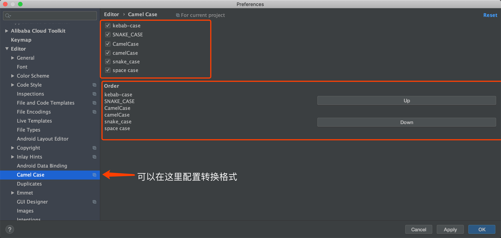
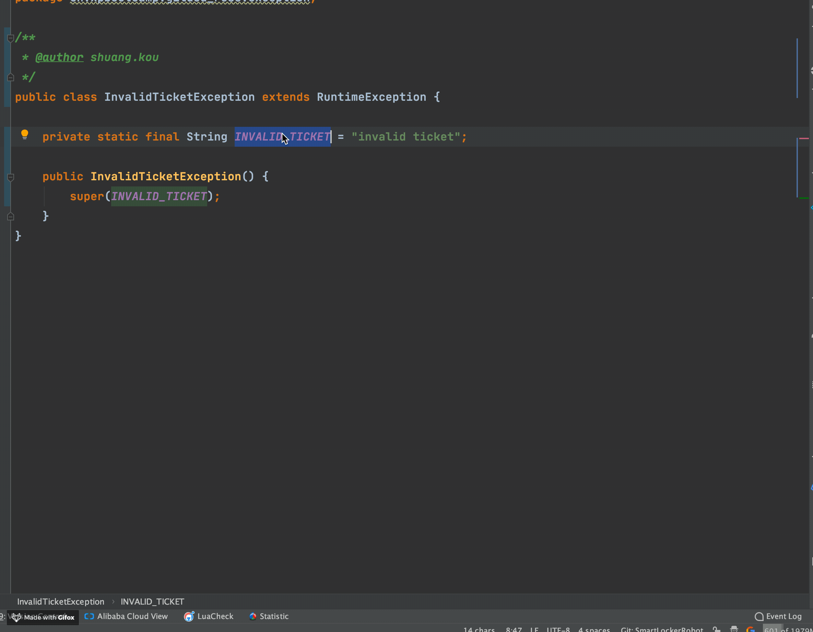

非常有用！这个插件可以实现包含6种常见命名格式之间的切换。并且，你还可以对转换格式进行相关配置（转换格式），如下图所示：

有了这个插件之后，你只需要使用快捷键 `shift+option+u(mac)` / `shift+alt+u` 对准你要修改的变量或者方法名字，就能实现在多种格式之间切换了，如下图所示：

如果你突然忘记快捷键的话，可以直接在IDEA的菜单栏的 Edit 部分找到。

使用这个插件对开发效率提升高吗？拿我之前项目组的情况举个例子：

我之前有一个项目组的测试名字是驼峰这种形式: `ShouldReturnTicketWhenRobotSaveBagGiven1LockersWith2FreeSpace` 。但是，使用驼峰形式命名测试方法的名字不太明显，一般建议用下划线_的形式： `should_return_ticket_when_robot_save_bag_given_1_lockers_with_2_free_space`

如果我们不用这个插件，而是手动去一个一个改的话，工作量想必会很大，而且正确率也会因为手工的原因降低。

>  
