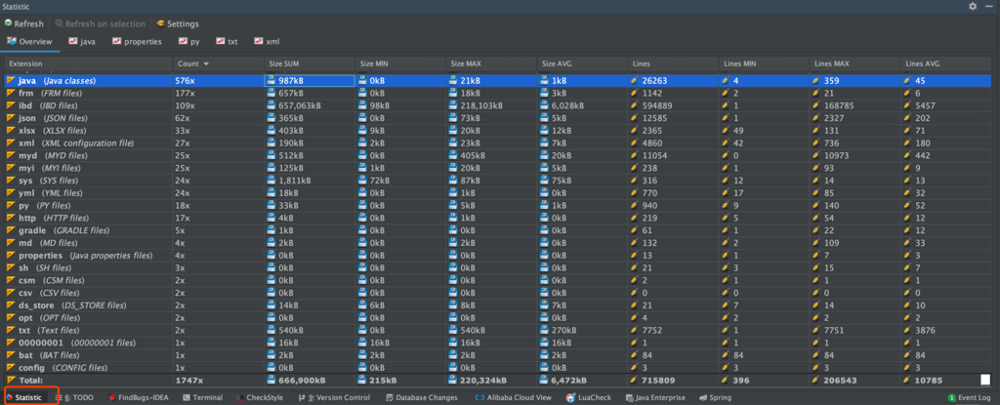

编程是一个很奇妙的事情，大部分的我们把大部分时间实际都花在了复制粘贴，而后修改代码上面。

很多时候，我们并不关注代码质量，只要功能能实现，我才不管一个类的代码有多长、一个方法的代码有多长。

因此，我们经常会碰到让自己想要骂街的项目，不过，说真的，你自己写的代码也有极大可能被后者 DISS。

为了快速分析项目情况，判断这个项目是不是一个“垃圾”项目，有一个方法挺简单的。

那就是**对代码的总行数、单个文件的代码行数、注释行数等信息进行统计。**

**怎么统计呢？**

首先想到的是 Excel 。不过，显然太麻烦了。

**有没有专门用于代码统计的工具呢？**

基于Perl语言开发的cloc（count lines of code）或许可以满足你的要求。

**有没有什么更简单的办法呢？**

如果你使用的是 IDEA 进行开发的话，推荐你可以使用一下 **Statistic** 这个插件。

有了这个插件之后你可以非常直观地看到你的项目中所有类型的文件的信息比如数量、大小等等，可以帮助你更好地了解你们的项目。

你还可以使用它看所有类的总行数、有效代码行数、注释行数、以及有效代码比重等等这些东西。

如果，你担心插件过多影响IDEA速度的话，可以只在有代码统计需求的时候开启这个插件，其他时间禁用它就完事了！