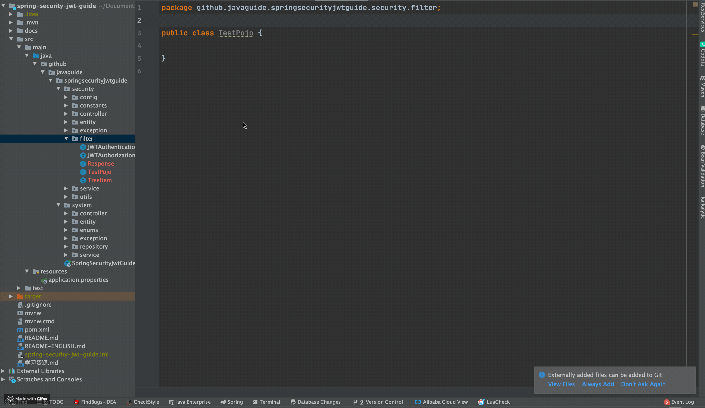
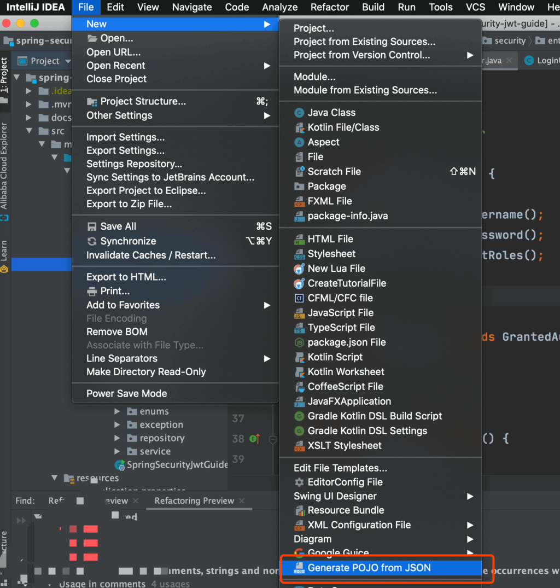
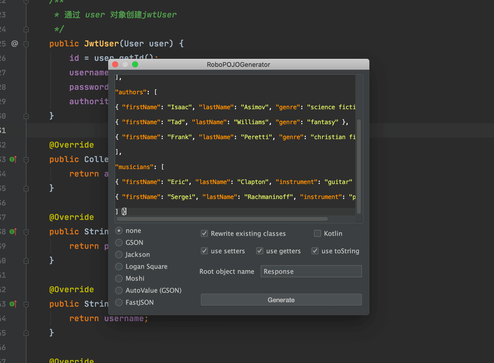

GsonFormat 这个插件可以根据Gson库使用的要求,将JSONObject格式的String 解析成实体类。

> 说明：2021.x 版本以上的 IDEA 可以使用：GsonFormatPlus

这个插件使用起来非常简单，我们新建一个类，然后在类中使用快捷键 `option + s`(Mac)或`alt + s` (win)调出操作窗口（**必须在类中使用快捷键才有效**），如下图所示。

这个插件是一个国人几年前写的，不过已经很久没有更新了，可能会因为IDEA的版本问题有一些小Bug。而且，这个插件无法将JSON转换为Kotlin（这个其实无关痛痒，IDEA自带的就有Java转Kotlin的功能）。 

另外一个与之相似的插件是 **：RoboPOJOGenerator** ，这个插件的更新频率比较快。

`File-> new -> Generate POJO from JSON`

然后将JSON格式的数据粘贴进去之后，配置相关属性之后选择“*Generate*”

