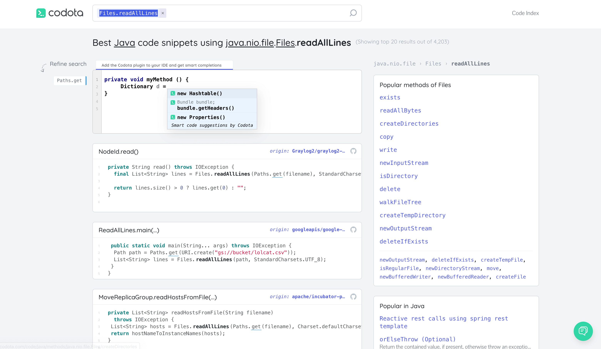
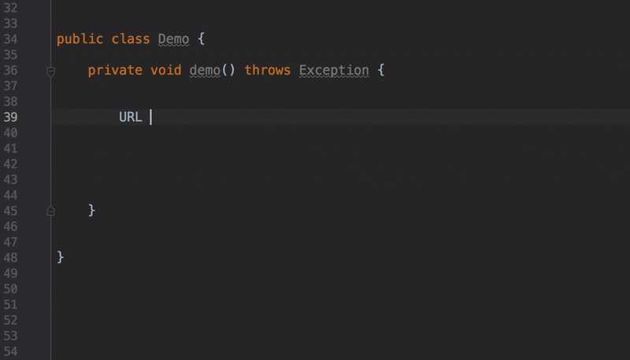
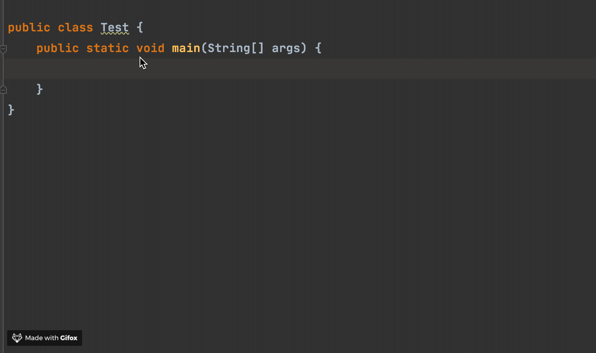
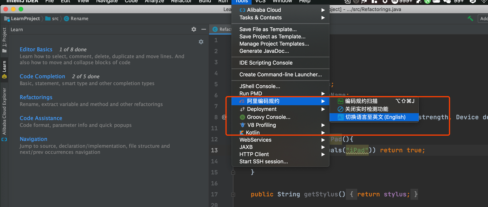
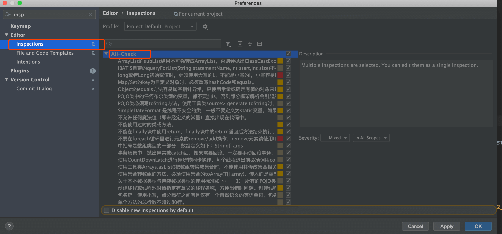
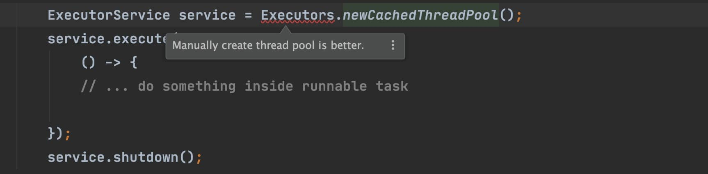
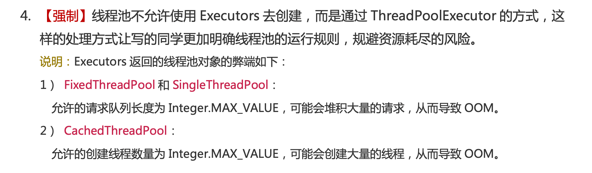

## Lombok:帮你简化代码

之前没有推荐这个插件的原因是觉得已经是人手必备的了。如果你要使用 Lombok 的话，不光是要安装这个插件，你的项目也要引入相关的依赖。

```xml
        <dependency>
            <groupId>org.projectlombok</groupId>
            <artifactId>lombok</artifactId>
            <optional>true</optional>
        </dependency>
```

使用 Lombok 能够帮助我们少写很多代码比如 Getter/Setter、Constructor等等。

关于Lombok的使用，可以查看这篇文章：[《十分钟搞懂Java效率工具Lombok使用与原理》](https://mp.weixin.qq.com/s?__biz=Mzg2OTA0Njk0OA==&mid=2247485385&idx=2&sn=a7c3fb4485ffd8c019e5541e9b1580cd&chksm=cea24802f9d5c1144eee0da52cfc0cc5e8ee3590990de3bb642df4d4b2a8cd07f12dd54947b9&token=1667678311&lang=zh_CN#rd)。


## Codota：代码智能提示

我一直在用的一个插件，可以说非常好用了（*我身边的很多大佬平时写代码也会用这个插件*）。

Codota 这个插件用于智能代码补全，它基于数百万Java程序，能够根据程序上下文提示补全代码。相比于IDEA自带的智能提示来说，Codota 的提示更加全面一些。

如果你觉得 IDEA 插件安装的太多比较卡顿的话，不用担心！Codota 插件还有一个对应的在线网站（[https://www.codota.com/code](https://www.codota.com/code)），在这个网站上你可以根据代码关键字搜索相关代码示例，非常不错！

我在工作中经常会用到，说实话确实给我带来了很大便利，比如我们搜索 `Files.readAllLines`相关的代码，搜索出来的结果如下图所示：



另外，Codota 插件的基础功能都是免费的。你的代码也不会被泄露，这点你不用担心。

简单来看看 Codota 插件的骚操作吧！

### 代码智能补全

我们使用`HttpUrlConnection ` 建立一个网络连接是真的样的：



我们创建线程池现在变成下面这样：



上面只是为了演示这个插件的强大，实际上创建线程池不推荐使用这种方式， 推荐使用 `ThreadPoolExecutor` 构造函数创建线程池。我下面要介绍的一个阿里巴巴的插件-**Alibaba Java Code Guidelines** 就检测出来了这个问题，所以，`Executors`下面用波浪线标记了出来。

### 代码智能搜索

除了，在写代码的时候智能提示之外。你还可以直接选中代码然后搜索相关代码示例。


## Alibaba Java Code Guidelines：阿里巴巴 Java 代码规范

阿里巴巴 Java 代码规范，对应的Github地址为：[https://github.com/alibaba/p3c](https://github.com/alibaba/p3c ) 。非常推荐安装！

安装完成之后建议将与语言替换成中文，提示更加友好一点。



根据官方描述：

> 目前这个插件实现了开发手册中的的53条规则，大部分基于PMD实现，其中有4条规则基于IDEA实现，并且基于IDEA [Inspection](https://www.jetbrains.com/help/idea/code-inspection.html)实现了实时检测功能。部分规则实现了Quick Fix功能，对于可以提供Quick Fix但没有提供的，我们会尽快实现，也欢迎有兴趣的同学加入进来一起努力。 目前插件检测有两种模式：实时检测、手动触发。

上述提到的开发手册也就是在Java开发领域赫赫有名的《阿里巴巴Java开发手册》。

### 手动配置检测规则

你还可以手动配置相关 inspection规则：



### 使用效果

这个插件会实时检测出我们的代码不匹配它的规则的地方，并且会给出修改建议。比如我们按照下面的方式去创建线程池的话，这个插件就会帮我们检测出来,如下图所示。



这个可以对应上 《阿里巴巴Java开发手册》 这本书关于创建线程池的方式说明。



## CheckStyle: Java代码格式规范

### 为何需要CheckStyle插件？

**CheckStyle 几乎是 Java 项目开发必备的一个插件了，它会帮助我们检查 Java 代码的格式是否有问题比如变量命名格式是否有问题、某一行代码的长度是否过长等等。**

在项目上，**通过项目开发人员自我约束来规范代码格式必然是不靠谱的！** 因此，我们非常需要这样一款工具来帮助我们规范代码格式。

如果你看过我写的轮子的话，可以发现我为每一个项目都集成了 CheckStyle，并且设置了 **Git Commit 钩子**，保证在提交代码之前代码格式没有问题。

> **Guide哥造的轮子**（*代码简洁，结构清晰，欢迎学习，欢迎一起完善*）：
>
> 1. [guide-rpc-framework](https://github.com/Snailclimb/guide-rpc-framework) ：A custom RPC framework implemented by Netty+Kyro+Zookeeper.（一款基于 Netty+Kyro+Zookeeper 实现的自定义 RPC 框架-附详细实现过程和相关教程）
> 2. [jsoncat](https://github.com/Snailclimb/jsoncat) ：仿 Spring Boot 但不同于 Spring Boot 的一个轻量级的 HTTP 框架
>
> **Git 钩子**： Git 能在特定的重要动作比如commit、push发生时触发自定义脚本。 钩子都被存储在 Git 目录下的 `hooks` 子目录中。 也即绝大部分项目中的 `.git/hooks` 。 

### 如何在Maven/Gradle项目中集成 Checksytle?

一般情况下，我们都是将其集成在项目中，并设置相应的 Git 钩子。网上有相应的介绍文章，这里就不多提了。

如果你觉得网上的文章不直观的话，可以参考我上面提到了两个轮子：

1. [guide-rpc-framework](https://github.com/Snailclimb/guide-rpc-framework) ：Maven项目集成 Checksytle。
2. [jsoncat](https://github.com/Snailclimb/jsoncat)  ：Gradle项目集成 Checksytle。

如果你在项目中集成了 Checksytle 的话，每次检测会生成一个 HTML格式的文件告诉你哪里的代码格式不对，这样看着非常不直观。通过  Checksytle插件的话可以非常直观的将项目中存在格式问题的地方显示出来。


如果你只是自己在本地使用，并不想在项目中集成 Checksytle 的话也可以，只需要下载一个 Checksytle插件就足够了。

### 如何安装？

我们直接在 IDEA 的插件市场即可找到这个插件。我这里已经安装好了。


安装插件之后重启 IDEA，你会发现就可以在底部菜单栏找到 CheckStyle 了。


### 如何自定义检测规则？

如果你需要自定义代码格式检测规则的话，可以按照如下方式进行配置（你可以导入用于自定义检测规则的`CheckStyle.xml`文件）。


### 使用效果

配置完成之后，按照如下方式使用这个插件！


可以非常清晰的看到：CheckStyle 插件已经根据我们自定义的规则将项目中的代码存在格式问题的地方都检测了出来。

## SonarLint:帮你优化代码

SonarLint 帮助你发现代码的错误和漏洞，就像是代码拼写检查器一样，SonarLint 可以实时显示出代码的问题，并提供清晰的修复指导，以便你提交代码之前就可以解决它们。


并且，很多项目都集成了 SonarQube,SonarLint 可以很方便地与 SonarQube 集成。