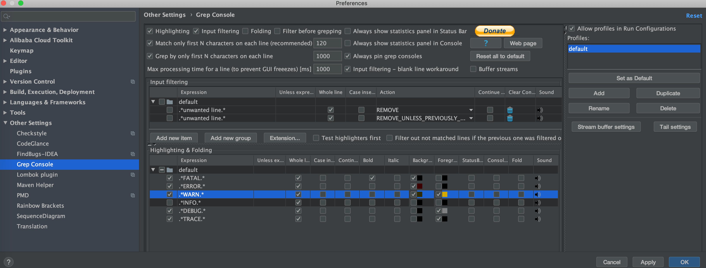
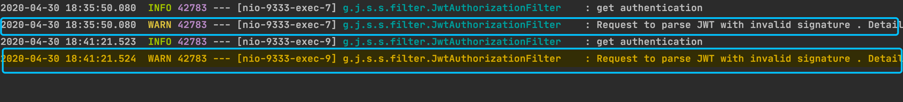
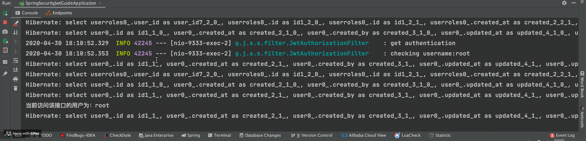
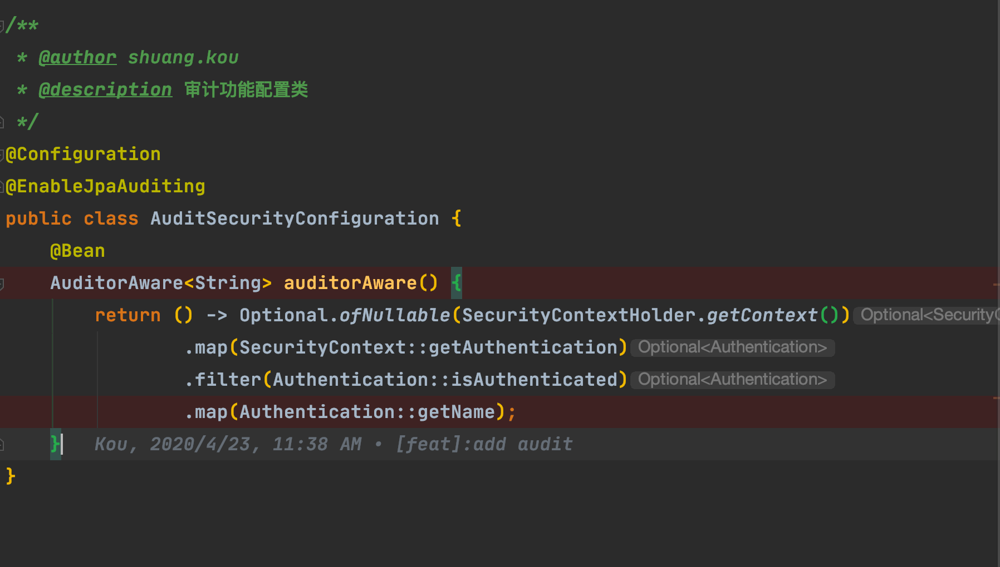

## Background Image Plus:背景图片

我这里推荐使用国人 Jack Chu 基于 Background Image Plus 开发的最新版本，适用于 2021.x 版本的 IDEA。

前面几个下载量比较高的，目前都还未支持 2021.x 版本的 IDEA。

通过这个插件，你可以将 IDEA 背景设置为指定的图片，支持随机背景。

效果图如下：

如果你想要设置随机背景的话，可以通过 IDEA 设置页 **Settings** -> **Appearance & Behaviour** -> **Background Image Plus** 自定义设置项，随机显示目录下的图片为背景图。

## Power Mode II : 代码特效

使用了这个插件之后，写代码会自带特效，适用于 2021.x 版本的 IDEA。 2021.x 版本之前，可以使用 **activate-power-mode** 。

你可以通过 IDEA 设置页 **Settings** -> **Appearance & Behaviour** -> **Power Mode II** 自定义设置项。

## Nyan Progress Bar : 进度条美化

可以让你拥有更加漂亮的进度条。

## Grep Console:控制台输出处理

可以说是必备的一个 IDEA 插件，非常实用！

这个插件主要的功能有两个：

**1. 自定义设置控制台输出颜色**

我们可以在设置中进行相关的配置:

配置完成之后的 log warn 的效果对比图如下：

**2. 过滤控制台输出**

## Rainbow Brackets : 彩虹括号

使用各种鲜明的颜色来展示你的括号，效果图如下。可以看出代码层级变得更加清晰了，可以说非常实用友好了！

