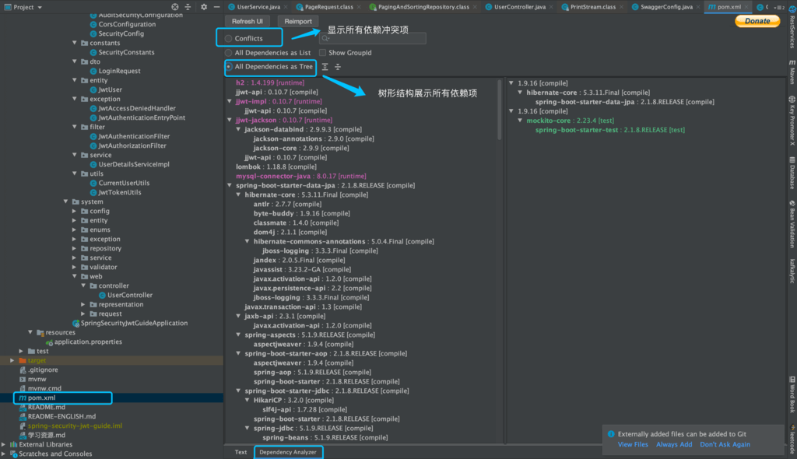

**Maven Helper** 主要用来分析 Maven 项目的相关依赖，可以帮助我们解决 Maven 依赖冲突问题。

**何为依赖冲突？**

说白了就是你的项目使用的 2 个 jar 包引用了同一个依赖 h，并且 h 的版本还不一样,这个时候你的项目就存在两个不同版本的 h。这时 Maven 会依据依赖路径最短优先原则，来决定使用哪个版本的 Jar 包，而另一个无用的 Jar 包则未被使用，这就是所谓的依赖冲突。

大部分情况下，依赖冲突可能并不会对系统造成什么异常，因为 Maven 始终选择了一个 Jar 包来使用。但是，不排除在某些特定条件下，会出现类似找不到类的异常，所以，只要存在依赖冲突，在我看来，最好还是解决掉，不要给系统留下隐患。
