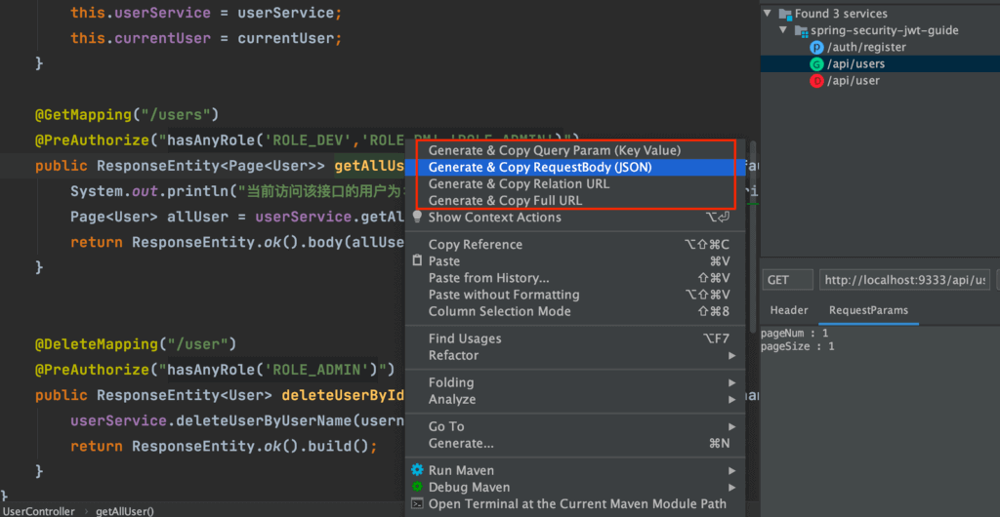
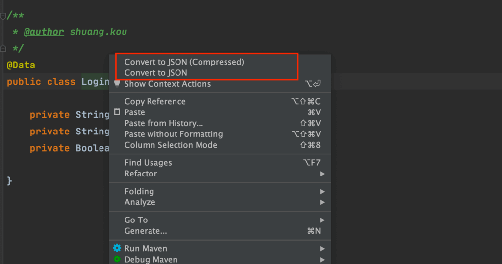

开始推荐这个 IDEA 插件之前，我觉得有必要花一小会时间简单聊聊 **REST** 这个我们经常打交道的概念。

## REST 相关概念解读

### 何为 REST？

REST 即 **REpresentational State Transfer** 的缩写。这个词组的翻译过来就是"**表现层状态转化**"。

这样理解起来甚是晦涩，实际上 REST 的全称是 **Resource Representational State Transfer** ，直白地翻译过来就是 **“资源”在网络传输中以某种“表现形式”进行“状态转移”** 。

**有没有感觉很难理解？**

没关系，看了我对 REST 涉及到的一些概念的解读之后你没准就能理解了！

- **资源（Resource）** ：我们可以把真实的对象数据称为资源。一个资源既可以是一个集合，也可以是单个个体。比如我们的班级 classes 是代表一个集合形式的资源，而特定的 class 代表单个个体资源。每一种资源都有特定的 URI（统一资源定位符）与之对应，如果我们需要获取这个资源，访问这个 URI 就可以了，比如获取特定的班级：`/class/12`。另外，资源也可以包含子资源，比如 `/classes/classId/teachers`：列出某个指定班级的所有老师的信息
- **表现形式（Representational）**："资源"是一种信息实体，它可以有多种外在表现形式。我们把"资源"具体呈现出来的形式比如 json，xml，image,txt 等等叫做它的"表现层/表现形式"。
- **状态转移（State Transfer）** ：大家第一眼看到这个词语一定会很懵逼？内心 BB：这尼玛是啥啊？ **大白话来说 REST 中的状态转移更多地描述的服务器端资源的状态，比如你通过增删改查（通过 HTTP 动词实现）引起资源状态的改变。** （HTTP 协议是一个无状态的，所有的资源状态都保存在服务器端）

### 何为 RESTful 架构？

满足 REST 风格的架构设计就可以称为 RESTful 架构：

1. 每一个 URI 代表一种资源；
2. 客户端和服务器之间，传递这种资源的某种表现形式比如 json，xml，image,txt 等等；
3. 客户端通过特定的 HTTP 动词，对服务器端资源进行操作，实现"表现层状态转化"。

### 何为 RESTful Web 服务？

基于 REST 架构的 Web 服务就被称为 RESTful Web 服务。

## RESTful Web 服务辅助开发工具

### 安装

这个插件的名字叫做 “**RestfulToolkit**” 。我们直接在 IDEA 的插件市场即可找到这个插件。如下图所示。

> 如果你因为网络问题没办法使用 IDEA 自带的插件市场的话，也可以通过[IDEA 插件市场的官网](https://plugins.jetbrains.com/idea)手动下载安装。


### 简单使用

#### URL 跳转到对应方法

根据 URL 直接跳转到对应的方法定义 (Windows: `ctrl+\` or `ctrl+alt+n` Mac:`command+\` or `command+alt+n` )并且提供了一个服务的树形可视化显示窗口。 如下图所示。


#### 作为 HTTP 请求工具

这个插件还可以作为一个简单的 http 请求工具来使用。如下图所示。


#### 复制生成 URL、复制方法参数...

这个插件还提供了生成 URL、查询参数、请求体（RequestBody）等功能。

举个例子。我们选中 `Controller` 中的某个请求对应的方法右击，你会发现多了几个可选项。当你选择`Generate & Copy Full URL`的话，就可以把整个请求的路径直接复制下来。eg：`http://localhost:9333/api/users?pageNum=1&pageSize=1` 。



#### 将 Java 类转换为对应的 JSON 格式

这个插件还为 Java 类上添加了 **Convert to JSON** 功能 。

我们选中的某个类对应的方法然后右击，你会发现多了几个可选项。



当我们选择`Convert to JSON`的话，你会得到如下 json 类型的数据：

```json
{
  "username": "demoData",
  "password": "demoData",
  "rememberMe": true
}
```

## 后记

RESTFulToolkit 原作者不更新了，IDEA.201 及以上版本不再适配。

因此，国内就有一个大佬参考 RESTFulToolkit 开发了一款类似的插件——RestfulTool（功能较少一些，不过够用了）。

