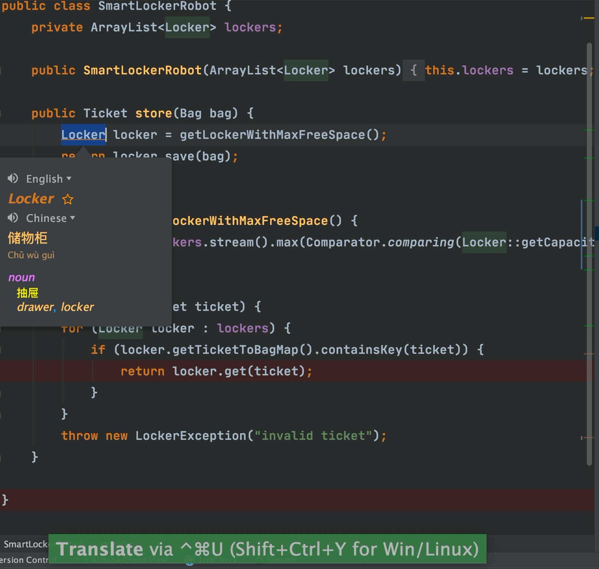
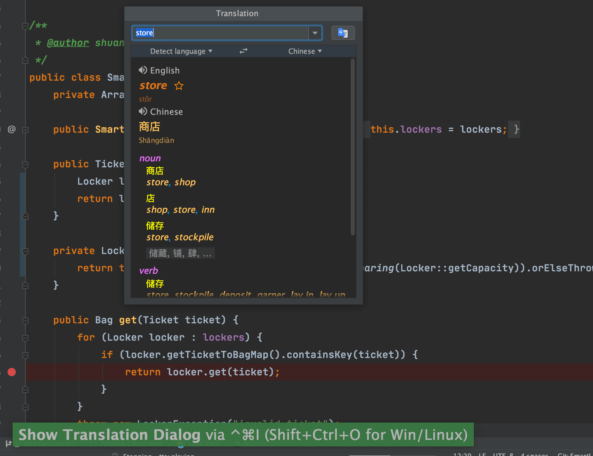

有了这个插件之后，你再也不用在编码的时候打开浏览器查找某个单词怎么拼写、某句英文注释什么意思了。

并且，这个插件支持多种翻译源：

1. Google 翻译
2. Youdao 翻译
3. Baidu 翻译

除了翻译功能之外还提供了语音朗读、单词本等实用功能。这个插件的Github地址是：[https://github.com/YiiGuxing/TranslationPlugin](https://github.com/YiiGuxing/TranslationPlugin) （貌似是国人开发的，很赞）。

**使用方法很简单！选中你要翻译的单词或者句子，使用快捷键 `command+ctrl+u(mac)` / `shift+ctrl+y(win/linux)`** （如果你忘记了快捷的话，鼠标右键操作即可！）

**如果需要快速打开翻译框，使用快捷键`command+ctrl+i(mac)`/`ctrl + shift + o(win/linux)`**

如果你需要将某个重要的单词添加到生词本的话，只需要点击单词旁边的收藏按钮即可！