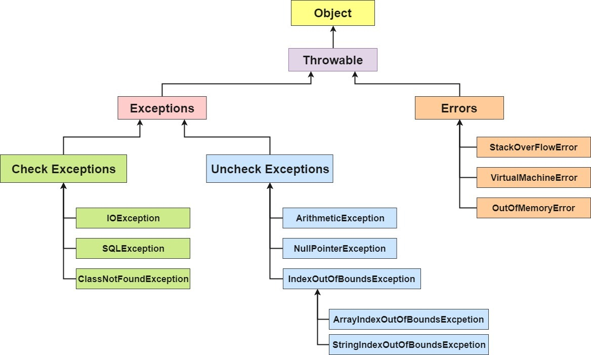
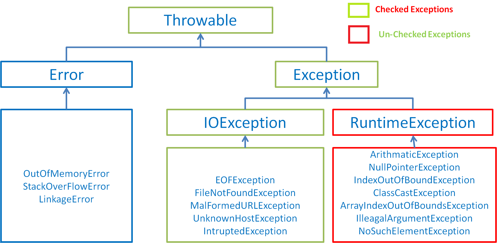

点击关注[公众号](#公众号)及时获取笔主最新更新文章，并可免费领取本文档配套的《Java 面试突击》以及 Java 工程师必备学习资源。
<!-- TOC -->

- [1. 面向对象和面向过程的区别](#1-面向对象和面向过程的区别)
- [2. Java 语言有哪些特点?](#2-java-语言有哪些特点)
- [3. 关于 JVM JDK 和 JRE 最详细通俗的解答](#3-关于-jvm-jdk-和-jre-最详细通俗的解答)
    - [JVM](#jvm)
    - [JDK 和 JRE](#jdk-和-jre)
- [4. Oracle JDK 和 OpenJDK 的对比](#4-oracle-jdk-和-openjdk-的对比)
- [5. Java 和 C++的区别?](#5-java-和-c的区别)
- [6. 什么是 Java 程序的主类 应用程序和小程序的主类有何不同?](#6-什么是-java-程序的主类-应用程序和小程序的主类有何不同)
- [7. Java 应用程序与小程序之间有哪些差别?](#7-java-应用程序与小程序之间有哪些差别)
- [8. 字符型常量和字符串常量的区别?](#8-字符型常量和字符串常量的区别)
- [9. 构造器 Constructor 是否可被 override?](#9-构造器-constructor-是否可被-override)
- [10. 重载和重写的区别](#10-重载和重写的区别)
        - [重载](#重载)
        - [重写](#重写)
- [11. Java 面向对象编程三大特性: 封装 继承 多态](#11-java-面向对象编程三大特性-封装-继承-多态)
    - [封装](#封装)
    - [继承](#继承)
    - [多态](#多态)
- [12. String StringBuffer 和 StringBuilder 的区别是什么? String 为什么是不可变的?](#12-string-stringbuffer-和-stringbuilder-的区别是什么-string-为什么是不可变的)
- [13. 自动装箱与拆箱](#13-自动装箱与拆箱)
- [14. 在一个静态方法内调用一个非静态成员为什么是非法的?](#14-在一个静态方法内调用一个非静态成员为什么是非法的)
- [15. 在 Java 中定义一个不做事且没有参数的构造方法的作用](#15-在-java-中定义一个不做事且没有参数的构造方法的作用)
- [16. import java 和 javax 有什么区别？](#16-import-java-和-javax-有什么区别)
- [17. 接口和抽象类的区别是什么？](#17-接口和抽象类的区别是什么)
- [18. 成员变量与局部变量的区别有哪些？](#18-成员变量与局部变量的区别有哪些)
- [19. 创建一个对象用什么运算符?对象实体与对象引用有何不同?](#19-创建一个对象用什么运算符对象实体与对象引用有何不同)
- [20. 什么是方法的返回值?返回值在类的方法里的作用是什么?](#20-什么是方法的返回值返回值在类的方法里的作用是什么)
- [21. 一个类的构造方法的作用是什么? 若一个类没有声明构造方法，该程序能正确执行吗? 为什么?](#21-一个类的构造方法的作用是什么-若一个类没有声明构造方法该程序能正确执行吗-为什么)
- [22. 构造方法有哪些特性？](#22-构造方法有哪些特性)
- [23. 静态方法和实例方法有何不同](#23-静态方法和实例方法有何不同)
- [24. 对象的相等与指向他们的引用相等,两者有什么不同?](#24-对象的相等与指向他们的引用相等两者有什么不同)
- [25. 在调用子类构造方法之前会先调用父类没有参数的构造方法,其目的是?](#25-在调用子类构造方法之前会先调用父类没有参数的构造方法其目的是)
- [26. == 与 equals(重要)](#26--与-equals重要)
- [27. hashCode 与 equals (重要)](#27-hashcode-与-equals-重要)
    - [hashCode（）介绍](#hashcode介绍)
    - [为什么要有 hashCode](#为什么要有-hashcode)
    - [hashCode（）与 equals（）的相关规定](#hashcode与-equals的相关规定)
- [28. 为什么 Java 中只有值传递？](#28-为什么-java-中只有值传递)
- [29. 简述线程、程序、进程的基本概念。以及他们之间关系是什么?](#29-简述线程程序进程的基本概念以及他们之间关系是什么)
- [30. 线程有哪些基本状态?](#30-线程有哪些基本状态)
- [31 关于 final 关键字的一些总结](#31-关于-final-关键字的一些总结)
- [32 Java 中的异常处理](#32-java-中的异常处理)
    - [Java 异常类层次结构图](#java-异常类层次结构图)
    - [Throwable 类常用方法](#throwable-类常用方法)
    - [异常处理总结](#异常处理总结)
- [33 Java 序列化中如果有些字段不想进行序列化，怎么办？](#33-java-序列化中如果有些字段不想进行序列化怎么办)
- [34 获取用键盘输入常用的两种方法](#34-获取用键盘输入常用的两种方法)
- [35 Java 中 IO 流](#35-java-中-io-流)
    - [Java 中 IO 流分为几种?](#java-中-io-流分为几种)
    - [既然有了字节流,为什么还要有字符流?](#既然有了字节流为什么还要有字符流)
    - [BIO,NIO,AIO 有什么区别?](#bionioaio-有什么区别)
- [36. 常见关键字总结:static,final,this,super](#36-常见关键字总结staticfinalthissuper)
- [37. Collections 工具类和 Arrays 工具类常见方法总结](#37-collections-工具类和-arrays-工具类常见方法总结)
- [38. 深拷贝 vs 浅拷贝](#38-深拷贝-vs-浅拷贝)
- [参考](#参考)
- [公众号](#公众号)

<!-- /TOC -->


## 1. 面向对象和面向过程的区别

- **面向过程** ：**面向过程性能比面向对象高。** 因为类调用时需要实例化，开销比较大，比较消耗资源，所以当性能是最重要的考量因素的时候，比如单片机、嵌入式开发、Linux/Unix 等一般采用面向过程开发。但是，**面向过程没有面向对象易维护、易复用、易扩展。**
- **面向对象** ：**面向对象易维护、易复用、易扩展。** 因为面向对象有封装、继承、多态性的特性，所以可以设计出低耦合的系统，使系统更加灵活、更加易于维护。但是，**面向对象性能比面向过程低**。

参见 issue : [面向过程 ：面向过程性能比面向对象高？？](https://github.com/Snailclimb/JavaGuide/issues/431)

> 这个并不是根本原因，面向过程也需要分配内存，计算内存偏移量，Java 性能差的主要原因并不是因为它是面向对象语言，而是 Java 是半编译语言，最终的执行代码并不是可以直接被 CPU 执行的二进制机械码。
>
> 而面向过程语言大多都是直接编译成机械码在电脑上执行，并且其它一些面向过程的脚本语言性能也并不一定比 Java 好。

## 2. Java 语言有哪些特点?

1. 简单易学；
2. 面向对象（封装，继承，多态）；
3. 平台无关性（ Java 虚拟机实现平台无关性）；
4. 可靠性；
5. 安全性；
6. 支持多线程（ C++ 语言没有内置的多线程机制，因此必须调用操作系统的多线程功能来进行多线程程序设计，而 Java 语言却提供了多线程支持）；
7. 支持网络编程并且很方便（ Java 语言诞生本身就是为简化网络编程设计的，因此 Java 语言不仅支持网络编程而且很方便）；
8. 编译与解释并存；

> 修正（参见： [issue#544](https://github.com/Snailclimb/JavaGuide/issues/544)）：C++11 开始（2011 年的时候）,C++就引入了多线程库，在 windows、linux、macos 都可以使用`std::thread`和`std::async`来创建线程。参考链接：http://www.cplusplus.com/reference/thread/thread/?kw=thread

## 3. 关于 JVM JDK 和 JRE 最详细通俗的解答

### JVM

Java 虚拟机（JVM）是运行 Java 字节码的虚拟机。JVM 有针对不同系统的特定实现（Windows，Linux，macOS），目的是使用相同的字节码，它们都会给出相同的结果。

**什么是字节码?采用字节码的好处是什么?**

> 在 Java 中，JVM 可以理解的代码就叫做`字节码`（即扩展名为 `.class` 的文件），它不面向任何特定的处理器，只面向虚拟机。Java 语言通过字节码的方式，在一定程度上解决了传统解释型语言执行效率低的问题，同时又保留了解释型语言可移植的特点。所以 Java 程序运行时比较高效，而且，由于字节码并不针对一种特定的机器，因此，Java 程序无须重新编译便可在多种不同操作系统的计算机上运行。

**Java 程序从源代码到运行一般有下面 3 步：**


我们需要格外注意的是 .class->机器码 这一步。在这一步 JVM 类加载器首先加载字节码文件，然后通过解释器逐行解释执行，这种方式的执行速度会相对比较慢。而且，有些方法和代码块是经常需要被调用的(也就是所谓的热点代码)，所以后面引进了 JIT 编译器，而 JIT 属于运行时编译。当 JIT 编译器完成第一次编译后，其会将字节码对应的机器码保存下来，下次可以直接使用。而我们知道，机器码的运行效率肯定是高于 Java 解释器的。这也解释了我们为什么经常会说 Java 是编译与解释共存的语言。

> HotSpot 采用了惰性评估(Lazy Evaluation)的做法，根据二八定律，消耗大部分系统资源的只有那一小部分的代码（热点代码），而这也就是 JIT 所需要编译的部分。JVM 会根据代码每次被执行的情况收集信息并相应地做出一些优化，因此执行的次数越多，它的速度就越快。JDK 9 引入了一种新的编译模式 AOT(Ahead of Time Compilation)，它是直接将字节码编译成机器码，这样就避免了 JIT 预热等各方面的开销。JDK 支持分层编译和 AOT 协作使用。但是 ，AOT 编译器的编译质量是肯定比不上 JIT 编译器的。

**总结：**

Java 虚拟机（JVM）是运行 Java 字节码的虚拟机。JVM 有针对不同系统的特定实现（Windows，Linux，macOS），目的是使用相同的字节码，它们都会给出相同的结果。字节码和不同系统的 JVM 实现是 Java 语言“一次编译，随处可以运行”的关键所在。

### JDK 和 JRE

JDK 是 Java Development Kit，它是功能齐全的 Java SDK。它拥有 JRE 所拥有的一切，还有编译器（javac）和工具（如 javadoc 和 jdb）。它能够创建和编译程序。

JRE 是 Java 运行时环境。它是运行已编译 Java 程序所需的所有内容的集合，包括 Java 虚拟机（JVM），Java 类库，java 命令和其他的一些基础构件。但是，它不能用于创建新程序。

如果你只是为了运行一下 Java 程序的话，那么你只需要安装 JRE 就可以了。如果你需要进行一些 Java 编程方面的工作，那么你就需要安装 JDK 了。但是，这不是绝对的。有时，即使您不打算在计算机上进行任何 Java 开发，仍然需要安装 JDK。例如，如果要使用 JSP 部署 Web 应用程序，那么从技术上讲，您只是在应用程序服务器中运行 Java 程序。那你为什么需要 JDK 呢？因为应用程序服务器会将 JSP 转换为 Java servlet，并且需要使用 JDK 来编译 servlet。

## 4. Oracle JDK 和 OpenJDK 的对比

可能在看这个问题之前很多人和我一样并没有接触和使用过 OpenJDK 。那么 Oracle 和 OpenJDK 之间是否存在重大差异？下面我通过收集到的一些资料，为你解答这个被很多人忽视的问题。

对于 Java 7，没什么关键的地方。OpenJDK 项目主要基于 Sun 捐赠的 HotSpot 源代码。此外，OpenJDK 被选为 Java 7 的参考实现，由 Oracle 工程师维护。关于 JVM，JDK，JRE 和 OpenJDK 之间的区别，Oracle 博客帖子在 2012 年有一个更详细的答案：

> 问：OpenJDK 存储库中的源代码与用于构建 Oracle JDK 的代码之间有什么区别？
>
> 答：非常接近 - 我们的 Oracle JDK 版本构建过程基于 OpenJDK 7 构建，只添加了几个部分，例如部署代码，其中包括 Oracle 的 Java 插件和 Java WebStart 的实现，以及一些封闭的源代码派对组件，如图形光栅化器，一些开源的第三方组件，如 Rhino，以及一些零碎的东西，如附加文档或第三方字体。展望未来，我们的目的是开源 Oracle JDK 的所有部分，除了我们考虑商业功能的部分。

**总结：**

1. Oracle JDK 大概每 6 个月发一次主要版本，而 OpenJDK 版本大概每三个月发布一次。但这不是固定的，我觉得了解这个没啥用处。详情参见：[https://blogs.oracle.com/java-platform-group/update-and-faq-on-the-java-se-release-cadence](https://blogs.oracle.com/java-platform-group/update-and-faq-on-the-java-se-release-cadence) 。
2. OpenJDK 是一个参考模型并且是完全开源的，而 Oracle JDK 是 OpenJDK 的一个实现，并不是完全开源的；
3. Oracle JDK 比 OpenJDK 更稳定。OpenJDK 和 Oracle JDK 的代码几乎相同，但 Oracle JDK 有更多的类和一些错误修复。因此，如果您想开发企业/商业软件，我建议您选择 Oracle JDK，因为它经过了彻底的测试和稳定。某些情况下，有些人提到在使用 OpenJDK 可能会遇到了许多应用程序崩溃的问题，但是，只需切换到 Oracle JDK 就可以解决问题；
4. 在响应性和 JVM 性能方面，Oracle JDK 与 OpenJDK 相比提供了更好的性能；
5. Oracle JDK 不会为即将发布的版本提供长期支持，用户每次都必须通过更新到最新版本获得支持来获取最新版本；
6. Oracle JDK 根据二进制代码许可协议获得许可，而 OpenJDK 根据 GPL v2 许可获得许可。

## 5. Java 和 C++的区别?

我知道很多人没学过 C++，但是面试官就是没事喜欢拿咱们 Java 和 C++ 比呀！没办法！！！就算没学过 C++，也要记下来！

- 都是面向对象的语言，都支持封装、继承和多态
- Java 不提供指针来直接访问内存，程序内存更加安全
- Java 的类是单继承的，C++ 支持多重继承；虽然 Java 的类不可以多继承，但是接口可以多继承。
- Java 有自动内存管理机制，不需要程序员手动释放无用内存
- **在 C 语言中，字符串或字符数组最后都会有一个额外的字符‘\0’来表示结束。但是，Java 语言中没有结束符这一概念。** 这是一个值得深度思考的问题，具体原因推荐看这篇文章： [https://blog.csdn.net/sszgg2006/article/details/49148189](https://blog.csdn.net/sszgg2006/article/details/49148189)

## 6. 什么是 Java 程序的主类 应用程序和小程序的主类有何不同?

一个程序中可以有多个类，但只能有一个类是主类。在 Java 应用程序中，这个主类是指包含 main（）方法的类。而在 Java 小程序中，这个主类是一个继承自系统类 JApplet 或 Applet 的子类。应用程序的主类不一定要求是 public 类，但小程序的主类要求必须是 public 类。主类是 Java 程序执行的入口点。

## 7. Java 应用程序与小程序之间有哪些差别?

简单说应用程序是从主线程启动(也就是 `main()` 方法)。applet 小程序没有 `main()` 方法，主要是嵌在浏览器页面上运行(调用`init()`或者`run()`来启动)，嵌入浏览器这点跟 flash 的小游戏类似。

## 8. 字符型常量和字符串常量的区别?

1. 形式上: 字符常量是单引号引起的一个字符; 字符串常量是双引号引起的若干个字符
2. 含义上: 字符常量相当于一个整型值( ASCII 值),可以参加表达式运算; 字符串常量代表一个地址值(该字符串在内存中存放位置)
3. 占内存大小 字符常量只占 2 个字节; 字符串常量占若干个字节 (**注意： char 在 Java 中占两个字节**)

> java 编程思想第四版：2.2.2 节
> 

## 9. 构造器 Constructor 是否可被 override?

Constructor 不能被 override（重写）,但是可以 overload（重载）,所以你可以看到一个类中有多个构造函数的情况。

## 10. 重载和重写的区别

> 重载就是同样的一个方法能够根据输入数据的不同，做出不同的处理
>
> 重写就是当子类继承自父类的相同方法，输入数据一样，但要做出有别于父类的响应时，你就要覆盖父类方法

#### 重载

发生在同一个类中，方法名必须相同，参数类型不同、个数不同、顺序不同，方法返回值和访问修饰符可以不同。

下面是《Java 核心技术》对重载这个概念的介绍：


**综上：重载就是同一个类中多个同名方法根据不同的传参来执行不同的逻辑处理。**

#### 重写

重写发生在运行期，是子类对父类的允许访问的方法的实现过程进行重新编写。

1. 返回值类型、方法名、参数列表必须相同，抛出的异常范围小于等于父类，访问修饰符范围大于等于父类。
2. 如果父类方法访问修饰符为 private/final/static 则子类就不能重写该方法，但是被 static 修饰的方法能够被再次声明。
3. 构造方法无法被重写

**综上：重写就是子类对父类方法的重新改造，外部样子不能改变，内部逻辑可以改变**

**暖心的 Guide 哥最后再来个图标总结一下！**

| 区别点     | 重载方法 | 重写方法                                       |
| :--------- | :------- | :--------------------------------------------- |
| 发生范围   |  同一个类   | 子类 中                                     |
| 参数列表   | 必须修改 | 一定不能修改                                   |
| 返回类型   | 可修改   | 一定不能修改                                   |
| 异常       | 可修改   | 可以减少或删除，一定不能抛出新的或者更广的异常 |
| 访问修饰符 | 可修改   | 一定不能做更严格的限制（可以降低限制）         |
| 发生阶段   | 编译期   | 运行期                                   |

## 11. Java 面向对象编程三大特性: 封装 继承 多态

### 封装

封装把一个对象的属性私有化，同时提供一些可以被外界访问的属性的方法，如果属性不想被外界访问，我们大可不必提供方法给外界访问。但是如果一个类没有提供给外界访问的方法，那么这个类也没有什么意义了。

### 继承

继承是使用已存在的类的定义作为基础建立新类的技术，新类的定义可以增加新的数据或新的功能，也可以用父类的功能，但不能选择性地继承父类。通过使用继承我们能够非常方便地复用以前的代码。

**关于继承如下 3 点请记住：**

1. 子类拥有父类对象所有的属性和方法（包括私有属性和私有方法），但是父类中的私有属性和方法子类是无法访问，**只是拥有**。
2. 子类可以拥有自己属性和方法，即子类可以对父类进行扩展。
3. 子类可以用自己的方式实现父类的方法。（以后介绍）。

### 多态

所谓多态就是指程序中定义的引用变量所指向的具体类型和通过该引用变量发出的方法调用在编程时并不确定，而是在程序运行期间才确定，即一个引用变量到底会指向哪个类的实例对象，该引用变量发出的方法调用到底是哪个类中实现的方法，必须在由程序运行期间才能决定。

在 Java 中有两种形式可以实现多态：继承（多个子类对同一方法的重写）和接口（实现接口并覆盖接口中同一方法）。

## 12. String StringBuffer 和 StringBuilder 的区别是什么? String 为什么是不可变的?

**可变性**

简单的来说：String 类中使用 final 关键字修饰字符数组来保存字符串，`private final char value[]`，所以 String 对象是不可变的。

> 补充（来自[issue 675](https://github.com/Snailclimb/JavaGuide/issues/675)）：在 Java 9 之后，String 类的实现改用 byte 数组存储字符串 `private final byte[] value`;

而 StringBuilder 与 StringBuffer 都继承自 AbstractStringBuilder 类，在 AbstractStringBuilder 中也是使用字符数组保存字符串`char[]value` 但是没有用 final 关键字修饰，所以这两种对象都是可变的。

StringBuilder 与 StringBuffer 的构造方法都是调用父类构造方法也就是 AbstractStringBuilder 实现的，大家可以自行查阅源码。

`AbstractStringBuilder.java`

```java
abstract class AbstractStringBuilder implements Appendable, CharSequence {
    /**
     * The value is used for character storage.
     */
    char[] value;

    /**
     * The count is the number of characters used.
     */
    int count;

    AbstractStringBuilder(int capacity) {
        value = new char[capacity];
    }
```

**线程安全性**

String 中的对象是不可变的，也就可以理解为常量，线程安全。AbstractStringBuilder 是 StringBuilder 与 StringBuffer 的公共父类，定义了一些字符串的基本操作，如 expandCapacity、append、insert、indexOf 等公共方法。StringBuffer 对方法加了同步锁或者对调用的方法加了同步锁，所以是线程安全的。StringBuilder 并没有对方法进行加同步锁，所以是非线程安全的。

**性能**

每次对 String 类型进行改变的时候，都会生成一个新的 String 对象，然后将指针指向新的 String 对象。StringBuffer 每次都会对 StringBuffer 对象本身进行操作，而不是生成新的对象并改变对象引用。相同情况下使用 StringBuilder 相比使用 StringBuffer 仅能获得 10%~15% 左右的性能提升，但却要冒多线程不安全的风险。

**对于三者使用的总结：**

1. 操作少量的数据: 适用 String
2. 单线程操作字符串缓冲区下操作大量数据: 适用 StringBuilder
3. 多线程操作字符串缓冲区下操作大量数据: 适用 StringBuffer

## 13. 自动装箱与拆箱

- **装箱**：将基本类型用它们对应的引用类型包装起来；
- **拆箱**：将包装类型转换为基本数据类型；

更多内容见：[深入剖析 Java 中的装箱和拆箱](https://www.cnblogs.com/dolphin0520/p/3780005.html)

## 14. 在一个静态方法内调用一个非静态成员为什么是非法的?

由于静态方法可以不通过对象进行调用，因此在静态方法里，不能调用其他非静态变量，也不可以访问非静态变量成员。

## 15. 在 Java 中定义一个不做事且没有参数的构造方法的作用

Java 程序在执行子类的构造方法之前，如果没有用 `super()`来调用父类特定的构造方法，则会调用父类中“没有参数的构造方法”。因此，如果父类中只定义了有参数的构造方法，而在子类的构造方法中又没有用 `super()`来调用父类中特定的构造方法，则编译时将发生错误，因为 Java 程序在父类中找不到没有参数的构造方法可供执行。解决办法是在父类里加上一个不做事且没有参数的构造方法。

## 16. import java 和 javax 有什么区别？

刚开始的时候 JavaAPI 所必需的包是 java 开头的包，javax 当时只是扩展 API 包来使用。然而随着时间的推移，javax 逐渐地扩展成为 Java API 的组成部分。但是，将扩展从 javax 包移动到 java 包确实太麻烦了，最终会破坏一堆现有的代码。因此，最终决定 javax 包将成为标准 API 的一部分。

所以，实际上 java 和 javax 没有区别。这都是一个名字。

## 17. 接口和抽象类的区别是什么？

1. 接口的方法默认是 public，所有方法在接口中不能有实现(Java 8 开始接口方法可以有默认实现），而抽象类可以有非抽象的方法。
2. 接口中除了 static、final 变量，不能有其他变量，而抽象类中则不一定。
3. 一个类可以实现多个接口，但只能实现一个抽象类。接口自己本身可以通过 extends 关键字扩展多个接口。
4. 接口方法默认修饰符是 public，抽象方法可以有 public、protected 和 default 这些修饰符（抽象方法就是为了被重写所以不能使用 private 关键字修饰！）。
5. 从设计层面来说，抽象是对类的抽象，是一种模板设计，而接口是对行为的抽象，是一种行为的规范。

> 备注：
>
> 1. 在 JDK8 中，接口也可以定义静态方法，可以直接用接口名调用。实现类和实现是不可以调用的。如果同时实现两个接口，接口中定义了一样的默认方法，则必须重写，不然会报错。(详见 issue:[https://github.com/Snailclimb/JavaGuide/issues/146](https://github.com/Snailclimb/JavaGuide/issues/146)。
> 2. jdk9 的接口被允许定义私有方法 。

总结一下 jdk7~jdk9 Java 中接口概念的变化（[相关阅读](https://www.geeksforgeeks.org/private-methods-java-9-interfaces/)）：

1. 在 jdk 7 或更早版本中，接口里面只能有常量变量和抽象方法。这些接口方法必须由选择实现接口的类实现。
2. jdk8 的时候接口可以有默认方法和静态方法功能。
3. Jdk 9 在接口中引入了私有方法和私有静态方法。

## 18. 成员变量与局部变量的区别有哪些？

1. 从语法形式上看:成员变量是属于类的，而局部变量是在方法中定义的变量或是方法的参数；成员变量可以被 public,private,static 等修饰符所修饰，而局部变量不能被访问控制修饰符及 static 所修饰；但是，成员变量和局部变量都能被 final 所修饰。
2. 从变量在内存中的存储方式来看:如果成员变量是使用`static`修饰的，那么这个成员变量是属于类的，如果没有使用`static`修饰，这个成员变量是属于实例的。而对象存在于堆内存，局部变量则存在于栈内存。
3. 从变量在内存中的生存时间上看:成员变量是对象的一部分，它随着对象的创建而存在，而局部变量随着方法的调用而自动消失。
4. 成员变量如果没有被赋初值:则会自动以类型的默认值而赋值（一种情况例外:被 final 修饰的成员变量也必须显式地赋值），而局部变量则不会自动赋值。

## 19. 创建一个对象用什么运算符?对象实体与对象引用有何不同?

new 运算符，new 创建对象实例（对象实例在堆内存中），对象引用指向对象实例（对象引用存放在栈内存中）。一个对象引用可以指向 0 个或 1 个对象（一根绳子可以不系气球，也可以系一个气球）;一个对象可以有 n 个引用指向它（可以用 n 条绳子系住一个气球）。

## 20. 什么是方法的返回值?返回值在类的方法里的作用是什么?

方法的返回值是指我们获取到的某个方法体中的代码执行后产生的结果！（前提是该方法可能产生结果）。返回值的作用:接收出结果，使得它可以用于其他的操作！

## 21. 一个类的构造方法的作用是什么? 若一个类没有声明构造方法，该程序能正确执行吗? 为什么?

主要作用是完成对类对象的初始化工作。可以执行。因为一个类即使没有声明构造方法也会有默认的不带参数的构造方法。

## 22. 构造方法有哪些特性？

1. 名字与类名相同。
2. 没有返回值，但不能用 void 声明构造函数。
3. 生成类的对象时自动执行，无需调用。

## 23. 静态方法和实例方法有何不同

1. 在外部调用静态方法时，可以使用"类名.方法名"的方式，也可以使用"对象名.方法名"的方式。而实例方法只有后面这种方式。也就是说，调用静态方法可以无需创建对象。

2. 静态方法在访问本类的成员时，只允许访问静态成员（即静态成员变量和静态方法），而不允许访问实例成员变量和实例方法；实例方法则无此限制。

## 24. 对象的相等与指向他们的引用相等,两者有什么不同?

对象的相等，比的是内存中存放的内容是否相等。而引用相等，比较的是他们指向的内存地址是否相等。

## 25. 在调用子类构造方法之前会先调用父类没有参数的构造方法,其目的是?

帮助子类做初始化工作。

## 26. == 与 equals(重要)

**==** : 它的作用是判断两个对象的地址是不是相等。即，判断两个对象是不是同一个对象(基本数据类型==比较的是值，引用数据类型==比较的是内存地址)。

**equals()** : 它的作用也是判断两个对象是否相等。但它一般有两种使用情况：

- 情况 1：类没有覆盖 equals() 方法。则通过 equals() 比较该类的两个对象时，等价于通过“==”比较这两个对象。
- 情况 2：类覆盖了 equals() 方法。一般，我们都覆盖 equals() 方法来比较两个对象的内容是否相等；若它们的内容相等，则返回 true (即，认为这两个对象相等)。

**举个例子：**

```java
public class test1 {
    public static void main(String[] args) {
        String a = new String("ab"); // a 为一个引用
        String b = new String("ab"); // b为另一个引用,对象的内容一样
        String aa = "ab"; // 放在常量池中
        String bb = "ab"; // 从常量池中查找
        if (aa == bb) // true
            System.out.println("aa==bb");
        if (a == b) // false，非同一对象
            System.out.println("a==b");
        if (a.equals(b)) // true
            System.out.println("aEQb");
        if (42 == 42.0) { // true
            System.out.println("true");
        }
    }
}
```

**说明：**

- String 中的 equals 方法是被重写过的，因为 object 的 equals 方法是比较的对象的内存地址，而 String 的 equals 方法比较的是对象的值。
- 当创建 String 类型的对象时，虚拟机会在常量池中查找有没有已经存在的值和要创建的值相同的对象，如果有就把它赋给当前引用。如果没有就在常量池中重新创建一个 String 对象。

## 27. hashCode 与 equals (重要)

面试官可能会问你：“你重写过 hashcode 和 equals 么，为什么重写 equals 时必须重写 hashCode 方法？”

### hashCode（）介绍

hashCode() 的作用是获取哈希码，也称为散列码；它实际上是返回一个 int 整数。这个哈希码的作用是确定该对象在哈希表中的索引位置。hashCode() 定义在 JDK 的 Object.java 中，这就意味着 Java 中的任何类都包含有 hashCode() 函数。

散列表存储的是键值对(key-value)，它的特点是：能根据“键”快速的检索出对应的“值”。这其中就利用到了散列码！（可以快速找到所需要的对象）

### 为什么要有 hashCode

**我们先以“HashSet 如何检查重复”为例子来说明为什么要有 hashCode：** 当你把对象加入 HashSet 时，HashSet 会先计算对象的 hashcode 值来判断对象加入的位置，同时也会与该位置其他已经加入的对象的 hashcode 值作比较，如果没有相符的 hashcode，HashSet 会假设对象没有重复出现。但是如果发现有相同 hashcode 值的对象，这时会调用 `equals()`方法来检查 hashcode 相等的对象是否真的相同。如果两者相同，HashSet 就不会让其加入操作成功。如果不同的话，就会重新散列到其他位置。（摘自我的 Java 启蒙书《Head first java》第二版）。这样我们就大大减少了 equals 的次数，相应就大大提高了执行速度。

通过我们可以看出：`hashCode()` 的作用就是**获取哈希码**，也称为散列码；它实际上是返回一个 int 整数。这个**哈希码的作用**是确定该对象在哈希表中的索引位置。**`hashCode()`在散列表中才有用，在其它情况下没用**。在散列表中 hashCode() 的作用是获取对象的散列码，进而确定该对象在散列表中的位置。

### hashCode（）与 equals（）的相关规定

1. 如果两个对象相等，则 hashcode 一定也是相同的
2. 两个对象相等,对两个对象分别调用 equals 方法都返回 true
3. 两个对象有相同的 hashcode 值，它们也不一定是相等的
4. **因此，equals 方法被覆盖过，则 hashCode 方法也必须被覆盖**
5. hashCode() 的默认行为是对堆上的对象产生独特值。如果没有重写 hashCode()，则该 class 的两个对象无论如何都不会相等（即使这两个对象指向相同的数据）

推荐阅读：[Java hashCode() 和 equals()的若干问题解答](https://www.cnblogs.com/skywang12345/p/3324958.html)

## 28. 为什么 Java 中只有值传递？

[为什么 Java 中只有值传递？](https://juejin.im/post/5e18879e6fb9a02fc63602e2)

## 29. 简述线程、程序、进程的基本概念。以及他们之间关系是什么?

**线程**与进程相似，但线程是一个比进程更小的执行单位。一个进程在其执行的过程中可以产生多个线程。与进程不同的是同类的多个线程共享同一块内存空间和一组系统资源，所以系统在产生一个线程，或是在各个线程之间作切换工作时，负担要比进程小得多，也正因为如此，线程也被称为轻量级进程。

**程序**是含有指令和数据的文件，被存储在磁盘或其他的数据存储设备中，也就是说程序是静态的代码。

**进程**是程序的一次执行过程，是系统运行程序的基本单位，因此进程是动态的。系统运行一个程序即是一个进程从创建，运行到消亡的过程。简单来说，一个进程就是一个执行中的程序，它在计算机中一个指令接着一个指令地执行着，同时，每个进程还占有某些系统资源如 CPU 时间，内存空间，文件，输入输出设备的使用权等等。换句话说，当程序在执行时，将会被操作系统载入内存中。
线程是进程划分成的更小的运行单位。线程和进程最大的不同在于基本上各进程是独立的，而各线程则不一定，因为同一进程中的线程极有可能会相互影响。从另一角度来说，进程属于操作系统的范畴，主要是同一段时间内，可以同时执行一个以上的程序，而线程则是在同一程序内几乎同时执行一个以上的程序段。

## 30. 线程有哪些基本状态?

Java 线程在运行的生命周期中的指定时刻只可能处于下面 6 种不同状态的其中一个状态（图源《Java 并发编程艺术》4.1.4 节）。


线程在生命周期中并不是固定处于某一个状态而是随着代码的执行在不同状态之间切换。Java 线程状态变迁如下图所示（图源《Java 并发编程艺术》4.1.4 节）：


由上图可以看出：

线程创建之后它将处于 **NEW（新建）** 状态，调用 `start()` 方法后开始运行，线程这时候处于 **READY（可运行）** 状态。可运行状态的线程获得了 cpu 时间片（timeslice）后就处于 **RUNNING（运行）** 状态。

> 操作系统隐藏 Java 虚拟机（JVM）中的 READY 和 RUNNING 状态，它只能看到 RUNNABLE 状态（图源：[HowToDoInJava](https://howtodoinjava.com/)：[Java Thread Life Cycle and Thread States](https://howtodoinjava.com/java/multi-threading/java-thread-life-cycle-and-thread-states/)），所以 Java 系统一般将这两个状态统称为 **RUNNABLE（运行中）** 状态 。


当线程执行 `wait()`方法之后，线程进入 **WAITING（等待）**状态。进入等待状态的线程需要依靠其他线程的通知才能够返回到运行状态，而 **TIME_WAITING(超时等待)** 状态相当于在等待状态的基础上增加了超时限制，比如通过 `sleep（long millis）`方法或 `wait（long millis）`方法可以将 Java 线程置于 TIMED WAITING 状态。当超时时间到达后 Java 线程将会返回到 RUNNABLE 状态。当线程调用同步方法时，在没有获取到锁的情况下，线程将会进入到 **BLOCKED（阻塞）** 状态。线程在执行 Runnable 的`run()`方法之后将会进入到 **TERMINATED（终止）** 状态。

## 31 关于 final 关键字的一些总结

final 关键字主要用在三个地方：变量、方法、类。

1. 对于一个 final 变量，如果是基本数据类型的变量，则其数值一旦在初始化之后便不能更改；如果是引用类型的变量，则在对其初始化之后便不能再让其指向另一个对象。
2. 当用 final 修饰一个类时，表明这个类不能被继承。final 类中的所有成员方法都会被隐式地指定为 final 方法。
3. 使用 final 方法的原因有两个。第一个原因是把方法锁定，以防任何继承类修改它的含义；第二个原因是效率。在早期的 Java 实现版本中，会将 final 方法转为内嵌调用。但是如果方法过于庞大，可能看不到内嵌调用带来的任何性能提升（现在的 Java 版本已经不需要使用 final 方法进行这些优化了）。类中所有的 private 方法都隐式地指定为 final。

## 32 Java 中的异常处理

### Java 异常类层次结构图



<p style="font-size:13px;text-align:right">图片来自：https://simplesnippets.tech/exception-handling-in-java-part-1/</p>




<p style="font-size:13px;text-align:right">图片来自：https://chercher.tech/java-programming/exceptions-java</p>


在 Java 中，所有的异常都有一个共同的祖先 java.lang 包中的 **Throwable 类**。Throwable： 有两个重要的子类：**Exception（异常）** 和 **Error（错误）** ，二者都是 Java 异常处理的重要子类，各自都包含大量子类。

**Error（错误）:是程序无法处理的错误**，表示运行应用程序中较严重问题。大多数错误与代码编写者执行的操作无关，而表示代码运行时 JVM（Java 虚拟机）出现的问题。例如，Java 虚拟机运行错误（Virtual MachineError），当 JVM 不再有继续执行操作所需的内存资源时，将出现 OutOfMemoryError。这些异常发生时，Java 虚拟机（JVM）一般会选择线程终止。

这些错误表示故障发生于虚拟机自身、或者发生在虚拟机试图执行应用时，如 Java 虚拟机运行错误（Virtual MachineError）、类定义错误（NoClassDefFoundError）等。这些错误是不可查的，因为它们在应用程序的控制和处理能力之 外，而且绝大多数是程序运行时不允许出现的状况。对于设计合理的应用程序来说，即使确实发生了错误，本质上也不应该试图去处理它所引起的异常状况。在 Java 中，错误通过 Error 的子类描述。

**Exception（异常）:是程序本身可以处理的异常**。</font>Exception 类有一个重要的子类 **RuntimeException**。RuntimeException 异常由 Java 虚拟机抛出。**NullPointerException**（要访问的变量没有引用任何对象时，抛出该异常）、**ArithmeticException**（算术运算异常，一个整数除以 0 时，抛出该异常）和 **ArrayIndexOutOfBoundsException** （下标越界异常）。

**注意：异常和错误的区别：异常能被程序本身处理，错误是无法处理。**

### Throwable 类常用方法

- **public string getMessage()**:返回异常发生时的简要描述
- **public string toString()**:返回异常发生时的详细信息
- **public string getLocalizedMessage()**:返回异常对象的本地化信息。使用 Throwable 的子类覆盖这个方法，可以生成本地化信息。如果子类没有覆盖该方法，则该方法返回的信息与 getMessage（）返回的结果相同
- **public void printStackTrace()**:在控制台上打印 Throwable 对象封装的异常信息

### 异常处理总结

- **try 块：** 用于捕获异常。其后可接零个或多个 catch 块，如果没有 catch 块，则必须跟一个 finally 块。
- **catch 块：** 用于处理 try 捕获到的异常。
- **finally 块：** 无论是否捕获或处理异常，finally 块里的语句都会被执行。当在 try 块或 catch 块中遇到 return
  语句时，finally 语句块将在方法返回之前被执行。

**在以下 4 种特殊情况下，finally 块不会被执行：**

1. 在 finally 语句块第一行发生了异常。 因为在其他行，finally 块还是会得到执行
2. 在前面的代码中用了 System.exit(int)已退出程序。 exit 是带参函数 ；若该语句在异常语句之后，finally 会执行
3. 程序所在的线程死亡。
4. 关闭 CPU。

下面这部分内容来自 issue:<https://github.com/Snailclimb/JavaGuide/issues/190>。

**注意：** 当 try 语句和 finally 语句中都有 return 语句时，在方法返回之前，finally 语句的内容将被执行，并且 finally 语句的返回值将会覆盖原始的返回值。如下：

```java
    public static int f(int value) {
        try {
            return value * value;
        } finally {
            if (value == 2) {
                return 0;
            }
        }
    }
```

如果调用 `f(2)`，返回值将是 0，因为 finally 语句的返回值覆盖了 try 语句块的返回值。

## 33 Java 序列化中如果有些字段不想进行序列化，怎么办？

对于不想进行序列化的变量，使用 transient 关键字修饰。

transient 关键字的作用是：阻止实例中那些用此关键字修饰的的变量序列化；当对象被反序列化时，被 transient 修饰的变量值不会被持久化和恢复。transient 只能修饰变量，不能修饰类和方法。

## 34 获取用键盘输入常用的两种方法

方法 1：通过 Scanner

```java
Scanner input = new Scanner(System.in);
String s  = input.nextLine();
input.close();
```

方法 2：通过 BufferedReader

```java
BufferedReader input = new BufferedReader(new InputStreamReader(System.in));
String s = input.readLine();
```

## 35 Java 中 IO 流

### Java 中 IO 流分为几种?

- 按照流的流向分，可以分为输入流和输出流；
- 按照操作单元划分，可以划分为字节流和字符流；
- 按照流的角色划分为节点流和处理流。

Java Io 流共涉及 40 多个类，这些类看上去很杂乱，但实际上很有规则，而且彼此之间存在非常紧密的联系， Java I0 流的 40 多个类都是从如下 4 个抽象类基类中派生出来的。

- InputStream/Reader: 所有的输入流的基类，前者是字节输入流，后者是字符输入流。
- OutputStream/Writer: 所有输出流的基类，前者是字节输出流，后者是字符输出流。

按操作方式分类结构图：


按操作对象分类结构图：


### 既然有了字节流,为什么还要有字符流?

问题本质想问：**不管是文件读写还是网络发送接收，信息的最小存储单元都是字节，那为什么 I/O 流操作要分为字节流操作和字符流操作呢？**

回答：字符流是由 Java 虚拟机将字节转换得到的，问题就出在这个过程还算是非常耗时，并且，如果我们不知道编码类型就很容易出现乱码问题。所以， I/O 流就干脆提供了一个直接操作字符的接口，方便我们平时对字符进行流操作。如果音频文件、图片等媒体文件用字节流比较好，如果涉及到字符的话使用字符流比较好。

### BIO,NIO,AIO 有什么区别?

- **BIO (Blocking I/O):** 同步阻塞 I/O 模式，数据的读取写入必须阻塞在一个线程内等待其完成。在活动连接数不是特别高（小于单机 1000）的情况下，这种模型是比较不错的，可以让每一个连接专注于自己的 I/O 并且编程模型简单，也不用过多考虑系统的过载、限流等问题。线程池本身就是一个天然的漏斗，可以缓冲一些系统处理不了的连接或请求。但是，当面对十万甚至百万级连接的时候，传统的 BIO 模型是无能为力的。因此，我们需要一种更高效的 I/O 处理模型来应对更高的并发量。
- **NIO (Non-blocking/New I/O):** NIO 是一种同步非阻塞的 I/O 模型，在 Java 1.4 中引入了 NIO 框架，对应 java.nio 包，提供了 Channel , Selector，Buffer 等抽象。NIO 中的 N 可以理解为 Non-blocking，不单纯是 New。它支持面向缓冲的，基于通道的 I/O 操作方法。 NIO 提供了与传统 BIO 模型中的 `Socket` 和 `ServerSocket` 相对应的 `SocketChannel` 和 `ServerSocketChannel` 两种不同的套接字通道实现,两种通道都支持阻塞和非阻塞两种模式。阻塞模式使用就像传统中的支持一样，比较简单，但是性能和可靠性都不好；非阻塞模式正好与之相反。对于低负载、低并发的应用程序，可以使用同步阻塞 I/O 来提升开发速率和更好的维护性；对于高负载、高并发的（网络）应用，应使用 NIO 的非阻塞模式来开发
- **AIO (Asynchronous I/O):** AIO 也就是 NIO 2。在 Java 7 中引入了 NIO 的改进版 NIO 2,它是异步非阻塞的 IO 模型。异步 IO 是基于事件和回调机制实现的，也就是应用操作之后会直接返回，不会堵塞在那里，当后台处理完成，操作系统会通知相应的线程进行后续的操作。AIO 是异步 IO 的缩写，虽然 NIO 在网络操作中，提供了非阻塞的方法，但是 NIO 的 IO 行为还是同步的。对于 NIO 来说，我们的业务线程是在 IO 操作准备好时，得到通知，接着就由这个线程自行进行 IO 操作，IO 操作本身是同步的。查阅网上相关资料，我发现就目前来说 AIO 的应用还不是很广泛，Netty 之前也尝试使用过 AIO，不过又放弃了。

## 36. 常见关键字总结:static,final,this,super

详见笔主的这篇文章: https://snailclimb.gitee.io/javaguide/#/docs/java/basic/final,static,this,super

## 37. Collections 工具类和 Arrays 工具类常见方法总结

详见笔主的这篇文章: https://gitee.com/SnailClimb/JavaGuide/blob/master/docs/java/basic/Arrays,CollectionsCommonMethods.md

## 38. 深拷贝 vs 浅拷贝

1. **浅拷贝**：对基本数据类型进行值传递，对引用数据类型进行引用传递般的拷贝，此为浅拷贝。
2. **深拷贝**：对基本数据类型进行值传递，对引用数据类型，创建一个新的对象，并复制其内容，此为深拷贝。


## 参考

- https://stackoverflow.com/questions/1906445/what-is-the-difference-between-jdk-and-jre
- https://www.educba.com/oracle-vs-openjdk/
- https://stackoverflow.com/questions/22358071/differences-between-oracle-jdk-and-openjdk?answertab=active#tab-top

## 公众号

如果大家想要实时关注我更新的文章以及分享的干货的话，可以关注我的公众号。

**《Java 面试突击》:** 由本文档衍生的专为面试而生的《Java 面试突击》V2.0 PDF 版本[公众号](#公众号)后台回复 **"Java 面试突击"** 即可免费领取！

**Java 工程师必备学习资源:** 一些 Java 工程师常用学习资源公众号后台回复关键字 **“1”** 即可免费无套路获取。


