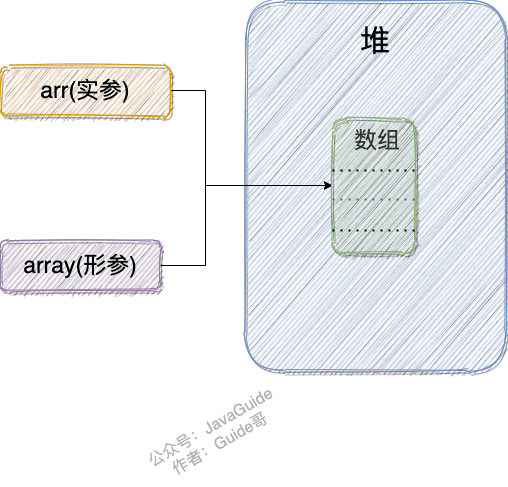
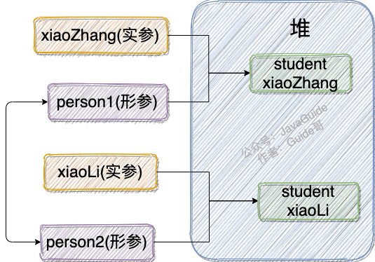

开始之前，我们先来搞懂下面这两个概念：

- 形参&实参
- 值传递&引用传递

## 形参&实参

方法的定义可能会用到 **参数**（有参的方法），参数在程序语言中分为：

- **实参（实际参数）** ：用于传递给函数/方法的参数，必须有确定的值。
- **形参（形式参数）** ：用于定义函数/方法，接收实参，不需要有确定的值。

```java
String hello = "Hello!";
// hello 为实参
sayHello(hello);
// str 为形参
void sayHello(String str) {
    System.out.println(str);
}
```

## 值传递&引用传递

程序设计语言将实参传递给方法（或函数）的方式分为两种：

- **值传递** ：方法接收的是实参值的拷贝，会创建副本。
- **引用传递** ：方法接收的直接是实参所引用的对象在堆中的地址，不会创建副本，对形参的修改将影响到实参。

很多程序设计语言（比如 C++、 Pascal )提供了两种参数传递的方式，不过，在 Java 中只有值传递。

## 为什么 Java 只有值传递？

**为什么说 Java 只有值传递呢？** 不需要太多废话，我通过 3 个例子来给大家证明。

### 案例1：传递基本类型参数

代码：

```java
public static void main(String[] args) {
    int num1 = 10;
    int num2 = 20;
    swap(num1, num2);
    System.out.println("num1 = " + num1);
    System.out.println("num2 = " + num2);
}

public static void swap(int a, int b) {
    int temp = a;
    a = b;
    b = temp;
    System.out.println("a = " + a);
    System.out.println("b = " + b);
}
```

输出：

```
a = 20
b = 10
num1 = 10
num2 = 20
```

解析：

在 `swap()`  方法中，`a`、`b` 的值进行交换，并不会影响到 `num1`、`num2`。因为，`a`、`b` 的值，只是从 `num1`、`num2` 的复制过来的。也就是说，a、b 相当于 `num1`、`num2` 的副本，副本的内容无论怎么修改，都不会影响到原件本身。


通过上面例子，我们已经知道了一个方法不能修改一个基本数据类型的参数，而对象引用作为参数就不一样，请看案例2。

### 案例2：传递引用类型参数1

代码：

```java
	public static void main(String[] args) {
      int[] arr = { 1, 2, 3, 4, 5 };
      System.out.println(arr[0]);
      change(arr);
      System.out.println(arr[0]);
	}

	public static void change(int[] array) {
      // 将数组的第一个元素变为0
      array[0] = 0;
	}
```

输出：

```
1
0
```

解析：



看了这个案例很多人肯定觉得 Java 对引用类型的参数采用的是引用传递。

实际上，并不是的，这里传递的还是值，不过，这个值是实参的地址罢了！

也就是说 `change` 方法的参数拷贝的是  `arr` （实参）的地址，因此，它和 `arr` 指向的是同一个数组对象。这也就说明了为什么方法内部对形参的修改会影响到实参。

为了更强有力地反驳 Java 对引用类型的参数采用的不是引用传递，我们再来看下面这个案例！

### 案例3 ：传递引用类型参数2

```java
public class Person {
    private String name;
   // 省略构造函数、Getter&Setter方法
}

public static void main(String[] args) {
    Person xiaoZhang = new Person("小张");
    Person xiaoLi = new Person("小李");
    swap(xiaoZhang, xiaoLi);
    System.out.println("xiaoZhang:" + xiaoZhang.getName());
    System.out.println("xiaoLi:" + xiaoLi.getName());
}

public static void swap(Person person1, Person person2) {
    Person temp = person1;
    person1 = person2;
    person2 = temp;
    System.out.println("person1:" + person1.getName());
    System.out.println("person2:" + person2.getName());
}
```

输出: 

```
person1:小李
person2:小张
xiaoZhang:小张
xiaoLi:小李
```

解析：

怎么回事？？？两个引用类型的形参互换并没有影响实参啊！

`swap` 方法的参数 `person1` 和 `person2` 只是拷贝的实参 `xiaoZhang` 和 `xiaoLi` 的地址。因此， `person1` 和 `person2` 的互换只是拷贝的两个地址的互换罢了，并不会影响到实参 `xiaoZhang` 和 `xiaoLi` 。



## 总结

Java 中将实参传递给方法（或函数）的方式是 **值传递** ：

- 如果参数是基本类型的话，很简单，传递的就是基本类型的字面量值的拷贝，会创建副本。
- 如果参数是引用类型，传递的就是实参所引用的对象在堆中地址值的拷贝，同样也会创建副本。

## 参考

- 《Java 核心技术卷 Ⅰ》基础知识第十版第四章 4.5 小节
- [Java 到底是值传递还是引用传递？ - Hollis的回答 - 知乎](https://www.zhihu.com/question/31203609/answer/576030121) 