<!-- @include: @article-header.snippet.md -->

## ⭐️JMM(Java 内存模型)

JMM（Java 内存模型）相关的问题比较多，也比较重要，于是我单独抽了一篇文章来总结 JMM 相关的知识点和问题：[JMM（Java 内存模型）详解](https://javaguide.cn/java/concurrent/jmm.html) 。

## ⭐️volatile 关键字

### 如何保证变量的可见性？

在 Java 中，`volatile` 关键字可以保证变量的可见性，如果我们将变量声明为 **`volatile`** ，这就指示 JVM，这个变量是共享且不稳定的，每次使用它都到主存中进行读取。


`volatile` 关键字其实并非是 Java 语言特有的，在 C 语言里也有，它最原始的意义就是禁用 CPU 缓存。如果我们将一个变量使用 `volatile` 修饰，这就指示 编译器，这个变量是共享且不稳定的，每次使用它都到主存中进行读取。

`volatile` 关键字能保证数据的可见性，但不能保证数据的原子性。`synchronized` 关键字两者都能保证。

### 如何禁止指令重排序？

**在 Java 中，`volatile` 关键字除了可以保证变量的可见性，还有一个重要的作用就是防止 JVM 的指令重排序。** 如果我们将变量声明为 **`volatile`** ，在对这个变量进行读写操作的时候，会通过插入特定的 **内存屏障** 的方式来禁止指令重排序。

在 Java 中，`Unsafe` 类提供了三个开箱即用的内存屏障相关的方法，屏蔽了操作系统底层的差异：

```java
public native void loadFence();
public native void storeFence();
public native void fullFence();
```

理论上来说，你通过这个三个方法也可以实现和`volatile`禁止重排序一样的效果，只是会麻烦一些。

下面我以一个常见的面试题为例讲解一下 `volatile` 关键字禁止指令重排序的效果。

面试中面试官经常会说：“单例模式了解吗？来给我手写一下！给我解释一下双重检验锁方式实现单例模式的原理呗！”

**双重校验锁实现对象单例（线程安全）**：

```java
public class Singleton {

    private volatile static Singleton uniqueInstance;

    private Singleton() {
    }

    public static Singleton getUniqueInstance() {
       //先判断对象是否已经实例过，没有实例化过才进入加锁代码
        if (uniqueInstance == null) {
            //类对象加锁
            synchronized (Singleton.class) {
                if (uniqueInstance == null) {
                    uniqueInstance = new Singleton();
                }
            }
        }
        return uniqueInstance;
    }
}
```

`uniqueInstance` 采用 `volatile` 关键字修饰也是很有必要的， `uniqueInstance = new Singleton();` 这段代码其实是分为三步执行：

1. 为 `uniqueInstance` 分配内存空间
2. 初始化 `uniqueInstance`
3. 将 `uniqueInstance` 指向分配的内存地址

但是由于 JVM 具有指令重排的特性，执行顺序有可能变成 1->3->2。指令重排在单线程环境下不会出现问题，但是在多线程环境下会导致一个线程获得还没有初始化的实例。例如，线程 T1 执行了 1 和 3，此时 T2 调用 `getUniqueInstance`() 后发现 `uniqueInstance` 不为空，因此返回 `uniqueInstance`，但此时 `uniqueInstance` 还未被初始化。

### volatile 可以保证原子性么？

**`volatile` 关键字能保证变量的可见性，但不能保证对变量的操作是原子性的。**

我们通过下面的代码即可证明：

```java
/**
 * 微信搜 JavaGuide 回复"面试突击"即可免费领取个人原创的 Java 面试手册
 *
 * @author Guide哥
 * @date 2022/08/03 13:40
 **/
public class VolatileAtomicityDemo {
    public volatile static int inc = 0;

    public void increase() {
        inc++;
    }

    public static void main(String[] args) throws InterruptedException {
        ExecutorService threadPool = Executors.newFixedThreadPool(5);
        VolatileAtomicityDemo volatileAtomicityDemo = new VolatileAtomicityDemo();
        for (int i = 0; i < 5; i++) {
            threadPool.execute(() -> {
                for (int j = 0; j < 500; j++) {
                    volatileAtomicityDemo.increase();
                }
            });
        }
        // 等待1.5秒，保证上面程序执行完成
        Thread.sleep(1500);
        System.out.println(inc);
        threadPool.shutdown();
    }
}
```

正常情况下，运行上面的代码理应输出 `2500`。但你真正运行了上面的代码之后，你会发现每次输出结果都小于 `2500`。

为什么会出现这种情况呢？不是说好了，`volatile` 可以保证变量的可见性嘛！

也就是说，如果 `volatile` 能保证 `inc++` 操作的原子性的话。每个线程中对 `inc` 变量自增完之后，其他线程可以立即看到修改后的值。5 个线程分别进行了 500 次操作，那么最终 inc 的值应该是 5\*500=2500。

很多人会误认为自增操作 `inc++` 是原子性的，实际上，`inc++` 其实是一个复合操作，包括三步：

1. 读取 inc 的值。
2. 对 inc 加 1。
3. 将 inc 的值写回内存。

`volatile` 是无法保证这三个操作是具有原子性的，有可能导致下面这种情况出现：

1. 线程 1 对 `inc` 进行读取操作之后，还未对其进行修改。线程 2 又读取了 `inc`的值并对其进行修改（+1），再将`inc` 的值写回内存。
2. 线程 2 操作完毕后，线程 1 对 `inc`的值进行修改（+1），再将`inc` 的值写回内存。

这也就导致两个线程分别对 `inc` 进行了一次自增操作后，`inc` 实际上只增加了 1。

其实，如果想要保证上面的代码运行正确也非常简单，利用 `synchronized`、`Lock`或者`AtomicInteger`都可以。

使用 `synchronized` 改进：

```java
public synchronized void increase() {
    inc++;
}
```

使用 `AtomicInteger` 改进：

```java
public AtomicInteger inc = new AtomicInteger();

public void increase() {
    inc.getAndIncrement();
}
```

使用 `ReentrantLock` 改进：

```java
Lock lock = new ReentrantLock();
public void increase() {
    lock.lock();
    try {
        inc++;
    } finally {
        lock.unlock();
    }
}
```

## ⭐️乐观锁和悲观锁

### 什么是悲观锁？

悲观锁总是假设最坏的情况，认为共享资源每次被访问的时候就会出现问题(比如共享数据被修改)，所以每次在获取资源操作的时候都会上锁，这样其他线程想拿到这个资源就会阻塞直到锁被上一个持有者释放。也就是说，**共享资源每次只给一个线程使用，其它线程阻塞，用完后再把资源转让给其它线程**。

像 Java 中`synchronized`和`ReentrantLock`等独占锁就是悲观锁思想的实现。

```java
public void performSynchronisedTask() {
    synchronized (this) {
        // 需要同步的操作
    }
}

private Lock lock = new ReentrantLock();
lock.lock();
try {
   // 需要同步的操作
} finally {
    lock.unlock();
}
```

高并发的场景下，激烈的锁竞争会造成线程阻塞，大量阻塞线程会导致系统的上下文切换，增加系统的性能开销。并且，悲观锁还可能会存在死锁问题，影响代码的正常运行。

### 什么是乐观锁？

乐观锁总是假设最好的情况，认为共享资源每次被访问的时候不会出现问题，线程可以不停地执行，无需加锁也无需等待，只是在提交修改的时候去验证对应的资源（也就是数据）是否被其它线程修改了（具体方法可以使用版本号机制或 CAS 算法）。

在 Java 中`java.util.concurrent.atomic`包下面的原子变量类（比如`AtomicInteger`、`LongAdder`）就是使用了乐观锁的一种实现方式 **CAS** 实现的。


```java
// LongAdder 在高并发场景下会比 AtomicInteger 和 AtomicLong 的性能更好
// 代价就是会消耗更多的内存空间（空间换时间）
LongAdder sum = new LongAdder();
sum.increment();
```

高并发的场景下，乐观锁相比悲观锁来说，不存在锁竞争造成线程阻塞，也不会有死锁的问题，在性能上往往会更胜一筹。但是，如果冲突频繁发生（写占比非常多的情况），会频繁失败和重试，这样同样会非常影响性能，导致 CPU 飙升。

不过，大量失败重试的问题也是可以解决的，像我们前面提到的 `LongAdder`以空间换时间的方式就解决了这个问题。

理论上来说：

- 悲观锁通常多用于写比较多的情况（多写场景，竞争激烈），这样可以避免频繁失败和重试影响性能，悲观锁的开销是固定的。不过，如果乐观锁解决了频繁失败和重试这个问题的话（比如`LongAdder`），也是可以考虑使用乐观锁的，要视实际情况而定。
- 乐观锁通常多用于写比较少的情况（多读场景，竞争较少），这样可以避免频繁加锁影响性能。不过，乐观锁主要针对的对象是单个共享变量（参考`java.util.concurrent.atomic`包下面的原子变量类）。

### 如何实现乐观锁？

乐观锁一般会使用版本号机制或 CAS 算法实现，CAS 算法相对来说更多一些，这里需要格外注意。

#### 版本号机制

一般是在数据表中加上一个数据版本号 `version` 字段，表示数据被修改的次数。当数据被修改时，`version` 值会加一。当线程 A 要更新数据值时，在读取数据的同时也会读取 `version` 值，在提交更新时，若刚才读取到的 version 值为当前数据库中的 `version` 值相等时才更新，否则重试更新操作，直到更新成功。

**举一个简单的例子**：假设数据库中帐户信息表中有一个 version 字段，当前值为 1 ；而当前帐户余额字段（ `balance` ）为 \$100 。

1. 操作员 A 此时将其读出（ `version`=1 ），并从其帐户余额中扣除 $50（ $100-\$50 ）。
2. 在操作员 A 操作的过程中，操作员 B 也读入此用户信息（ `version`=1 ），并从其帐户余额中扣除 $20 （ $100-\$20 ）。
3. 操作员 A 完成了修改工作，将数据版本号（ `version`=1 ），连同帐户扣除后余额（ `balance`=\$50 ），提交至数据库更新，此时由于提交数据版本等于数据库记录当前版本，数据被更新，数据库记录 `version` 更新为 2 。
4. 操作员 B 完成了操作，也将版本号（ `version`=1 ）试图向数据库提交数据（ `balance`=\$80 ），但此时比对数据库记录版本时发现，操作员 B 提交的数据版本号为 1 ，数据库记录当前版本也为 2 ，不满足 “ 提交版本必须等于当前版本才能执行更新 “ 的乐观锁策略，因此，操作员 B 的提交被驳回。

这样就避免了操作员 B 用基于 `version`=1 的旧数据修改的结果覆盖操作员 A 的操作结果的可能。

#### CAS 算法

CAS 的全称是 **Compare And Swap（比较与交换）** ，用于实现乐观锁，被广泛应用于各大框架中。CAS 的思想很简单，就是用一个预期值和要更新的变量值进行比较，两值相等才会进行更新。

CAS 是一个原子操作，底层依赖于一条 CPU 的原子指令。

> **原子操作** 即最小不可拆分的操作，也就是说操作一旦开始，就不能被打断，直到操作完成。

CAS 涉及到三个操作数：

- **V**：要更新的变量值(Var)
- **E**：预期值(Expected)
- **N**：拟写入的新值(New)

当且仅当 V 的值等于 E 时，CAS 通过原子方式用新值 N 来更新 V 的值。如果不等，说明已经有其它线程更新了 V，则当前线程放弃更新。

**举一个简单的例子**：线程 A 要修改变量 i 的值为 6，i 原值为 1（V = 1，E=1，N=6，假设不存在 ABA 问题）。

1. i 与 1 进行比较，如果相等， 则说明没被其他线程修改，可以被设置为 6 。
2. i 与 1 进行比较，如果不相等，则说明被其他线程修改，当前线程放弃更新，CAS 操作失败。

当多个线程同时使用 CAS 操作一个变量时，只有一个会胜出，并成功更新，其余均会失败，但失败的线程并不会被挂起，仅是被告知失败，并且允许再次尝试，当然也允许失败的线程放弃操作。

Java 语言并没有直接实现 CAS，CAS 相关的实现是通过 C++ 内联汇编的形式实现的（JNI 调用）。因此， CAS 的具体实现和操作系统以及 CPU 都有关系。

`sun.misc`包下的`Unsafe`类提供了`compareAndSwapObject`、`compareAndSwapInt`、`compareAndSwapLong`方法来实现的对`Object`、`int`、`long`类型的 CAS 操作

```java
/**
  *  CAS
  * @param o         包含要修改field的对象
  * @param offset    对象中某field的偏移量
  * @param expected  期望值
  * @param update    更新值
  * @return          true | false
  */
public final native boolean compareAndSwapObject(Object o, long offset,  Object expected, Object update);

public final native boolean compareAndSwapInt(Object o, long offset, int expected,int update);

public final native boolean compareAndSwapLong(Object o, long offset, long expected, long update);
```

关于 `Unsafe` 类的详细介绍可以看这篇文章：[Java 魔法类 Unsafe 详解 - JavaGuide - 2022](https://javaguide.cn/java/basis/unsafe.html) 。

### Java 中 CAS 是如何实现的？

在 Java 中，实现 CAS（Compare-And-Swap, 比较并交换）操作的一个关键类是`Unsafe`。

`Unsafe`类位于`sun.misc`包下，是一个提供低级别、不安全操作的类。由于其强大的功能和潜在的危险性，它通常用于 JVM 内部或一些需要极高性能和底层访问的库中，而不推荐普通开发者在应用程序中使用。关于 `Unsafe`类的详细介绍，可以阅读这篇文章：📌[Java 魔法类 Unsafe 详解](https://javaguide.cn/java/basis/unsafe.html)。

`sun.misc`包下的`Unsafe`类提供了`compareAndSwapObject`、`compareAndSwapInt`、`compareAndSwapLong`方法来实现的对`Object`、`int`、`long`类型的 CAS 操作：

```java
/**
 * 以原子方式更新对象字段的值。
 *
 * @param o        要操作的对象
 * @param offset   对象字段的内存偏移量
 * @param expected 期望的旧值
 * @param x        要设置的新值
 * @return 如果值被成功更新，则返回 true；否则返回 false
 */
boolean compareAndSwapObject(Object o, long offset, Object expected, Object x);

/**
 * 以原子方式更新 int 类型的对象字段的值。
 */
boolean compareAndSwapInt(Object o, long offset, int expected, int x);

/**
 * 以原子方式更新 long 类型的对象字段的值。
 */
boolean compareAndSwapLong(Object o, long offset, long expected, long x);
```

`Unsafe`类中的 CAS 方法是`native`方法。`native`关键字表明这些方法是用本地代码（通常是 C 或 C++）实现的，而不是用 Java 实现的。这些方法直接调用底层的硬件指令来实现原子操作。也就是说，Java 语言并没有直接用 Java 实现 CAS，而是通过 C++ 内联汇编的形式实现的（通过 JNI 调用）。因此，CAS 的具体实现与操作系统以及 CPU 密切相关。

`java.util.concurrent.atomic` 包提供了一些用于原子操作的类。这些类利用底层的原子指令，确保在多线程环境下的操作是线程安全的。


关于这些 Atomic 原子类的介绍和使用，可以阅读这篇文章：[Atomic 原子类总结](https://javaguide.cn/java/concurrent/atomic-classes.html)。

`AtomicInteger`是 Java 的原子类之一，主要用于对 `int` 类型的变量进行原子操作，它利用`Unsafe`类提供的低级别原子操作方法实现无锁的线程安全性。

下面，我们通过解读`AtomicInteger`的核心源码（JDK1.8），来说明 Java 如何使用`Unsafe`类的方法来实现原子操作。

`AtomicInteger`核心源码如下：

```java
// 获取 Unsafe 实例
private static final Unsafe unsafe = Unsafe.getUnsafe();
private static final long valueOffset;

static {
    try {
        // 获取“value”字段在AtomicInteger类中的内存偏移量
        valueOffset = unsafe.objectFieldOffset
            (AtomicInteger.class.getDeclaredField("value"));
    } catch (Exception ex) { throw new Error(ex); }
}
// 确保“value”字段的可见性
private volatile int value;

// 如果当前值等于预期值，则原子地将值设置为newValue
// 使用 Unsafe#compareAndSwapInt 方法进行CAS操作
public final boolean compareAndSet(int expect, int update) {
    return unsafe.compareAndSwapInt(this, valueOffset, expect, update);
}

// 原子地将当前值加 delta 并返回旧值
public final int getAndAdd(int delta) {
    return unsafe.getAndAddInt(this, valueOffset, delta);
}

// 原子地将当前值加 1 并返回加之前的值（旧值）
// 使用 Unsafe#getAndAddInt 方法进行CAS操作。
public final int getAndIncrement() {
    return unsafe.getAndAddInt(this, valueOffset, 1);
}

// 原子地将当前值减 1 并返回减之前的值（旧值）
public final int getAndDecrement() {
    return unsafe.getAndAddInt(this, valueOffset, -1);
}
```

`Unsafe#getAndAddInt`源码：

```java
// 原子地获取并增加整数值
public final int getAndAddInt(Object o, long offset, int delta) {
    int v;
    do {
        // 以 volatile 方式获取对象 o 在内存偏移量 offset 处的整数值
        v = getIntVolatile(o, offset);
    } while (!compareAndSwapInt(o, offset, v, v + delta));
    // 返回旧值
    return v;
}
```

可以看到，`getAndAddInt` 使用了 `do-while` 循环：在`compareAndSwapInt`操作失败时，会不断重试直到成功。也就是说，`getAndAddInt`方法会通过 `compareAndSwapInt` 方法来尝试更新 `value` 的值，如果更新失败（当前值在此期间被其他线程修改），它会重新获取当前值并再次尝试更新，直到操作成功。

由于 CAS 操作可能会因为并发冲突而失败，因此通常会与`while`循环搭配使用，在失败后不断重试，直到操作成功。这就是 **自旋锁机制** 。

### CAS 算法存在哪些问题？

ABA 问题是 CAS 算法最常见的问题。

#### ABA 问题

如果一个变量 V 初次读取的时候是 A 值，并且在准备赋值的时候检查到它仍然是 A 值，那我们就能说明它的值没有被其他线程修改过了吗？很明显是不能的，因为在这段时间它的值可能被改为其他值，然后又改回 A，那 CAS 操作就会误认为它从来没有被修改过。这个问题被称为 CAS 操作的 **"ABA"问题。**

ABA 问题的解决思路是在变量前面追加上**版本号或者时间戳**。JDK 1.5 以后的 `AtomicStampedReference` 类就是用来解决 ABA 问题的，其中的 `compareAndSet()` 方法就是首先检查当前引用是否等于预期引用，并且当前标志是否等于预期标志，如果全部相等，则以原子方式将该引用和该标志的值设置为给定的更新值。

```java
public boolean compareAndSet(V   expectedReference,
                             V   newReference,
                             int expectedStamp,
                             int newStamp) {
    Pair<V> current = pair;
    return
        expectedReference == current.reference &&
        expectedStamp == current.stamp &&
        ((newReference == current.reference &&
          newStamp == current.stamp) ||
         casPair(current, Pair.of(newReference, newStamp)));
}
```

#### 循环时间长开销大

CAS 经常会用到自旋操作来进行重试，也就是不成功就一直循环执行直到成功。如果长时间不成功，会给 CPU 带来非常大的执行开销。

如果 JVM 能够支持处理器提供的`pause`指令，那么自旋操作的效率将有所提升。`pause`指令有两个重要作用：

1. **延迟流水线执行指令**：`pause`指令可以延迟指令的执行，从而减少 CPU 的资源消耗。具体的延迟时间取决于处理器的实现版本，在某些处理器上，延迟时间可能为零。
2. **避免内存顺序冲突**：在退出循环时，`pause`指令可以避免由于内存顺序冲突而导致的 CPU 流水线被清空，从而提高 CPU 的执行效率。

#### 只能保证一个共享变量的原子操作

CAS 操作仅能对单个共享变量有效。当需要操作多个共享变量时，CAS 就显得无能为力。不过，从 JDK 1.5 开始，Java 提供了`AtomicReference`类，这使得我们能够保证引用对象之间的原子性。通过将多个变量封装在一个对象中，我们可以使用`AtomicReference`来执行 CAS 操作。

除了 `AtomicReference` 这种方式之外，还可以利用加锁来保证。

### 总结

| **对比维度**    | **乐观锁 (Optimistic Locking)**             | **悲观锁 (Pessimistic Locking)**             |
| --------------- | ------------------------------------------- | -------------------------------------------- |
| **核心假设**    | 假设冲突很少发生，提交时才验证。            | 假设冲突必然发生，读取时就加锁。             |
| **底层原理**    | **CAS (Compare And Swap)** 或版本号机制。   | **操作系统互斥锁**，涉及内核态切换。         |
| **阻塞情况**    | **非阻塞**。失败后由业务逻辑决定是否重试。  | **阻塞**。其他线程必须排队等待锁释放。       |
| **并发开销**    | **CPU 消耗**（高并发写时频繁自旋重试）。    | **上下文切换开销**（线程挂起与唤醒）。       |
| **死锁风险**    | **无死锁**（因为不涉及持有锁的等待）。      | **有死锁风险**（多个锁相互等待）。           |
| **数据库实现**  | `UPDATE ... SET version = version + 1`      | `SELECT ... FOR UPDATE`                      |
| **Java 代表类** | `AtomicInteger`、`LongAdder`、`StampedLock` | `synchronized`、`ReentrantLock`              |
| **适用场景**    | **多读少写**、并发冲突概率低的业务。        | **多写少读**、数据一致性要求极高的核心业务。 |

## synchronized 关键字

### synchronized 是什么？有什么用？

`synchronized` 是 Java 中的一个关键字，翻译成中文是同步的意思，主要解决的是多个线程之间访问资源的同步性，可以保证被它修饰的方法或者代码块在任意时刻只能有一个线程执行。

在 Java 早期版本中，`synchronized` 属于 **重量级锁**，效率低下。这是因为监视器锁（monitor）是依赖于底层的操作系统的 `Mutex Lock` 来实现的，Java 的线程是映射到操作系统的原生线程之上的。如果要挂起或者唤醒一个线程，都需要操作系统帮忙完成，而操作系统实现线程之间的切换时需要从用户态转换到内核态，这个状态之间的转换需要相对比较长的时间，时间成本相对较高。

不过，在 Java 6 之后， `synchronized` 引入了大量的优化如自旋锁、适应性自旋锁、锁消除、锁粗化、偏向锁、轻量级锁等技术来减少锁操作的开销，这些优化让 `synchronized` 锁的效率提升了很多。因此， `synchronized` 还是可以在实际项目中使用的，像 JDK 源码、很多开源框架都大量使用了 `synchronized` 。

关于偏向锁多补充一点：由于偏向锁增加了 JVM 的复杂性，同时也并没有为所有应用都带来性能提升。因此，在 JDK15 中，偏向锁被默认关闭（仍然可以使用 `-XX:+UseBiasedLocking` 启用偏向锁），在 JDK18 中，偏向锁已经被彻底废弃（无法通过命令行打开）。

### 如何使用 synchronized？

`synchronized` 关键字的使用方式主要有下面 3 种：

1. 修饰实例方法
2. 修饰静态方法
3. 修饰代码块

**1、修饰实例方法** （锁当前对象实例）

给当前对象实例加锁，进入同步代码前要获得 **当前对象实例的锁** 。

```java
synchronized void method() {
    //业务代码
}
```

**2、修饰静态方法** （锁当前类）

给当前类加锁，会作用于类的所有对象实例 ，进入同步代码前要获得 **当前 class 的锁**。

这是因为静态成员不属于任何一个实例对象，归整个类所有，不依赖于类的特定实例，被类的所有实例共享。

```java
synchronized static void method() {
    //业务代码
}
```

静态 `synchronized` 方法和非静态 `synchronized` 方法之间的调用互斥么？不互斥！如果一个线程 A 调用一个实例对象的非静态 `synchronized` 方法，而线程 B 需要调用这个实例对象所属类的静态 `synchronized` 方法，是允许的，不会发生互斥现象，因为访问静态 `synchronized` 方法占用的锁是当前类的锁，而访问非静态 `synchronized` 方法占用的锁是当前实例对象锁。

**3、修饰代码块** （锁指定对象/类）

对括号里指定的对象/类加锁：

- `synchronized(object)` 表示进入同步代码块前要获得 **给定对象的锁**。
- `synchronized(类.class)` 表示进入同步代码块前要获得 **给定 Class 的锁**

```java
synchronized(this) {
    //业务代码
}
```

**总结：**

- `synchronized` 关键字加到 `static` 静态方法和 `synchronized(class)` 代码块上都是是给 Class 类上锁；
- `synchronized` 关键字加到实例方法上是给对象实例上锁；
- 尽量不要使用 `synchronized(String a)` 因为 JVM 中，字符串常量池具有缓存功能。

### 构造方法可以用 synchronized 修饰么？

构造方法不能使用 synchronized 关键字修饰。不过，可以在构造方法内部使用 synchronized 代码块。

另外，构造方法本身是线程安全的，但如果在构造方法中涉及到共享资源的操作，就需要采取适当的同步措施来保证整个构造过程的线程安全。

### ⭐️synchronized 底层原理了解吗？

synchronized 关键字底层原理属于 JVM 层面的东西。

#### synchronized 同步语句块的情况

```java
public class SynchronizedDemo {
    public void method() {
        synchronized (this) {
            System.out.println("synchronized 代码块");
        }
    }
}
```

通过 JDK 自带的 `javap` 命令查看 `SynchronizedDemo` 类的相关字节码信息：首先切换到类的对应目录执行 `javac SynchronizedDemo.java` 命令生成编译后的 .class 文件，然后执行`javap -c -s -v -l SynchronizedDemo.class`。


从上面我们可以看出：**`synchronized` 同步语句块的实现使用的是 `monitorenter` 和 `monitorexit` 指令，其中 `monitorenter` 指令指向同步代码块的开始位置，`monitorexit` 指令则指明同步代码块的结束位置。**

上面的字节码中包含一个 `monitorenter` 指令以及两个 `monitorexit` 指令，这是为了保证锁在同步代码块代码正常执行以及出现异常的这两种情况下都能被正确释放。

当执行 `monitorenter` 指令时，线程试图获取锁也就是获取 **对象监视器 `monitor`** 的持有权。

> 在 Java 虚拟机(HotSpot)中，Monitor 是基于 C++实现的，由[ObjectMonitor](https://github.com/openjdk-mirror/jdk7u-hotspot/blob/50bdefc3afe944ca74c3093e7448d6b889cd20d1/src/share/vm/runtime/objectMonitor.cpp)实现的。每个对象中都内置了一个 `ObjectMonitor`对象。
>
> 另外，`wait/notify`等方法也依赖于`monitor`对象，这就是为什么只有在同步的块或者方法中才能调用`wait/notify`等方法，否则会抛出`java.lang.IllegalMonitorStateException`的异常的原因。

在执行`monitorenter`时，会尝试获取对象的锁，如果锁的计数器为 0 则表示锁可以被获取，获取后将锁计数器设为 1 也就是加 1。


对象锁的拥有者线程才可以执行 `monitorexit` 指令来释放锁。在执行 `monitorexit` 指令后，将锁计数器设为 0，表明锁被释放，其他线程可以尝试获取锁。


如果获取对象锁失败，那当前线程就要阻塞等待，直到锁被另外一个线程释放为止。

#### synchronized 修饰方法的情况

```java
public class SynchronizedDemo2 {
    public synchronized void method() {
        System.out.println("synchronized 方法");
    }
}

```


`synchronized` 修饰的方法并没有 `monitorenter` 指令和 `monitorexit` 指令，取而代之的是 `ACC_SYNCHRONIZED` 标识，该标识指明了该方法是一个同步方法。JVM 通过该 `ACC_SYNCHRONIZED` 访问标志来辨别一个方法是否声明为同步方法，从而执行相应的同步调用。

如果是实例方法，JVM 会尝试获取实例对象的锁。如果是静态方法，JVM 会尝试获取当前 class 的锁。

#### 总结

`synchronized` 同步语句块的实现使用的是 `monitorenter` 和 `monitorexit` 指令，其中 `monitorenter` 指令指向同步代码块的开始位置，`monitorexit` 指令则指明同步代码块的结束位置。

`synchronized` 修饰的方法并没有 `monitorenter` 指令和 `monitorexit` 指令，取而代之的是 `ACC_SYNCHRONIZED` 标识，该标识指明了该方法是一个同步方法。

**不过，两者的本质都是对对象监视器 monitor 的获取。**

相关推荐：[Java 锁与线程的那些事 - 有赞技术团队](https://tech.youzan.com/javasuo-yu-xian-cheng-de-na-xie-shi/) 。

🧗🏻 进阶一下：学有余力的小伙伴可以抽时间详细研究一下对象监视器 `monitor`。

### JDK1.6 之后的 synchronized 底层做了哪些优化？锁升级原理了解吗？

在 Java 6 之后， `synchronized` 引入了大量的优化如自旋锁、适应性自旋锁、锁消除、锁粗化、偏向锁、轻量级锁等技术来减少锁操作的开销，这些优化让 `synchronized` 锁的效率提升了很多（JDK18 中，偏向锁已经被彻底废弃，前面已经提到过了）。

锁主要存在四种状态，依次是：无锁状态、偏向锁状态、轻量级锁状态、重量级锁状态，他们会随着竞争的激烈而逐渐升级。注意锁可以升级不可降级，这种策略是为了提高获得锁和释放锁的效率。

`synchronized` 锁升级是一个比较复杂的过程，面试也很少问到，如果你想要详细了解的话，可以看看这篇文章：[浅析 synchronized 锁升级的原理与实现](https://www.cnblogs.com/star95/p/17542850.html)。

### synchronized 的偏向锁为什么被废弃了？

Open JDK 官方声明：[JEP 374: Deprecate and Disable Biased Locking](https://openjdk.org/jeps/374)

在 JDK15 中，偏向锁被默认关闭（仍然可以使用 `-XX:+UseBiasedLocking` 启用偏向锁），在 JDK18 中，偏向锁已经被彻底废弃（无法通过命令行打开）。

在官方声明中，主要原因有两个方面：

- **性能收益不明显：**

偏向锁是 HotSpot 虚拟机的一项优化技术，可以提升单线程对同步代码块的访问性能。

受益于偏向锁的应用程序通常使用了早期的 Java 集合 API，例如 HashTable、Vector，在这些集合类中通过 synchronized 来控制同步，这样在单线程频繁访问时，通过偏向锁会减少同步开销。

随着 JDK 的发展，出现了 ConcurrentHashMap 高性能的集合类，在集合类内部进行了许多性能优化，此时偏向锁带来的性能收益就不明显了。

偏向锁仅仅在单线程访问同步代码块的场景中可以获得性能收益。

如果存在多线程竞争，就需要 **撤销偏向锁** ，这个操作的性能开销是比较昂贵的。偏向锁的撤销需要等待进入到全局安全点（safe point），该状态下所有线程都是暂停的，此时去检查线程状态并进行偏向锁的撤销。

- **JVM 内部代码维护成本太高：**

偏向锁将许多复杂代码引入到同步子系统，并且对其他的 HotSpot 组件也具有侵入性。这种复杂性为理解代码、系统重构带来了困难，因此， OpenJDK 官方希望禁用、废弃并删除偏向锁。

### ⭐️synchronized 和 volatile 有什么区别？

`synchronized` 关键字和 `volatile` 关键字是两个互补的存在，而不是对立的存在！

- `volatile` 关键字是线程同步的轻量级实现，所以 `volatile`性能肯定比`synchronized`关键字要好 。但是 `volatile` 关键字只能用于变量而 `synchronized` 关键字可以修饰方法以及代码块 。
- `volatile` 关键字能保证数据的可见性，但不能保证数据的原子性。`synchronized` 关键字两者都能保证。
- `volatile`关键字主要用于解决变量在多个线程之间的可见性，而 `synchronized` 关键字解决的是多个线程之间访问资源的同步性。

## ReentrantLock

### ReentrantLock 是什么？

`ReentrantLock` 实现了 `Lock` 接口，是一个可重入且独占式的锁，和 `synchronized` 关键字类似。不过，`ReentrantLock` 更灵活、更强大，增加了轮询、超时、中断、公平锁和非公平锁等高级功能。

```java
public class ReentrantLock implements Lock, java.io.Serializable {}
```

`ReentrantLock` 里面有一个内部类 `Sync`，`Sync` 继承 AQS（`AbstractQueuedSynchronizer`），添加锁和释放锁的大部分操作实际上都是在 `Sync` 中实现的。`Sync` 有公平锁 `FairSync` 和非公平锁 `NonfairSync` 两个子类。


`ReentrantLock` 默认使用非公平锁，也可以通过构造器来显式的指定使用公平锁。

```java
// 传入一个 boolean 值，true 时为公平锁，false 时为非公平锁
public ReentrantLock(boolean fair) {
    sync = fair ? new FairSync() : new NonfairSync();
}
```

从上面的内容可以看出， `ReentrantLock` 的底层就是由 AQS 来实现的。关于 AQS 的相关内容推荐阅读 [AQS 详解](https://javaguide.cn/java/concurrent/aqs.html) 这篇文章。

### 公平锁和非公平锁有什么区别？

- **公平锁** : 锁被释放之后，先申请的线程先得到锁。性能较差一些，因为公平锁为了保证时间上的绝对顺序，上下文切换更频繁。
- **非公平锁**：锁被释放之后，后申请的线程可能会先获取到锁，是随机或者按照其他优先级排序的。性能更好，但可能会导致某些线程永远无法获取到锁。

### ⭐️synchronized 和 ReentrantLock 有什么区别？

#### 两者都是可重入锁

**可重入锁** 也叫递归锁，指的是线程可以再次获取自己的内部锁。比如一个线程获得了某个对象的锁，此时这个对象锁还没有释放，当其再次想要获取这个对象的锁的时候还是可以获取的，如果是不可重入锁的话，就会造成死锁。

JDK 提供的所有现成的 `Lock` 实现类，包括 `synchronized` 关键字锁都是可重入的。

在下面的代码中，`method1()` 和 `method2()`都被 `synchronized` 关键字修饰，`method1()`调用了`method2()`。

```java
public class SynchronizedDemo {
    public synchronized void method1() {
        System.out.println("方法1");
        method2();
    }

    public synchronized void method2() {
        System.out.println("方法2");
    }
}
```

由于 `synchronized`锁是可重入的，同一个线程在调用`method1()` 时可以直接获得当前对象的锁，执行 `method2()` 的时候可以再次获取这个对象的锁，不会产生死锁问题。假如`synchronized`是不可重入锁的话，由于该对象的锁已被当前线程所持有且无法释放，这就导致线程在执行 `method2()`时获取锁失败，会出现死锁问题。

#### synchronized 依赖于 JVM 而 ReentrantLock 依赖于 API

`synchronized` 是依赖于 JVM 实现的，前面我们也讲到了 虚拟机团队在 JDK1.6 为 `synchronized` 关键字进行了很多优化，但是这些优化都是在虚拟机层面实现的，并没有直接暴露给我们。

`ReentrantLock` 是 JDK 层面实现的（也就是 API 层面，需要 `lock()` 和 `unlock()` 方法配合 `try/finally` 语句块来完成），所以我们可以通过查看它的源代码，来看它是如何实现的。

#### ReentrantLock 比 synchronized 增加了一些高级功能

相比`synchronized`，`ReentrantLock`增加了一些高级功能。主要来说主要有三点：

- **等待可中断** : `ReentrantLock`提供了一种能够中断等待锁的线程的机制，通过 `lock.lockInterruptibly()` 来实现这个机制。也就是说当前线程在等待获取锁的过程中，如果其他线程中断当前线程「 `interrupt()` 」，当前线程就会抛出 `InterruptedException` 异常，可以捕捉该异常进行相应处理。
- **可实现公平锁** : `ReentrantLock`可以指定是公平锁还是非公平锁。而`synchronized`只能是非公平锁。所谓的公平锁就是先等待的线程先获得锁。`ReentrantLock`默认情况是非公平的，可以通过 `ReentrantLock`类的`ReentrantLock(boolean fair)`构造方法来指定是否是公平的。
- **通知机制更强大**：`ReentrantLock` 通过绑定多个 `Condition` 对象，可以实现分组唤醒和选择性通知。这解决了 `synchronized` 只能随机唤醒或全部唤醒的效率问题，为复杂的线程协作场景提供了强大的支持。
- **支持超时** ：`ReentrantLock` 提供了 `tryLock(timeout)` 的方法，可以指定等待获取锁的最长等待时间，如果超过了等待时间，就会获取锁失败，不会一直等待。

如果你想使用上述功能，那么选择 `ReentrantLock` 是一个不错的选择。

关于 `Condition`接口的补充：

> `Condition`是 JDK1.5 之后才有的，它具有很好的灵活性，比如可以实现多路通知功能也就是在一个`Lock`对象中可以创建多个`Condition`实例（即对象监视器），**线程对象可以注册在指定的`Condition`中，从而可以有选择性的进行线程通知，在调度线程上更加灵活。 在使用`notify()/notifyAll()`方法进行通知时，被通知的线程是由 JVM 选择的，用`ReentrantLock`类结合`Condition`实例可以实现“选择性通知”** ，这个功能非常重要，而且是 `Condition` 接口默认提供的。而`synchronized`关键字就相当于整个 `Lock` 对象中只有一个`Condition`实例，所有的线程都注册在它一个身上。如果执行`notifyAll()`方法的话就会通知所有处于等待状态的线程，这样会造成很大的效率问题。而`Condition`实例的`signalAll()`方法，只会唤醒注册在该`Condition`实例中的所有等待线程。

关于 **等待可中断** 的补充：

> `lockInterruptibly()` 会让获取锁的线程在阻塞等待的过程中可以响应中断，即当前线程在获取锁的时候，发现锁被其他线程持有，就会阻塞等待。
>
> 在阻塞等待的过程中，如果其他线程中断当前线程 `interrupt()` ，就会抛出 `InterruptedException` 异常，可以捕获该异常，做一些处理操作。
>
> 为了更好理解这个方法，借用 Stack Overflow 上的一个案例，可以更好地理解 `lockInterruptibly()` 可以响应中断：
>
> ```JAVA
> public class MyRentrantlock {
>     Thread t = new Thread() {
>         @Override
>         public void run() {
>             ReentrantLock r = new ReentrantLock();
>             // 1.1、第一次尝试获取锁，可以获取成功
>             r.lock();
>
>             // 1.2、此时锁的重入次数为 1
>             System.out.println("lock() : lock count :" + r.getHoldCount());
>
>             // 2、中断当前线程，通过 Thread.currentThread().isInterrupted() 可以看到当前线程的中断状态为 true
>             interrupt();
>             System.out.println("Current thread is intrupted");
>
>             // 3.1、尝试获取锁，可以成功获取
>             r.tryLock();
>             // 3.2、此时锁的重入次数为 2
>             System.out.println("tryLock() on intrupted thread lock count :" + r.getHoldCount());
>             try {
>                 // 4、打印线程的中断状态为 true，那么调用 lockInterruptibly() 方法就会抛出 InterruptedException 异常
>                 System.out.println("Current Thread isInterrupted:" + Thread.currentThread().isInterrupted());
>                 r.lockInterruptibly();
>                 System.out.println("lockInterruptibly() --NOt executable statement" + r.getHoldCount());
>             } catch (InterruptedException e) {
>                 r.lock();
>                 System.out.println("Error");
>             } finally {
>                 r.unlock();
>             }
>
>             // 5、打印锁的重入次数，可以发现 lockInterruptibly() 方法并没有成功获取到锁
>             System.out.println("lockInterruptibly() not able to Acqurie lock: lock count :" + r.getHoldCount());
>
>             r.unlock();
>             System.out.println("lock count :" + r.getHoldCount());
>             r.unlock();
>             System.out.println("lock count :" + r.getHoldCount());
>         }
>     };
>     public static void main(String str[]) {
>         MyRentrantlock m = new MyRentrantlock();
>         m.t.start();
>     }
> }
> ```
>
> 输出：
>
> ```BASH
> lock() : lock count :1
> Current thread is intrupted
> tryLock() on intrupted thread lock count :2
> Current Thread isInterrupted:true
> Error
> lockInterruptibly() not able to Acqurie lock: lock count :2
> lock count :1
> lock count :0
> ```

关于 **支持超时** 的补充：

> **为什么需要 `tryLock(timeout)` 这个功能呢？**
>
> `tryLock(timeout)` 方法尝试在指定的超时时间内获取锁。如果成功获取锁，则返回 `true`；如果在锁可用之前超时，则返回 `false`。此功能在以下几种场景中非常有用：
>
> - **防止死锁：** 在复杂的锁场景中，`tryLock(timeout)` 可以通过允许线程在合理的时间内放弃并重试来帮助防止死锁。
> - **提高响应速度：** 防止线程无限期阻塞。
> - **处理时间敏感的操作：** 对于具有严格时间限制的操作，`tryLock(timeout)` 允许线程在无法及时获取锁时继续执行替代操作。

### 可中断锁和不可中断锁有什么区别？

它们的区别在于：**线程在获取锁的过程中被阻塞时，是否能够因为中断而提前放弃等待。**

- **不可中断锁**：线程在等待锁期间即使收到中断信号，也不会退出阻塞状态，而是一直等待直到获得锁。中断状态会被保留，但不会影响锁的获取过程。
  - `synchronized` 属于典型的不可中断锁。
  - `ReentrantLock#lock()` 也是不可中断的。
- **可中断锁**：线程在等待锁的过程中如果收到中断信号，会立即停止等待并抛出 `InterruptedException`，从而有机会进行取消或错误处理。
  - `ReentrantLock#lockInterruptibly()` 实现了可中断锁。
  - `ReentrantLock#tryLock(long time, TimeUnit unit)` （带超时的尝试获取）也是可中断的。

## ReentrantReadWriteLock

`ReentrantReadWriteLock` 在实际项目中使用的并不多，面试中也问的比较少，简单了解即可。JDK 1.8 引入了性能更好的读写锁 `StampedLock` 。

### ReentrantReadWriteLock 是什么？

`ReentrantReadWriteLock` 实现了 `ReadWriteLock` ，是一个可重入的读写锁，既可以保证多个线程同时读的效率，同时又可以保证有写入操作时的线程安全。

```java
public class ReentrantReadWriteLock
        implements ReadWriteLock, java.io.Serializable{
}
public interface ReadWriteLock {
    Lock readLock();
    Lock writeLock();
}
```

- 一般锁进行并发控制的规则：读读互斥、读写互斥、写写互斥。
- 读写锁进行并发控制的规则：读读不互斥、读写互斥、写写互斥（只有读读不互斥）。

`ReentrantReadWriteLock` 其实是两把锁，一把是 `WriteLock` (写锁)，一把是 `ReadLock`（读锁） 。读锁是共享锁，写锁是独占锁。读锁可以被同时读，可以同时被多个线程持有，而写锁最多只能同时被一个线程持有。

和 `ReentrantLock` 一样，`ReentrantReadWriteLock` 底层也是基于 AQS 实现的。


`ReentrantReadWriteLock` 也支持公平锁和非公平锁，默认使用非公平锁，可以通过构造器来显式地指定。

```java
// 传入一个 boolean 值，true 时为公平锁，false 时为非公平锁
public ReentrantReadWriteLock(boolean fair) {
    sync = fair ? new FairSync() : new NonfairSync();
    readerLock = new ReadLock(this);
    writerLock = new WriteLock(this);
}
```

### ReentrantReadWriteLock 适合什么场景？

由于 `ReentrantReadWriteLock` 既可以保证多个线程同时读的效率，同时又可以保证有写入操作时的线程安全。因此，在读多写少的情况下，使用 `ReentrantReadWriteLock` 能够明显提升系统性能。

### 共享锁和独占锁有什么区别？

- **共享锁**：一把锁可以被多个线程同时获得。
- **独占锁**：一把锁只能被一个线程获得。

### 线程持有读锁还能获取写锁吗？

- 在线程持有读锁的情况下，该线程不能取得写锁(因为获取写锁的时候，如果发现当前的读锁被占用，就马上获取失败，不管读锁是不是被当前线程持有)。
- 在线程持有写锁的情况下，该线程可以继续获取读锁（获取读锁时如果发现写锁被占用，只有写锁没有被当前线程占用的情况才会获取失败）。

读写锁的源码分析，推荐阅读 [聊聊 Java 的几把 JVM 级锁 - 阿里巴巴中间件](https://mp.weixin.qq.com/s/h3VIUyH9L0v14MrQJiiDbw) 这篇文章，写的很不错。

### 读锁为什么不能升级为写锁？

写锁可以降级为读锁，但是读锁却不能升级为写锁。这是因为读锁升级为写锁会引起线程的争夺，毕竟写锁属于是独占锁，这样的话，会影响性能。

另外，还可能会有死锁问题发生。举个例子：假设两个线程的读锁都想升级写锁，则需要对方都释放自己锁，而双方都不释放，就会产生死锁。

## StampedLock

```mermaid
flowchart TB
    subgraph StampedLock["StampedLock(JDK1.8+)"]
        style StampedLock fill:#F0F2F5,stroke:#E0E6ED,rx:10,ry:10
        subgraph Modes["模式分类"]
            style Modes fill:#F5F7FA,stroke:#E0E6ED,rx:10,ry:10
            Write(["写锁（独占）：单线程持有，阻塞其他读写"]):::write
            Read(["读锁（悲观读）：无写锁时多线程共享"]):::read
            Optimistic(["乐观读：无写锁时直接访问，提交时验证"]):::optimistic
        end
        subgraph Features["核心特点"]
            style Features fill:#F5F7FA,stroke:#E0E6ED,rx:10,ry:10
            F1(["不可重入，不支持Condition"]):::feature
            F2(["性能优秀（乐观读减少阻塞）"]):::feature
            F3(["适用场景：读多写少，无重入需求"]):::feature
        end
    end

    classDef write fill:#C44545,color:#fff,rx:10,ry:10
    classDef read fill:#00838F,color:#fff,rx:10,ry:10
    classDef optimistic fill:#4CA497,color:#fff,rx:10,ry:10
    classDef feature fill:#E99151,color:#333,rx:10,ry:10

    linkStyle default stroke-width:1.5px,opacity:0.8
```



`StampedLock` 面试中问的比较少，不是很重要，简单了解即可。

### StampedLock 是什么？

`StampedLock` 是 JDK 1.8 引入的性能更好的读写锁，不可重入且不支持条件变量 `Condition`。

不同于一般的 `Lock` 类，`StampedLock` 并不是直接实现 `Lock`或 `ReadWriteLock`接口，而是基于 **CLH 锁** 独立实现的（AQS 也是基于这玩意）。

```java
public class StampedLock implements java.io.Serializable {
}
```

`StampedLock` 提供了三种模式的读写控制模式：读锁、写锁和乐观读。

- **写锁**：独占锁，一把锁只能被一个线程获得。当一个线程获取写锁后，其他请求读锁和写锁的线程必须等待。类似于 `ReentrantReadWriteLock` 的写锁，不过这里的写锁是不可重入的。
- **读锁** （悲观读）：共享锁，没有线程获取写锁的情况下，多个线程可以同时持有读锁。如果己经有线程持有写锁，则其他线程请求获取该读锁会被阻塞。类似于 `ReentrantReadWriteLock` 的读锁，不过这里的读锁是不可重入的。
- **乐观读**：允许多个线程获取乐观读以及读锁。同时允许一个写线程获取写锁。

另外，`StampedLock` 还支持这三种锁在一定条件下进行相互转换 。

```java
long tryConvertToWriteLock(long stamp){}
long tryConvertToReadLock(long stamp){}
long tryConvertToOptimisticRead(long stamp){}
```

`StampedLock` 在获取锁的时候会返回一个 long 型的数据戳，该数据戳用于稍后的锁释放参数，如果返回的数据戳为 0 则表示锁获取失败。当前线程持有了锁再次获取锁还是会返回一个新的数据戳，这也是`StampedLock`不可重入的原因。

```java
// 写锁
public long writeLock() {
    long s, next;  // bypass acquireWrite in fully unlocked case only
    return ((((s = state) & ABITS) == 0L &&
             U.compareAndSwapLong(this, STATE, s, next = s + WBIT)) ?
            next : acquireWrite(false, 0L));
}
// 读锁
public long readLock() {
    long s = state, next;  // bypass acquireRead on common uncontended case
    return ((whead == wtail && (s & ABITS) < RFULL &&
             U.compareAndSwapLong(this, STATE, s, next = s + RUNIT)) ?
            next : acquireRead(false, 0L));
}
// 乐观读
public long tryOptimisticRead() {
    long s;
    return (((s = state) & WBIT) == 0L) ? (s & SBITS) : 0L;
}
```

### StampedLock 的性能为什么更好？

相比于传统读写锁多出来的乐观读是`StampedLock`比 `ReadWriteLock` 性能更好的关键原因。`StampedLock` 的乐观读允许一个写线程获取写锁，所以不会导致所有写线程阻塞，也就是当读多写少的时候，写线程有机会获取写锁，减少了线程饥饿的问题，吞吐量大大提高。

### StampedLock 适合什么场景？

和 `ReentrantReadWriteLock` 一样，`StampedLock` 同样适合读多写少的业务场景，可以作为 `ReentrantReadWriteLock`的替代品，性能更好。

不过，需要注意的是`StampedLock`不可重入，不支持条件变量 `Condition`，对中断操作支持也不友好（使用不当容易导致 CPU 飙升）。如果你需要用到 `ReentrantLock` 的一些高级性能，就不太建议使用 `StampedLock` 了。

另外，`StampedLock` 性能虽好，但使用起来相对比较麻烦，一旦使用不当，就会出现生产问题。强烈建议你在使用`StampedLock` 之前，看看 [StampedLock 官方文档中的案例](https://docs.oracle.com/javase/8/docs/api/java/util/concurrent/locks/StampedLock.html)。

### StampedLock 的底层原理了解吗？

`StampedLock` 不是直接实现 `Lock`或 `ReadWriteLock`接口，而是基于 **CLH 锁** 实现的（AQS 也是基于这玩意），CLH 锁是对自旋锁的一种改良，是一种隐式的链表队列。`StampedLock` 通过 CLH 队列进行线程的管理，通过同步状态值 `state` 来表示锁的状态和类型。

`StampedLock` 的原理和 AQS 原理比较类似，这里就不详细介绍了，感兴趣的可以看看下面这两篇文章：

- [AQS 详解](https://javaguide.cn/java/concurrent/aqs.html)
- [StampedLock 底层原理分析](https://segmentfault.com/a/1190000015808032)

如果你只是准备面试的话，建议多花点精力搞懂 AQS 原理即可，`StampedLock` 底层原理在面试中遇到的概率非常小。

## Atomic 原子类

Atomic 原子类部分的内容我单独写了一篇文章来总结：[Atomic 原子类总结](./atomic-classes.md) 。

## 参考

- 《深入理解 Java 虚拟机》
- 《实战 Java 高并发程序设计》
- Guide to the Volatile Keyword in Java - Baeldung：<https://www.baeldung.com/java-volatile>
- 不可不说的 Java“锁”事 - 美团技术团队：<https://tech.meituan.com/2018/11/15/java-lock.html>
- 在 ReadWriteLock 类中读锁为什么不能升级为写锁？：<https://cloud.tencent.com/developer/article/1176230>
- 高性能解决线程饥饿的利器 StampedLock：<https://mp.weixin.qq.com/s/2Acujjr4BHIhlFsCLGwYSg>
- 理解 Java 中的 ThreadLocal - 技术小黑屋：<https://droidyue.com/blog/2016/03/13/learning-threadlocal-in-java/>
- ThreadLocal (Java Platform SE 8 ) - Oracle Help Center：<https://docs.oracle.com/javase/8/docs/api/java/lang/ThreadLocal.html>

<!-- @include: @article-footer.snippet.md -->
