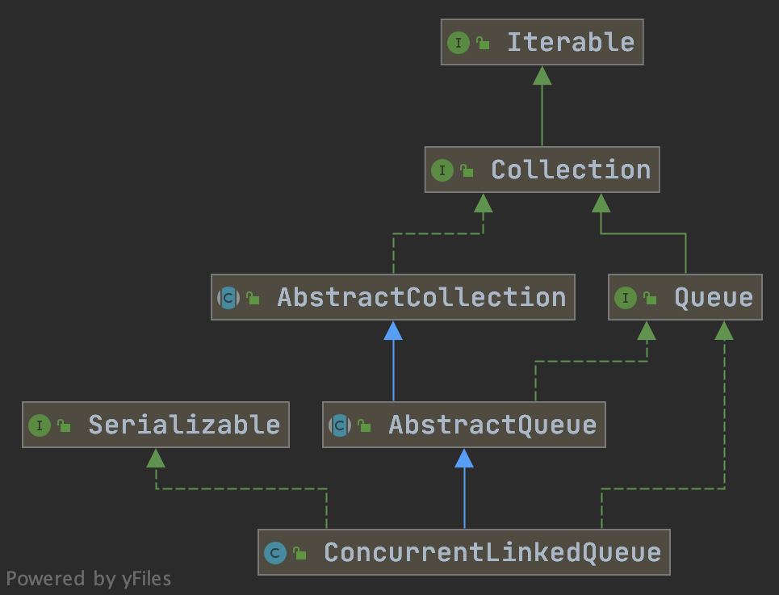
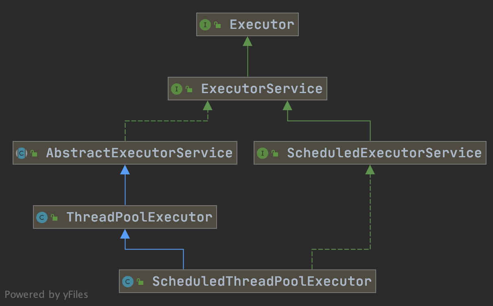
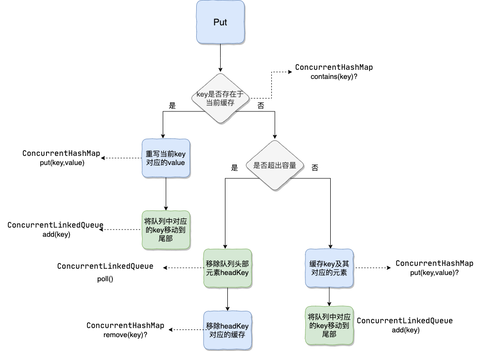

<!-- TOC -->

- [1. LRU 缓存介绍](#1-lru-%e7%bc%93%e5%ad%98%e4%bb%8b%e7%bb%8d)
- [2. ConcurrentLinkedQueue简单介绍](#2-concurrentlinkedqueue%e7%ae%80%e5%8d%95%e4%bb%8b%e7%bb%8d)
- [3. ReadWriteLock简单介绍](#3-readwritelock%e7%ae%80%e5%8d%95%e4%bb%8b%e7%bb%8d)
- [4. ScheduledExecutorService 简单介绍](#4-scheduledexecutorservice-%e7%ae%80%e5%8d%95%e4%bb%8b%e7%bb%8d)
- [5. 徒手撸一个线程安全的 LRU 缓存](#5-%e5%be%92%e6%89%8b%e6%92%b8%e4%b8%80%e4%b8%aa%e7%ba%bf%e7%a8%8b%e5%ae%89%e5%85%a8%e7%9a%84-lru-%e7%bc%93%e5%ad%98)
  - [5.1. 实现方法](#51-%e5%ae%9e%e7%8e%b0%e6%96%b9%e6%b3%95)
  - [5.2. 原理](#52-%e5%8e%9f%e7%90%86)
  - [5.3. put方法具体流程分析](#53-put%e6%96%b9%e6%b3%95%e5%85%b7%e4%bd%93%e6%b5%81%e7%a8%8b%e5%88%86%e6%9e%90)
  - [5.4. 源码](#54-%e6%ba%90%e7%a0%81)
- [6. 实现一个线程安全并且带有过期时间的 LRU 缓存](#6-%e5%ae%9e%e7%8e%b0%e4%b8%80%e4%b8%aa%e7%ba%bf%e7%a8%8b%e5%ae%89%e5%85%a8%e5%b9%b6%e4%b8%94%e5%b8%a6%e6%9c%89%e8%bf%87%e6%9c%9f%e6%97%b6%e9%97%b4%e7%9a%84-lru-%e7%bc%93%e5%ad%98)

<!-- /TOC -->

最近被读者问到“不用LinkedHashMap的话，如何实现一个线程安全的 LRU 缓存？网上的代码太杂太乱，Guide哥哥能不能帮忙写一个？”。

*划重点，手写一个 LRU 缓存在面试中还是挺常见的！*

很多人就会问了：“网上已经有这么多现成的缓存了！为什么面试官还要我们自己实现一个呢？” 。咳咳咳，当然是为了面试需要。哈哈！开个玩笑，我个人觉得更多地是为了学习吧！今天Guide哥教大家：

1. 实现一个线程安全的 LRU 缓存
2. 实现一个线程安全并且带有过期时间的 LRU 缓存

考虑到了线程安全性我们使用了 `ConcurrentHashMap` 、`ConcurrentLinkedQueue` 这两个线程安全的集合。另外，还用到 `ReadWriteLock`（读写锁）。为了实现带有过期时间的缓存，我们用到了 `ScheduledExecutorService`来做定时任务执行。

如果有任何不对或者需要完善的地方，请帮忙指出！

### 1. LRU 缓存介绍

**LRU (Least Recently Used,最近最少使用)是一种缓存淘汰策略。** 

LRU缓存指的是当缓存大小已达到最大分配容量的时候，如果再要去缓存新的对象数据的话，就需要将缓存中最近访问最少的对象删除掉以便给新来的数据腾出空间。

### 2. ConcurrentLinkedQueue简单介绍

**ConcurrentLinkedQueue是一个基于单向链表的无界无锁线程安全的队列，适合在高并发环境下使用，效率比较高。** 我们在使用的时候，可以就把它理解为我们经常接触的数据结构——队列，不过是增加了多线程下的安全性保证罢了。**和普通队列一样，它也是按照先进先出(FIFO)的规则对接点进行排序。** 另外，队列元素中不可以放置null元素。

`ConcurrentLinkedQueue` 整个继承关系如下图所示：



`ConcurrentLinkedQueue中`最主要的两个方法是：`offer(value)`和`poll()`，分别实现队列的两个重要的操作：入队和出队(`offer(value)`等价于 `add(value)`)。

我们添加一个元素到队列的时候，它会添加到队列的尾部，当我们获取一个元素时，它会返回队列头部的元素。


利用`ConcurrentLinkedQueue`队列先进先出的特性，每当我们 `put`/`get`(缓存被使用)元素的时候，我们就将这个元素存放在队列尾部，这样就能保证队列头部的元素是最近最少使用的。

### 3. ReadWriteLock简单介绍

`ReadWriteLock` 是一个接口，位于`java.util.concurrent.locks`包下，里面只有两个方法分别返回读锁和写锁：

```java
public interface ReadWriteLock {
    /**
     * 返回读锁
     */
    Lock readLock();

    /**
     * 返回写锁
     */
    Lock writeLock();
}
```

`ReentrantReadWriteLock` 是`ReadWriteLock`接口的具体实现类。

**读写锁还是比较适合缓存这种读多写少的场景。读写锁可以保证多个线程和同时读取，但是只有一个线程可以写入。**

读写锁的特点是：写锁和写锁互斥，读锁和写锁互斥，读锁之间不互斥。也就说：同一时刻只能有一个线程写，但是可以有多个线程
读。读写之间是互斥的，两者不能同时发生（当进行写操作时，同一时刻其他线程的读操作会被阻塞；当进行读操作时，同一时刻所有线程的写操作会被阻塞）。

另外，**同一个线程持有写锁时是可以申请读锁，但是持有读锁的情况下不可以申请写锁。**

### 4. ScheduledExecutorService 简单介绍

`ScheduledExecutorService` 是一个接口，`ScheduledThreadPoolExecutor` 是其主要实现类。



**`ScheduledThreadPoolExecutor` 主要用来在给定的延迟后运行任务，或者定期执行任务。** 这个在实际项目用到的比较少，因为有其他方案选择比如`quartz`。但是，在一些需求比较简单的场景下还是非常有用的！

**`ScheduledThreadPoolExecutor` 使用的任务队列 `DelayQueue` 封装了一个 `PriorityQueue`，`PriorityQueue` 会对队列中的任务进行排序，执行所需时间短的放在前面先被执行，如果执行所需时间相同则先提交的任务将被先执行。**

### 5. 徒手撸一个线程安全的 LRU 缓存

#### 5.1. 实现方法

 `ConcurrentHashMap` + `ConcurrentLinkedQueue` +`ReadWriteLock`

#### 5.2. 原理

`ConcurrentHashMap` 是线程安全的Map，我们可以利用它缓存 key,value形式的数据。`ConcurrentLinkedQueue`是一个线程安全的基于链表的队列（先进先出），我们可以用它来维护 key 。每当我们put/get(缓存被使用)元素的时候，我们就将这个元素对应的 key 存放在队列尾部，这样就能保证队列头部的元素是最近最少使用的。当我们的缓存容量不够的时候，我们直接移除队列头部对应的key以及这个key对应的缓存即可！

另外，我们用到了`ReadWriteLock`(读写锁)来保证线程安全。

#### 5.3. put方法具体流程分析

为了方便大家理解，我将代码中比较重要的 `put(key,value)`方法的原理图画了出来，如下图所示：




#### 5.4. 源码

```java
/**
 * @author shuang.kou
 * <p>
 * 使用 ConcurrentHashMap+ConcurrentLinkedQueue+ReadWriteLock实现线程安全的 LRU 缓存
 * 这里只是为了学习使用，本地缓存推荐使用 Guava 自带的,使用 Spring 的话，推荐使用Spring Cache
 */
public class MyLruCache<K, V> {

    /**
     * 缓存的最大容量
     */
    private final int maxCapacity;

    private ConcurrentHashMap<K, V> cacheMap;
    private ConcurrentLinkedQueue<K> keys;
    /**
     * 读写锁
     */
    private ReadWriteLock readWriteLock = new ReentrantReadWriteLock();
    private Lock writeLock = readWriteLock.writeLock();
    private Lock readLock = readWriteLock.readLock();

    public MyLruCache(int maxCapacity) {
        if (maxCapacity < 0) {
            throw new IllegalArgumentException("Illegal max capacity: " + maxCapacity);
        }
        this.maxCapacity = maxCapacity;
        cacheMap = new ConcurrentHashMap<>(maxCapacity);
        keys = new ConcurrentLinkedQueue<>();
    }

    public V put(K key, V value) {
        // 加写锁
        writeLock.lock();
        try {
            //1.key是否存在于当前缓存
            if (cacheMap.containsKey(key)) {
                moveToTailOfQueue(key);
                cacheMap.put(key, value);
                return value;
            }
            //2.是否超出缓存容量，超出的话就移除队列头部的元素以及其对应的缓存
            if (cacheMap.size() == maxCapacity) {
                System.out.println("maxCapacity of cache reached");
                removeOldestKey();
            }
            //3.key不存在于当前缓存。将key添加到队列的尾部并且缓存key及其对应的元素
            keys.add(key);
            cacheMap.put(key, value);
            return value;
        } finally {
            writeLock.unlock();
        }
    }

    public V get(K key) {
        //加读锁
        readLock.lock();
        try {
            //key是否存在于当前缓存
            if (cacheMap.containsKey(key)) {
                // 存在的话就将key移动到队列的尾部
                moveToTailOfQueue(key);
                return cacheMap.get(key);
            }
            //不存在于当前缓存中就返回Null
            return null;
        } finally {
            readLock.unlock();
        }
    }

    public V remove(K key) {
        writeLock.lock();
        try {
            //key是否存在于当前缓存
            if (cacheMap.containsKey(key)) {
                // 存在移除队列和Map中对应的Key
                keys.remove(key);
                return cacheMap.remove(key);
            }
            //不存在于当前缓存中就返回Null
            return null;
        } finally {
            writeLock.unlock();
        }
    }

    /**
     * 将元素添加到队列的尾部(put/get的时候执行)
     */
    private void moveToTailOfQueue(K key) {
        keys.remove(key);
        keys.add(key);
    }

    /**
     * 移除队列头部的元素以及其对应的缓存 (缓存容量已满的时候执行)
     */
    private void removeOldestKey() {
        K oldestKey = keys.poll();
        if (oldestKey != null) {
            cacheMap.remove(oldestKey);
        }
    }

    public int size() {
        return cacheMap.size();
    }

}
```

**非并发环境测试：**

```java
MyLruCache<Integer, String> myLruCache = new MyLruCache<>(3);
myLruCache.put(1, "Java");
System.out.println(myLruCache.get(1));// Java
myLruCache.remove(1);
System.out.println(myLruCache.get(1));// null
myLruCache.put(2, "C++");
myLruCache.put(3, "Python");
System.out.println(myLruCache.get(2));//C++
myLruCache.put(4, "C");
myLruCache.put(5, "PHP");
System.out.println(myLruCache.get(2));// C++
```

**并发环境测试：**

我们初始化了一个固定容量为 10 的线程池和count为10的`CountDownLatch`。我们将1000000次操作分10次添加到线程池，然后我们等待线程池执行完成这10次操作。


```java
int threadNum = 10;
int batchSize = 100000;
//init cache
MyLruCache<String, Integer> myLruCache = new MyLruCache<>(batchSize * 10);
//init thread pool with 10 threads
ExecutorService fixedThreadPool = Executors.newFixedThreadPool(threadNum);
//init CountDownLatch with 10 count
CountDownLatch latch = new CountDownLatch(threadNum);
AtomicInteger atomicInteger = new AtomicInteger(0);
long startTime = System.currentTimeMillis();
for (int t = 0; t < threadNum; t++) {
    fixedThreadPool.submit(() -> {
        for (int i = 0; i < batchSize; i++) {
            int value = atomicInteger.incrementAndGet();
            myLruCache.put("id" + value, value);
        }
        latch.countDown();
    });
}
//wait for 10 threads to complete the task
latch.await();
fixedThreadPool.shutdown();
System.out.println("Cache size:" + myLruCache.size());//Cache size:1000000
long endTime = System.currentTimeMillis();
long duration = endTime - startTime;
System.out.println(String.format("Time cost：%dms", duration));//Time cost：511ms
```

### 6. 实现一个线程安全并且带有过期时间的 LRU 缓存

实际上就是在我们上面时间的LRU缓存的基础上加上一个定时任务去删除缓存，单纯利用 JDK 提供的类，我们实现定时任务的方式有很多种：

1. `Timer` :不被推荐，多线程会存在问题。
2. `ScheduledExecutorService` ：定时器线程池，可以用来替代 `Timer`
3. `DelayQueue` ：延时队列
4. `quartz` ：一个很火的开源任务调度框架，很多其他框架都是基于 `quartz` 开发的，比如当当网的`elastic-job `就是基于`quartz`二次开发之后的分布式调度解决方案 
5. ......

最终我们选择了  `ScheduledExecutorService`，主要原因是它易用（基于`DelayQueue`做了很多封装）并且基本能满足我们的大部分需求。

我们在我们上面实现的线程安全的 LRU 缓存基础上，简单稍作修改即可！我们增加了一个方法：

```java
private void removeAfterExpireTime(K key, long expireTime) {
    scheduledExecutorService.schedule(() -> {
        //过期后清除该键值对
        cacheMap.remove(key);
        keys.remove(key);
    }, expireTime, TimeUnit.MILLISECONDS);
}
```
我们put元素的时候，如果通过这个方法就能直接设置过期时间。


**完整源码如下：**

```java
/**
 * @author shuang.kou
 * <p>
 * 使用 ConcurrentHashMap+ConcurrentLinkedQueue+ReadWriteLock+ScheduledExecutorService实现线程安全的 LRU 缓存
 * 这里只是为了学习使用，本地缓存推荐使用 Guava 自带的，使用 Spring 的话，推荐使用Spring Cache
 */
public class MyLruCacheWithExpireTime<K, V> {

    /**
     * 缓存的最大容量
     */
    private final int maxCapacity;

    private ConcurrentHashMap<K, V> cacheMap;
    private ConcurrentLinkedQueue<K> keys;
    /**
     * 读写锁
     */
    private ReadWriteLock readWriteLock = new ReentrantReadWriteLock();
    private Lock writeLock = readWriteLock.writeLock();
    private Lock readLock = readWriteLock.readLock();

    private ScheduledExecutorService scheduledExecutorService;

    public MyLruCacheWithExpireTime(int maxCapacity) {
        if (maxCapacity < 0) {
            throw new IllegalArgumentException("Illegal max capacity: " + maxCapacity);
        }
        this.maxCapacity = maxCapacity;
        cacheMap = new ConcurrentHashMap<>(maxCapacity);
        keys = new ConcurrentLinkedQueue<>();
        scheduledExecutorService = Executors.newScheduledThreadPool(3);
    }

    public V put(K key, V value, long expireTime) {
        // 加写锁
        writeLock.lock();
        try {
            //1.key是否存在于当前缓存
            if (cacheMap.containsKey(key)) {
                moveToTailOfQueue(key);
                cacheMap.put(key, value);
                return value;
            }
            //2.是否超出缓存容量，超出的话就移除队列头部的元素以及其对应的缓存
            if (cacheMap.size() == maxCapacity) {
                System.out.println("maxCapacity of cache reached");
                removeOldestKey();
            }
            //3.key不存在于当前缓存。将key添加到队列的尾部并且缓存key及其对应的元素
            keys.add(key);
            cacheMap.put(key, value);
            if (expireTime > 0) {
                removeAfterExpireTime(key, expireTime);
            }
            return value;
        } finally {
            writeLock.unlock();
        }
    }

    public V get(K key) {
        //加读锁
        readLock.lock();
        try {
            //key是否存在于当前缓存
            if (cacheMap.containsKey(key)) {
                // 存在的话就将key移动到队列的尾部
                moveToTailOfQueue(key);
                return cacheMap.get(key);
            }
            //不存在于当前缓存中就返回Null
            return null;
        } finally {
            readLock.unlock();
        }
    }

    public V remove(K key) {
        writeLock.lock();
        try {
            //key是否存在于当前缓存
            if (cacheMap.containsKey(key)) {
                // 存在移除队列和Map中对应的Key
                keys.remove(key);
                return cacheMap.remove(key);
            }
            //不存在于当前缓存中就返回Null
            return null;
        } finally {
            writeLock.unlock();
        }
    }

    /**
     * 将元素添加到队列的尾部(put/get的时候执行)
     */
    private void moveToTailOfQueue(K key) {
        keys.remove(key);
        keys.add(key);
    }

    /**
     * 移除队列头部的元素以及其对应的缓存 (缓存容量已满的时候执行)
     */
    private void removeOldestKey() {
        K oldestKey = keys.poll();
        if (oldestKey != null) {
            cacheMap.remove(oldestKey);
        }
    }

    private void removeAfterExpireTime(K key, long expireTime) {
        scheduledExecutorService.schedule(() -> {
            //过期后清除该键值对
            cacheMap.remove(key);
            keys.remove(key);
        }, expireTime, TimeUnit.MILLISECONDS);
    }

    public int size() {
        return cacheMap.size();
    }

}

```

**测试效果：**

```java
MyLruCacheWithExpireTime<Integer,String> myLruCache = new MyLruCacheWithExpireTime<>(3);
myLruCache.put(1,"Java",3000);
myLruCache.put(2,"C++",3000);
myLruCache.put(3,"Python",1500);
System.out.println(myLruCache.size());//3
Thread.sleep(2000);
System.out.println(myLruCache.size());//2
```
