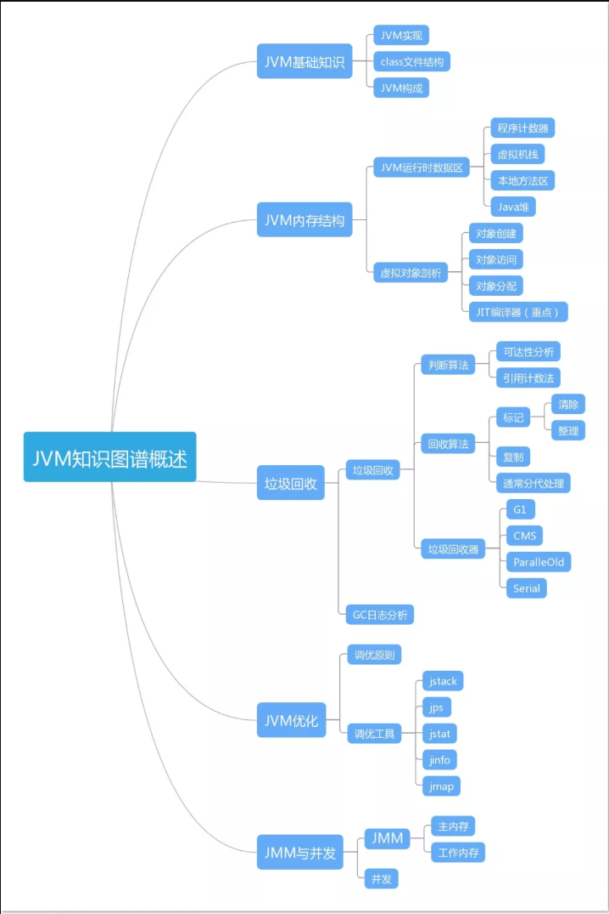

无论什么级别的Java从业者，JVM都是进阶时必须迈过的坎。不管是工作还是面试中，JVM都是必考题。如果不懂JVM的话，薪酬会非常吃亏（近70%的面试者挂在JVM上了）。

掌握了JVM机制，就等于学会了深层次解决问题的方法。对于Java开发者而言，只有熟悉底层虚拟机的运行机制，才能通过JVM日志深入到字节码的层次去分析排查问题，发现隐性的系统缺陷，进而提升系统性能。

一些技术人员开发工具用得很熟练，触及JVM问题时却是模棱两可，甚至连内存模型和内存区域，HotSpot和JVM规范，都混淆不清。工作很长时间，在生产时还在用缺省参数来直接启动，以致系统运行时出现性能、稳定性等问题时束手无措，不知该如何追踪排查。久而久之，这对自己的职业成长是极为不利的。

掌握JVM，是深入Java技术栈的必经之路。

