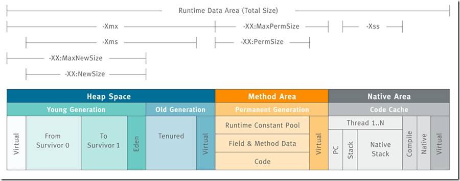

> 本文由 JavaGuide 翻译自 [https://www.baeldung.com/jvm-parameters](https://www.baeldung.com/jvm-parameters)，并对文章进行了大量的完善补充。
> 文档参数 [https://docs.oracle.com/javase/8/docs/technotes/tools/unix/java.html](https://docs.oracle.com/javase/8/docs/technotes/tools/unix/java.html)
>
> JDK 版本：1.8 为主，也会补充新版本常用参数

在本篇文章中，我们将一起掌握 Java 虚拟机（JVM）中最常用的一些参数配置，帮助你更好地理解和调优 Java 应用的运行环境。

## 堆内存相关

> Java 堆（Java Heap）是 JVM 所管理的内存中最大的一块区域，**所有线程共享**，在虚拟机启动时创建。**此内存区域的唯一目的就是存放对象实例，几乎所有的对象实例以及数组都要在堆上分配内存。**



### 设置堆内存大小 (-Xms 和 -Xmx)

根据应用程序的实际需求设置初始和最大堆内存大小，是性能调优中最常见的实践之一。**推荐显式设置这两个参数，并且通常建议将它们设置为相同的值**，以避免运行时堆内存的动态调整带来的性能开销。

使用以下参数进行设置：

```bash
-Xms<heap size>[unit]  # 设置 JVM 初始堆大小
-Xmx<heap size>[unit]  # 设置 JVM 最大堆大小
```

- `<heap size>`: 指定内存的具体数值。
- `[unit]`: 指定内存的单位，如 g (GB)、m (MB)、k (KB)。

**示例：** 将 JVM 的初始堆和最大堆都设置为 4GB：

```bash
-Xms4G -Xmx4G
```

### 设置新生代内存大小 (Young Generation)

根据[Oracle 官方文档](https://docs.oracle.com/javase/8/docs/technotes/guides/vm/gctuning/sizing.html)，在堆总可用内存配置完成之后，第二大影响因素是为 `Young Generation` 在堆内存所占的比例。默认情况下，YG 的最小大小为 **1310 MB**，最大大小为 **无限制**。

可以通过以下两种方式设置新生代内存大小：

**1.通过`-XX:NewSize`和`-XX:MaxNewSize`指定**

```bash
-XX:NewSize=<young size>[unit]    # 设置新生代初始大小
-XX:MaxNewSize=<young size>[unit] # 设置新生代最大大小
```

**示例：** 设置新生代最小 512MB，最大 1024MB：

```bash
-XX:NewSize=512m -XX:MaxNewSize=1024m
```

**2.通过`-Xmn<young size>[unit]`指定**

**示例：** 将新生代大小固定为 512MB：

```bash
-Xmn512m
```

GC 调优策略中很重要的一条经验总结是这样说的：

> 尽量让新创建的对象在新生代分配内存并被回收，因为 Minor GC 的成本通常远低于 Full GC。通过分析 GC 日志，判断新生代空间分配是否合理。如果大量新对象过早进入老年代（Promotion），可以适当通过 `-Xmn` 或 -`XX:NewSize/-XX:MaxNewSize` 调整新生代大小，目标是最大限度地减少对象直接进入老年代的情况。

另外，你还可以通过 **`-XX:NewRatio=<int>`** 参数来设置**老年代与新生代（不含 Survivor 区）的内存大小比例**。

例如，`-XX:NewRatio=2` （默认值）表示老年代 : 新生代 = 2 : 1。即新生代占整个堆大小的 1/3。

```bash
-XX:NewRatio=2
```

### 设置永久代/元空间大小 (PermGen/Metaspace)

**从 Java 8 开始，如果我们没有指定 Metaspace 的大小，随着更多类的创建，虚拟机会耗尽所有可用的系统内存（永久代并不会出现这种情况）。**

JDK 1.8 之前永久代还没被彻底移除的时候通常通过下面这些参数来调节方法区大小

```bash
-XX:PermSize=N #方法区 (永久代) 初始大小
-XX:MaxPermSize=N #方法区 (永久代) 最大大小,超过这个值将会抛出 OutOfMemoryError 异常:java.lang.OutOfMemoryError: PermGen
```

相对而言，垃圾收集行为在这个区域是比较少出现的，但并非数据进入方法区后就“永久存在”了。

**JDK 1.8 的时候，方法区（HotSpot 的永久代）被彻底移除了（JDK1.7 就已经开始了），取而代之是元空间，元空间使用的是本地内存。**

下面是一些常用参数：

```bash
-XX:MetaspaceSize=N #设置 Metaspace 的初始大小（是一个常见的误区，后面会解释）
-XX:MaxMetaspaceSize=N #设置 Metaspace 的最大大小
```

**🐛 修正（参见：[issue#1947](https://github.com/Snailclimb/JavaGuide/issues/1947)）**：

**1、`-XX:MetaspaceSize` 并非初始容量：** Metaspace 的初始容量并不是 `-XX:MetaspaceSize` 设置，无论 `-XX:MetaspaceSize` 配置什么值，对于 64 位 JVM，元空间的初始容量通常是一个固定的较小值（Oracle 文档提到约 12MB 到 20MB 之间，实际观察约 20.8MB）。

可以参考 Oracle 官方文档 [Other Considerations](https://docs.oracle.com/javase/8/docs/technotes/guides/vm/gctuning/considerations.html) 中提到的：

> Specify a higher value for the option MetaspaceSize to avoid early garbage collections induced for class metadata. The amount of class metadata allocated for an application is application-dependent and general guidelines do not exist for the selection of MetaspaceSize. The default size of MetaspaceSize is platform-dependent and ranges from 12 MB to about 20 MB.
>
> MetaspaceSize 的默认大小取决于平台，范围从 12 MB 到大约 20 MB。

另外，还可以看一下这个试验：[JVM 参数 MetaspaceSize 的误解](https://mp.weixin.qq.com/s/jqfppqqd98DfAJHZhFbmxA)。

**2、扩容与 Full GC：** 当 Metaspace 的使用量增长并首次达到`-XX:MetaspaceSize` 指定的阈值时，会触发一次 Full GC。在此之后，JVM 会动态调整这个触发 GC 的阈值。如果元空间继续增长，每次达到新的阈值需要扩容时，仍然可能触发 Full GC（具体行为与垃圾收集器和版本有关）。垃圾搜集器内部是根据变量 `_capacity_until_GC`来判断 Metaspace 区域是否达到阈值的，初始化代码如下所示：

```c
void MetaspaceGC::initialize() {
  // Set the high-water mark to MaxMetapaceSize during VM initialization since
  // we can't do a GC during initialization.
  _capacity_until_GC = MaxMetaspaceSize;
}
```

**3、`-XX:MaxMetaspaceSize` 的重要性：**如果不显式设置 -`XX:MaxMetaspaceSize`，元空间的最大大小理论上受限于可用的本地内存。在极端情况下（如类加载器泄漏导致不断加载类），这确实**可能耗尽大量本地内存**。因此，**强烈建议设置一个合理的 `-XX:MaxMetaspaceSize` 上限**，以防止对系统造成影响。

相关阅读：[issue 更正：MaxMetaspaceSize 如果不指定大小的话，不会耗尽内存 #1204](https://github.com/Snailclimb/JavaGuide/issues/1204) 。

## 垃圾收集相关

### 选择垃圾回收器

选择合适的垃圾收集器（Garbage Collector, GC）对于应用的吞吐量和响应延迟至关重要。关于垃圾收集算法和收集器的详细介绍，可以看笔者写的这篇：[JVM 垃圾回收详解（重点）](https://javaguide.cn/java/jvm/jvm-garbage-collection.html)。

JVM 提供了多种 GC 实现，适用于不同的场景：

- **Serial GC (串行垃圾收集器):** 单线程执行 GC，适用于客户端模式或单核 CPU 环境。参数：`-XX:+UseSerialGC`。
- **Parallel GC (并行垃圾收集器):** 多线程执行新生代 GC (Minor GC)，以及可选的多线程执行老年代 GC (Full GC，通过 `-XX:+UseParallelOldGC`)。关注吞吐量，是 JDK 8 的默认 GC。参数：`-XX:+UseParallelGC`。
- **CMS GC (Concurrent Mark Sweep 并发标记清除收集器):** 以获取最短回收停顿时间为目标，大部分 GC 阶段可与用户线程并发执行。适用于对响应时间要求高的应用。在 JDK 9 中被标记为弃用，JDK 14 中被移除。参数：`-XX:+UseConcMarkSweepGC`。
- **G1 GC (Garbage-First Garbage Collector):** JDK 9 及之后版本的默认 GC。将堆划分为多个 Region，兼顾吞吐量和停顿时间，试图在可预测的停顿时间内完成 GC。参数：`-XX:+UseG1GC`。
- **ZGC:** 更新的低延迟 GC，目标是将 GC 停顿时间控制在几毫秒甚至亚毫秒级别，需要较新版本的 JDK 支持。参数（具体参数可能随版本变化）：`-XX:+UseZGC`、`-XX:+UseShenandoahGC`。

### GC 日志记录

在生产环境或进行 GC 问题排查时，**务必开启 GC 日志记录**。详细的 GC 日志是分析和解决 GC 问题的关键依据。

以下是一些推荐配置的 GC 日志参数（适用于 JDK 8/11 等常见版本）：

```bash
# --- 推荐的基础配置 ---
# 打印详细 GC 信息
-XX:+PrintGCDetails
# 打印 GC 发生的时间戳 (相对于 JVM 启动时间)
# -XX:+PrintGCTimeStamps
# 打印 GC 发生的日期和时间 (更常用)
-XX:+PrintGCDateStamps
# 指定 GC 日志文件的输出路径，%t 可以输出日期时间戳
-Xloggc:/path/to/gc-%t.log

# --- 推荐的进阶配置 ---
# 打印对象年龄分布 (有助于判断对象晋升老年代的情况)
-XX:+PrintTenuringDistribution
# 在 GC 前后打印堆信息
-XX:+PrintHeapAtGC
# 打印各种类型引用 (强/软/弱/虚) 的处理信息
-XX:+PrintReferenceGC
# 打印应用暂停时间 (Stop-The-World, STW)
-XX:+PrintGCApplicationStoppedTime

# --- GC 日志文件滚动配置 ---
# 启用 GC 日志文件滚动
-XX:+UseGCLogFileRotation
# 设置滚动日志文件的数量 (例如，保留最近 14 个)
-XX:NumberOfGCLogFiles=14
# 设置每个日志文件的最大大小 (例如，50MB)
-XX:GCLogFileSize=50M

# --- 可选的辅助诊断配置 ---
# 打印安全点 (Safepoint) 统计信息 (有助于分析 STW 原因)
# -XX:+PrintSafepointStatistics
# -XX:PrintSafepointStatisticsCount=1
```

**注意:** JDK 9 及之后版本引入了统一的 JVM 日志框架 (`-Xlog`)，配置方式有所不同，但上述 `-Xloggc` 和滚动参数通常仍然兼容或有对应的新参数。

## 处理 OOM

对于大型应用程序来说，面对内存不足错误是非常常见的，这反过来会导致应用程序崩溃。这是一个非常关键的场景，很难通过复制来解决这个问题。

这就是为什么 JVM 提供了一些参数，这些参数将堆内存转储到一个物理文件中，以后可以用来查找泄漏:

```bash
# 在发生 OOM 时生成堆转储文件
-XX:+HeapDumpOnOutOfMemoryError

# 指定堆转储文件的输出路径。<pid> 会被替换为进程 ID
-XX:HeapDumpPath=/path/to/heapdump/java_pid<pid>.hprof
# 示例：-XX:HeapDumpPath=/data/dumps/

# (可选) 在发生 OOM 时执行指定的命令或脚本
# 例如，发送告警通知或尝试重启服务（需谨慎使用）
# -XX:OnOutOfMemoryError="<command> <args>"
# 示例：-XX:OnOutOfMemoryError="sh /path/to/notify.sh"

# (可选) 启用 GC 开销限制检查
# 如果 GC 时间占总时间比例过高（默认 98%）且回收效果甚微（默认小于 2% 堆内存），
# 会提前抛出 OOM，防止应用长时间卡死在 GC 中。
-XX:+UseGCOverheadLimit
```

## 其他常用参数

- `-server`: 明确启用 Server 模式的 HotSpot VM。（在 64 位 JVM 上通常是默认值）。
- `-XX:+UseStringDeduplication`: (JDK 8u20+) 尝试识别并共享底层 `char[]` 数组相同的 String 对象，以减少内存占用。适用于存在大量重复字符串的场景。
- `-XX:SurvivorRatio=<ratio>`: 设置 Eden 区与单个 Survivor 区的大小比例。例如 `-XX:SurvivorRatio=8` 表示 Eden:Survivor = 8:1。
- `-XX:MaxTenuringThreshold=<threshold>`: 设置对象从新生代晋升到老年代的最大年龄阈值（对象每经历一次 Minor GC 且存活，年龄加 1）。默认值通常是 15。
- `-XX:+DisableExplicitGC`: 禁止代码中显式调用 `System.gc()`。推荐开启，避免人为触发不必要的 Full GC。
- `-XX:+UseLargePages`: (需要操作系统支持) 尝试使用大内存页（如 2MB 而非 4KB），可能提升内存密集型应用的性能，但需谨慎测试。
- -`XX:MinHeapFreeRatio=<percent> / -XX:MaxHeapFreeRatio=<percent>`: 控制 GC 后堆内存保持空闲的最小/最大百分比，用于动态调整堆大小（如果 `-Xms` 和 `-Xmx` 不相等）。通常建议将 `-Xms` 和 `-Xmx` 设为一致，避免调整开销。

**注意：** 以下参数在现代 JVM 版本中可能已**弃用、移除或默认开启且无需手动设置**：

- `-XX:+UseLWPSynchronization`: 较旧的同步策略选项，现代 JVM 通常有更优化的实现。
- `-XX:LargePageSizeInBytes`: 通常由 `-XX:+UseLargePages` 自动确定或通过 OS 配置。
- `-XX:+UseStringCache`: 已被移除。
- `-XX:+UseCompressedStrings`: 已被 Java 9 及之后默认开启的 Compact Strings 特性取代。
- `-XX:+OptimizeStringConcat`: 字符串连接优化（invokedynamic）在 Java 9 及之后是默认行为。

## 总结

本文为 Java 开发者提供了一份实用的 JVM 常用参数配置指南，旨在帮助读者理解和优化 Java 应用的性能与稳定性。文章重点强调了以下几个方面：

1. **堆内存配置：** 建议显式设置初始与最大堆内存 (`-Xms`, -`Xmx`，通常设为一致) 和新生代大小 (`-Xmn` 或 `-XX:NewSize/-XX:MaxNewSize`)，这对 GC 性能至关重要。
2. **元空间管理 (Java 8+)：** 澄清了 `-XX:MetaspaceSize` 的实际作用（首次触发 Full GC 的阈值，而非初始容量），并强烈建议设置 `-XX:MaxMetaspaceSize` 以防止潜在的本地内存耗尽。
3. **垃圾收集器选择与日志：**介绍了不同 GC 算法的适用场景，并强调在生产和测试环境中开启详细 GC 日志 (`-Xloggc`, `-XX:+PrintGCDetails` 等) 对于问题排查的必要性。
4. **OOM 故障排查：** 说明了如何通过 `-XX:+HeapDumpOnOutOfMemoryError` 等参数在发生 OOM 时自动生成堆转储文件，以便进行后续的内存泄漏分析。
5. **其他参数：** 简要介绍了如字符串去重等其他有用参数，并指出了部分旧参数的现状。

具体的问题排查和调优案例，可以参考笔者整理的这篇文章：[JVM 线上问题排查和性能调优案例](https://javaguide.cn/java/jvm/jvm-in-action.html)。

<!-- @include: @article-footer.snippet.md -->
