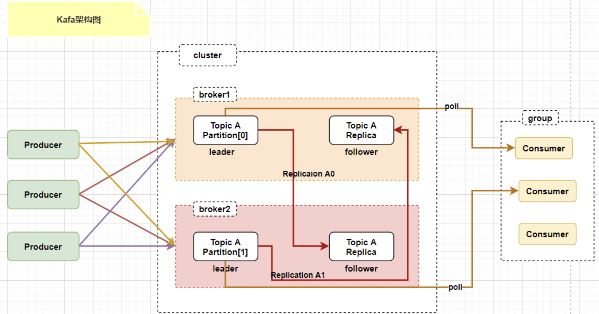

## 什么是Kafka？

**KafKa**是一个**分布式**的基于**发布/订阅模式**的消息队列，主要应用于大数据实时处理领域。Kafka由**服务端**和**客户端**组成，通过高性能的TCP网络协议进行通信。它可以部署在本地和云环境中的裸机硬件、虚拟机和容器上。

+ 服务端：Kafka作为一个或多个服务器集群运行，其中，部分服务器构成了存储层（Brokers）。其他服务器作为[Kafka Connect](https://kafka.apache.org/documentation/#connect)，以事件流的形式持续导入和导出数据。同时，Kafka集群具有高度的**可扩展性**和**容错性**：如果其中任何一台服务器出现故障，其他服务器将接管其工作，以确保其保持持续运行状态。
+ 客户端：提供接口编写分布式和微服务程序，以并行、大规模和容错的方式读取、写入和处理事件流。

## Kafka的使用背景？为什么要使用Kafka？

这道题可以理解为为什么要使用消息队列？ （消息队列的作用？优点？）

+ **缓冲和削峰**：消息队列在应对类似双十一这样的突发高流量场景中发挥着关键的作用，它可以被视为一个非常有效的**缓冲**和**削峰**机制。考虑以下情形：当突然涌入大量订单请求时，下游的处理服务器可能不具备足够的计算资源来立即处理这些请求。直接将这些请求传递给下游服务器可能导致其超负荷运行，甚至崩溃。消息队列通过将这些突发的订单流量缓存到消息队列中，允许订单处理端按照其自身的处理能力逐一从消息队列中提取订单并进行处理。这种方式有效地平滑了流量高峰，确保了系统的稳定性。因此，消息队列在这里扮演了一个关键的角色，既能够充当缓冲，将请求暂时保存在队列中，又能够削减流量高峰，防止直接冲击到下游服务器，从而实现了系统的平稳运行。
+ **解耦和扩展性**：在项目开发中，由于需求的不确定性，消息队列充当了一个关键的接口层，通过将关键的业务流程解耦。这种解耦使得在后续业务需要扩展时，只需遵循约定并进行数据编程，就能轻松实现所需的扩展能力。
+ **异步通信**：消息队列提供了一种强大的机制，允许用户将消息放入队列中，而无需立即处理它们。这种异步处理方式可以显著提高业务处理速度，例如在需要发送短信验证码的用户注册等场景中，业务主线程可以将发送短信验证码的任务放入消息队列，然后继续处理其他业务，而无需等待短信发送完成。这种机制极大地提高了系统的效率和响应性。
+ **可恢复性**：即使一个处理消息的进程挂掉，加入队列中的消息仍然可以在系统恢复后被处理。

## Kafka的使用场景

+ **日志收集**:一个公司可以用 Kafka 可以收集各种服务的 log，通过 Kafka 以统一接口服务的方式开放给各种 consumer。也就是在系统各个运行的位置将日志输送到一个统一的地方进行保存和处理。
+ **消息系统**：将业务进行解耦合，分成消息的生产者和消费者，实现异步通信、可恢复、解耦和缓冲与削峰。
+ **用户行为跟踪**：Kafka 经常被用来记录web用户或者 app 用户的各种活动，如浏览网页、搜索、点击等活动，这些活动信息被各个服务器发布到 kafka 的 Topic 中，然后订阅者通过订阅这些topic来做实时的监控分析，或者装载到 Hadoop、数据仓库中做离线分析和挖掘。

​	

## Kafka架构

+ **Producer**(生产者):生产者可以将数据发布到所选择的topic（主题）中。生产者负责将记录分配到topic的指定分区（partition）中，这里可以使用多个partition循环发送来实现多个server负载均衡。
+ **Consumer**（消费者）： 消息消费者，从 Kafka Broker 取消息的客户端。
+ **Broker**：Broker是kafka的服务节点，一个Broker就是一个服务节点，即Kafka服务器。一个broker可以容纳多个topic。broker可以看作事消息的代理，Producers往Brokers里面指定的Topic写消息，Consumers从Brokers里面拉取指定的消息，然后进行业务处理，broker在中间起到一个代理保存消息的中转站。
+ **Topic**（主题）：可以理解为一个队列，一个 Topic 又分为一个或多个分区。

+ **Partition**（分区）：Topic 是一个逻辑的概念，它可以细分为多个分区，每个分区只属于单个主题。 同一个主题下不同分区包含的消息是不同的，分区在存储层面可以看作一个可追加的日志（Log）文件，消息在被追加到分区日志文件的时候都会分配一个特定的偏移量（Offset）。

+ **Offset**（偏移量）：是消息在分区中的唯一标识，Kafka 通过它来保证消息在分区内的顺序性，不过 Offset 并不跨越分区，也就是说，Kafka 保证的是分区有序性而不是主题有序性，即局部有序。

+ **Replication** （副本）：是 Kafka 保证数据高可用的方式，Kafka 同一 Partition 的数据可以在多 Broker 上存在多个副本，通常只有主副本对外提供读写服务，当主副本所在 Broker 崩溃或发生网络一场，Kafka 会在 Controller 的管理下会重新选择新的 Leader 副本对外提供读写服务。

+ **Record** ：实际写入 Kafka 中并可以被读取的消息记录。每个 Record 包含了 key、value 和 timestamp。
+ **Consumer Group：** 消费者组（CG），消费者组内每个消费者负责消费不同分区的数据，提高消费能力。一个分区只能由组内一个消费者消费，消费者组之间互不影响。所有的消费者都属于某个消费者组，即消费者组是逻辑上的一个订阅者。

## Kafka为什么要分区？Kafka分区的目的？

+ **提供并行处理能力**：通过将消息分散到多个分区，Kafka可以实现消息的并行处理。消费者可以独立地从不同的分区中读取消息，从而提高整体的处理能力。
+ **提高可靠性和可伸缩性**：Kafka通过复制机制实现数据的可靠性和冗余存储，每个分区可以配置多个副本，这些副本分布在不同的Broker节点上，当一个副本不可用时，可以使用其他副本来继续提供服务。同时，通过增加分区的数量，可以增加整个系统的处理能力、存储容量和实现负载均衡，提高并发度，提高效率。

## Kafka如何实现消息有序性？

kafka中每一个partition中的消息在写入的时候都是有序的，而且单独一个partition只能由一个消费者去消费，可以在里面保证消息的顺序性，但是分区之间的额消息是不保证有序的。总结就是：kafka只保证了单个partition的有序性，并没有保证多个partition的有序性，因为如果需要保证多个partition的有序性，那么整个kafka就退化成了单一队列，毫无并发性可言了。

**那如果需要保证全局的有序性怎么办呢？**

1. 创建一个Topic，只创建一个Partition，这样就不会存在多个partition，也自然是全局有序的了。
2. 生产者发送消息的时候发送到指定的partition。

## Kafka为什么这么快？

kafka会把接收到的信息都写入硬盘中来保证消息的不丢失。为了优化写入速度，Kafka采用了顺序写入和MMFile两个技术。

**写入数据**

1. 顺序写入：因为硬盘是机械结构，每次读写都会寻址->写入，其中寻址是一个“机械动作”，它是最耗时的。所以硬盘最讨厌随机I/O，最喜欢顺序I/O。为了提高读写硬盘的速度，Kafka就是使用顺序I/O。

2. MMFile：即使是顺序写入，硬盘的访问速度还是与内存速度有较大的差距。因此，Kafka并不是实时写入硬盘的，它还利用了操作系统的分页存储来利用内存提高I/O效率。

	> Memory Mapped Files(后面简称mmap)也被翻译成 内存映射文件 ，在64位操作系统中一般可以表示20G的数据文件，它的工作原理是直接利用操作系统的Page来实现文件到物理内存的直接映射。完成映射之后你对物理内存的操作会被同步到硬盘上（操作系统在适当的时候）。

**读取数据**

1. 基于sendfile实现**零拷贝**，减少拷贝次数。

	> 零拷贝是指计算机执行IO操作时，CPU不需要将数据从一个存储区域复制到另一个存储区域，从而可以减少上下文切换以及CPU的拷贝时间。它是一种`I/O`操作优化技术。(减少用户态与内核态之间的数据复制次数)

	>sendfile具体流程如下：
	>
	>1. sendfile系统调用，文件数据被copy至内核缓冲区
	>2. 从内核缓冲区copy至内核中socket相关的缓冲区
	>3. socket相关的缓冲区copy到协议引擎

2. 批量压缩：它把所有的消息都变成一个批量的文件，并且进行合理的批量压缩，减少网络IO损耗。Producer使用GZIP或者Snappy格式对消息几个进行压缩，压缩的好处就是减少传输的数据量，减轻对网络传输的压力。

**文件分段**

kafka 的队列topic被分为了多个区partition，每个partition又分为多个段segment，所以一个队列中的消息实际上是保存在N多个片段文件中。通过分段的方式，每次文件操作都是对一个小文件的操作，非常轻便，同时也增加了并行处理能力。

**批量发送**

Kafka 允许进行批量发送消息，先将消息缓存在内存中，然后一次请求批量发送出去，比如可以指定缓存的消息达到某个量的时候就发出去，或者缓存了固定的时间后就发送出去，如100条消息就发送，或者每5秒发送一次，这种策略将大大减少服务端的I/O次数。

## Kafka中的消息是否会丢失和重复消费？

Kafka在**生产端**发送消息和**消费端**消费消息时都可能会**丢失**一些消息。

### Producer消息丢失

生产者在发送消息时，会有一个ack机制，当acks=0或者acks=1时，都可能会丢失消息。

> 背景知识：Producer发送消息时，是直接与Broker中的Leader Partition进行交互的，然后其他的副本再从Leader Partition中进行数据的同步。因此，在发送消息的时候，Producer只需要找到对应Topic的Leader Partition进行消息发送即可。
>
> 消息发送的流程：
>
> 1. 将消息发送到对应Topic下的Leader Partition
> 2. Leader Partition收到消息，并将消息写入Page Cache，定时刷盘进行持久化（顺序写入磁盘）。
> 3. Foller Partition 拉取Leader Partition的消息并同Leader Partition的数据保持一致，待消息拉取完毕后再给Leader Partition回复ack确认消息。
> 4. 待Leader与Foller 同步完数据并收到所有ISR中的Replica副本的ack后，Leader Partition会给Producer回复ack确认消息。

Producer端为了提升发送效率，减少I/O操作，发送数据的时候是将多个请求合并成一个个RecordBatch，并将其转换成为Request请求**异步**将数据发送出去（或者按时间间隔方式，每隔一定的时间自动发送出去），因此，Producer端消息丢失更多是因为消息根本没有发送到Kafka Broker端。

因此，**导致Producer端消息没有成功发送有以下原因**：

1. 网络原因：由于网络原因，数据根本没有到达Broker端。
2. 数据原因：消息太大，超出Broker承受的范围，导致Broker拒收消息。

**Producer消息确认机制**

Producer端配置了消息确认机制来确认消息是否生产成功，使用ack确认机制。

1. asks=0:只要发送就自认为成功，并不进行消息接收成功的ack确认。
	1. 不能保证消息是否发送成功。
	2. 生产环境完全不可用。
2. acks=1:当Leader Partition接收成功时进行ack确认，确认后表示成功；
	1. 只要Leader Partition存活就可以保证不丢失，保证了吞吐量。
	2. 生产环境中如果需要保证吞吐量可以用这个。
3. acks=-1或者all：所有Leader Partition和Foller Partition（ISR）都接收成功时进行ack确认，确认后表示成功。
	1. 保证消息不丢失，但是吞吐量低。
	2. 生产环境要求数据不能丢失可以采用该方式。

### Broker端丢失场景

Broker接收到数据后，会将数据进行持久化存储到磁盘，为了提高吞吐量和性能，采用的是**异步批量刷盘的策略**，也就是说按照一定的消息量和时间间隔进行刷盘（这一点和mysql、redis很像）。首先，数据会背存储到**PageCache**中，至于什么时候将 Cache 中的数据刷盘是由「**操作系统**」根据自己的策略决定或者调用 fsync 命令进行强制刷盘，如果此时 Broker 宕机 Crash 掉，且选举了一个落后 Leader Partition 很多的 Follower Partition 成为新的 Leader Partition，那么落后的消息数据就会丢失。既然Broker是异步刷盘的，那么数据就有可能会丢失（比如刷盘之前操作系统崩了）。（并且Kafka中没有提供**同步刷盘**机制。）

虽然，Kafka 通过「**多 Partition （分区）多 Replica（副本）机制」**已经可以最大限度的保证数据不丢失，但是当数据已经写入 PageCache 中但是还没来得及刷写到磁盘，此时如果所在 Broker 突然宕机挂掉或者停电，极端情况还是会造成数据丢失。

### Consumer端丢失场景剖析

> Consumer通过Pull模式主动的去Kafka集群中拉消息
>
> 1. 在消息拉取的过程中，有个消费者组的概念，多个 Consumer 可以组成一个消费者组即 Consumer Group，每个消费者组都有一个Group-Id。同一个 Consumer Group 中的 Consumer 可以消费同一个 Topic 下不同分区的数据，但是不会出现多个 Consumer 去消费同一个分区的数据。
> 2. 拉取到消息后进行业务逻辑处理，待处理完成后，会进行 ACK 确认，即提交 Offset 消费位移进度记录。
> 3. 最后 Offset 会被保存到 Kafka Broker 集群中的 **__consumer_offsets** 这个 Topic 中，且每个 Consumer 保存自己的 Offset 进度。

Consumer端丢失消息主要体现在**消费端offset的自动提交**，如果开启了自动提交，万一消费到数据还没处理完，此时consumer直接宕机，未处理完的数据丢失了，下次也消费不到了，因为offset已经提交完毕，下次会从offset处开始消费新消息。（这种丢失情况的解决方法是**采用消费端的手动提交**）

### 消息重复消费

**生产端消息重复发送**

生产端发送一条消息，但是未得到broker的ack，生产端又重新发了一条消息。这个时候两条消息都被broker接收到了，消费端从broker拉取消息时就会造成重复消费。

> kafka新版本已经在broker中保证了接收消息的幂等性（比如2.4版本），只需在生产者加上参数 props.put(“enable.idempotence”, true) 即可，默认是false不开启。
>
> 新版本解决方案是：producer发送消息时，加上PID和Sequence Number，PID是Producer的唯一ID，Sequence Number是数据的序列号。
>
> broker接收到消息的时候就会检查有没有收到过这个消息（根据PID和Sequence Number）。

**消费端消息重复消费**

消费端拉取一部分数据，消费完成之后，提交offset之前挂掉了，此时offset未提交，当前消息就会被重复消费。

解决办法：添加分布式锁，在offset提交之后再删key，这样就保证了同一个消息只会被消费一次。

## Kafka顺序消息

Kakfa如果需要保证消息的顺序性则需要牺牲一定的性能。具体的顺序方式就是使用单一的消费者，由一个消费者消费可以保证消息消费的顺序性，但是消息发送的顺序性还是无法保证，（因为消息发送端有重传机制，如果一次性发送两条消息，前一条消息发送失败，引发重传，就会导致消息发送乱序）。此时如果需要保证发送和接收的顺序，那就使用发送的ack机制，确认发送成功之后再发送下一条消息，并且只能有一个Partition。但是这种方式会导致kafka性能低下。

**高效的解决方式**

类似于tcp发送的方式，给每一个消息添加一个序号，然后消费端每次拉取全部消息，拉取回来之后再排序，根据排序之后的数据进行处理。

## Kafka与其它MQ之间的区别？为什么选择使用Kafka？

**kafka相对于rocketMQ、rabbitMQ来说，与它们最大的区别就是分布式存储，这也是kafka高性能的最主要原因**。使用分布式存储理念，一个主题下多个分区，同时可以被多个消费者和生产者去使用，也增加了接受消息和消费消息的能力！

## 参考

+ Kafka官方文档：https://kafka.apache.org/documentation
+ Kafka 设计架构原理详细解析：https://blog.csdn.net/qq_32828253/article/details/110732652
+ Kafka为什么这么快：https://zhuanlan.zhihu.com/p/147054382
+ Kafka如何保证消息不丢失：https://zhuanlan.zhihu.com/p/459610418
+ kafka专题：kafka的消息丢失、重复消费、消息积压等线上问题汇总及优化：https://blog.csdn.net/qq_45076180/article/details/111561984