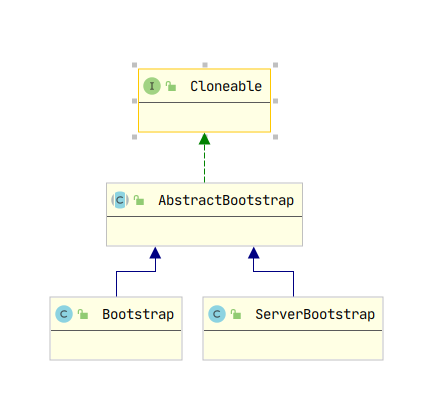
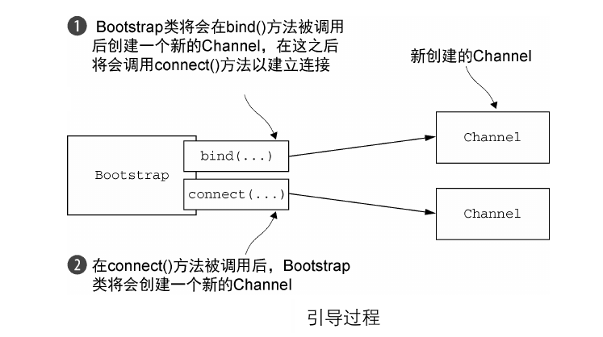
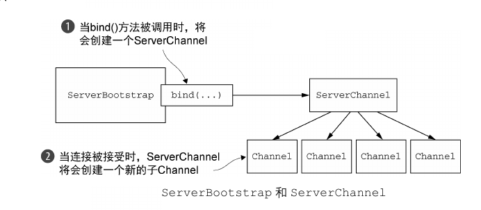

<!-- TOC -->

   * [Bootstrap引导](#bootstrap引导)
      * [Bootstrap类](#bootstrap类)
         * [引导客户端和无连接协议](#引导客户端和无连接协议)
         * [引导服务端](#引导服务端)

<!--/ TOC -->

# Bootstrap引导
在了解ChanelPipeline，EventLoop等组件之后，我们需要将这些组件组织起来，使其成为一个可运行的应用程序。
这里就需要引导这些组件了。


## Bootstrap类
引导类的层次结构包括一个抽象的父类和两个具体的引导子类：



ServerBootstrap总是需要一个ServerSocketChannel来处理客户端的连接通信，而
Bootstrap则只需要一个普通的Channel用于与服务端的通信。

下面是AbstractBootstrap的主要方法：

|       方法         |         描述          |
|      :---        |        :---          |
|     group         |      设置用语处理所有事件的EventLoopGroup |
|    channel        |      指定服务端或客户端的Channel |
|    channelFactory |      如果引导没有指定Channel，那么可以指定ChannelFactory来创建Channel   |
|   localAddress    |      指定Channel需要绑定的本地地址，如果不指定，则将由系统随机分配一个地址 |
|   remoteAddress   |      设置Channel需要连接的远程地址  |
|   attr            |      指定新创建的Channel的属性值    |
|   handler         |      设置添加到ChannelPipeline中的ChannelHandler |
|   connect         |      连接到远程主机，返回ChannelFuture，用于连接完成的回调  |
|   bind            |      绑定指定地址，返回ChannelFuture，用于绑定完成的回调 |


### 引导客户端和无连接协议
Bootstrap负责Netty应用程序的客户端引导，作为客户端，我们需要使用到connect API来连接到远程
服务端，其过程如下：



客户端引导的编程模型如下：

````text

//创建EventLoopGroup
EventLoopGroup group = new NioEventLoopGroup();
//创建客户端引导
Bootstrap bootstrap = new Bootstrap();
//配置各种属性，如Channel，ChannelHandler等 
bootstrap.group(group) 
    .channel(NioSocketChannel.class)
    .handler(new SimpleChannelInboundHandler<ByteBuf>() { 
        @Override
        protected void channeRead0(
            ChannelHandlerContext channelHandlerContext,
            ByteBuf byteBuf) throws Exception {
                System.out.println("Received data");
                byteBuf.clear();
            }
        });
//连接到远程主机
ChannelFuture future = bootstrap.connect(
    new InetSocketAddress("www.manning.com", 80)); 
//设置连接成功后的回调
future.addListener(new ChannelFutureListener() {
    @Override
    public void operationComplete(ChannelFuture channelFuture)
        throws Exception {
            if (channelFuture.isSuccess()) {
                System.out.println("Connection established");
            } else {
                System.err.println("Connection attempt failed");
                channelFuture.cause().printStackTrace();
            }
        }
    });

````


### 引导服务端
ServerBootstrap负责Netty应用程序的服务端引导，作为服务端，我们需要使用bind API来
与本地地址绑定，从而接收客户端连接，其过程如下：



服务端引导的编程模型如下:

````text
//创建EventLoopGroup
NioEventLoopGroup group = new NioEventLoopGroup();
//创建服务端引导
ServerBootstrap bootstrap = new ServerBootstrap();
//配置各种属性，如Channel，ChannelHandler等 
bootstrap.group(group)
    .channel(NioServerSocketChannel.class) 
    .childHandler(new SimpleChannelInboundHandler<ByteBuf>() {
        @Override
        protected void channelRead0(ChannelHandlerContext ctx,
            ByteBuf byteBuf) throws Exception {
                System.out.println("Reveived data");
                byteBuf.clear();
            }
        }
    );
//绑定本地地址
ChannelFuture future = bootstrap.bind(new InetSocketAddress(8080));
//设置绑定成功后的回调
future.addListener(new ChannelFutureListener() {
    @Override
    public void operationComplete(ChannelFuture channelFuture)
        throws Exception {
            if (channelFuture.isSuccess()) {
                System.out.println("Server bound");
            } else {
                System.err.println("Bound attempt failed");
                channelFuture.cause().printStackTrace();
            }
        }
    }
);
````
