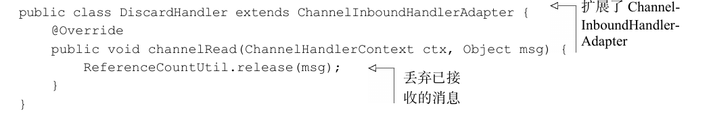
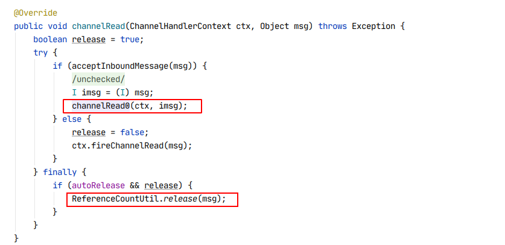
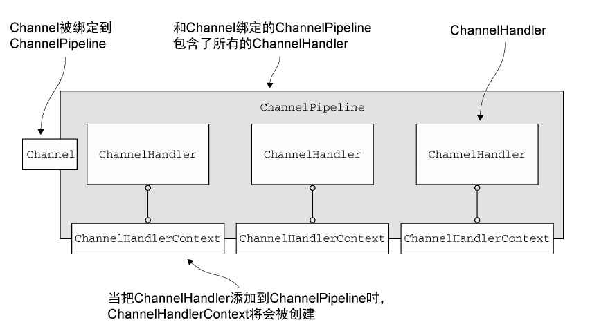
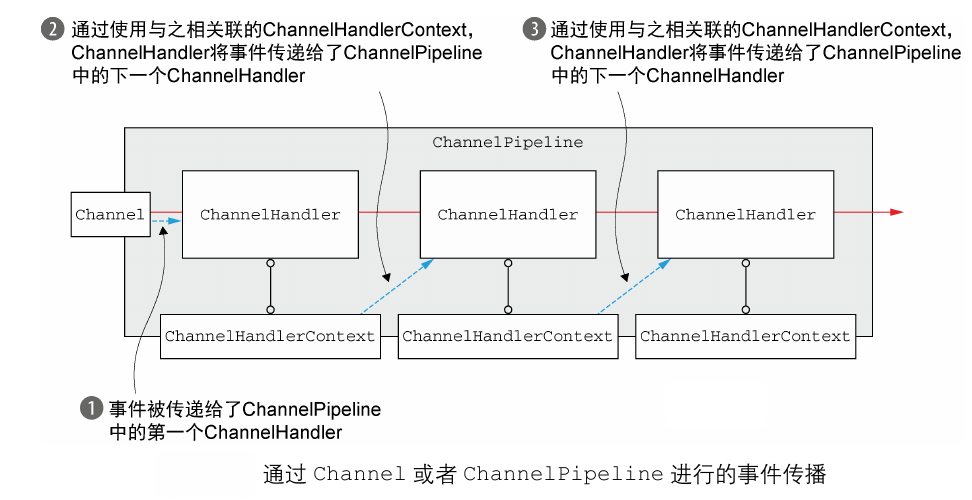
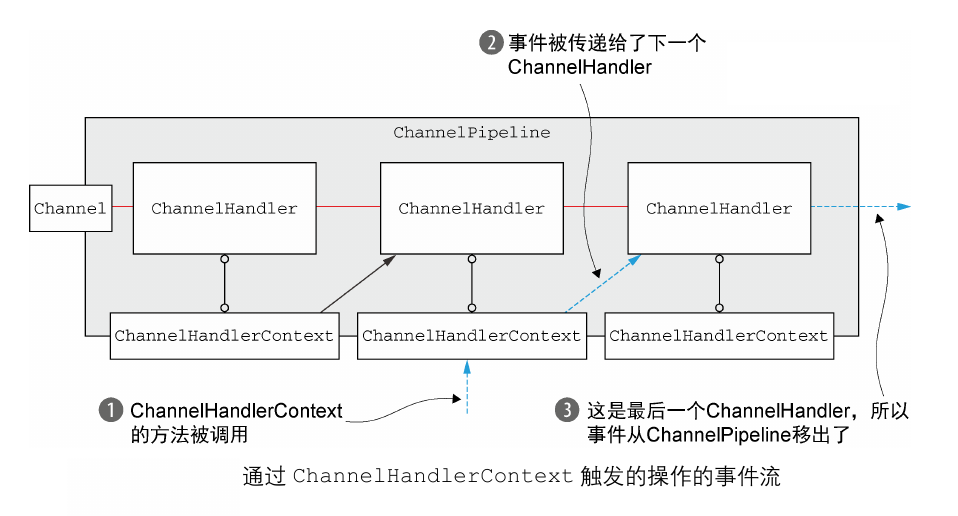

<!--TOC-->

   * [ChannelHandler和ChannelPipeline](#channelhandler和channelpipeline)
       * [ChannelHandler家族](#channelhandler家族)
          * [Channel的生命周期](#channel的生命周期)
          * [ChannelHandler生命周期](#channelhandler生命周期)
          * [ChannelInboundHandler接口](#channelinboundhandler接口)
          * [ChannelOutboundHandler接口](#channeloutboundhandler接口)
          * [资源管理](#资源管理)
       * [ChannelPipeline](#channelpipeline)
          * [ChannelPipeline相对论](#channelpipeline相对论)
          * [修改ChannelPipeline](#修改channelpipeline)
          * [ChannelHandler的执行和阻塞](#channelhandler的执行和阻塞)
          * [触发事件](#触发事件)
       * [ChannelHandlerContext](#channelhandlercontext)
          * [ChannelHandlerContext的高级用法](#channelhandlercontext的高级用法)
          
<!-- /TOC-->


# ChannelHandler和ChannelPipeline
在Netty组件中我们已经介绍了ChannelHandler和ChannelPipeline的关系，这里我们将继续深入了解这两个核心
组件的细节。在学习本章内容之前，请各位同学温习一遍Netty组件部分的内容。

### ChannelHandler家族

#### Channel的生命周期
在Channel的生命周期中，它的状态与ChannelHandler是密切相关的，下列是Channel组件的四个状态：

|        状态             |      描述                       |
|       :---             |     :---                        |
|  ChannelUnregistered   |    Channel没有注册到EventLoop    |
|  ChannelRegistered     |    Channel被注册到了EventLoop    |
|  ChannelActive         |    Channel已经连接到它的远程节点，处于活动状态，可以收发数据 |
|  ChannelInactive       |    Channel与远程节点断开不再处于活动状态      |

Channel的生命周期如下图所示，当这些状态发生改变时，将会生成对应的事件，ChannelPipeline中的ChannelHandler
就可以及时做出处理。


#### ChannelHandler生命周期
ChannelHandler接口定义了其生命周期中的操作，当ChanelHandler被添加到ChannelPipeline
或从ChannelPipeline中移除时，会调用这些操作，ChannelHandler的生命周期如下：

|       方法          |    描述   |
|       :---         |     :---  |
|   handlerAdded     |   当把ChannelHandler添加到ChannelPipeline中时调用此方法       |
|   handlerRemoved   |   当把ChannelHandler从ChannelPipeline中移除的时候会调用此方法 |
|   exceptionCaught  |   当ChannelHandler在处理数据的过程中发生异常时会调用此方法      |


#### ChannelInboundHandler接口
ChannelInboundHandler会在接受数据或者其对应的Channel状态发生改变时调用其生命周期的方法，
ChannelInboundHandler的生命周期和Channel的生命周期其实是密切相关的。
以下是ChannelInboundHandler的生命周期方法：

|     方法     |    描述    |
|   :---      |    :---    |
| ChannelRegistered     |  当Channel被注册到EventLoop且能够处理IO事件时会调用此方法 |
| ChannelUnregistered   |  当Channel从EventLoop注销且无法处理任何IO事件时会调用此方法 | 
| ChannelActive         |  当Channel已经连接到远程节点(或者已绑定本地address)且处于活动状态时会调用此方法 | 
| ChannelInactive       |  当Channel与远程节点断开，不再处于活动状态时调用此方法   |
| ChannelReadComplete   |  当Channel的某一个读操作完成时调用此方法               |
| ChannelRead           |  当Channel有数据可读时调用此方法                      |
| ChannelWritabilityChanged | 当Channel的可写状态发生改变时调用此方法，可以调用Channel的isWritable方法检测Channel的可写性，还可以通过ChannelConfig来配置write操作相关的属性  |
| userEventTriggered    |  当ChannelInboundHandler的fireUserEventTriggered方法被调用时才调用此方法。  |

**这里有一个细节一定需要注意：当我们实现ChannelInboundHandler的channelRead方法时，请一定要记住
使用ReferenceCountUtil的release方法释放ByteBuf，这样可以减少内存的消耗，所以我们可以实现一个
ChannelHandler来完成对ByteBuf的释放，就像下面这样：**




**一个更好的办法是继承SimpleChannelInboundHandler，因为SimpleChannelInboundHandler已经帮我们
把与业务无关的逻辑在ChannelRead方法实现了，我们只需要实现它的channelRead0方法来完成我们的逻辑就够了：**



**可以看到SimpleChannelInboundHandler已经将释放资源的逻辑实现了，而且会自动调用ChannelRead0方法
来完成我们业务逻辑。**


#### ChannelOutboundHandler接口
出站数据将由ChannelOutboundHandler处理，它的方法将被Channel，ChannelPipeline以及ChannelHandlerContext调用
（Channel，ChannelPipeline，ChannelHandlerContext都拥有write操作），以下是ChannelOutboundHandler的主要方法：

|       状态       |      描述       |
|       :---      |     :---        |
|      bind       |    当Channel绑定到本地address时会调用此方法  |
|      connect    |    当Channel连接到远程节点时会调用此方法     |
|      disconnect |    当Channel和远程节点断开时会调用此方法     |
|      close      |    当关闭Channel时会调用此方法              |
|      deregister |    当Channel从它的EventLoop注销时会调用此方法   |
|      read       |    当从Channel读取数据时会调用此方法         |
|      flush      |    当Channel将数据冲刷到远程节点时调用此方法  |
|      write      |    当通过Channel将数据写入到远程节点时调用此方法   |

**ChannelOutboundHandler的大部分方法都需要一个ChannelPromise类型的参数，ChannelPromise是
ChannelFuture的一个子接口，这样你就可以明白ChannelPromise实际的作用和ChannelFuture是一样的，
没错，ChannelPromise正是用于在ChannelOutboundHandler的操作完成后执行的回调。**


#### 资源管理
当我们使用ChannelInboundHandler的read或ChannelOutboundHandler的write操作时，我们都需要保证
没有任何资源泄露并尽可能的减少资源耗费。之前已经介绍过了ReferenceCount引用计数用于处理池化的
ByteBuf资源。 为了帮助我们诊断潜在的的资源泄露问题，Netty提供了ResourceLeakDetector，它将
对我们的Netty程序的已分配的缓冲区做大约1%的采样用以检测内存泄露，Netty目前定义了4种泄露检测级别，如下：

|   级别   |      描述       |
|   :---    |   :---        |
| Disabled  |   禁用泄露检测。我们应当在详细测试之后才应该使用此级别。  |
| SIMPLE    |   使用1%的默认采样率检测并报告任何发现的泄露，这是默认的检测级别。   |
| ADVANCED  |   使用默认的采样率，报告任何发现的泄露以及对应的消息的位置。   |
| PARANOID  |   类似于ADVANCED，但是每次都会对消息的访问进行采样，此级别可能会对程序的性能造成影响，应该用于调试阶段。   |

我们可以通过JVM启动参数来设置leakDetector的级别：

````text
java -Dio.netty.leakDetectionLevel=ADVANCED
````


### ChannelPipeline
在Netty组件中也介绍过了，ChannelPipeline是一系列ChannelHandler组成的拦截链，每一个新创建的Channel
都会被分配一个新的ChannelPipeline，Channel和ChannelPipeline之间的关联是持久的，无需我们干涉它们
之间的关系。


#### ChannelPipeline相对论
Netty总是将ChannelPipeline的入站口作为头部，出站口作为尾部，当我们通过ChannelPipeline的add方法
将入站处理器和出站处理器混合添加到ChannelPipeline后，ChannelHandler的顺序如下：


一个入站事件将从ChannelPipeline的头部（左侧）向尾部（右侧）开始传播，出站事件的传播则是与入站的传播方向
相反。当ChannelPipeline在ChannelHandler之间传播事件的时候，它会判断下一个ChannelHandler的类型
是否与当前ChannelHandler的类型相同，如果相同则说明它们是一个方向的事件，
如果不同则跳过该ChannelHandler并前进到下一个ChannelHandler，直到它找到相同类型的ChannelHandler。


#### 修改ChannelPipeline
ChannelPipeline可以通过添加，删除和修改ChannelHandler来修改它自身的布局，这是它最基本的能力，
一下列举了ChannelPipeline的一些修改方法：

|       方法          |           描述           |
|       addXX        |     将指定的ChannelHandler添加到ChannelPipeline中   |
|       remove       |     将指定的ChannelHandler从ChannelPipeline中移除   |
|       replace      |     将ChannelPipeline中指定的ChannelHandler替换成另一个ChannelHandler  |


#### ChannelHandler的执行和阻塞
通常ChannelPipeline中的每个ChannelHandler都是通过它（ChannelPipeline）的EventLoop线程来处理
传递给他的数据的，所以我们不能去阻塞这个线程，否则会对整体的IO操作产生负面影响。 但有时候不得已
需要使用阻塞的API来完成逻辑处理，对于这种情况，ChannelPipeline的某些方法支持接受一个EventLoopGroup
类型的参数，我们可以通过自定义EventLoopGroup的方式，使ChannelHandler在我们的EventLoopGroup内处理数据。
这样一来，就可以避免阻塞线程的影响了。


#### 触发事件
ChannelPipeline的API不仅有对ChannelHandler的增删改操作，还有对入站和出站操作的附加方法，如下：

ChannelPipeline的入站方法：

|       方法      |           描述           |
|   :---         |          :---            |
|   fireChannelRegistered  |    调用ChannelPipeline中下一个ChannelInboundHandler的channelRegistered方法 |
|   fireChannelUnregistered |   调用ChannelPipeline中下一个ChannelInboundHandler的channelUnregistered方法 |
|   fireChannelActive       |   调用ChannelPipeline中下一个ChannelInboundHandler的channelActive方法 |
|   fireChannelInactive     |   调用ChannelPipeline中下一个ChannelInboundHandler的channelInactive方法  |
|   fireExceptionCaught     |   调用ChannelPipeline中下一个ChannelInboundHandler的exceptionCaught方法  |
|   fireUserEventTriggered  |   调用ChannelPipeline中下一个ChannelInboundHandler的userEventTriggered方法 |
|   fireChannelRead         |   调用ChannelPipeline中下一个ChannelInboundHandler的channelRead方法        |
|   fireChannelReadComplete |   调用ChannelPipeline中下一个ChannelInboundHandler的channelReadComplete方法    |
|   fireChannelWritabilityChanged | 调用ChannelPipeline中下一个ChannelInboundHandler的channelWritabilityChanged方法  |


ChannelPipeline的出站方法：

|           方法           |             描述             |
|           :---           |            :---             |
|       bind               |   调用ChannelPipeline中下一个ChannelOutboundHandler的bind方法，将Channel与本地地址绑定 |
|       connect            |   调用ChannelPipeline中下一个ChannelOutboundHandler的connect方法，将Channel连接到远程节点    |
|       disconnect         |   调用ChannelPipeline中下一个ChannelOutboundHandler的disconnect方法，将Channel与远程连接断开 |
|       close              |   调用ChannelPipeline中下一个ChannelOutboundHandler的close方法，将Channel关闭   |
|       deregister         |   调用ChannelPipeline中下一个ChannelOutboundHandler的deregister方法，将Channel从其对应的EventLoop注销   |   
|       flush              |   调用ChannelPipeline中下一个ChannelOutboundHandler的flush方法，将Channel的数据冲刷到远程节点   |
|       write              |   调用ChannelPipeline中下一个ChannelOutboundHandler的write方法，将数据写入Channel     |
|       writeAndFlush      |   先调用write方法，然后调用flush方法，将数据写入并刷回远程节点          |
|       read               |   调用ChannelPipeline中下一个ChannelOutboundHandler的read方法，从Channel中读取数据 |


### ChannelHandlerContext
ChannelHandlerContext代表的是ChannelHandler和ChannelPipeline之间的关联，每当有ChannelHandler
添加到ChannelPipeline中时，都会创建ChannelHandlerContext。ChannelHandlerContext的主要功能是
管理它所关联的ChannelHandler与同一个ChannelPipeline中的其他ChannelHandler之间的交互：



ChannelHandlerContext的大部分方法和Channel和ChannelPipeline相似，但有一个重要的区别是：
调用Channel或ChannelPipeline的方法，如：

````text
//使用Chanel write
Channel channel = ctx.channel();
ctx.write(xxx);

//使用Pipeline write
ChannelPipeline pipeline = ctx.pipeline();
pipeline.write(xxx);
````

，其影响是会沿着整个ChannelPipeline进行传播：




而调用ChannelHandlerContext的方法，如：

````text
//使用ChannelContext write
ctx.write(xxx);
````
则是从其关联的ChannelHandler开始，并且只会传播给位于该ChannelPipeline中的下一个能够处理该事件的
ChannelHandler：




下面是一些比较重要的方法，有些和ChannelPipeline功能相似的方法就不再罗列了，各位同学可以直接查看原API。

|   方法     |   描述   |
|  :---     |   :---   |
|  alloc    |   获取与当前ChannelHandlerContext所关联的Channel的ByteBufAllocator  |
|  handler  |   返回与当前ChannelHandlerContext绑定的ChannelHandler   |
|  pipeline |   返回与当前ChannelHandlerContext关联的ChannelPipeline               |
|  ...      |   ...               |


#### ChannelHandlerContext的高级用法
有时候我们需要在多个ChannelPipeline之间共享一个ChannelHandler，以此实现跨管道处理（获取）数据
的功能，此时的ChannelHandler属于多个ChannelPipeline，且会绑定到不同的ChannelHandlerContext上。
在多个ChannelPipeline之间共享ChannelHandler我们需要使用 **@Sharable注解**，这代表着它是一个共享的
ChannelHandler，如果一个ChannelHandler没有使用@Sharable注解却被用于多个ChannelPipeline，那么
将会触发异常。 还有非常重要的一点：**一个ChannelHandler被用于多个ChannelPipeline肯定涉及到多线程
数据共享的问题，因此我们需要保证ChannelHandler的方法同步。** 下面是一个很好的例子：

`````java
@Sharable
public class UnsafeSharableChannelHandler extends ChannelInboundHandlerAdapter
{
    private int count;

    @Override
    public void channelRead(ChannelHandlerContext ctx,Object msg)
    {
        count++;
        System.out.println("count : " + count);
        ctx.fireChannelRead(msg);
    }
}
`````
上面这个ChannelHandler标识了@Sharable注解，这代表它需要被用于多个ChannelPipeline之间，
但是这个ChannelHandler之中有一个不易察觉的问题： 它声明了一个实例变量count，且ChannelRead方法
不是线程安全的。 那么这个问题的后果我相信学习了多线程的同学应该都明白，一个最简单的方法
就是给修改了count的变量的方法加synchronized关键字，确保即使在多个ChannelPipeline之间共享，
ChannelHandler也能保证数据一致。