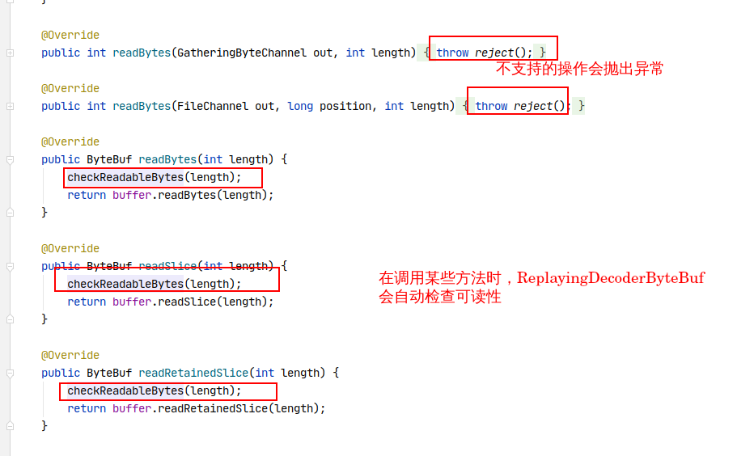

<!-- TOC -->

   * [什么是编码器和解码器?](#什么是编码器和解码器)
      * [解码器](#解码器)
         * [ByteToMessageDecoder](#bytetomessagedecoder)
         * [ReplayingDecoder](#replayingdecoder)
         * [MessageToMessageDecoder](#messagetomessagedecoder)
      * [编码器](#编码器)
         * [MessageToByteEncoder](#messagetobyteencoder)
         * [MessageToMessageEncoder](#messagetomessageencoder)
      * [编解码器](#编解码器)
      
<!-- TOC -->

# 什么是编码器和解码器?
从网络传输的角度来讲，数组总是以字节的格式在网络之中进行传输的。
每当源主机发送数据到目标主机时，数据会从本地格式被转换成字节进行传输，这种转换被称为编码，编码的逻辑由
编码器处理。
每当目标主机接受来自源主机的数据时，数据会从字节转换为我们需要的格式，这种转换被称为解码，解码的逻辑由
解码器处理。

在Netty中，编码解码器实际上是ChannelOutboundHandler和ChannelInboundHandler的实现，
因为编码和解码都属于对数据的处理，由此看来，编码解码器被设计为ChannelHandler也就无可厚非。


## 解码器
在Netty中，解码器是ChannelInboundHandler的实现，即处理入站数据。
解码器主要分为两种：

- 将字节解码为Message消息： ByteToMessageDecoder和ReplayingDecoder。
- 将一种消息解码为另一种消息： MessageToMessageDecoder。


### ByteToMessageDecoder
ByteToMessageDecoder用于将字节解码为消息，如果我们想自定义解码器，就需要继承这个类并实现decode方法。
decode方法是自定解码器必须实现的方法，它被调用时会传入一个包含了数据的ByteBuf和一个用来添加解码消息的List。
对decode方法的调用会重复进行，直至确认没有新元素被添加到该List或ByteBuf没有可读字节为止。最后，如果List不为空，
那么它的内容会被传递给ChannelPipeline中的下一个ChannelInboundHandler。  

下面是ByteToMessageDecoder的编程模型：

````java
public class ToIntegerDecoder extends ByteToMessageDecoder //扩展ByteToMessageDecoder
{  

    @Override
    public void decode(ChannelHandlerContext ctx, ByteBuf in, List<Object> out)
            throws Exception 
    {
        //检查ByteBuf是否仍有4个字节可读
        if (in.readableBytes() >= 4) 
        {  
            out.add(in.readInt());  //从ByteBuf读取消息到List中
        }
    }
}
````

上面这种编程模式很简单，但是在读取ByteBuf之前验证其是否可读的步骤显得有些多余，所以可以使用ReplayingDecoder
来解决这个问题。


### ReplayingDecoder
ReplayingDecoder扩展了ByteToMessageDecoder，这使得我们不再需要检查ByteBuf，因为ReplayingDecoder
自定义了ByteBuf的实现：ReplayingDecoderByteBuf，这个包装后的ByteBuf在内部会自动检查是否可读。以下是
ReplayingDecoderByteBuf的内部实现：



虽然ReplayingDecoderByteBuf可以自动检查可读性，但是对于某些操作并不支持，会抛出
UnsupportedOperationException异常。其编程模型如下：

`````java
public class ToIntegerDecoder2 extends ReplayingDecoder<Void> //扩展ReplayingDecoder
{
    @Override
    public void decode(ChannelHandlerContext ctx, ByteBuf in, List<Object> out)
            throws Exception 
    {
        out.add(in.readInt());//从ByteBuf读取消息到List中
    }
}
`````

### MessageToMessageDecoder
MessageToMessageDecoder用于将一种类型的消息解码另一种类型的消息，如从DTO转为POJO。
这是MessageToMessageDecoder的原型：

````text
public abstract class MessageToMessageDecoder<I> extends ChannelInboundHandlerAdapter 
````
MessageToMessageDecoder的泛型I定义了我们转换何种类型的参数。
和ByteToMessageDecoder一样，自定义MessageToMessageDecoder的解码器也需要实现其decode方法。

以下是它的编程模型：

````java

public class IntegerToStringDecoder extends
        MessageToMessageDecoder<Integer> 
{

    @Override
    public void decode(ChannelHandlerContext ctx, Integer msg, List<Object> out)
            throws Exception
     {
        out.add(String.valueOf(msg));
     }
}
````


## 编码器
在Netty中，编码器是ChannelOutboundHandler的实现，即处理出站数据。
编码器同样分为两种：

- 将消息编码为字节： MessageToByteEncoder。
- 将消息编码为消息： MessageToMessageEncoder。


### MessageToByteEncoder
MessageToByteEncoder用于将消息编码为字节，如果我们需要自定编码器，就需要继承它并实现它的encode方法。
encode方法是自定义编码器必须实现的方法，它被调用时会传入相应的数据和一个存储数据的ByteBuf。
在encode被调用之后，该ByteBuf会被传递给ChannelPipeline中下一个ChannelOutboundHandler。

以下是MessageToByteEncoder的编程模型：

````java
public class ShortToByteEncoder extends MessageToByteEncoder<Short> //扩展MessageToByteEncoder
{  

    @Override
    public void encode(ChannelHandlerContext ctx , Short data, ByteBuf out)
            throws Exception 
    {
        out.writeShort(data);//将data写入ByteBuf   
    }
}
````


### MessageToMessageEncoder
MessageToMessageEncoder用于将一种类型的消息编码另一种类型的消息，其原型和
MessageToMessageDecoder相似，所以这里也不再细说。


## 编解码器
上面的内容讲的是单独的编码器和解码器，编码器处理出站数据，是ChannelOutboundHandler的实现，
解码器负责处理入站数据，是ChannelInboundHandler的实现。除了编码器和解码器，Netty还提供了集编码与解码
于一身的编解码器ByteToMessageCodec和MessageToMessageCodec，它们同时实现了ChannelInboundHandler和ChannelOutboundHandler，其结构如下：


虽然使用编码解码器可以同时编码和解码数据，但这样不利于代码的可重用性。
相反，单独的编码器和解码器最大化了代码的可重用性和可扩展性，所以我们应该优先考虑分开使用二者。

