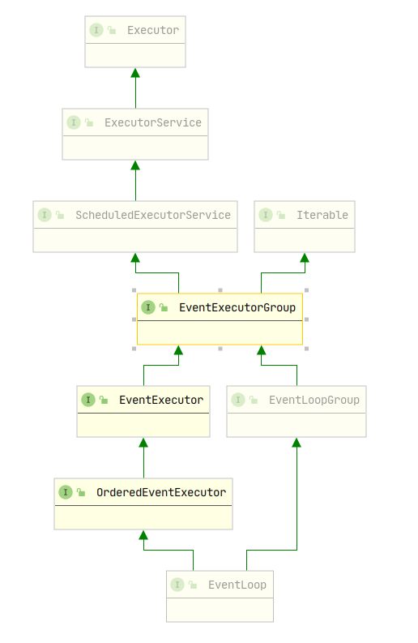
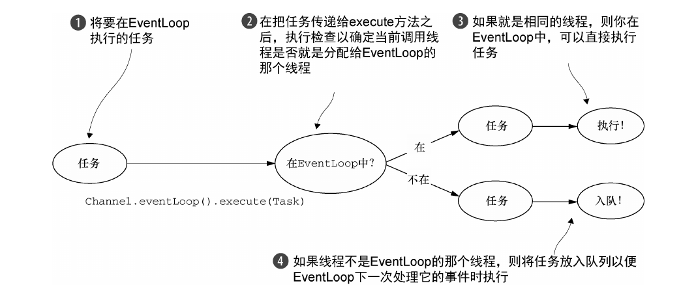
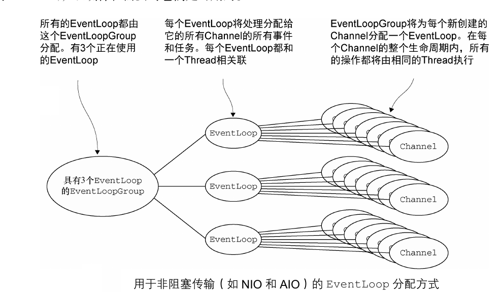
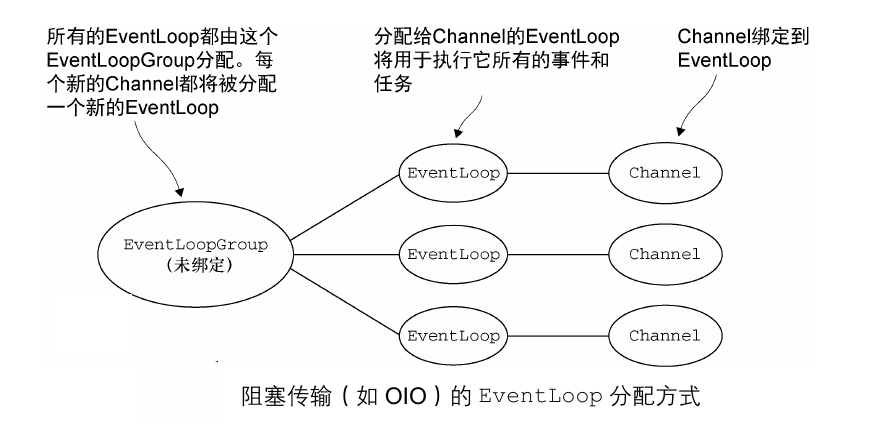

<!-- TOC -->

   * [Netty线程模型和EventLoop](#netty线程模型和eventloop)
      * [线程模型概述](#线程模型概述)
      * [EventLoop事件循环](#eventloop事件循环)
      * [任务调度](#任务调度)
         * [JDK任务调度](#jdk任务调度)
         * [EventLoop任务调度](#eventloop任务调度)
      * [线程管理](#线程管理)
      * [线程分配](#线程分配)
         * [非阻塞传输](#非阻塞传输)
         * [阻塞传输](#阻塞传输)

<!--/ TOC -->

# Netty线程模型和EventLoop
由于线程模型确定了代码执行的方式，它可能带来一些副作用以及不确定因素，
可以说这是并发编程中最大的难点，因此，我们需要了解Netty所采用的线程模型，这样
在遇到相关问题时不至于手足无措。

## 线程模型概述
现代操作系统几乎都具有多个核心的CPU，所以我们可以使用多线程技术以有效地利用系统资源。在早期的
Java多线程编程中，我们使用线程的方式一般都是继承Thread或者实现Runnable以此创建新的Thread，
这是一种比较原始且浪费资源的处理线程的方式。JDK5之后引入了Executor API，其核心思想是使用池化技术
来重用Thread，以此达到提高线程响应速度和降低资源浪费的目的。

## EventLoop事件循环
事件循环正如它的名字，处于一个循环之中。我们以前在编写网络程序的时候，会使我们处理连接的逻辑
处于一个死循环之中，这样可以不断的处理客户端连接。

Netty的EventLoop采用了两个基本的API：并发和网络。
Netty的并发包io.netty.util.concurrent是基于Java的并发包java.util.concurrent之上的，
它主要用于提供Executor的支持。Netty的io.netty.channel包提供了与客户端Channel的事件交互的支持。
以下是EventLoop类层次结构图：

在EventLoop模型中，**EventLoop将有一个永远不会改变的Thread，即Netty会给EventLoop分配一个
Thread，在EventLoop生命周期之中的所有IO操作和事件都由这个Thread执行。 根据配置和CPU核心的不同，
Netty可以创建多个EventLoop，且单个EventLoop可能会服务于多个客户端Channel。**

在EventLoop中，**事件或任务的执行总是以FIFO先进先出的顺序执行的，这样可以保证字节总是按正确的
顺序被处理，消除潜在的数据损坏的可能性。**

## 任务调度
有时候我们需要在指定的时间之后触发任务或者周期性的执行某一个人物，这都需要使用到任务调度。

### JDK任务调度
JDK主要有Timer和ScheduledExecutorService两种实现任务调度的方式，但是这两种原生的API的
性能都不太适合高负载应用。

### EventLoop任务调度
上面介绍过的EventLoop类层次结构图，可以看到EventLoop扩展了ScheduledExecutorService，
所以我们可以通过EventLoop来实现任务调度，其编程模型如下：

使用Channel获取其对应的EventLoop，然后调用schedule方法给其分配一个Runnable执行。Netty的任务调度
比JDK的任务调度性能性能要好，这主要是由于Netty底层的线程模型设计的非常优秀。

## 线程管理
Netty线程模型的卓越性能取决于当前执行任务的Thread，我们看一张图就明白了：

**如果处理Chanel任务的线程正是支撑EventLoop的线程，那么与Channel的任务会被直接执行。
否则EventLoop会将该任务放入任务队列之中稍后执行。
需要注意的是每个EventLoop都有自己的任务队列，独立于其他EventLoop的任务队列。**

## 线程分配
每个EventLoop都注册在一个EventLoopGroup之中，一个EventLoopGroup可以包含多个EventLoop，根据不同的传输实现，
EventLoop的创建和分配方式也不同。

#### 非阻塞传输
我们说过一个EventLoop可以处理多个Channel，Netty这样设计的目的就是尽可能的通过少量Thread来支撑大量的Channel，
而不是每个Channel都分配一个Thread。

EventLoopGroup负责为每个新创建的Channel分配一个EventLoop，一旦一个Channel被分配给EventLoop，它将在
整个生命周期中都使用这个EventLoop及其Thread处理事件和任务。

**注意：EventLoop的分配方式对ThreadLocal的使用是很有很大影响的。因为注册在一个EventLoop上的Channel
共有这一个线程，那么在这些Channel之间使用ThreadLocal，其ThreadLocal的状态都是一样的，无法发挥ThreadLocal
本来的作用。**

#### 阻塞传输
阻塞传输即OIO(BIO)，此种传输方式的EventLoop只会被分配一个Channel，如下图：

这样带来的会是线程资源的巨大消耗，导致并发量降低。
