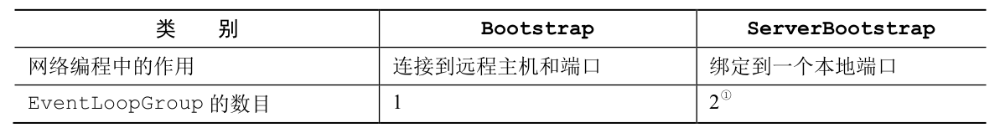
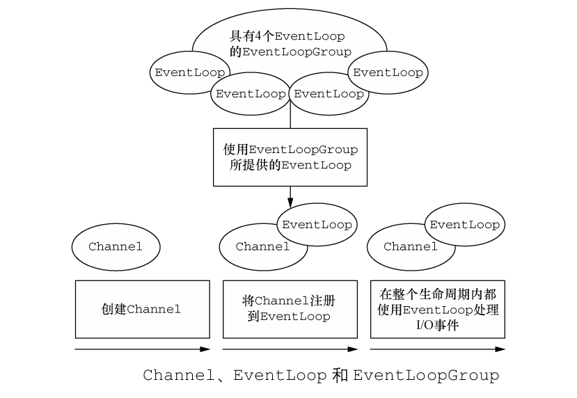
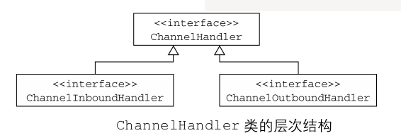
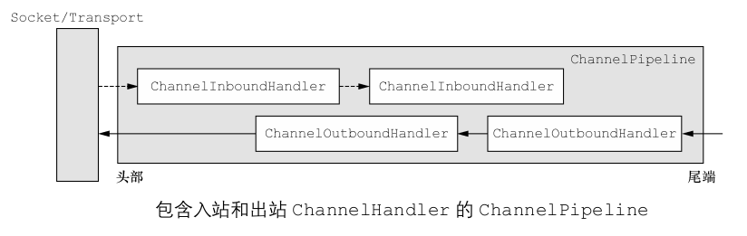

<!-- TOC -->
         
  * [Netty组件介绍](#netty组件介绍)
     * [Bootstrap/ServerBootstrap](#bootstrapserverbootstrap)
     * [Channel](#channel)
     * [EventLoop](#eventloop)
     * [ChannelFuture](#channelfuture)
     * [ChannelHandler](#channelhandler)
     * [ChannelPipeline](#channelpipeline)
     * [入站事件和出站事件的流向](#入站事件和出站事件的流向)
     * [进一步了解ChannelHandler](#进一步了解channelhandler)
     * [编码器和解码器](#编码器和解码器)
     * [SimpleChannelInboundHandler](#simplechannelinboundhandler)

<!--  TOC -->

# Netty组件介绍

Netty有 Bootstrap/ServerBootstrap，Channel，EventLoop，ChannelFuture，
ChannelHandler，ChannelPipeline，编码器和解码器等核心组件。 

**在学习Netty组件之前建议各位同学先编写一个Netty的Demo，你不必了解这个Demo的细节，
只需要让它在你的脑海中留下一个记忆，然后对照Demo来学习以下组件，会事半功倍。** 

[Demo](https://github.com/guang19/framework-learning/tree/dev/netty-learning/src/main/java/com/github/guang19/nettylearning/echo)

#### Bootstrap/ServerBootstrap
Bootstrap和ServerBootstrap是Netty应用程序的引导类，它提供了用于应用程序网络层的配置。
一般的Netty应用程序总是分为客户端和服务端，所以引导分为客户端引导Bootstrap和服务端引导ServerBootstrap，
ServerBootstrap作为服务端引导，它将服务端进程绑定到指定的端口，而Bootstrap则是将客户端连接到
指定的远程服务器。
Bootstrap和ServerBootstrap除了职责不同，它们所需的EventLoopGroup的数量也不同，
Bootstrap引导客户端只需要一个EventLoopGroup，而ServerBootstrap则需要两个EventLoopGroup。
    

#### Channel
在我们使用某种语言，如c/c++,java,go等，进行网络编程的时候，我们通常会使用到Socket，
Socket是对底层操作系统网络IO操作(如read,write,bind,connect等)的封装，
因此我们必须去学习Socket才能完成网络编程，而Socket的操作其实是比较复杂的，想要使用好它有一定难度，
所以Netty提供了Channel(io.netty.Channel，而非java nio的Channel)，更加方便我们处理IO事件。

#### EventLoop
EventLoop用于服务端与客户端连接的生命周期中所发生的事件。 
EventLoop 与 EventLoopGroup，Channel的关系模型如下：

一个EventLoopGroup通常包含一个或多个EventLoop，一个EventLoop可以处理多个Channel的IO事件，
一个Channel也只会被注册到一个EventLoop上。**在EventLoop的生命周期中，它只会和一个Thread线程绑定，这个
EventLoop处理的IO事件都将在与它绑定的Thread内被处理。**

#### ChannelFuture
在Netty中，所有的IO操作都是异步执行的，所以一个操作会立刻返回，但是如何获取操作执行完的结果呢？
Netty就提供了ChannelFuture接口，它的addListener方法会向Channel注册ChannelFutureListener，
以便在某个操作完成时得到通知结果。

#### ChannelHandler
我们知道Netty是一个款基于事件驱动的网络框架，当特定事件触发时，我们能够按照自定义的逻辑去处理数据。
**ChannelHandler则正是用于处理入站和出站数据钩子**，它可以处理几乎所有类型的动作，所以ChannelHandler会是
我们开发者更为关注的一个接口。

ChannelHandler主要分为处理入站数据的 ChannelInboundHandler和出站数据的 ChannelOutboundHandler 接口。

Netty以适配器的形式提供了大量默认的 ChannelHandler实现，主要目的是为了简化程序开发的过程，我们只需要
重写我们关注的事件和方法就可以了。 通常我们会以继承的方式使用以下适配器和抽象:

- ChannelHandlerAdapter
- ChannelInboundHandlerAdapter
- ChannelDuplexHandler
- ChannelOutboundHandlerAdapter

#### ChannelPipeline
上面介绍了ChannelHandler的作用，它使我们更关注于特定事件的数据处理，但如何使我们自定义的
ChannelHandler能够在事件触发时被使用呢？ Netty提供了ChannelPipeline接口，它
提供了存放ChannelHandler链的容器，且ChannelPipeline定义了在这条ChannelHandler链上
管理入站和出站事件流的API。
当一个Channel被初始化时，会使用ChannelInitializer接口的initChannel方法在ChannelPipeline中
添加一组自定义的ChannelHandler。

#### 入站事件和出站事件的流向

从服务端角度来看，如果一个事件的运动方向是从客户端到服务端，那么这个事件是入站的，如果事件运动的方向
是从服务端到客户端，那么这个事件是出站的。

上图是Netty事件入站和出站的大致流向，入站和出站的ChannelHandler可以被安装到一个ChannelPipeline中，
**如果一个消息或其他的入站事件被[读取]，那么它会从ChannelPipeline的头部开始流动，并传递给第一个ChannelInboundHandler
，这个ChannelHandler的行为取决于它的具体功能，不一定会修改消息。 在经历过第一个ChannelInboundHandler之后，
消息会被传递给这条ChannelHandler链的下一个ChannelHandler，最终消息会到达ChannelPipeline尾端，消息的读取也就结束了。**

**数据的出站(消息被[写出])流程与入站是相似的，在出站过程中，消息从ChannelOutboundHandler链的尾端开始流动，
直到到达它的头部为止，在这之后，消息会到达网络传输层进行后续传输。**

#### 进一步了解ChannelHandler
鉴于入站操作和出站操作是不同的，可能有同学会疑惑：为什么入站ChannelHandler和出站ChannelHandler的数据
不会窜流呢(为什么入站的数据不会到出站ChannelHandler链中)？ 因为Netty可以区分ChannelInboundHandler和
ChannelOutboundHandler的实现，并确保**数据只在两个相同类型的ChannelHandler直接传递，即数据要么在
ChannelInboundHandler链之间流动，要么在ChannelOutboundHandler链之间流动。**

**当ChannelHandler被添加到ChannelPipeline中后，它会被分配一个ChannelHandlerContext，
它代表了ChannelHandler和ChannelPipeline之间的绑定。 我们可以使用ChannelHandlerContext
获取底层的Channel，但它最主要的作用还是用于写出数据。**

#### 编码器和解码器
当我们通过Netty发送(出站)或接收(入站)一个消息时，就会发生一次数据的转换，因为数据在网络中总是通过字节传输的，
所以当数据入站时，Netty会解码数据，即把数据从字节转为为另一种格式(通常是一个Java对象)，
当数据出站时，Netty会编码数据，即把数据从它当前格式转为为字节。

Netty为编码器和解码器提供了不同类型的抽象，这些编码器和解码器其实都是ChannelHandler的实现，
它们的名称通常是ByteToMessageDecoder和MessageToByteEncoder。

对于入站数据来说，解码其实是解码器通过重写ChannelHandler的read事件，然后调用它们自己的
decode方法完成的。
对于出站数据来说，编码则是编码器通过重写ChannelHandler的write事件，然后调用它们自己的
encode方法完成的。

**为什么编码器和解码器被设计为ChannelHandler的实现呢?**

我觉得这很符合Netty的设计，上面已经介绍过Netty是一个事件驱动的框架，其事件由特定的ChannelHandler
完成，我们从用户的角度看，编码和解码其实是属于应用逻辑的，按照应用逻辑实现自定义的编码器和解码器就是
理所应当的。

#### SimpleChannelInboundHandler
在我们编写Netty应用程序时，会使用某个ChannelHandler来接受入站消息，非常简单的一种方式
是扩展SimpleChannelInboundHandler< T >，T是我们需要处理消息的类型。 继承SimpleChannelInboundHandler
后，我们只需要重写其中一个或多个方法就可以完成我们的逻辑。