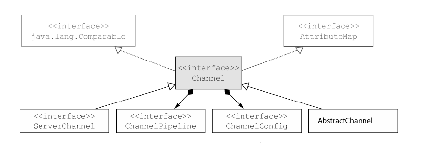
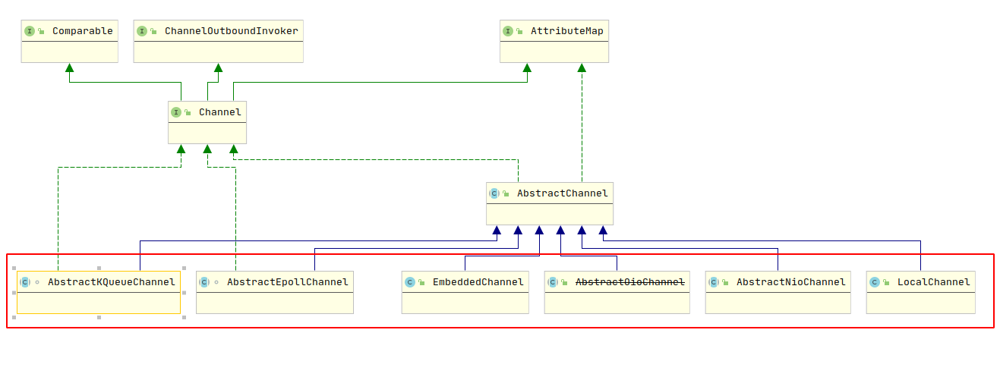
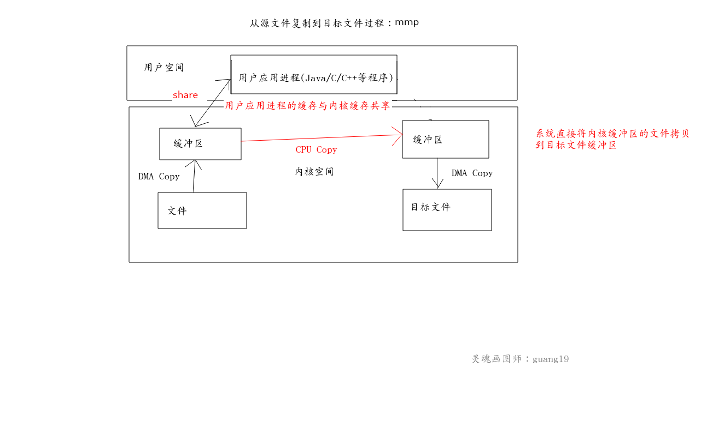
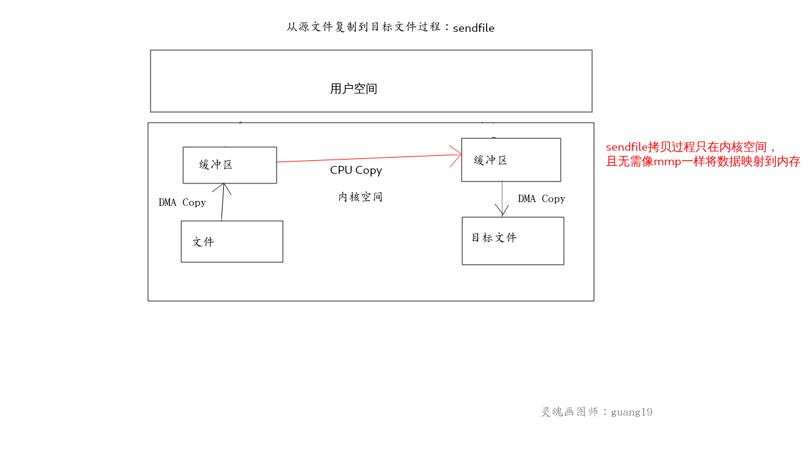

<!-- TOC -->

  * [传输(Transport)](#传输transport)
     * [传输API](#传输api)
     * [Netty内置的传输](#netty内置的传输)
     * [零拷贝](#零拷贝)
       * [内存映射（Memory Mapped）](#内存映射memory-mapped)
       * [文件传输(SendFile)](#文件传输sendfile)

<!-- /TOC -->


# 传输(Transport)
在网络中传递的数据总是具有相同的类型：字节。 这些字节流动的细节取决于网络传输，它是一个帮我们抽象
底层数据传输机制的概念，我们不需要关心字节流动的细节，只需要确保字节被可靠的接收和发送。

当我们使用Java网络编程时，可能会接触到多种不同的网络IO模型，如NIO，BIO(OIO: Old IO)，AIO等，我们可能因为
使用这些不同的API而遇到问题。 
Netty则为这些不同的IO模型实现了一个通用的API，我们使用这个通用的API比直接使用JDK提供的API要
简单的多，且避免了由于使用不同API而带来的问题，大大提高了代码的可读性。
在传输这一部分，我们将主要学习这个通用的API，以及它与JDK之间的对比。


### 传输API
传输API的核心是Channel(io.netty.Channel，而非java nio的Channel)接口，它被用于所有的IO操作。

Channel结构层次：



每个Channel都会被分配一个ChannelPipeline和ChannelConfig，
ChannelConfig包含了该Channel的所有配置，并允许在运行期间更新它们。

ChannelPipeline在上面已经介绍过了，它存储了所有用于处理出站和入站数据的ChannelHandler，
我们可以在运行时根据自己的需求添加或删除ChannelPipeline中的ChannelHandler。

此外，Channel还有以下方法值得留意：

| 方法名 | 描述 |
| :---: | :---: |
| eventLoop | 返回当前Channel注册到的EventLoop |
| pipeline  | 返回分配给Channel的ChannelPipeline |
| isActive  | 判断当前Channel是活动的，如果是则返回true。 此处活动的意义依赖于底层的传输，如果底层传输是TCP Socket，那么客户端与服务端保持连接便是活动的；如果底层传输是UDP Datagram，那么Datagram传输被打开就是活动的。 |
| localAddress | 返回本地SocketAddress |
| remoteAddress | 返回远程的SocketAddress |
| write     | 将数据写入远程主机，数据将会通过ChannelPipeline传输 |
| flush     | 将之前写入的数据刷新到底层传输 |
| writeFlush | 等同于调用 write 写入数据后再调用 flush 刷新数据 |


### Netty内置的传输
Netty内置了一些开箱即用的传输，我们上面介绍了传输的核心API是Channel，那么这些已经封装好的
传输也是基于Channel的。

Netty内置Channel接口层次：



| 名称    |  包   | 描述 |
| :---:  | :---: | :---| 
| NIO    | io.netty.channel.socket.nio | NIO Channel基于java.nio.channels，其io模型为IO多路复用 |
| Epoll  | io.netty.channel.epoll      | Epoll Channel基于操作系统的epoll函数，其io模型为IO多路复用，不过Epoll模型只支持在Linux上的多种特性，比NIO性能更好 |
| KQueue | io.netty.channel.kqueue     | KQueue 与 Epoll 相似，它主要被用于 FreeBSD 系统上，如Mac等 |
| OIO(Old Io) | io.netty.channel.socket.oio | OIO Channel基于java.net包，其io模型是阻塞的，且此传输被Netty标记为deprecated，故不推荐使用，最好使用NIO / EPOLL / KQUEUE 等传输 |
| Local       | io.netty.channel.local      | Local Channel 可以在VM虚拟机内部进行本地通信 |
| Embedded    | io.netty.channel.embedded   | Embedded Channel允许在没有真正的网络传输中使用ChannelHandler，可以非常有用的测试ChannelHandler |


### 零拷贝
零拷贝(Zero-Copy)是一种目前只有在使用NIO和Epoll传输时才可使用的特性。
在我之前写过的IO模型中，所有的IO的数据都是从内核复制到用户应用进程，再由用户应用进程处理。
而零拷贝则可以快速地将数据从源文件移动到目标文件，无需经过用户空间。

在学习零拷贝技术之前先学习一下普通的IO拷贝过程吧，
这里举个栗子： 我要使用一个程序将一个目录下的文件复制到另一个目录下，
在普通的IO中，其过程如下：


**应用程序启动后，向内核发出read调用（用户态切换到内核态），操作系统收到调用请求后，
会检查文件是否已经缓存过了，如果缓存过了，就将数据从缓冲区（直接内存）拷贝到用户应用进程（内核态切换到用户态），
如果是第一次访问这个文件，则系统先将数据先拷贝到缓冲区（直接内存），然后CPU将数据从缓冲区拷贝到应用进程内（内核态切换到用户态），
应用进程收到内核的数据后发起write调用，将数据拷贝到目标文件相关的堆栈内存（用户态切换到内核态），
最后再从缓存拷贝到目标文件。**

根据上面普通拷贝的过程我们知道了其缺点主要有： 

1. 用户态与内核态之间的上下文切换次数较多（用户态发送系统调用与内核态将数据拷贝到用户空间）。
2. 拷贝次数较多，每次IO都需要DMA和CPU拷贝。

而零拷贝正是针对普通拷贝的缺点做了很大改进，使得其拷贝速度在处理大数据的时候很是出色。

零拷贝主要有两种实现技术：

1. 内存映射（mmp）
2. 文件传输（sendfile）

可以参照我编写的demo进行接下来的学习：

[zerocopy](https://github.com/guang19/framework-learning/tree/dev/netty-learning/src/main/java/com/github/guang19/nettylearning/zerocopy/ZeroCopyTest.java)


#### 内存映射（Memory Mapped）
````text
内存映射对应JAVA NIO的API为
FileChannel.map。
````

当用户程序发起 mmp 系统调用后，操作系统会将文件的数据直接映射到内核缓冲区中，
且缓冲区会与用户空间共享这一块内存，这样就无需将数据从内核拷贝到用户空间了，用户程序接着发起write
调用，操作系统直接将内核缓冲区的数据拷贝到目标文件的缓冲区，最后再将数据从缓冲区拷贝到目标文件。

其过程如下：



内存映射由原来的四次拷贝减少到了三次，且拷贝过程都在内核空间，这在很大程度上提高了IO效率。

但是mmp也有缺点： 当我们使用mmp映射一个文件到内存并将数据write到指定的目标文件时，
如果另一个进程同时对这个映射的文件做出写的操作，用户程序可能会因为访问非法地址而产生一个错误的信号从而终止。 

试想一种情况：我们的服务器接收一个客户端的下载请求，客户端请求的是一个超大的文件，服务端开启一个线程
使用mmp和write将文件拷贝到Socket进行响应，如果此时又有一个客户端请求对这个文件做出修改，
由于这个文件先前已经被第一个线程mmp了，可能第一个线程会因此出现异常，客户端也会请求失败。

解决这个问题的最简单的一种方法就对这个文件加读写锁，当一个线程对这个文件进行读或写时，其他线程不能操作此文件，
不过这样处理并发的能力可能就大打折扣了。


#### 文件传输(SendFile)

````text
文件传输对应JAVA NIO的API为
FileChannel.transferFrom/transferTo
````

在了解sendfile之前，先来看一下它的函数原型（linux系统的同学可以使用 man sendfile 查看）：

````text
#include<sys/sendfile.h>

ssize_t 

sendfile(int out_fd,
        int in_fd,
        off_t *offset,
        size_t count);
````

sendfile在代表输入文件的文件描述符 in_fd 和 输入文件的文件描述符 out_fd 之间传输文件内容，
这个传输过程完全是在内核之中进行的，程序只需要把输入文件的描述符和输出文件的描述符传递给
sendfile调用，系统自然会完成拷贝。 当然，sendfile和mmp一样都有相同的缺点，在传输过程中，
如果有其他进程截断了这个文件的话，用户程序仍然会被终止。

sendfile传输过程如下：



它的拷贝次数与mmp一样，但是无需像mmp一样与用户进程共享内存了。


