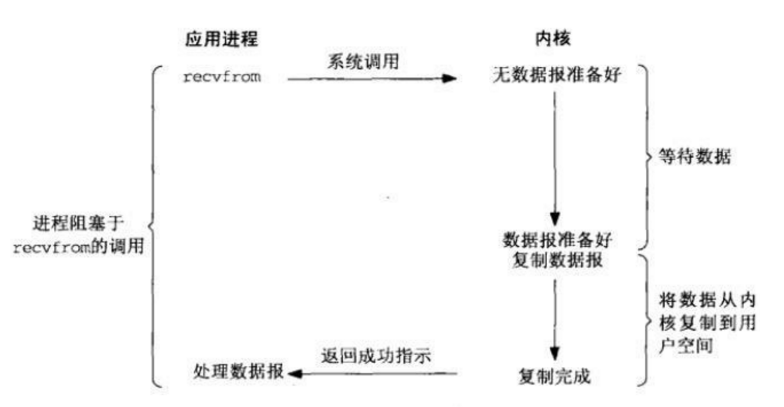
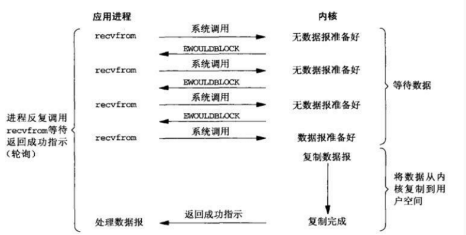
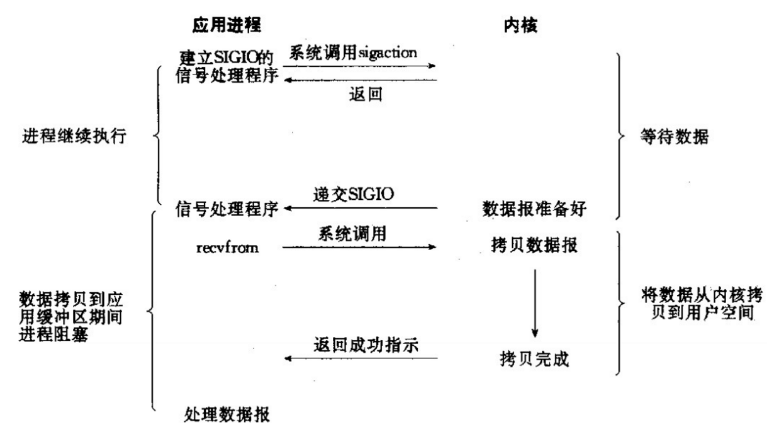
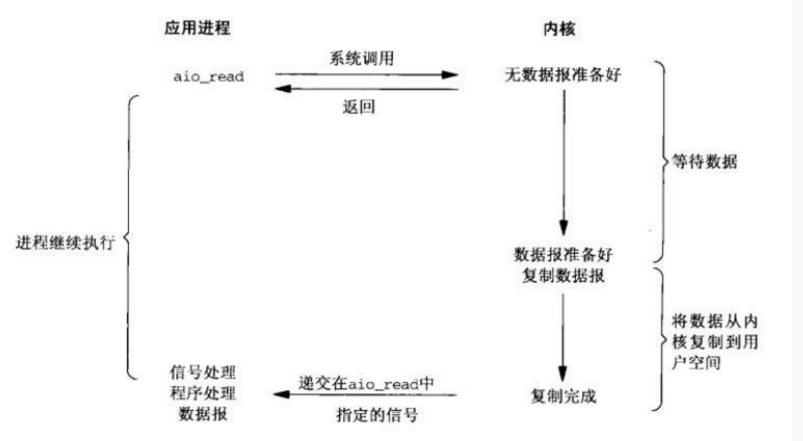

<!-- TOC -->

- [Linux IO](#linux-io)
  - [操作系统的内核](#操作系统的内核)
    - [操作系统的用户态与内核态](#操作系统的用户态与内核态)
    - [为什么要有用户态与内核态?](#为什么要有用户态与内核态)
    - [用户态切换到内核态的几种方式](#用户态切换到内核态的几种方式)
    - [阻塞和非阻塞](#阻塞和非阻塞)
    - [同步与异步](#同步与异步)
  - [Linux IO 模型](#linux-io模型)
    - [阻塞 IO](#阻塞io)
    - [非阻塞 IO(网络 IO 模型)](#非阻塞io网络io模型)
    - [IO 多路复用(网络 IO 模型)](#io多路复用网络io模型)
    - [信号驱动 IO(网络 IO 模型)](#信号驱动io网络io模型)
    - [异步 IO](#异步io)

<!-- /TOC -->

# Linux IO

> 图源: https://www.jianshu.com/p/85e931636f27 (如有侵权,请联系俺,俺会立刻删除)

### 操作系统的内核

**操作系统的内核是操作系统的核心部分。它负责系统的内存，硬件设备，文件系统以及应用程序的管理。**

#### 操作系统的用户态与内核态

unix 与 linux 的体系架构：用户态与内核态。

用户态与内核态与内核态是操作系统对执行权限进行分级后的不同的运行模式。


#### 为什么要有用户态与内核态?

在 cpu 的所有指令中，有些指令是非常危险的，如果使用不当，将会造成系统崩溃等后果。为了避免这种情况发生，cpu 将指令划分为**特权级(内核态)指令**和**非特权级(用户态)指令。**

**对于那些危险的指令只允许内核及其相关模块调用，对于那些不会造成危险的指令，就允许用户应用程序调用。**

- 内核态(核心态,特权态): **内核态是操作系统内核运行的模式。** 内核态控制计算机的硬件资源，如硬件设备，文件系统等等，并为上层应用程序提供执行环境。
- 用户态: **用户态是用户应用程序运行的状态。** 应用程序必须依托于内核态运行,因此用户态的态的操作权限比内核态是要低的，如磁盘，文件等，访问操作都是受限的。
- 系统调用: 系统调用是操作系统为应用程序提供能够访问到内核态的资源的接口。

#### 用户态切换到内核态的几种方式

- 系统调用: 系统调用是用户态主动要求切换到内核态的一种方式，用户应用程序通过操作系统调用内核为上层应用程序开放的接口来执行程序。
- 异常: 当 cpu 在执行用户态的应用程序时，发生了某些不可知的异常。于是当前用户态的应用进程切换到处理此异常的内核的程序中去。
- 硬件设备的中断: 当硬件设备完成用户请求后，会向 cpu 发出相应的中断信号，这时 cpu 会暂停执行下一条即将要执行的指令，转而去执行与中断信号对应的应用程序，如果先前执行的指令是用户态下程序的指令，那么这个转换过程也是用户态到内核台的转换。

#### 阻塞和非阻塞

1. 阻塞: 一个线程调用一个方法计算 1 - 100 的和，如果该方法没有返回结果，
   那么调用方法的线程就一直等待直到该方法执行完毕。
2. 非阻塞: 一个线程调用一个方法计算 1 - 100 的和，该方法立刻返回，如果方法返回没有结果，
   调用者线程也无需一直等待该方法的结果，可以执行其他任务，但是在方法返回结果之前，
   **线程仍然需要轮询的检查方法是否已经有结果。**

**结论: 阻塞与非阻塞针对调用者的立场而言。**

#### 同步与异步

1. **同步**: 一个线程调用一个方法计算 1 - 100 的和，如果方法没有计算完，就不返回。
2. **异步**: 一个线程调用一个方法计算 1 - 100 的和，该方法立刻返回，但是由于方法没有返回结果，
   所以就需要被调用的这个方法来通知调用线程 1 - 100 的结果，
   或者线程在调用方法的时候指定一个回调函数来告诉被调用的方法执行完后就执行回调函数。

**结论:同步和异步是针对被调用者的立场而言的。**

### Linux IO 模型

Linux 下共有 5 种 IO 模型:

1. 阻塞 IO
2. 非阻塞 IO
3. IO 多路复用
4. 信号驱动 IO
5. 异步 IO

#### 阻塞 IO

阻塞 IO 是很常见的一种 IO 模型。在这种模型中，**用户态的应用程序会执行一个操作系统的调用，检查内核的数据是否准备好。如果内核的数据已经准备好，就把数据复制到用户应用进程。如果内核没有准备好数据，那么用户应用进程(线程)就阻塞，直到内核准备好数据并把数据从内核复制到用户应用进程，** 最后应用程序再处理数据。



**阻塞 IO 是同步阻塞的。**

1. 阻塞 IO 的同步体现在: **内核只有准备好数据并把数据复制到用户应用进程才会返回。**

2. 阻塞 IO 的阻塞体现在:**用户应用进程等待内核准备数据和把数据从用户态拷贝到内核态的这整个过程，
   用户应用进程都必须一直等待。** 当然,如果是本地磁盘 IO,内核准备数据的时间可能会很短。但网络 IO 就不一样了，因为服务端不知道客户端何时发送数据，内核就仍需要等待 socket 数据，时间就可能会很长。

**阻塞 IO 的优点是对于数据是能够保证无延时的，因为应用程序进程会一直阻塞直到 IO 完成。**但应用程序的阻塞就意味着应用程序进程无法执行其他任务，这会大大降低程序性能。一个不太可行的办法是为每个客户端 socket 都分配一个线程，这样就会提升 server 处理请求的能力。不过操作系统的线程资源是有限的，如果请求过多，可能造成线程资源耗尽，系统卡死等后果。

#### 非阻塞 IO(网络 IO 模型)

在非阻塞 IO 模型中，用户态的应用程序也会执行一个操作系统的调用，检查内核的数据是否准备完成。**如果内核没有准备好数据,
内核会立刻返回结果,用户应用进程不用一直阻塞等待内核准备数据，而是可以执行其他任务,但仍需要不断的向内核发起系统调用，检测数据是否准备好，这个过程就叫轮询。** 轮询直到内核准备好数据，然后内核把数据拷贝到用户应用进程，再进行数据处理。



非阻塞 IO 的非阻塞体现在: **用户应用进程不用阻塞在对内核的系统调用上**

非阻塞 IO 的优点在于用户应用进程在轮询阶段可以执行其它任务。但这也是它的缺点，轮询就代表着用户应用进程不是时刻都会发起系统调用。
**可能数据准备好了，而用户应用进程可能等待其它任务执行完毕才会发起系统调用，这就意味着数据可能会被延时获取。**

#### IO 多路复用(网络 IO 模型)

在 IO 多路复用模型中,**用户应用进程会调用操作系统的 select/poll/epoll 函数,它会使内核同步的轮询指定的 socket，
(在 NIO 中,socket 就是注册到 Selector 上的 SocketChannel,可以允许多个)直至监听的 socket 有数据可读或可写，select/poll/epoll 函数才会返回,用户应用进程也会阻塞的等待 select/poll/epoll 函数返回。**

当 select/poll/epoll 函数返回后，即某个 socket 有事件发生了，用户应用进程就会发起系统调用，处理事件，将 socket 数据复制到用户进程内，然后进行数据处理。


**IO 多路复用模型是同步阻塞的**

1. IO 多路复用模型的同步体现在: **select 函数只有监听到某个 socket 有事件才会返回。**

2. IO 多路复用模型的阻塞体现在: **用户应用进程会阻塞在对 select 函数上的调用上。**

**IO 多路复用的优点在于内核可以处理多个 socket，相当于一个用户进程(线程)就可以处理多个 socket 连接。**

这样不仅降低了系统的开销，并且对于需要高并发的应用是非常有利的。而非阻塞 IO 和阻塞 IO 的一个用户应用进程只能处理一个 socket，要想处理多 socket，只能新开进程或线程，但这样很消耗系统资源。

**PS:
在 IO 多路复用模型中, socket 一般应该为非阻塞的，这就是 Java 中 NIO 被称为非阻塞 IO 的原因。但实际上 NIO 属于 IO 多路复用，它是同步阻塞的 IO。具体原因见 [知乎讨论](https://www.zhihu.com/question/37271342)**

**PS:
select/poll/epoll 函数是 IO 多路复用模型的基础，所以如果想深入了解 IO 多路复用模型，就需要了解这 3 个函数以及它们的优缺点。**

#### 信号驱动 IO(网络 IO 模型)

在信号驱动 IO 模型中，**用户应用进程发起 sigaction 系统调用,内核收到并立即返回。用户应用进程可以继续执行其他任务，不会阻塞。当内核准备好数据后向用户应用进程发送 SIGIO 信号，应用进程收到信号后，发起系统调用，将数据从内核拷贝到用户进程，** 然后进行数据处理。



个人感觉在内核收到系统调用就立刻返回这一点很像异步 IO 的方式了，不过与异步 IO 仍有很大差别。

#### 异步 IO

在异步 IO 模型中，**用户进程发起 aio_read 系统调用，无论内核的数据是否准备好，都会立即返回。用户应用进程不会阻塞,可以继续执行其他任务。当内核准备好数据,会直接把数据复制到用户应用进程。最后内核会通知用户应用进程 IO 完成。**



**异步 IO 的异步体现在:内核不用等待数据准备好就立刻返回，所以内核肯定需要在 IO 完成后通知用户应用进程。**

---

```text
弄清楚了阻塞与非阻塞，同步与异步和上面5种IO模型，相信再看
Java中的IO模型，也只是换汤不换药。
```

- BIO : 阻塞 IO
- NIO : IO 多路复用
- AIO : 异步 IO

本来打算写 Java 中的 IO 模型的，发现上面几乎讲完了(剩 API 使用吧)，没啥要写的了，
所以暂时就这样吧。如果各位同学有好的建议，欢迎 pr 或 issue。
