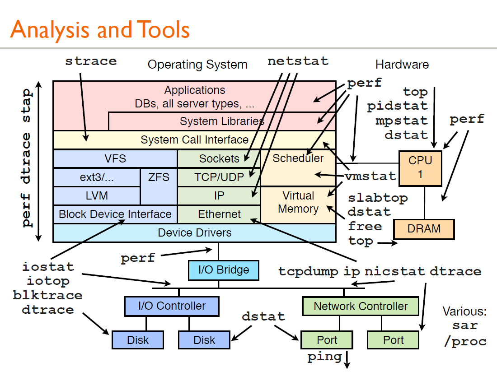

# Linux性能分析工具合集

> 本文由读者投稿，原文地址：[https://ysshao.cn/Linux/Linux_performance/](https://ysshao.cn/Linux/Linux_performance/) 。

## 1. 背景

有时候会遇到一些疑难杂症，并且监控插件并不能一眼立马发现问题的根源。这时候就需要登录服务器进一步深入分析问题的根源。那么分析问题需要有一定的技术经验积累，并且有些问题涉及到的领域非常广，才能定位到问题。所以，分析问题和踩坑是非常锻炼一个人的成长和提升自我能力。如果我们有一套好的分析工具，那将是事半功倍，能够帮助大家快速定位问题，节省大家很多时间做更深入的事情。

## 2. 说明

本篇文章主要介绍各种问题定位的工具以及会结合案例分析问题。

## 3. 分析问题的方法论

套用5W2H方法，可以提出性能分析的几个问题

- What-现象是什么样的
- When-什么时候发生
- Why-为什么会发生
- Where-哪个地方发生的问题
- How much-耗费了多少资源
- How to do-怎么解决问题

## 4.性能分析工具合集



### CPU

针对应用程序，我们通常关注的是内核CPU调度器功能和性能。

线程的状态分析主要是分析线程的时间用在什么地方，而线程状态的分类一般分为：

a. on-CPU：执行中，执行中的时间通常又分为用户态时间user和系统态时间sys。
		b. off-CPU：等待下一轮上CPU，或者等待I/O、锁、换页等等，其状态可以细分为可执行、匿名换页、睡		眠、锁、空闲等状态。

#### **分析工具**

| 工具     | 描述                           |
| -------- | ------------------------------ |
| uptime/w | 查看服务器运行时间、平均负载   |
| top      | 监控每个进程的CPU用量分解      |
| vmstat   | 系统的CPU平均负载情况          |
| mpstat   | 查看多核CPU信息                |
| sar -u   | 查看CPU过去或未来时点CPU利用率 |
| pidstat  | 查看每个进程的用量分解         |

#### uptime

uptime 命令可以用来查看服务器已经运行了多久，当前登录的用户有多少，以及服务器在过去的1分钟、5分钟、15分钟的系统平均负载值


第一项是当前时间，up 表示系统正在运行，6:47是系统启动的总时间，最后是系统的负载load信息

w 同上，增加了具体登陆了那些用户及登陆时间。

#### top

常用来监控[Linux](http://lib.csdn.net/base/linux)的系统状况，比如cpu、内存的使用，显示系统上正在运行的进程。


1. **系统运行时间和平均负载：**

   top命令的顶部显示与uptime命令相似的输出。

   这些字段显示：

   - 当前时间
   - 系统已运行的时间
   - 当前登录用户的数量
   - 相应最近5、10和15分钟内的平均负载。

2. **任务**

   第二行显示的是任务或者进程的总结。进程可以处于不同的状态。这里显示了全部进程的数量。除此之外，还有正在运行、睡眠、停止、僵尸进程的数量（僵尸是一种进程的状态）。这些进程概括信息可以用’t’切换显示。

3. **CPU状态**

   下一行显示的是CPU状态。 这里显示了不同模式下的所占CPU时间的百分比。这些不同的CPU时间表示:

   - us, user： 运行(未调整优先级的) 用户进程的CPU时间
   - sy，system: 运行内核进程的CPU时间
   - ni，niced：运行已调整优先级的用户进程的CPU时间
   - wa，IO wait: 用于等待IO完成的CPU时间
   - hi：处理硬件中断的CPU时间
   - si: 处理软件中断的CPU时间
   - st：这个虚拟机被hypervisor偷去的CPU时间（译注：如果当前处于一个hypervisor下的vm，实际上hypervisor也是要消耗一部分CPU处理时间的）。

4. **内存使用**

   接下来两行显示内存使用率，有点像’free’命令。第一行是物理内存使用，第二行是虚拟内存使用(交换空间)。

   物理内存显示如下:全部可用内存、已使用内存、空闲内存、缓冲内存。相似地：交换部分显示的是：全部、已使用、空闲和缓冲交换空间。

   > 这里要说明的是不能用windows的内存概念理解这些数据，如果按windows的方式此台服务器“危矣”：8G的内存总量只剩下530M的可用内存。Linux的内存管理有其特殊性，复杂点需要一本书来说明，这里只是简单说点和我们传统概念（windows）的不同。
   >
   > 第四行中使用中的内存总量（used）指的是现在系统内核控制的内存数，空闲内存总量（free）是内核还未纳入其管控范围的数量。纳入内核管理的内存不见得都在使用中，还包括过去使用过的现在可以被重复利用的内存，内核并不把这些可被重新使用的内存交还到free中去，因此在[linux](http://lib.csdn.net/base/linux)上free内存会越来越少，但不用为此担心。
   >
   > 如果出于习惯去计算可用内存数，这里有个近似的计算公式：
   >
   > ​		**第四行的free + 第四行的buffers + 第五行的cached。**
   >
   > 对于内存监控，在top里我们要时刻监控第五行swap交换分区的used，如果这个数值在不断的变化，说明内核在不断进行内存和swap的数据交换，这是真正的内存不够用了。

5. **字段/列**

   | 进程的属性 | 属性含义                                                     |
   | ---------- | ------------------------------------------------------------ |
   | PID        | 进程ID，进程的唯一标识符                                     |
   | USER       | 进程所有者的实际用户名。                                     |
   | PR         | 进程的调度优先级。这个字段的一些值是’rt’。这意味这这些进程运行在实时态。 |
   | NI         | 进程的nice值（优先级）。越小的值意味着越高的优先级。         |
   | VIRT       | 进程使用的虚拟内存。                                         |
   | RES        | 驻留内存大小。驻留内存是任务使用的非交换物理内存大小。       |
   | SHR        | SHR是进程使用的共享内存。                                    |
   | S          | 这个是进程的状态。它有以下不同的值:<br>D–不可中断的睡眠态、R–运行态、S–睡眠态、T–被跟踪或已停止、Z – 僵尸态 |
   | %CPU       | 自从上一次更新时到现在任务所使用的CPU时间百分比。            |
   | %MEM       | 进程使用的可用物理内存百分比。                               |
   | TIME+      | 任务启动后到现在所使用的全部CPU时间，精确到百分之一秒。      |
   | COMMAND    | 运行进程所使用的命令。                                       |

   还有许多在默认情况下不会显示的输出，它们可以显示进程的页错误、有效组和组ID和其他更多的信息。

   常用交互命令：

   ‘B’：一些重要信息会以加粗字体显示(高亮)。这个命令可以切换粗体显示。

   ‘b’:

   ‘D’或’S‘: 你将被提示输入一个值（以秒为单位），它会以设置的值作为刷新间隔。如果你这里输入了1，top将会每秒刷新。 top默认为3秒刷新

   ‘l’、‘t’、‘m’: 切换负载、任务、内存信息的显示，这会相应地切换顶部的平均负载、任务/CPU状态和内存信息的概况显示。

   ‘z’ : 切换彩色显示

   ‘x’ 或者 ‘y’

   切换高亮信息：’x’将排序字段高亮显示（纵列）；’y’将运行进程高亮显示（横行）。依赖于你的显示设置，你可能需要让输出彩色来看到这些高亮。

   ‘u’: 特定用户的进程

   ‘n’ 或 ‘#’: 任务的数量

   ‘k’: 结束任务

   **命令行选项**

   > top  //每隔3秒显式所有进程的资源占用情况
   >
   > top -u oracle -c //按照用户显示进程、并显示完整命令 
   >
   > top -d 2 //每隔2秒显式所有进程的资源占用情况
   >
   > top -c //每隔3秒显式进程的资源占用情况，并显示进程的命令行参数(默认只有进程名)
   >
   > top -p 12345 -p 6789//每隔3秒显示pid是12345和pid是6789的两个进程的资源占用情况
   >
   > top -d 2 -c -p 123456 //每隔2秒显示pid是12345的进程的资源使用情况，并显式该进程启动的命令行参数
   >
   > top -n  设置显示多少次后就退出

   **补充**

   top命令是Linux上进行系统监控的首选命令，但有时候却达不到我们的要求，比如当前这台服务器，top监控有很大的局限性。这台服务器运行着websphere集群，有两个节点服务，就是【top视图 01】中的老大、老二两个java进程，top命令的监控最小单位是进程，所以看不到我关心的java线程数和客户连接数，而这两个指标是java的web服务非常重要的指标，通常我用ps和netstate两个命令来补充top的不足。

#### vmstat

​	vmstat命令是最常见的Linux/Unix监控工具，可以展现给定时间间隔的服务器的状态值,包括服务器的CPU使用率，内存使用，虚拟内存交换情况,IO读写情况。

​	一般vmstat工具的使用是通过两个数字参数来完成的，第一个参数是采样的时间间隔数，单位是秒，第二个参数是采样的次数，如:


每个参数的含义：

**Procs（进程）**

| r:   | 运行队列中进程数量，这个值也可以判断是否需要增加CPU。（长期大于1） |
| ---- | ------------------------------------------------------------ |
| b    | 等待IO的进程数量。                                           |

**Memory（内存）**

| swpd  | 使用虚拟内存大小，如果swpd的值不为0，但是SI，SO的值长期为0，这种情况不会影响系统性能。 |
| ----- | ------------------------------------------------------------ |
| free  | 空闲物理内存大小。                                           |
| buff  | 用作缓冲的内存大小。                                         |
| cache | 用作缓存的内存大小，如果cache的值大的时候，说明cache处的文件数多，如果频繁访问到的文件都能被cache处，那么磁盘的读IO bi会非常小。 |

**Swap**

| si   | 每秒从交换区写到内存的大小，由磁盘调入内存。 |
| ---- | -------------------------------------------- |
| so   | 每秒写入交换区的内存大小，由内存调入磁盘。   |

注意：内存够用的时候，这2个值都是0，如果这2个值长期大于0时，系统性能会受到影响，磁盘IO和CPU资源都会被消耗。有些朋友看到空闲内存（free）很少的或接近于0时，就认为内存不够用了，不能光看这一点，还要结合si和so，如果free很少，但是si和so也很少（大多时候是0），那么不用担心，系统性能这时不会受到影响的。因为linux总是先把内存用光.

**IO**

| bi   | 每秒读取的块数 |
| ---- | -------------- |
| bo   | 每秒写入的块数 |

注意：随机磁盘读写的时候，这2个值越大（如超出1024k)，能看到CPU在IO等待的值也会越大。

**system（系统）**

| in   | 每秒中断数，包括时钟中断。 |
| ---- | -------------------------- |
| cs   | 每秒上下文切换数。         |

注意：上面2个值越大，会看到由内核消耗的CPU时间会越大。

**CPU（以百分比表示）**

| us   | 用户进程执行时间百分比(user  time) us的值比较高时，说明用户进程消耗的CPU时间多，但是如果长期超50%的使用，那么我们就该考虑优化程序算法或者进行加速。 |
| ---- | ------------------------------------------------------------ |
| sy:  | 内核系统进程执行时间百分比(system  time) sy的值高时，说明系统内核消耗的CPU资源多，这并不是良性表现，我们应该检查原因。 |
| wa   | IO等待时间百分比  wa的值高时，说明IO等待比较严重，这可能由于磁盘大量作随机访问造成，也有可能磁盘出现瓶颈（块操作）。 |
| id   | 空闲时间百分比                                               |

#### mpstat

​	mpstat是一个实时监控工具，主要报告与CPU相关统计信息,在多核心cpu系统中，不仅可以查看cpu平均信息，还可以查看指定cpu信息。

> mpstat -P ALL  //查看全部CPU的负载情况。 
>
> mpstat 2 5  //可指定间隔时间和次数。

| CPU: 处理器编号。关键字all表示统计信息计算为所有处理器之间的平均值。 |
| ------------------------------------------------------------ |
| ％usr: 显示在用户级（应用程序）执行时发生的CPU利用率百分比。 |
| ％nice: 显示以优先级较高的用户级别执行时发生的CPU利用率百分比。 |
| ％sys: 显示在系统级（内核）执行时发生的CPU利用率百分比。请注意，这不包括维护硬件和软件的时间中断。 |
| ％iowait: 显示系统具有未完成磁盘I / O请求的CPU或CPU空闲的时间百分比。 |
| ％irq: 显示CPU或CPU用于服务硬件中断的时间百分比。            |
| %soft: 显示CPU或CPU用于服务软件中断的时间百分比。            |
| %steal: 显示虚拟CPU或CPU在管理程序为另一个虚拟处理器提供服务时非自愿等待的时间百分比。 |
| %guest: 显示CPU或CPU运行虚拟处理器所花费的时间百分比。       |

#### sar

系统活动情况报告，可以从多方面对系统的活动进行报告，包括：文件的读写情况、系统调用的使用情况、磁盘I/O、CPU效率、内存使用状况、进程活动及IPC有关的活动等

CPU相关：

sar -p （查看全天）

sar -u 1 10 （1：每隔一秒，10：写入10次）

CPU输出项-详细说明

CPU:all 表示统计信息为所有 CPU 的平均值。

%user:显示在用户级别(application)运行使用 CPU 总时间的百分比。

%nice:显示在用户级别，用于nice操作，所占用 CPU 总时间的百分比。

%system:在核心级别(kernel)运行所使用 CPU 总时间的百分比。

%iowait:显示用于等待I/O操作占用 CPU 总时间的百分比。

%steal:管理程序(hypervisor)为另一个虚拟进程提供服务而等待虚拟 CPU 的百分比。

%idle:显示 CPU 空闲时间占用 CPU 总时间的百分比。

#### pidstat

用于监控全部或指定进程的cpu、内存、线程、设备IO等系统资源的占用情况。

pidstat 和 pidstat -u -p ALL 是等效的。
		pidstat 默认显示了所有进程的cpu使用率。

详细说明

PID：进程ID

%usr：进程在用户空间占用cpu的百分比

%system：进程在内核空间占用cpu的百分比

%guest：进程在虚拟机占用cpu的百分比

%CPU：进程占用cpu的百分比

CPU：处理进程的cpu编号

Command：当前进程对应的命令

### 内存

内存是为提高效率而生，实际分析问题的时候，内存出现问题可能不只是影响性能，而是影响服务或者引起其他问题。同样对于内存有些概念需要清楚：

- 主存
- 虚拟内存
- 常驻内存
- 地址空间
- OOM
- 页缓存
- 缺页
- 换页
- 交换空间
- 交换
- 用户分配器libc、glibc、libmalloc和mtmalloc
- LINUX内核级SLUB分配器

#### 分析工具

| 工具    | 描述                           |
| ------- | ------------------------------ |
| free    | 查看内存的使用情况             |
| top     | 监控每个进程的内存使用情况     |
| vmstat  | 虚拟内存统计信息               |
| sar -r  | 查看内存                       |
| sar     | 查看CPU过去或未来时点CPU利用率 |
| pidstat | 查看每个进程的内存使用情况     |

#### free

free 命令显示系统内存的使用情况，包括物理内存、交换内存(swap)和内核缓冲区内存。

Mem 行(第二行)是内存的使用情况。
		Swap 行(第三行)是交换空间的使用情况。
		total 列显示系统总的可用物理内存和交换空间大小。
		used 列显示已经被使用的物理内存和交换空间。
		free 列显示还有多少物理内存和交换空间可用使用。
		shared 列显示被共享使用的物理内存大小。
		buff/cache 列显示被 buffer 和 cache 使用的物理内存大小。
		available 列显示还可以被应用程序使用的物理内存大小。

常用命令：

> free   
>
> free -g  以GB显示
>
> free -m  以MB显示
>
> free -h  自动转换展示
>
> free -h -s  3  有时我们需要持续的观察内存的状况，此时可以使用 -s 选项并指定间隔的秒数

所以从应用程序的角度来说，**available = free + buffer + cache**

可用内存=系统free memory+buffers+cached。

#### top

请参考上面top的详解

#### vmstat

请参考上面vmstat的详解

#### sar

sar -r  #查看内存使用情况

详解：

kbmemfree  空闲的物理内存大小

kbmemused  使用中的物理内存大小

%memused 物理内存使用率

kbbuffers 内核中作为缓冲区使用的物理内存大小，kbbuffers和kbcached:这两个值就是free命令中的buffer							和cache. 

kbcached 缓存的文件大小

kbcommit  保证当前系统正常运行所需要的最小内存，即为了确保内存不溢出而需要的最少内存（物理内存							+Swap分区）

commt 这个值是kbcommit与内存总量（物理内存+swap分区）的一个百分比的值

#### pidstat

pidstat -r  查看内存使用情况 pidstat将显示各活动进程的内存使用统计

PID：进程标识符

Minflt/s:任务每秒发生的次要错误，不需要从磁盘中加载页

Majflt/s:任务每秒发生的主要错误，需要从磁盘中加载页

VSZ：虚拟地址大小，虚拟内存的使用KB

RSS：常驻集合大小，非交换区五里内存使用KB

Command：task命令名

### 磁盘IO

磁盘通常是计算机最慢的子系统，也是最容易出现性能瓶颈的地方，因为磁盘离 CPU 距离最远而且 CPU 访问磁盘要涉及到机械操作，比如转轴、寻轨等。访问硬盘和访问内存之间的速度差别是以数量级来计算的，就像1天和1分钟的差别一样。要监测 IO 性能，有必要了解一下基本原理和 Linux 是如何处理硬盘和内存之间的 IO 的。

在理解磁盘IO之前，同样我们需要理解一些概念，例如：

- 文件系统
- VFS
- 文件系统缓存
- 页缓存page cache
- 缓冲区高速缓存buffer cache
- 目录缓存
- inode
- inode缓存
- noop调用策略

#### 分析工具

| 工具    | 描述                         |
| ------- | ---------------------------- |
| iostat  | 磁盘详细统计信息             |
| iotop   | 按进程查看磁盘IO统计信息     |
| pidstat | 查看每个进程的磁盘IO使用情况 |

#### iostat

iostat工具将对系统的磁盘操作活动进行监视。它的特点是汇报磁盘活动统计情况，同时也会汇报出CPU使用情况


CPU属性

%user：CPU处在用户模式下的时间百分比。

%nice：CPU处在带NICE值的用户模式下的时间百分比。

%system：CPU处在系统模式下的时间百分比。

%iowait：CPU等待输入输出完成时间的百分比。

%steal：管理程序维护另一个虚拟处理器时，虚拟CPU的无意识等待时间百分比。

%idle：CPU空闲时间百分比。

备注：

如果%iowait的值过高，表示硬盘存在I/O瓶颈

如果%idle值高，表示CPU较空闲

如果%idle值高但系统响应慢时，可能是CPU等待分配内存，应加大内存容量。

如果%idle值持续低于10，表明CPU处理能力相对较低，系统中最需要解决的资源是CPU。

Device属性

tps：该设备每秒的传输次数

kB_read/s：每秒从设备（drive expressed）读取的数据量；

kB_wrtn/s：每秒向设备（drive expressed）写入的数据量；

kB_read： 读取的总数据量；

kB_wrtn：写入的总数量数据量

常用命令：

iostat 2 3 每隔2秒刷新显示，且显示3次

iostat -m 以M为单位显示所有信息

查看设备使用率（%util）、响应时间（await）

iostat -d -x -k 1 1

#### iotop

在一般运维工作中经常会遇到这么一个场景，服务器的IO负载很高（iostat中的util），但是无法快速的定位到IO负载的来源进程和来源文件导致无法进行相应的策略来解决问题。

如果你想检查那个进程实际在做 I/O，那么运行 `iotop` 命令加上 `-o` 或者 `--only` 参数。

iotop --only 

#### pidstat

显示各个进程的IO使用情况

pidstat -d

报告IO统计显示以下信息：

- PID：进程id
- kB_rd/s：每秒从磁盘读取的KB
- kB_wr/s：每秒写入磁盘KB
- kB_ccwr/s：任务取消的写入磁盘的KB。当任务截断脏的pagecache的时候会发生。
- COMMAND:task的命令名

### 网络

#### 分析工具

| ping     | 测试网络的连通性             |
| -------- | ---------------------------- |
| netstat  | 检验本机各端口的网络连接情况 |
| hostname | 查看主机和域名               |

#### ping

常用命令参数：

-d 使用Socket的SO_DEBUG功能。

-f 极限检测。大量且快速地送网络封包给一台机器，看它的回应。

-n 只输出数值。

-q 不显示任何传送封包的信息，只显示最后的结果。

-r 忽略普通的Routing Table，直接将数据包送到远端主机上。通常是查看本机的网络接口是否有问题。

-R 记录路由过程。

-v 详细显示指令的执行过程。

<p>-c 数目：在发送指定数目的包后停止。

-i 秒数：设定间隔几秒送一个网络封包给一台机器，预设值是一秒送一次。

-I 网络界面：使用指定的网络界面送出数据包。

-l 前置载入：设置在送出要求信息之前，先行发出的数据包。

-p 范本样式：设置填满数据包的范本样式。

-s 字节数：指定发送的数据字节数，预设值是56，加上8字节的ICMP头，一共是64ICMP数据字节。

-t 存活数值：设置存活数值TTL的大小。

> ping -b 192.168.120.1   --ping网关
>
> ping -c 10 192.168.120.206  --ping指定次数
>
> ping -c 10 -i 0.5 192.168.120.206   --时间间隔和次数限制的ping

#### netstat

netstat命令是一个监控TCP/IP网络的非常有用的工具，它可以显示路由表、实际的网络连接以及每一个网络接口设备的状态信息。

netstat [选项]

```
-a或--all：显示所有连线中的Socket； 
-a (all) 显示所有选项，默认不显示LISTEN相关。
-t (tcp) 仅显示tcp相关选项。
-u (udp) 仅显示udp相关选项。
-n 拒绝显示别名，能显示数字的全部转化成数字。
-l 仅列出有在 Listen (监听) 的服务状态。
-p 显示建立相关链接的程序名
-r 显示路由信息，路由表
-e 显示扩展信息，例如uid等
-s 按各个协议进行统计
-c 每隔一个固定时间，执行该netstat命令。
```

常用命令：

列出所有端口情况

```
netstat -a      # 列出所有端口
netstat -at     # 列出所有TCP端口
netstat -au     # 列出所有UDP端口
```

列出所有处于监听状态的 Sockets

```
netstat -l   # 只显示监听端口
netstat -lt  # 显示监听TCP端口
netstat -lu  # 显示监听UDP端口
netstat -lx  # 显示监听UNIX端口
```

显示每个协议的统计信息

```
netstat -s     # 显示所有端口的统计信息
netstat -st    # 显示所有TCP的统计信息
netstat -su    # 显示所有UDP的统计信息
```

显示 PID 和进程名称

```
netstat -p
```

显示网络统计信息

```
netstat -s
```

统计机器中网络连接各个状态个数

```
netstat` `-an | ``awk` `'/^tcp/ {++S[$NF]} END {for (a in S) print a,S[a]} '
```

**补充netstat网络状态详解：**

一个正常的TCP连接，都会有三个阶段:1、TCP三次握手;2、数据传送;3、TCP四次挥手


**TCP的连接释放**


```
LISTEN：侦听来自远方的TCP端口的连接请求
SYN-SENT：再发送连接请求后等待匹配的连接请求（如果有大量这样的状态包，检查是否中招了）
SYN-RECEIVED：再收到和发送一个连接请求后等待对方对连接请求的确认（如有大量此状态估计被flood攻击了）
ESTABLISHED：代表一个打开的连接
FIN-WAIT-1：等待远程TCP连接中断请求，或先前的连接中断请求的确认
FIN-WAIT-2：从远程TCP等待连接中断请求
CLOSE-WAIT：等待从本地用户发来的连接中断请求
CLOSING：等待远程TCP对连接中断的确认
LAST-ACK：等待原来的发向远程TCP的连接中断请求的确认（不是什么好东西，此项出现，检查是否被攻击）
TIME-WAIT：等待足够的时间以确保远程TCP接收到连接中断请求的确认
CLOSED：没有任何连接状态
```

------

本文参考的文章: https://rdc.hundsun.com/portal/article/731.html?ref=myread


