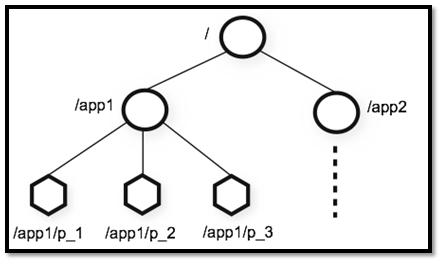
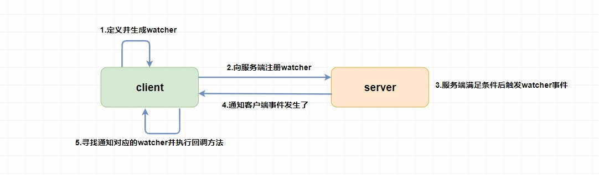
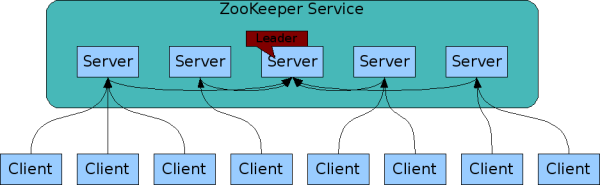

<!-- @import "[TOC]" {cmd="toc" depthFrom=1 depthTo=6 orderedList=false} -->

<!-- code_chunk_output -->

- [1. 前言](#1-前言)
- [2. ZooKeeper 介绍](#2-zookeeper-介绍)
  - [2.1. ZooKeeper 由来](#21-zookeeper-由来)
  - [2.2. ZooKeeper 概览](#22-zookeeper-概览)
  - [2.3. ZooKeeper 特点](#23-zookeeper-特点)
  - [2.4. ZooKeeper 典型应用场景](#24-zookeeper-典型应用场景)
  - [2.5. 有哪些著名的开源项目用到了 ZooKeeper?](#25-有哪些著名的开源项目用到了-zookeeper)
- [3. ZooKeeper 重要概念解读](#3-zookeeper-重要概念解读)
  - [3.1. Data model（数据模型）](#31-data-model数据模型)
  - [3.2. znode（数据节点）](#32-znode数据节点)
    - [3.2.1. znode 4种类型](#321-znode-4种类型)
    - [3.2.2. znode 数据结构](#322-znode-数据结构)
  - [3.3. 版本（version）](#33-版本version)
  - [3.4. ACL（权限控制）](#34-acl权限控制)
  - [3.5. Watcher（事件监听器）](#35-watcher事件监听器)
  - [3.6. 会话（Session）](#36-会话session)
- [4. ZooKeeper 集群](#4-zookeeper-集群)
  - [4.1. ZooKeeper 集群角色](#41-zookeeper-集群角色)
  - [4.2. ZooKeeper 集群中的服务器状态](#42-zookeeper-集群中的服务器状态)
  - [4.3. ZooKeeper 集群为啥最好奇数台？](#43-zookeeper-集群为啥最好奇数台)
- [5. ZAB 协议和Paxos 算法](#5-zab-协议和paxos-算法)
  - [5.1. ZAB 协议介绍](#51-zab-协议介绍)
  - [5.2. ZAB 协议两种基本的模式：崩溃恢复和消息广播](#52-zab-协议两种基本的模式崩溃恢复和消息广播)
- [6. 总结](#6-总结)
- [7. 参考](#7-参考)

<!-- /code_chunk_output -->


## 1. 前言

相信大家对 ZooKeeper 应该不算陌生。但是你真的了解 ZooKeeper 到底有啥用不？如果别人/面试官让你给他讲讲对于 ZooKeeper 的认识，你能回答到什么地步呢？

拿我自己来说吧！我本人曾经使用 Dubbo 来做分布式项目的时候，使用了 ZooKeeper 作为注册中心。为了保证分布式系统能够同步访问某个资源，我还使用 ZooKeeper 做过分布式锁。另外，我在学习 Kafka 的时候，知道 Kafka 很多功能的实现依赖了 ZooKeeper。

前几天，总结项目经验的时候，我突然问自己 ZooKeeper 到底是个什么东西？想了半天，脑海中只是简单的能浮现出几句话：

1. ZooKeeper 可以被用作注册中心、分布式锁；
2. ZooKeeper 是 Hadoop 生态系统的一员；
3. 构建 ZooKeeper 集群的时候，使用的服务器最好是奇数台。

由此可见，我对于 ZooKeeper 的理解仅仅是停留在了表面。

所以，通过本文，希望带大家稍微详细的了解一下 ZooKeeper 。如果没有学过 ZooKeeper ，那么本文将会是你进入 ZooKeeper 大门的垫脚砖。如果你已经接触过 ZooKeeper ，那么本文将带你回顾一下 ZooKeeper 的一些基础概念。

另外，本文不光会涉及到 ZooKeeper 的一些概念，后面的文章会介绍到 ZooKeeper 常见命令的使用以及使用 Apache Curator 作为 ZooKeeper 的客户端。

*如果文章有任何需要改善和完善的地方，欢迎在评论区指出，共同进步！*

## 2. ZooKeeper 介绍

### 2.1. ZooKeeper 由来

正式介绍 ZooKeeper 之前，我们先来看看 ZooKeeper 的由来，还挺有意思的。

下面这段内容摘自《从 Paxos 到 ZooKeeper 》第四章第一节，推荐大家阅读一下：

> ZooKeeper 最早起源于雅虎研究院的一个研究小组。在当时，研究人员发现，在雅虎内部很多大型系统基本都需要依赖一个类似的系统来进行分布式协调，但是这些系统往往都存在分布式单点问题。所以，雅虎的开发人员就试图开发一个通用的无单点问题的分布式协调框架，以便让开发人员将精力集中在处理业务逻辑上。
>
> 关于“ZooKeeper”这个项目的名字，其实也有一段趣闻。在立项初期，考虑到之前内部很多项目都是使用动物的名字来命名的（例如著名的 Pig 项目),雅虎的工程师希望给这个项目也取一个动物的名字。时任研究院的首席科学家 RaghuRamakrishnan 开玩笑地说：“在这样下去，我们这儿就变成动物园了！”此话一出，大家纷纷表示就叫动物园管理员吧一一一因为各个以动物命名的分布式组件放在一起，雅虎的整个分布式系统看上去就像一个大型的动物园了，而 ZooKeeper 正好要用来进行分布式环境的协调一一于是，ZooKeeper 的名字也就由此诞生了。

### 2.2. ZooKeeper 概览

ZooKeeper 是一个开源的**分布式协调服务**，它的设计目标是将那些复杂且容易出错的分布式一致性服务封装起来，构成一个高效可靠的原语集，并以一系列简单易用的接口提供给用户使用。

> **原语：** 操作系统或计算机网络用语范畴。是由若干条指令组成的，用于完成一定功能的一个过程。具有不可分割性·即原语的执行必须是连续的，在执行过程中不允许被中断。

**ZooKeeper 为我们提供了高可用、高性能、稳定的分布式数据一致性解决方案，通常被用于实现诸如数据发布/订阅、负载均衡、命名服务、分布式协调/通知、集群管理、Master 选举、分布式锁和分布式队列等功能。**

另外，**ZooKeeper 将数据保存在内存中，性能是非常棒的。 在“读”多于“写”的应用程序中尤其地高性能，因为“写”会导致所有的服务器间同步状态。（“读”多于“写”是协调服务的典型场景）。**

### 2.3. ZooKeeper 特点

- **顺序一致性：** 从同一客户端发起的事务请求，最终将会严格地按照顺序被应用到 ZooKeeper 中去。
- **原子性：** 所有事务请求的处理结果在整个集群中所有机器上的应用情况是一致的，也就是说，要么整个集群中所有的机器都成功应用了某一个事务，要么都没有应用。
- **单一系统映像 ：** 无论客户端连到哪一个 ZooKeeper 服务器上，其看到的服务端数据模型都是一致的。
- **可靠性：** 一旦一次更改请求被应用，更改的结果就会被持久化，直到被下一次更改覆盖。

### 2.4. ZooKeeper 典型应用场景

ZooKeeper 概览中，我们介绍到使用其通常被用于实现诸如数据发布/订阅、负载均衡、命名服务、分布式协调/通知、集群管理、Master 选举、分布式锁和分布式队列等功能。

下面选 3 个典型的应用场景来专门说说：

1. **分布式锁** ： 通过创建唯一节点获得分布式锁，当获得锁的一方执行完相关代码或者是挂掉之后就释放锁。
2. **命名服务** ：可以通过 ZooKeeper 的顺序节点生成全局唯一 ID
3. **数据发布/订阅** ：通过 **Watcher 机制** 可以很方便地实现数据发布/订阅。当你将数据发布到 ZooKeeper 被监听的节点上，其他机器可通过监听 ZooKeeper 上节点的变化来实现配置的动态更新。

实际上，这些功能的实现基本都得益于 ZooKeeper 可以保存数据的功能，但是 ZooKeeper 不适合保存大量数据，这一点需要注意。

### 2.5. 有哪些著名的开源项目用到了 ZooKeeper?

1. **Kafka** : ZooKeeper 主要为 Kafka 提供 Broker 和 Topic 的注册以及多个 Partition 的负载均衡等功能。
2. **Hbase** : ZooKeeper 为 Hbase 提供确保整个集群只有一个 Master 以及保存和提供 regionserver 状态信息（是否在线）等功能。
3. **Hadoop** : ZooKeeper 为 Namenode 提供高可用支持。

## 3. ZooKeeper 重要概念解读

_破音：拿出小本本，下面的内容非常重要哦！_

### 3.1. Data model（数据模型）

ZooKeeper 数据模型采用层次化的多叉树形结构，每个节点上都可以存储数据，这些数据可以是数字、字符串或者是二级制序列。并且。每个节点还可以拥有 N 个子节点，最上层是根节点以“/”来代表。每个数据节点在 ZooKeeper 中被称为 **znode**，它是 ZooKeeper 中数据的最小单元。并且，每个 znode 都一个唯一的路径标识。

强调一句：**ZooKeeper 主要是用来协调服务的，而不是用来存储业务数据的，所以不要放比较大的数据在 znode 上，ZooKeeper 给出的上限是每个结点的数据大小最大是 1M。**

从下图可以更直观地看出：ZooKeeper 节点路径标识方式和 Unix 文件系统路径非常相似，都是由一系列使用斜杠"/"进行分割的路径表示，开发人员可以向这个节点中写人数据，也可以在节点下面创建子节点。这些操作我们后面都会介绍到。



### 3.2. znode（数据节点）

介绍了 ZooKeeper 树形数据模型之后，我们知道每个数据节点在 ZooKeeper 中被称为 **znode**，它是 ZooKeeper 中数据的最小单元。你要存放的数据就放在上面，是你使用 ZooKeeper 过程中经常需要接触到的一个概念。

#### 3.2.1. znode 4种类型

我们通常是将 znode 分为 4 大类：

- **持久（PERSISTENT）节点** ：一旦创建就一直存在即使 ZooKeeper 集群宕机，直到将其删除。
- **临时（EPHEMERAL）节点** ：临时节点的生命周期是与 **客户端会话（session）** 绑定的，**会话消失则节点消失** 。并且，**临时节点只能做叶子节点** ，不能创建子节点。
- **持久顺序（PERSISTENT_SEQUENTIAL）节点** ：除了具有持久（PERSISTENT）节点的特性之外， 子节点的名称还具有顺序性。比如 `/node1/app0000000001` 、`/node1/app0000000002` 。
- **临时顺序（EPHEMERAL_SEQUENTIAL）节点** ：除了具备临时（EPHEMERAL）节点的特性之外，子节点的名称还具有顺序性。

#### 3.2.2. znode 数据结构

每个 znode 由 2 部分组成:

- **stat** ：状态信息
- **data** ： 节点存放的数据的具体内容

如下所示，我通过 get 命令来获取 根目录下的 dubbo 节点的内容。（get 命令在下面会介绍到）。

```shell
[zk: 127.0.0.1:2181(CONNECTED) 6] get /dubbo
# 该数据节点关联的数据内容为空
null
# 下面是该数据节点的一些状态信息，其实就是 Stat 对象的格式化输出
cZxid = 0x2
ctime = Tue Nov 27 11:05:34 CST 2018
mZxid = 0x2
mtime = Tue Nov 27 11:05:34 CST 2018
pZxid = 0x3
cversion = 1
dataVersion = 0
aclVersion = 0
ephemeralOwner = 0x0
dataLength = 0
numChildren = 1
```

Stat 类中包含了一个数据节点的所有状态信息的字段，包括事务 ID-cZxid、节点创建时间-ctime 和子节点个数-numChildren 等等。

下面我们来看一下每个 znode 状态信息究竟代表的是什么吧！（下面的内容来源于《从 Paxos 到 ZooKeeper 分布式一致性原理与实践》，因为 Guide 确实也不是特别清楚，要学会参考资料的嘛！ ） ：

| znode 状态信息 | 解释                                                         |
| -------------- | ------------------------------------------------------------ |
| cZxid          | create ZXID，即该数据节点被创建时的事务 id                   |
| ctime          | create time，即该节点的创建时间                              |
| mZxid          | modified ZXID，即该节点最终一次更新时的事务 id               |
| mtime          | modified time，即该节点最后一次的更新时间                    |
| pZxid          | 该节点的子节点列表最后一次修改时的事务 id，只有子节点列表变更才会更新 pZxid，子节点内容变更不会更新 |
| cversion       | 子节点版本号，当前节点的子节点每次变化时值增加 1             |
| dataVersion    | 数据节点内容版本号，节点创建时为 0，每更新一次节点内容(不管内容有无变化)该版本号的值增加 1 |
| aclVersion     | 节点的 ACL 版本号，表示该节点 ACL 信息变更次数               |
| ephemeralOwner | 创建该临时节点的会话的 sessionId；如果当前节点为持久节点，则 ephemeralOwner=0 |
| dataLength     | 数据节点内容长度                                             |
| numChildren    | 当前节点的子节点个数                                         |

### 3.3. 版本（version）

在前面我们已经提到，对应于每个 znode，ZooKeeper 都会为其维护一个叫作 **Stat** 的数据结构，Stat 中记录了这个 znode 的三个相关的版本：

- **dataVersion** ：当前 znode 节点的版本号
- **cversion** ： 当前 znode 子节点的版本
- **aclVersion** ： 当前 znode 的 ACL 的版本。

### 3.4. ACL（权限控制）

ZooKeeper 采用 ACL（AccessControlLists）策略来进行权限控制，类似于 UNIX 文件系统的权限控制。

对于 znode 操作的权限，ZooKeeper 提供了以下 5 种：

- **CREATE** : 能创建子节点
- **READ** ：能获取节点数据和列出其子节点
- **WRITE** : 能设置/更新节点数据
- **DELETE** : 能删除子节点
- **ADMIN** : 能设置节点 ACL 的权限

其中尤其需要注意的是，**CREATE** 和 **DELETE** 这两种权限都是针对 **子节点** 的权限控制。

对于身份认证，提供了以下几种方式：

- **world** ： 默认方式，所有用户都可无条件访问。
- **auth** :不使用任何 id，代表任何已认证的用户。
- **digest** :用户名:密码认证方式： _username:password_ 。
- **ip** : 对指定 ip 进行限制。

### 3.5. Watcher（事件监听器）

Watcher（事件监听器），是 ZooKeeper 中的一个很重要的特性。ZooKeeper 允许用户在指定节点上注册一些 Watcher，并且在一些特定事件触发的时候，ZooKeeper 服务端会将事件通知到感兴趣的客户端上去，该机制是 ZooKeeper 实现分布式协调服务的重要特性。



_破音：非常有用的一个特性，都能出小本本记好了，后面用到 ZooKeeper 基本离不开 Watcher（事件监听器）机制。_

### 3.6. 会话（Session）

Session 可以看作是 ZooKeeper 服务器与客户端的之间的一个 TCP 长连接，通过这个连接，客户端能够通过心跳检测与服务器保持有效的会话，也能够向 ZooKeeper 服务器发送请求并接受响应，同时还能够通过该连接接收来自服务器的 Watcher 事件通知。

Session 有一个属性叫做：`sessionTimeout` ，`sessionTimeout` 代表会话的超时时间。当由于服务器压力太大、网络故障或是客户端主动断开连接等各种原因导致客户端连接断开时，只要在`sessionTimeout`规定的时间内能够重新连接上集群中任意一台服务器，那么之前创建的会话仍然有效。

另外，在为客户端创建会话之前，服务端首先会为每个客户端都分配一个 `sessionID`。由于 `sessionID`是 ZooKeeper 会话的一个重要标识，许多与会话相关的运行机制都是基于这个 `sessionID` 的，因此，无论是哪台服务器为客户端分配的 `sessionID`，都务必保证全局唯一。

## 4. ZooKeeper 集群

为了保证高可用，最好是以集群形态来部署 ZooKeeper，这样只要集群中大部分机器是可用的（能够容忍一定的机器故障），那么 ZooKeeper 本身仍然是可用的。通常 3 台服务器就可以构成一个 ZooKeeper 集群了。ZooKeeper 官方提供的架构图就是一个 ZooKeeper 集群整体对外提供服务。



上图中每一个 Server 代表一个安装 ZooKeeper 服务的服务器。组成 ZooKeeper 服务的服务器都会在内存中维护当前的服务器状态，并且每台服务器之间都互相保持着通信。集群间通过 ZAB 协议（ZooKeeper Atomic Broadcast）来保持数据的一致性。

**最典型集群模式： Master/Slave 模式（主备模式）**。在这种模式中，通常 Master 服务器作为主服务器提供写服务，其他的 Slave 服务器从服务器通过异步复制的方式获取 Master 服务器最新的数据提供读服务。

### 4.1. ZooKeeper 集群角色

但是，在 ZooKeeper 中没有选择传统的 Master/Slave 概念，而是引入了 Leader、Follower 和 Observer 三种角色。如下图所示


ZooKeeper 集群中的所有机器通过一个 **Leader 选举过程** 来选定一台称为 “**Leader**” 的机器，Leader 既可以为客户端提供写服务又能提供读服务。除了 Leader 外，**Follower** 和 **Observer** 都只能提供读服务。Follower 和 Observer 唯一的区别在于 Observer 机器不参与 Leader 的选举过程，也不参与写操作的“过半写成功”策略，因此 Observer 机器可以在不影响写性能的情况下提升集群的读性能。

| 角色     | 说明                                                         |
| -------- | ------------------------------------------------------------ |
| Leader   | 为客户端提供读和写的服务，负责投票的发起和决议，更新系统状态。 |
| Follower | 为客户端提供读服务，如果是写服务则转发给 Leader。在选举过程中参与投票。 |
| Observer | 为客户端提供读服务器，如果是写服务则转发给 Leader。不参与选举过程中的投票，也不参与“过半写成功”策略。在不影响写性能的情况下提升集群的读性能。此角色于 ZooKeeper3.3 系列新增的角色。 |

当 Leader 服务器出现网络中断、崩溃退出与重启等异常情况时，就会进入 Leader 选举过程，这个过程会选举产生新的 Leader 服务器。

这个过程大致是这样的：

1. **Leader election（选举阶段）**：节点在一开始都处于选举阶段，只要有一个节点得到超半数节点的票数，它就可以当选准 leader。
2. **Discovery（发现阶段）** ：在这个阶段，followers 跟准 leader 进行通信，同步 followers 最近接收的事务提议。
3. **Synchronization（同步阶段）** :同步阶段主要是利用 leader 前一阶段获得的最新提议历史，同步集群中所有的副本。同步完成之后
   准 leader 才会成为真正的 leader。
4. **Broadcast（广播阶段）** :到了这个阶段，ZooKeeper 集群才能正式对外提供事务服务，并且 leader 可以进行消息广播。同时如果有新的节点加入，还需要对新节点进行同步。

### 4.2. ZooKeeper 集群中的服务器状态

- **LOOKING** ：寻找 Leader。
- **LEADING** ：Leader 状态，对应的节点为 Leader。
- **FOLLOWING** ：Follower 状态，对应的节点为 Follower。
- **OBSERVING** ：Observer 状态，对应节点为 Observer，该节点不参与 Leader 选举。

### 4.3. ZooKeeper 集群为啥最好奇数台？

ZooKeeper 集群在宕掉几个 ZooKeeper 服务器之后，如果剩下的 ZooKeeper 服务器个数大于宕掉的个数的话整个 ZooKeeper 才依然可用。假如我们的集群中有 n 台 ZooKeeper 服务器，那么也就是剩下的服务数必须大于 n/2。先说一下结论，2n 和 2n-1 的容忍度是一样的，都是 n-1，大家可以先自己仔细想一想，这应该是一个很简单的数学问题了。
比如假如我们有 3 台，那么最大允许宕掉 1 台 ZooKeeper 服务器，如果我们有 4 台的的时候也同样只允许宕掉 1 台。
假如我们有 5 台，那么最大允许宕掉 2 台 ZooKeeper 服务器，如果我们有 6 台的的时候也同样只允许宕掉 2 台。

综上，何必增加那一个不必要的 ZooKeeper 呢？

## 5. ZAB 协议和Paxos 算法

Paxos 算法应该可以说是  ZooKeeper 的灵魂了。但是，ZooKeeper 并没有完全采用 Paxos算法 ，而是使用 ZAB 协议作为其保证数据一致性的核心算法。另外，在ZooKeeper的官方文档中也指出，ZAB协议并不像 Paxos 算法那样，是一种通用的分布式一致性算法，它是一种特别为Zookeeper设计的崩溃可恢复的原子消息广播算法。

### 5.1. ZAB 协议介绍

ZAB（ZooKeeper Atomic Broadcast 原子广播） 协议是为分布式协调服务 ZooKeeper 专门设计的一种支持崩溃恢复的原子广播协议。 在 ZooKeeper 中，主要依赖 ZAB 协议来实现分布式数据一致性，基于该协议，ZooKeeper 实现了一种主备模式的系统架构来保持集群中各个副本之间的数据一致性。

### 5.2. ZAB 协议两种基本的模式：崩溃恢复和消息广播

ZAB 协议包括两种基本的模式，分别是 

- **崩溃恢复**  ：当整个服务框架在启动过程中，或是当 Leader 服务器出现网络中断、崩溃退出与重启等异常情况时，ZAB 协议就会进入恢复模式并选举产生新的Leader服务器。当选举产生了新的 Leader 服务器，同时集群中已经有过半的机器与该Leader服务器完成了状态同步之后，ZAB协议就会退出恢复模式。其中，**所谓的状态同步是指数据同步，用来保证集群中存在过半的机器能够和Leader服务器的数据状态保持一致**。
- **消息广播** ：**当集群中已经有过半的Follower服务器完成了和Leader服务器的状态同步，那么整个服务框架就可以进入消息广播模式了。** 当一台同样遵守ZAB协议的服务器启动后加入到集群中时，如果此时集群中已经存在一个Leader服务器在负责进行消息广播，那么新加入的服务器就会自觉地进入数据恢复模式：找到Leader所在的服务器，并与其进行数据同步，然后一起参与到消息广播流程中去。

关于 **ZAB 协议&Paxos算法** 需要讲和理解的东西太多了，具体可以看下面这两篇文章：

-  [图解 Paxos 一致性协议](http://codemacro.com/2014/10/15/explain-poxos/)
-  [Zookeeper ZAB 协议分析](https://dbaplus.cn/news-141-1875-1.html)

## 6. 总结

1. ZooKeeper 本身就是一个分布式程序（只要半数以上节点存活，ZooKeeper 就能正常服务）。
2. 为了保证高可用，最好是以集群形态来部署 ZooKeeper，这样只要集群中大部分机器是可用的（能够容忍一定的机器故障），那么 ZooKeeper 本身仍然是可用的。
3. ZooKeeper 将数据保存在内存中，这也就保证了 高吞吐量和低延迟（但是内存限制了能够存储的容量不太大，此限制也是保持 znode 中存储的数据量较小的进一步原因）。
4. ZooKeeper 是高性能的。 在“读”多于“写”的应用程序中尤其地明显，因为“写”会导致所有的服务器间同步状态。（“读”多于“写”是协调服务的典型场景。）
5. ZooKeeper 有临时节点的概念。 当创建临时节点的客户端会话一直保持活动，瞬时节点就一直存在。而当会话终结时，瞬时节点被删除。持久节点是指一旦这个 znode 被创建了，除非主动进行 znode 的移除操作，否则这个 znode 将一直保存在 ZooKeeper 上。
6. ZooKeeper 底层其实只提供了两个功能：① 管理（存储、读取）用户程序提交的数据；② 为用户程序提供数据节点监听服务。

## 7. 参考

1. 《从 Paxos 到 ZooKeeper 分布式一致性原理与实践》