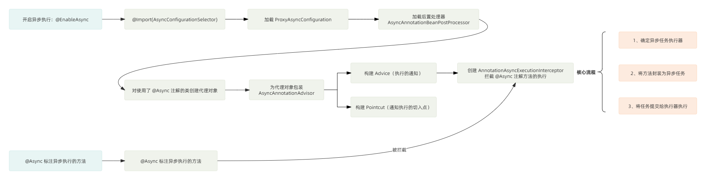

`@Async` 注解由 Spring 框架提供，被该注解标注的类或方法会在 **异步线程** 中执行。这意味着当方法被调用时，调用者将不会等待该方法执行完成，而是可以继续执行后续的代码。

`@Async` 注解的使用非常简单，需要两个步骤：

1. 在启动类上添加注解 `@EnableAsync` ，开启异步任务。
2. 在需要异步执行的方法或类上添加注解 `@Async` 。

```java
@SpringBootApplication
// 开启异步任务
@EnableAsync
public class YourApplication {

    public static void main(String[] args) {
        SpringApplication.run(YourApplication.class, args);
    }
}

// 异步服务类
@Service
public class MyService {

    // 推荐使用自定义线程池，这里只是演示基本用法
    @Async
    public CompletableFuture<String> doSomethingAsync() {

        // 这里会有一些业务耗时操作
        // ...
        // 使用 CompletableFuture 可以更方便地处理异步任务的结果，避免阻塞主线程
        return CompletableFuture.completedFuture("Async Task Completed");
    }

}
```

接下来，我们一起来看看 `@Async` 的底层原理。

## @Async 原理分析

`@Async` 可以异步执行任务，本质上是使用 **动态代理** 来实现的。通过 Spring 中的后置处理器 `BeanPostProcessor` 为使用 `@Async` 注解的类创建动态代理，之后 `@Async` 注解方法的调用会被动态代理拦截，在拦截器中将方法的执行封装为异步任务提交给线程池处理。

接下来，我们来详细分析一下。

### 开启异步

使用 `@Async` 之前，需要在启动类上添加 `@EnableAsync` 来开启异步，`@EnableAsync` 注解如下：

```JAVA
// 省略其他注解 ...
@Import(AsyncConfigurationSelector.class)
public @interface EnableAsync { /* ... */ }
```

在 `@EnableAsync` 注解上通过 `@Import` 注解引入了 `AsyncConfigurationSelector` ，因此 Spring 会去加载通过 `@Import` 注解引入的类。

`AsyncConfigurationSelector` 类实现了 `ImportSelector` 接口，因此在该类中会重写 `selectImports()` 方法来自定义加载 Bean 的逻辑，如下：

```JAVA
public class AsyncConfigurationSelector extends AdviceModeImportSelector<EnableAsync> {
	@Override
	@Nullable
	public String[] selectImports(AdviceMode adviceMode) {
		switch (adviceMode) {
   // 基于 JDK 代理织入的通知
			case PROXY:
				return new String[] {ProxyAsyncConfiguration.class.getName()};
   // 基于 AspectJ 织入的通知
			case ASPECTJ:
				return new String[] {ASYNC_EXECUTION_ASPECT_CONFIGURATION_CLASS_NAME};
			default:
				return null;
		}
	}
}
```

在 `selectImports()` 方法中，会根据通知的不同类型来选择加载不同的类，其中 `adviceMode` 默认值为 `PROXY` 。

这里以基于 JDK 代理的通知为例，此时会加载 `ProxyAsyncConfiguration` 类，如下：

```JAVA
@Configuration
@Role(BeanDefinition.ROLE_INFRASTRUCTURE)
public class ProxyAsyncConfiguration extends AbstractAsyncConfiguration {
	@Bean(name = TaskManagementConfigUtils.ASYNC_ANNOTATION_PROCESSOR_BEAN_NAME)
	@Role(BeanDefinition.ROLE_INFRASTRUCTURE)
	public AsyncAnnotationBeanPostProcessor asyncAdvisor() {
		 // ...
  // 加载后置处理器
		AsyncAnnotationBeanPostProcessor bpp = new AsyncAnnotationBeanPostProcessor();

  // ...
		return bpp;
	}
}
```

### 后置处理器

在 `ProxyAsyncConfiguration` 类中，会通过 `@Bean` 注解加载一个后置处理器 `AsyncAnnotationBeanPostProcessor` ，这个后置处理器是使 `@Async` 注解起作用的关键。

如果某一个类或者方法上使用了 `@Async` 注解，`AsyncAnnotationBeanPostProcessor` 处理器就会为该类创建一个动态代理。

该类的方法在执行时，会被代理对象的拦截器所拦截，其中被 `@Async` 注解标记的方法会异步执行。

`AsyncAnnotationBeanPostProcessor` 代码如下：

```JAVA
public class AsyncAnnotationBeanPostProcessor extends AbstractBeanFactoryAwareAdvisingPostProcessor {
	@Override
	public void setBeanFactory(BeanFactory beanFactory) {
		super.setBeanFactory(beanFactory);
  // 创建 AsyncAnnotationAdvisor，它是一个 Advisor
  // 用于拦截带有 @Async 注解的方法并将这些方法异步执行。
		AsyncAnnotationAdvisor advisor = new AsyncAnnotationAdvisor(this.executor, this.exceptionHandler);
  // 如果设置了自定义的 asyncAnnotationType，则将其设置到 advisor 中。
  // asyncAnnotationType 用于指定自定义的异步注解，例如 @MyAsync。
		if (this.asyncAnnotationType != null) {
			advisor.setAsyncAnnotationType(this.asyncAnnotationType);
		}
		advisor.setBeanFactory(beanFactory);
		this.advisor = advisor;
	}
}
```

`AsyncAnnotationBeanPostProcessor` 的父类实现了 `BeanFactoryAware` 接口，因此在该类中重写了 `setBeanFactory()` 方法作为扩展点，来加载 `AsyncAnnotationAdvisor` 。

#### 创建 Advisor

`Advisor` 是 `Spring AOP` 对 `Advice` 和 `Pointcut` 的抽象。`Advice` 为执行的通知逻辑，`Pointcut` 为通知执行的切入点。

在后置处理器 `AsyncAnnotationBeanPostProcessor` 中会去创建 `AsyncAnnotationAdvisor` ， 在它的构造方法中，会构建对应的 `Advice` 和 `Pointcut` ，如下：

```JAVA
public class AsyncAnnotationAdvisor extends AbstractPointcutAdvisor implements BeanFactoryAware {

    private Advice advice; // 异步执行的 Advice
    private Pointcut pointcut; // 匹配 @Async 注解方法的切点

    // 构造函数
    public AsyncAnnotationAdvisor(/* 参数省略 */) {
        // 1. 创建 Advice，负责异步执行逻辑
        this.advice = buildAdvice(executor, exceptionHandler);
        // 2. 创建 Pointcut，选择要被增强的目标方法
        this.pointcut = buildPointcut(asyncAnnotationTypes);
    }

    // 创建 Advice
    protected Advice buildAdvice(/* 参数省略 */) {
        // 创建处理异步执行的拦截器
        AnnotationAsyncExecutionInterceptor interceptor = new AnnotationAsyncExecutionInterceptor(null);
        // 使用执行器和异常处理器配置拦截器
        interceptor.configure(executor, exceptionHandler);
        return interceptor;
    }

    // 创建 Pointcut
    protected Pointcut buildPointcut(Set<Class<? extends Annotation>> asyncAnnotationTypes) {
        ComposablePointcut result = null;
        for (Class<? extends Annotation> asyncAnnotationType : asyncAnnotationTypes) {
            // 1. 类级别切点：如果类上有注解则匹配
            Pointcut cpc = new AnnotationMatchingPointcut(asyncAnnotationType, true);
            // 2. 方法级别切点：如果方法上有注解则匹配
            Pointcut mpc = new AnnotationMatchingPointcut(null, asyncAnnotationType, true);

            if (result == null) {
                result = new ComposablePointcut(cpc);
            } else {
                // 使用 union 合并之前的切点
                result.union(cpc);
            }
            // 将方法级别切点添加到组合切点
            result = result.union(mpc);
        }
        // 返回组合切点，如果没有提供注解类型则返回 Pointcut.TRUE
        return (result != null ? result : Pointcut.TRUE);
    }
}
```

`AsyncAnnotationAdvisor` 的核心在于构建 `Advice` 和 `Pointcut` ：

- 构建 `Advice` ：会创建 `AnnotationAsyncExecutionInterceptor` 拦截器，在拦截器的 `invoke()` 方法中会执行通知的逻辑。
- 构建 `Pointcut` ：由 `ClassFilter` 和 `MethodMatcher` 组成，用于匹配哪些方法需要执行通知（ `Advice` ）的逻辑。

#### 后置处理逻辑

`AsyncAnnotationBeanPostProcessor` 后置处理器中实现的 `postProcessAfterInitialization()` 方法在其父类 `AbstractAdvisingBeanPostProcessor` 中，在 `Bean` 初始化之后，会进入到 `postProcessAfterInitialization()` 方法进行后置处理。

在后置处理方法中，会判断 `Bean` 是否符合后置处理器中 `Advisor` 通知的条件，如果符合，则创建代理对象。如下：

```JAVA
// AbstractAdvisingBeanPostProcessor
public Object postProcessAfterInitialization(Object bean, String beanName) {
	if (this.advisor == null || bean instanceof AopInfrastructureBean) {
		return bean;
	}
	if (bean instanceof Advised) {
		Advised advised = (Advised) bean;
		if (!advised.isFrozen() && isEligible(AopUtils.getTargetClass(bean))) {
			if (this.beforeExistingAdvisors) {
				advised.addAdvisor(0, this.advisor);
			}
			else {
				advised.addAdvisor(this.advisor);
			}
			return bean;
		}
	}
 // 判断给定的 Bean 是否符合后置处理器中 Advisor 通知的条件，符合的话，就创建代理对象。
	if (isEligible(bean, beanName)) {
		ProxyFactory proxyFactory = prepareProxyFactory(bean, beanName);
		if (!proxyFactory.isProxyTargetClass()) {
			evaluateProxyInterfaces(bean.getClass(), proxyFactory);
		}
  // 添加 Advisor。
		proxyFactory.addAdvisor(this.advisor);
		customizeProxyFactory(proxyFactory);
  // 返回代理对象。
		return proxyFactory.getProxy(getProxyClassLoader());
	}
	return bean;
}
```

### @Async 注解方法的拦截

`@Async` 注解方法的执行会在 `AnnotationAsyncExecutionInterceptor` 中被拦截，在 `invoke()` 方法中执行拦截器的逻辑。此时会将 `@Async` 注解标注的方法封装为异步任务，交给执行器来执行。

`invoke()` 方法在 `AnnotationAsyncExecutionInterceptor` 的父类 `AsyncExecutionInterceptor` 中定义，如下：

```JAVA
public class AsyncExecutionInterceptor extends AsyncExecutionAspectSupport implements MethodInterceptor, Ordered {
	@Override
	@Nullable
	public Object invoke(final MethodInvocation invocation) throws Throwable {
		Class<?> targetClass = (invocation.getThis() != null ? AopUtils.getTargetClass(invocation.getThis()) : null);
		Method specificMethod = ClassUtils.getMostSpecificMethod(invocation.getMethod(), targetClass);
		final Method userDeclaredMethod = BridgeMethodResolver.findBridgedMethod(specificMethod);

  // 1、确定异步任务执行器
		AsyncTaskExecutor executor = determineAsyncExecutor(userDeclaredMethod);

  // 2、将要执行的方法封装为 Callable 异步任务
		Callable<Object> task = () -> {
			try {
    // 2.1、执行方法
				Object result = invocation.proceed();
    // 2.2、如果方法返回值是 Future 类型，阻塞等待结果
				if (result instanceof Future) {
					return ((Future<?>) result).get();
				}
			}
			catch (ExecutionException ex) {
				handleError(ex.getCause(), userDeclaredMethod, invocation.getArguments());
			}
			catch (Throwable ex) {
				handleError(ex, userDeclaredMethod, invocation.getArguments());
			}
			return null;
		};
		// 3、提交任务
		return doSubmit(task, executor, invocation.getMethod().getReturnType());
	}
}
```

在 `invoke()` 方法中，主要有 3 个步骤：

1. 确定执行异步任务的执行器。
2. 将 `@Async` 注解标注的方法封装为 `Callable` 异步任务。
3. 将任务提交给执行器执行。

#### 1、获取异步任务执行器

在 `determineAsyncExecutor()` 方法中，会获取异步任务的执行器（即执行异步任务的 **线程池** ）。代码如下：

```JAVA
// 确定异步任务的执行器
protected AsyncTaskExecutor determineAsyncExecutor(Method method) {
 // 1、先从缓存中获取。
	AsyncTaskExecutor executor = this.executors.get(method);
	if (executor == null) {
		Executor targetExecutor;
  // 2、获取执行器的限定符。
		String qualifier = getExecutorQualifier(method);
		if (StringUtils.hasLength(qualifier)) {
   // 3、根据限定符获取对应的执行器。
			targetExecutor = findQualifiedExecutor(this.beanFactory, qualifier);
		}
		else {
   // 4、如果没有限定符，则使用默认的执行器。即 Spring 提供的默认线程池：SimpleAsyncTaskExecutor。
			targetExecutor = this.defaultExecutor.get();
		}
		if (targetExecutor == null) {
			return null;
		}
  // 5、将执行器包装为 TaskExecutorAdapter 适配器。
  // TaskExecutorAdapter 是 Spring 对于 JDK 线程池做的一层抽象，还是继承自 JDK 的线程池 Executor。这里可以不用管太多，只要知道它是线程池就可以了。
		executor = (targetExecutor instanceof AsyncListenableTaskExecutor ?
				(AsyncListenableTaskExecutor) targetExecutor : new TaskExecutorAdapter(targetExecutor));
		this.executors.put(method, executor);
	}
	return executor;
}
```

在 `determineAsyncExecutor()` 方法中确定了异步任务的执行器（线程池），主要是通过 `@Async` 注解的 `value` 值来获取执行器的限定符，根据限定符再去 `BeanFactory` 中查找对应的执行器就可以了。

如果在 `@Async` 注解中没有指定线程池，则会通过 `this.defaultExecutor.get()` 来获取默认的线程池，其中 `defaultExecutor` 在下边方法中进行赋值：

```JAVA
// AsyncExecutionInterceptor
protected Executor getDefaultExecutor(@Nullable BeanFactory beanFactory) {
 // 1、尝试从 beanFactory 中获取线程池。
	Executor defaultExecutor = super.getDefaultExecutor(beanFactory);
 // 2、如果 beanFactory 中没有，则创建 SimpleAsyncTaskExecutor 线程池。
	return (defaultExecutor != null ? defaultExecutor : new SimpleAsyncTaskExecutor());
}
```

其中 `super.getDefaultExecutor()` 会在 `beanFactory` 中尝试获取 `Executor` 类型的线程池。代码如下：

```JAVA
protected Executor getDefaultExecutor(@Nullable BeanFactory beanFactory) {
	if (beanFactory != null) {
		try {
   // 1、从 beanFactory 中获取 TaskExecutor 类型的线程池。
			return beanFactory.getBean(TaskExecutor.class);
		}
		catch (NoUniqueBeanDefinitionException ex) {
			try {
				// 2、如果有多个，则尝试从 beanFactory 中获取执行名称的 Executor 线程池。
				return beanFactory.getBean(DEFAULT_TASK_EXECUTOR_BEAN_NAME, Executor.class);
			}
			catch (NoSuchBeanDefinitionException ex2) {
				if (logger.isInfoEnabled()) {
					// ...
				}
			}
		}
		catch (NoSuchBeanDefinitionException ex) {
			try {
    // 3、如果没有，则尝试从 beanFactory 中获取执行名称的 Executor 线程池。
				return beanFactory.getBean(DEFAULT_TASK_EXECUTOR_BEAN_NAME, Executor.class);
			}
			catch (NoSuchBeanDefinitionException ex2) {
				// ...
			}
		}
	}
	return null;
}
```

在 `getDefaultExecutor()` 中，如果从 `beanFactory` 获取线程池失败的话，则会创建 `SimpleAsyncTaskExecutor` 线程池。

该线程池的在每次执行异步任务时，都会创建一个新的线程去执行任务，并不会对线程进行复用，从而导致异步任务执行的开销很大。一旦在 `@Async` 注解标注的方法某一瞬间并发量剧增，应用就会大量创建线程，从而影响服务质量甚至出现服务不可用。

同一时刻如果向 `SimpleAsyncTaskExecutor` 线程池提交 10000 个任务，那么该线程池就会创建 10000 个线程，其的 `execute()` 方法如下：

```JAVA
// SimpleAsyncTaskExecutor：execute() 内部会调用 doExecute()
protected void doExecute(Runnable task) {
    // 创建新线程
    Thread thread = (this.threadFactory != null ? this.threadFactory.newThread(task) : createThread(task));
    thread.start();
}
```

**建议：在使用 `@Async` 时需要自己指定线程池，避免 Spring 默认线程池带来的风险。**

在 `@Async` 注解中的 `value` 指定了线程池的限定符，根据限定符可以获取 **自定义的线程池** 。获取限定符的代码如下：

```JAVA
// AnnotationAsyncExecutionInterceptor
protected String getExecutorQualifier(Method method) {
	// 1.从方法上获取 Async 注解。
	Async async = AnnotatedElementUtils.findMergedAnnotation(method, Async.class);
 // 2. 如果方法上没有找到 @Async 注解，则尝试从方法所在的类上获取 @Async 注解。
	if (async == null) {
		async = AnnotatedElementUtils.findMergedAnnotation(method.getDeclaringClass(), Async.class);
	}
 // 3. 如果找到了 @Async 注解，则获取注解的 value 值并返回，作为线程池的限定符。
 //    如果 "value" 属性值为空字符串，则使用默认的线程池。
 //    如果没有找到 @Async 注解，则返回 null，同样使用默认的线程池。
	return (async != null ? async.value() : null);
}
```

#### 2、将方法封装为异步任务

在 `invoke()` 方法获取执行器之后，会将方法封装为异步任务，代码如下：

```JAVA
// 将要执行的方法封装为 Callable 异步任务
Callable<Object> task = () -> {
    try {
        // 2.1、执行被拦截的方法 (proceed() 方法是 AOP 中的核心方法，用于执行目标方法)
        Object result = invocation.proceed();

        // 2.2、如果被拦截方法的返回值是 Future 类型，则需要阻塞等待结果，
        //     并将 Future 的结果作为异步任务的结果返回。 这是为了处理异步方法嵌套调用的情况。
        //     例如，一个异步方法内部调用了另一个异步方法，则需要等待内部异步方法执行完成，
        //     才能返回最终的结果。
        if (result instanceof Future) {
            return ((Future<?>) result).get(); // 阻塞等待 Future 的结果
        }
    }
    catch (ExecutionException ex) {
        // 2.3、处理 ExecutionException 异常。 ExecutionException 是 Future.get() 方法抛出的异常，
        handleError(ex.getCause(), userDeclaredMethod, invocation.getArguments()); // 处理原始异常
    }
    catch (Throwable ex) {
        // 2.4、处理其他类型的异常。 将异常、被拦截的方法和方法参数作为参数调用 handleError() 方法进行处理。
        handleError(ex, userDeclaredMethod, invocation.getArguments());
    }
    // 2.5、如果方法返回值不是 Future 类型，或者发生异常，则返回 null。
    return null;
};
```

相比于 `Runnable` ，`Callable` 可以返回结果，并且抛出异常。

将 `invocation.proceed()` 的执行（原方法的执行）封装为 `Callable` 异步任务。这里仅仅当 `result` （方法返回值）类型为 `Future` 才返回，如果是其他类型则直接返回 `null` 。

因此使用 `@Async` 注解标注的方法如果使用 `Future` 类型之外的返回值，则无法获取方法的执行结果。

#### 3、提交异步任务

在 `AsyncExecutionInterceptor # invoke()` 中将要执行的方法封装为 Callable 任务之后，就会将任务交给执行器来执行。提交相关的代码如下：

```JAVA
protected Object doSubmit(Callable<Object> task, AsyncTaskExecutor executor, Class<?> returnType) {
    // 根据方法的返回值类型，选择不同的异步执行方式并返回结果。
    // 1. 如果方法返回值是 CompletableFuture 类型
    if (CompletableFuture.class.isAssignableFrom(returnType)) {
        // 使用 CompletableFuture.supplyAsync() 方法异步执行任务。
        return CompletableFuture.supplyAsync(() -> {
            try {
                return task.call();
            }
            catch (Throwable ex) {
                throw new CompletionException(ex); // 将异常包装为 CompletionException，以便在 future.get() 时抛出
            }
        }, executor);
    }
    // 2. 如果方法返回值是 ListenableFuture 类型
    else if (ListenableFuture.class.isAssignableFrom(returnType)) {
        // 将 AsyncTaskExecutor 强制转换为 AsyncListenableTaskExecutor，
        // 并调用 submitListenable() 方法提交任务。
        // AsyncListenableTaskExecutor 是 ListenableFuture 的专用异步执行器，
        // 它可以返回一个 ListenableFuture 对象，允许添加回调函数来监听任务的完成。
        return ((AsyncListenableTaskExecutor) executor).submitListenable(task);
    }
    // 3. 如果方法返回值是 Future 类型
    else if (Future.class.isAssignableFrom(returnType)) {
        // 直接调用 AsyncTaskExecutor 的 submit() 方法提交任务，并返回一个 Future 对象。
        return executor.submit(task);
    }
    // 4. 如果方法返回值是 void 或其他类型
    else {
        // 直接调用 AsyncTaskExecutor 的 submit() 方法提交任务。
        // 由于方法返回值是 void，因此不需要返回任何结果，直接返回 null。
        executor.submit(task);
        return null;
    }
}
```

在 `doSubmit()` 方法中，会根据 `@Async` 注解标注方法的返回值不同，来选择不同的任务提交方式，最后任务会由执行器（线程池）执行。

### 总结



理解 `@Async` 原理的核心在于理解 `@EnableAsync` 注解，该注解开启了异步任务的功能。

主要流程如上图，会通过后置处理器来创建代理对象，之后代理对象中 `@Async` 方法的执行会走到 `Advice` 内部的拦截器中，之后将方法封装为异步任务，并提交线程池进行处理。

## @Async 使用建议

### 自定义线程池

如果没有显式地配置线程池，在 `@Async` 底层会先在 `BeanFactory` 中尝试获取线程池，如果获取不到，则会创建一个 `SimpleAsyncTaskExecutor` 实现。`SimpleAsyncTaskExecutor` 本质上不算是一个真正的线程池，因为它对于每个请求都会启动一个新线程而不重用现有线程，这会带来一些潜在的问题，例如资源消耗过大。

具体线程池获取可以参考这篇文章：[浅析 Spring 中 Async 注解底层异步线程池原理｜得物技术](https://mp.weixin.qq.com/s/FySv5L0bCdrlb5MoSfQtAA)。

一定要显式配置一个线程池，推荐`ThreadPoolTaskExecutor`。并且，还可以根据任务的性质和需求，为不同的异步方法指定不同的线程池。

```java
@Configuration
@EnableAsync
public class AsyncConfig {

    @Bean(name = "executor1")
    public Executor executor1() {
        ThreadPoolTaskExecutor executor = new ThreadPoolTaskExecutor();
        executor.setCorePoolSize(3);
        executor.setMaxPoolSize(5);
        executor.setQueueCapacity(50);
        executor.setThreadNamePrefix("AsyncExecutor1-");
        executor.initialize();
        return executor;
    }

    @Bean(name = "executor2")
    public Executor executor2() {
        ThreadPoolTaskExecutor executor = new ThreadPoolTaskExecutor();
        executor.setCorePoolSize(2);
        executor.setMaxPoolSize(4);
        executor.setQueueCapacity(100);
        executor.setThreadNamePrefix("AsyncExecutor2-");
        executor.initialize();
        return executor;
    }
}
```

`@Async` 注解中指定线程池的 Bean 名称：

```java
@Service
public class AsyncService {

    @Async("executor1")
    public void performTask1() {
        // 任务1的逻辑
        System.out.println("Executing Task1 with Executor1");
    }

    @Async("executor2")
    public void performTask2() {
        // 任务2的逻辑
        System.out.println("Executing Task2 with Executor2");
    }
}
```

### 避免 @Async 注解失效

`@Async` 注解会在以下几个场景失效，需要注意：

**1、同一类中调用异步方法**

如果你在同一个类内部调用一个`@Async`注解的方法，那这个方法将不会异步执行。

```java
@Service
public class MyService {

    public void myMethod() {
        // 直接通过 this 引用调用，绕过了 Spring 的代理机制，异步执行失效
        asyncMethod();
    }

    @Async
    public void asyncMethod() {
        // 异步执行的逻辑
    }
}
```

这是因为 Spring 的异步机制是通过 **代理** 实现的，而在同一个类内部的方法调用会绕过 Spring 的代理机制，也就是绕过了代理对象，直接通过 this 引用调用的。由于没有经过代理，所有的代理相关的处理（即将任务提交线程池异步执行）都不会发生。

为了避免这个问题，比较推荐的做法是将异步方法移至另一个 Spring Bean 中。

```java
@Service
public class AsyncService {
    @Async
    public void asyncMethod() {
        // 异步执行的逻辑
    }
}

@Service
public class MyService {
    @Autowired
    private AsyncService asyncService;

    public void myMethod() {
        asyncService.asyncMethod();
    }
}
```

**2、使用 static 关键字修饰异步方法**

如果`@Async`注解的方法被 `static` 关键字修饰，那这个方法将不会异步执行。

这是因为 Spring 的异步机制是通过代理实现的，由于静态方法不属于实例而是属于类且不参与继承，Spring 的代理机制（无论是基于 JDK 还是 CGLIB）无法拦截静态方法来提供如异步执行这样的增强功能。

篇幅问题，这里没有进一步详细介绍，不了解的代理机制的朋友，可以看看我写的 [Java 代理模式详解](https://javaguide.cn/java/basis/proxy.html)这篇文章。

如果你需要异步执行一个静态方法的逻辑，可以考虑设计一个非静态的包装方法，这个包装方法使用 `@Async` 注解，并在其内部调用静态方法

```java
@Service
public class AsyncService {

    @Async
    public void asyncWrapper() {
        // 调用静态方法
        SClass.staticMethod();
    }
}

public class SClass {
    public static void staticMethod() {
        // 执行一些操作
    }
}
```

**3、忘记开启异步支持**

Spring Boot 默认情况下不启用异步支持，确保在主配置类 `Application` 上添加`@EnableAsync`注解以启用异步功能。

```java
@SpringBootApplication
@EnableAsync
public class Application {
    public static void main(String[] args) {
        SpringApplication.run(Application.class, args);
    }
}
```

**4、`@Async` 注解的方法所在的类必须是 Spring Bean**

`@Async` 注解的方法必须位于 Spring 管理的 Bean 中，只有这样，Spring 才能在创建 Bean 时应用代理，代理能够拦截方法调用并实现异步执行的逻辑。如果该方法不在 Spring 管理的 bean 中，Spring 就无法创建必要的代理，`@Async` 注解就不会产生任何效果。

### 返回值类型

建议将 `@Async` 注解方法的返回值类型定义为 `void` 和 `Future` 。

- 如果不需要获取异步方法返回的结果，将返回值类型定义为 `void` 。
- 如果需要获取异步方法返回的结果，将返回值类型定义为 `Future`（例如`CompletableFuture` 、 `ListenableFuture` ）。

如果将 `@Async` 注解方法的返回值定义为其他类型（如 `Object` 、 `String` 等等），则无法获取方法返回值。

这种设计符合异步编程的基本原则，即调用者不应立即期待一个结果，而是应该能够在未来某个时间点获取结果。如果返回类型是 `Future`，调用者可以使用这个返回的 `Future` 对象来查询任务的状态，取消任务，或者在任务完成时获取结果。

### 处理异步方法中的异常

异步方法中抛出的异常默认不会被调用者捕获。为了管理这些异常，建议使用`CompletableFuture`的异常处理功能，或者配置一个全局的`AsyncUncaughtExceptionHandler`来处理没有正确捕获的异常。

```java
@Configuration
@EnableAsync
public class AsyncConfig implements AsyncConfigurer{

    @Override
    public AsyncUncaughtExceptionHandler getAsyncUncaughtExceptionHandler() {
        return new CustomAsyncExceptionHandler();
    }

}

// 自定义异常处理器
class CustomAsyncExceptionHandler implements AsyncUncaughtExceptionHandler {

    @Override
    public void handleUncaughtException(Throwable ex, Method method, Object... params) {
        // 日志记录或其他处理逻辑
    }
}
```

### 未考虑事务管理

`@Async`注解的方法需要事务支持时，务必在该异步方法上独立使用。

```java
@Service
public class AsyncTransactionalService {

    @Async
    // Propagation.REQUIRES_NEW 表示 Spring 在执行异步方法时开启一个新的、与当前事务无关的事务
    @Transactional(propagation = Propagation.REQUIRES_NEW)
    public void asyncTransactionalMethod() {
        // 这里的操作会在新的事务中执行
        // 执行一些数据库操作
    }
}
```

### 未指定异步方法执行顺序

`@Async`注解的方法执行是非阻塞的，它们可能以任意顺序完成。如果需要按照特定的顺序处理结果，你可以将方法的返回值设定为 `Future` 或 `CompletableFuture` ，通过返回值对象来实现一个方法在另一个方法完成后再执行。

```java
@Async
public CompletableFuture<String> fetchDataAsync() {
    return CompletableFuture.completedFuture("Data");
}

@Async
public CompletableFuture<String> processDataAsync(String data) {
    return CompletableFuture.supplyAsync(() -> "Processed " + data);
}
```

`processDataAsync` 方法在 `fetchDataAsync`后执行：

```java
CompletableFuture<String> dataFuture = asyncService.fetchDataAsync();
dataFuture.thenCompose(data -> asyncService.processDataAsync(data))
          .thenAccept(result -> System.out.println(result));
```

##
