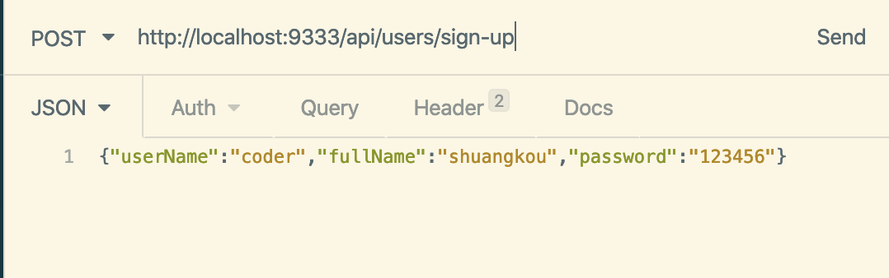

可以毫不夸张地说，这篇文章介绍的 Spring/SpringBoot 常用注解基本已经涵盖你工作中遇到的大部分常用的场景。对于每一个注解本文都提供了具体用法，掌握这些内容后，使用 Spring Boot 来开发项目基本没啥大问题了！

**为什么要写这篇文章？**

最近看到网上有一篇关于 Spring Boot 常用注解的文章被广泛转载，但文章内容存在一些误导性，可能对没有太多实际使用经验的开发者不太友好。于是我花了几天时间总结了这篇文章，希望能够帮助大家更好地理解和使用 Spring 注解。

**因为个人能力和精力有限，如果有任何错误或遗漏，欢迎指正！非常感激！**

## Spring Boot 基础注解

`@SpringBootApplication` 是 Spring Boot 应用的核心注解，通常用于标注主启动类。

示例：

```java
@SpringBootApplication
public class SpringSecurityJwtGuideApplication {
      public static void main(java.lang.String[] args) {
        SpringApplication.run(SpringSecurityJwtGuideApplication.class, args);
    }
}
```

我们可以把 `@SpringBootApplication`看作是下面三个注解的组合：

- **`@EnableAutoConfiguration`**：启用 Spring Boot 的自动配置机制。
- **`@ComponentScan`**：扫描 `@Component`、`@Service`、`@Repository`、`@Controller` 等注解的类。
- **`@Configuration`**：允许注册额外的 Spring Bean 或导入其他配置类。

源码如下：

```java
package org.springframework.boot.autoconfigure;
@Target(ElementType.TYPE)
@Retention(RetentionPolicy.RUNTIME)
@Documented
@Inherited
@SpringBootConfiguration
@EnableAutoConfiguration
@ComponentScan(excludeFilters = {
    @Filter(type = FilterType.CUSTOM, classes = TypeExcludeFilter.class),
    @Filter(type = FilterType.CUSTOM, classes = AutoConfigurationExcludeFilter.class) })
public @interface SpringBootApplication {
   ......
}

package org.springframework.boot;
@Target(ElementType.TYPE)
@Retention(RetentionPolicy.RUNTIME)
@Documented
@Configuration
public @interface SpringBootConfiguration {

}
```

## Spring Bean

### 依赖注入（Dependency Injection, DI）

`@Autowired` 用于自动注入依赖项（即其他 Spring Bean）。它可以标注在构造器、字段、Setter 方法或配置方法上，Spring 容器会自动查找匹配类型的 Bean 并将其注入。

```java
@Service
public class UserServiceImpl implements UserService {
    // ...
}

@RestController
public class UserController {
    // 字段注入
    @Autowired
    private UserService userService;
    // ...
}
```

当存在多个相同类型的 Bean 时，`@Autowired` 默认按类型注入可能产生歧义。此时，可以与 `@Qualifier` 结合使用，通过指定 Bean 的名称来精确选择需要注入的实例。

```java
@Repository("userRepositoryA")
public class UserRepositoryA implements UserRepository { /* ... */ }

@Repository("userRepositoryB")
public class UserRepositoryB implements UserRepository { /* ... */ }

@Service
public class UserService {
    @Autowired
    @Qualifier("userRepositoryA") // 指定注入名为 "userRepositoryA" 的 Bean
    private UserRepository userRepository;
    // ...
}
```

`@Primary`同样是为了解决同一类型存在多个 Bean 实例的注入问题。在 Bean 定义时（例如使用 `@Bean` 或类注解）添加 `@Primary` 注解，表示该 Bean 是**首选**的注入对象。当进行 `@Autowired` 注入时，如果没有使用 `@Qualifier` 指定名称，Spring 将优先选择带有 `@Primary` 的 Bean。

```java
@Primary // 将 UserRepositoryA 设为首选注入对象
@Repository("userRepositoryA")
public class UserRepositoryA implements UserRepository { /* ... */ }

@Repository("userRepositoryB")
public class UserRepositoryB implements UserRepository { /* ... */ }

@Service
public class UserService {
    @Autowired // 会自动注入 UserRepositoryA，因为它是 @Primary
    private UserRepository userRepository;
    // ...
}
```

`@Resource(name="beanName")`是 JSR-250 规范定义的注解，也用于依赖注入。它默认按**名称 (by Name)** 查找 Bean 进行注入，而 `@Autowired`默认按**类型 (by Type)** 。如果未指定 `name` 属性，它会尝试根据字段名或方法名查找，如果找不到，则回退到按类型查找（类似 `@Autowired`）。

`@Resource`只能标注在字段 和 Setter 方法上，不支持构造器注入。

```java
@Service
public class UserService {
    @Resource(name = "userRepositoryA")
    private UserRepository userRepository;
    // ...
}
```

### Bean 作用域

`@Scope("scopeName")` 定义 Spring Bean 的作用域，即 Bean 实例的生命周期和可见范围。常用的作用域包括：

- **singleton** : IoC 容器中只有唯一的 bean 实例。Spring 中的 bean 默认都是单例的，是对单例设计模式的应用。
- **prototype** : 每次获取都会创建一个新的 bean 实例。也就是说，连续 `getBean()` 两次，得到的是不同的 Bean 实例。
- **request** （仅 Web 应用可用）: 每一次 HTTP 请求都会产生一个新的 bean（请求 bean），该 bean 仅在当前 HTTP request 内有效。
- **session** （仅 Web 应用可用） : 每一次来自新 session 的 HTTP 请求都会产生一个新的 bean（会话 bean），该 bean 仅在当前 HTTP session 内有效。
- **application/global-session** （仅 Web 应用可用）：每个 Web 应用在启动时创建一个 Bean（应用 Bean），该 bean 仅在当前应用启动时间内有效。
- **websocket** （仅 Web 应用可用）：每一次 WebSocket 会话产生一个新的 bean。

```java
@Component
// 每次获取都会创建新的 PrototypeBean 实例
@Scope("prototype")
public class PrototypeBean {
    // ...
}
```

### Bean 注册

Spring 容器需要知道哪些类需要被管理为 Bean。除了使用 `@Bean` 方法显式声明（通常在 `@Configuration` 类中），更常见的方式是使用 Stereotype（构造型） 注解标记类，并配合组件扫描（Component Scanning）机制，让 Spring 自动发现并注册这些类作为 Bean。这些 Bean 后续可以通过 `@Autowired` 等方式注入到其他组件中。

下面是常见的一些注册 Bean 的注解：

- `@Component`：通用的注解，可标注任意类为 `Spring` 组件。如果一个 Bean 不知道属于哪个层，可以使用`@Component` 注解标注。
- `@Repository` : 对应持久层即 Dao 层，主要用于数据库相关操作。
- `@Service` : 对应服务层，主要涉及一些复杂的逻辑，需要用到 Dao 层。
- `@Controller` : 对应 Spring MVC 控制层，主要用于接受用户请求并调用 Service 层返回数据给前端页面。
- `@RestController`：一个组合注解，等效于 `@Controller` + `@ResponseBody`。它专门用于构建 RESTful Web 服务的控制器。标注了 `@RestController` 的类，其所有处理器方法（handler methods）的返回值都会被自动序列化（通常为 JSON）并写入 HTTP 响应体，而不是被解析为视图名称。

`@Controller` vs `@RestController`：

- `@Controller`：主要用于传统的 Spring MVC 应用，方法返回值通常是逻辑视图名，需要视图解析器配合渲染页面。如果需要返回数据（如 JSON），则需要在方法上额外添加 `@ResponseBody` 注解。
- `@RestController`：专为构建返回数据的 RESTful API 设计。类上使用此注解后，所有方法的返回值都会默认被视为响应体内容（相当于每个方法都隐式添加了 `@ResponseBody`），通常用于返回 JSON 或 XML 数据。在现代前后端分离的应用中，`@RestController` 是更常用的选择。

关于`@RestController` 和 `@Controller`的对比，请看这篇文章：[@RestController vs @Controller](https://mp.weixin.qq.com/s?__biz=Mzg2OTA0Njk0OA==&mid=2247485544&idx=1&sn=3cc95b88979e28fe3bfe539eb421c6d8&chksm=cea247a3f9d5ceb5e324ff4b8697adc3e828ecf71a3468445e70221cce768d1e722085359907&token=1725092312&lang=zh_CN#rd)。

## 配置

### 声明配置类

`@Configuration` 主要用于声明一个类是 Spring 的配置类。虽然也可以用 `@Component` 注解替代，但 `@Configuration` 能够更明确地表达该类的用途（定义 Bean），语义更清晰，也便于 Spring 进行特定的处理（例如，通过 CGLIB 代理确保 `@Bean` 方法的单例行为）。

```java
@Configuration
public class AppConfig {

    // @Bean 注解用于在配置类中声明一个 Bean
    @Bean
    public TransferService transferService() {
        return new TransferServiceImpl();
    }

    // 配置类中可以包含一个或多个 @Bean 方法。
}
```

### 读取配置信息

在应用程序开发中，我们经常需要管理一些配置信息，例如数据库连接细节、第三方服务（如阿里云 OSS、短信服务、微信认证）的密钥或地址等。通常，这些信息会**集中存放在配置文件**（如 `application.yml` 或 `application.properties`）中，方便管理和修改。

Spring 提供了多种便捷的方式来读取这些配置信息。假设我们有如下 `application.yml` 文件：

```yaml
wuhan2020: 2020年初武汉爆发了新型冠状病毒，疫情严重，但是，我相信一切都会过去！武汉加油！中国加油！

my-profile:
  name: Guide哥
  email: koushuangbwcx@163.com

library:
  location: 湖北武汉加油中国加油
  books:
    - name: 天才基本法
      description: 二十二岁的林朝夕在父亲确诊阿尔茨海默病这天，得知自己暗恋多年的校园男神裴之即将出国深造的消息——对方考取的学校，恰是父亲当年为她放弃的那所。
    - name: 时间的秩序
      description: 为什么我们记得过去，而非未来？时间“流逝”意味着什么？是我们存在于时间之内，还是时间存在于我们之中？卡洛·罗韦利用诗意的文字，邀请我们思考这一亘古难题——时间的本质。
    - name: 了不起的我
      description: 如何养成一个新习惯？如何让心智变得更成熟？如何拥有高质量的关系？ 如何走出人生的艰难时刻？
```

下面介绍几种常用的读取配置的方式：

1、`@Value("${property.key}")` 注入配置文件（如 `application.properties` 或 `application.yml`）中的单个属性值。它还支持 Spring 表达式语言 (SpEL)，可以实现更复杂的注入逻辑。

```java
@Value("${wuhan2020}")
String wuhan2020;
```

2、`@ConfigurationProperties`可以读取配置信息并与 Bean 绑定，用的更多一些。

```java
@Component
@ConfigurationProperties(prefix = "library")
class LibraryProperties {
    @NotEmpty
    private String location;
    private List<Book> books;

    @Setter
    @Getter
    @ToString
    static class Book {
        String name;
        String description;
    }
  省略getter/setter
  ......
}
```

你可以像使用普通的 Spring Bean 一样，将其注入到类中使用。

```java
@Service
public class LibraryService {

    private final LibraryProperties libraryProperties;

    @Autowired
    public LibraryService(LibraryProperties libraryProperties) {
        this.libraryProperties = libraryProperties;
    }

    public void printLibraryInfo() {
        System.out.println(libraryProperties);
    }
}
```

### 加载指定的配置文件

`@PropertySource` 注解允许加载自定义的配置文件。适用于需要将部分配置信息独立存储的场景。

```java
@Component
@PropertySource("classpath:website.properties")

class WebSite {
    @Value("${url}")
    private String url;

  省略getter/setter
  ......
}
```

**注意**：当使用 `@PropertySource` 时，确保外部文件路径正确，且文件在类路径（classpath）中。

更多内容请查看我的这篇文章：[10 分钟搞定 SpringBoot 如何优雅读取配置文件？](https://mp.weixin.qq.com/s?__biz=Mzg2OTA0Njk0OA==&mid=2247486181&idx=2&sn=10db0ae64ef501f96a5b0dbc4bd78786&chksm=cea2452ef9d5cc384678e456427328600971180a77e40c13936b19369672ca3e342c26e92b50&token=816772476&lang=zh_CN#rd) 。

## MVC

### HTTP 请求

**5 种常见的请求类型:**

- **GET**：请求从服务器获取特定资源。举个例子：`GET /users`（获取所有学生）
- **POST**：在服务器上创建一个新的资源。举个例子：`POST /users`（创建学生）
- **PUT**：更新服务器上的资源（客户端提供更新后的整个资源）。举个例子：`PUT /users/12`（更新编号为 12 的学生）
- **DELETE**：从服务器删除特定的资源。举个例子：`DELETE /users/12`（删除编号为 12 的学生）
- **PATCH**：更新服务器上的资源（客户端提供更改的属性，可以看做作是部分更新），使用的比较少，这里就不举例子了。

#### GET 请求

`@GetMapping("users")` 等价于`@RequestMapping(value="/users",method=RequestMethod.GET)`。

```java
@GetMapping("/users")
public ResponseEntity<List<User>> getAllUsers() {
 return userRepository.findAll();
}
```

#### POST 请求

`@PostMapping("users")` 等价于`@RequestMapping(value="/users",method=RequestMethod.POST)`。

`@PostMapping` 通常与 `@RequestBody` 配合，用于接收 JSON 数据并映射为 Java 对象。

```java
@PostMapping("/users")
public ResponseEntity<User> createUser(@Valid @RequestBody UserCreateRequest userCreateRequest) {
 return userRepository.save(userCreateRequest);
}
```

#### PUT 请求

`@PutMapping("/users/{userId}")` 等价于`@RequestMapping(value="/users/{userId}",method=RequestMethod.PUT)`。

```java
@PutMapping("/users/{userId}")
public ResponseEntity<User> updateUser(@PathVariable(value = "userId") Long userId,
  @Valid @RequestBody UserUpdateRequest userUpdateRequest) {
  ......
}
```

#### DELETE 请求

`@DeleteMapping("/users/{userId}")`等价于`@RequestMapping(value="/users/{userId}",method=RequestMethod.DELETE)`

```java
@DeleteMapping("/users/{userId}")
public ResponseEntity deleteUser(@PathVariable(value = "userId") Long userId){
  ......
}
```

#### PATCH 请求

一般实际项目中，我们都是 PUT 不够用了之后才用 PATCH 请求去更新数据。

```java
  @PatchMapping("/profile")
  public ResponseEntity updateStudent(@RequestBody StudentUpdateRequest studentUpdateRequest) {
        studentRepository.updateDetail(studentUpdateRequest);
        return ResponseEntity.ok().build();
    }
```

### 参数绑定

在处理 HTTP 请求时，Spring MVC 提供了多种注解用于绑定请求参数到方法参数中。以下是常见的参数绑定方式：

#### 从 URL 路径中提取参数

`@PathVariable` 用于从 URL 路径中提取参数。例如：

```java
@GetMapping("/klasses/{klassId}/teachers")
public List<Teacher> getTeachersByClass(@PathVariable("klassId") Long klassId) {
    return teacherService.findTeachersByClass(klassId);
}
```

若请求 URL 为 `/klasses/123/teachers`，则 `klassId = 123`。

#### 绑定查询参数

`@RequestParam` 用于绑定查询参数。例如：

```java
@GetMapping("/klasses/{klassId}/teachers")
public List<Teacher> getTeachersByClass(@PathVariable Long klassId,
                                        @RequestParam(value = "type", required = false) String type) {
    return teacherService.findTeachersByClassAndType(klassId, type);
}
```

若请求 URL 为 `/klasses/123/teachers?type=web`，则 `klassId = 123`，`type = web`。

#### 绑定请求体中的 JSON 数据

`@RequestBody` 用于读取 Request 请求（可能是 POST,PUT,DELETE,GET 请求）的 body 部分并且**Content-Type 为 application/json** 格式的数据，接收到数据之后会自动将数据绑定到 Java 对象上去。系统会使用`HttpMessageConverter`或者自定义的`HttpMessageConverter`将请求的 body 中的 json 字符串转换为 java 对象。

我用一个简单的例子来给演示一下基本使用！

我们有一个注册的接口：

```java
@PostMapping("/sign-up")
public ResponseEntity signUp(@RequestBody @Valid UserRegisterRequest userRegisterRequest) {
  userService.save(userRegisterRequest);
  return ResponseEntity.ok().build();
}
```

`UserRegisterRequest`对象：

```java
@Data
@AllArgsConstructor
@NoArgsConstructor
public class UserRegisterRequest {
    @NotBlank
    private String userName;
    @NotBlank
    private String password;
    @NotBlank
    private String fullName;
}
```

我们发送 post 请求到这个接口，并且 body 携带 JSON 数据：

```json
{ "userName": "coder", "fullName": "shuangkou", "password": "123456" }
```

这样我们的后端就可以直接把 json 格式的数据映射到我们的 `UserRegisterRequest` 类上。



**注意**：

- 一个方法只能有一个 `@RequestBody` 参数，但可以有多个 `@PathVariable` 和 `@RequestParam`。
- 如果需要接收多个复杂对象，建议合并成一个单一对象。

## 数据校验

数据校验是保障系统稳定性和安全性的关键环节。即使在用户界面（前端）已经实施了数据校验，**后端服务仍必须对接收到的数据进行再次校验**。这是因为前端校验可以被轻易绕过（例如，通过开发者工具修改请求或使用 Postman、curl 等 HTTP 工具直接调用 API），恶意或错误的数据可能直接发送到后端。因此，后端校验是防止非法数据、维护数据一致性、确保业务逻辑正确执行的最后一道，也是最重要的一道防线。

Bean Validation 是一套定义 JavaBean 参数校验标准的规范 (JSR 303, 349, 380)，它提供了一系列注解，可以直接用于 JavaBean 的属性上，从而实现便捷的参数校验。

- **JSR 303 (Bean Validation 1.0):** 奠定了基础，引入了核心校验注解（如 `@NotNull`、`@Size`、`@Min`、`@Max` 等），定义了如何通过注解的方式对 JavaBean 的属性进行校验，并支持嵌套对象校验和自定义校验器。
- **JSR 349 (Bean Validation 1.1):** 在 1.0 基础上进行扩展，例如引入了对方法参数和返回值校验的支持、增强了对分组校验（Group Validation）的处理。
- **JSR 380 (Bean Validation 2.0):** 拥抱 Java 8 的新特性，并进行了一些改进，例如支持 `java.time` 包中的日期和时间类型、引入了一些新的校验注解（如 `@NotEmpty`, `@NotBlank`等）。

Bean Validation 本身只是一套**规范（接口和注解）**，我们需要一个实现了这套规范的**具体框架**来执行校验逻辑。目前，**Hibernate Validator** 是 Bean Validation 规范最权威、使用最广泛的参考实现。

- Hibernate Validator 4.x 实现了 Bean Validation 1.0 (JSR 303)。
- Hibernate Validator 5.x 实现了 Bean Validation 1.1 (JSR 349)。
- Hibernate Validator 6.x 及更高版本实现了 Bean Validation 2.0 (JSR 380)。

在 Spring Boot 项目中使用 Bean Validation 非常方便，这得益于 Spring Boot 的自动配置能力。关于依赖引入，需要注意：

- 在较早版本的 Spring Boot（通常指 2.3.x 之前）中，`spring-boot-starter-web` 依赖默认包含了 hibernate-validator。因此，只要引入了 Web Starter，就无需额外添加校验相关的依赖。
- 从 Spring Boot 2.3.x 版本开始，为了更精细化的依赖管理，校验相关的依赖被移出了 spring-boot-starter-web。如果你的项目使用了这些或更新的版本，并且需要 Bean Validation 功能，那么你需要显式地添加 `spring-boot-starter-validation` 依赖：

```xml
<dependency>
    <groupId>org.springframework.boot</groupId>
    <artifactId>spring-boot-starter-validation</artifactId>
</dependency>
```


非 SpringBoot 项目需要自行引入相关依赖包，这里不多做讲解，具体可以查看我的这篇文章：[如何在 Spring/Spring Boot 中做参数校验？你需要了解的都在这里！](https://mp.weixin.qq.com/s?__biz=Mzg2OTA0Njk0OA==&mid=2247485783&idx=1&sn=a407f3b75efa17c643407daa7fb2acd6&chksm=cea2469cf9d5cf8afbcd0a8a1c9cc4294d6805b8e01bee6f76bb2884c5bc15478e91459def49&token=292197051&lang=zh_CN#rd)。

👉 需要注意的是：所有的注解，推荐使用 JSR 注解，即`javax.validation.constraints`，而不是`org.hibernate.validator.constraints`

### 一些常用的字段验证的注解

Bean Validation 规范及其实现（如 Hibernate Validator）提供了丰富的注解，用于声明式地定义校验规则。以下是一些常用的注解及其说明：

- `@NotNull`: 检查被注解的元素（任意类型）不能为 `null`。
- `@NotEmpty`: 检查被注解的元素（如 `CharSequence`、`Collection`、`Map`、`Array`）不能为 `null` 且其大小/长度不能为 0。注意：对于字符串，`@NotEmpty` 允许包含空白字符的字符串，如 `" "`。
- `@NotBlank`: 检查被注解的 `CharSequence`（如 `String`）不能为 `null`，并且去除首尾空格后的长度必须大于 0。（即，不能为空白字符串）。
- `@Null`: 检查被注解的元素必须为 `null`。
- `@AssertTrue` / `@AssertFalse`: 检查被注解的 `boolean` 或 `Boolean` 类型元素必须为 `true` / `false`。
- `@Min(value)` / `@Max(value)`: 检查被注解的数字类型（或其字符串表示）的值必须大于等于 / 小于等于指定的 `value`。适用于整数类型（`byte`、`short`、`int`、`long`、`BigInteger` 等）。
- `@DecimalMin(value)` / `@DecimalMax(value)`: 功能类似 `@Min` / `@Max`，但适用于包含小数的数字类型（`BigDecimal`、`BigInteger`、`CharSequence`、`byte`、`short`、`int`、`long`及其包装类）。 `value` 必须是数字的字符串表示。
- `@Size(min=, max=)`: 检查被注解的元素（如 `CharSequence`、`Collection`、`Map`、`Array`）的大小/长度必须在指定的 `min` 和 `max` 范围之内（包含边界）。
- `@Digits(integer=, fraction=)`: 检查被注解的数字类型（或其字符串表示）的值，其整数部分的位数必须 ≤ `integer`，小数部分的位数必须 ≤ `fraction`。
- `@Pattern(regexp=, flags=)`: 检查被注解的 `CharSequence`（如 `String`）是否匹配指定的正则表达式 (`regexp`)。`flags` 可以指定匹配模式（如不区分大小写）。
- `@Email`: 检查被注解的 `CharSequence`（如 `String`）是否符合 Email 格式（内置了一个相对宽松的正则表达式）。
- `@Past` / `@Future`: 检查被注解的日期或时间类型（`java.util.Date`、`java.util.Calendar`、JSR 310 `java.time` 包下的类型）是否在当前时间之前 / 之后。
- `@PastOrPresent` / `@FutureOrPresent`: 类似 `@Past` / `@Future`，但允许等于当前时间。
- ……

### 验证请求体(RequestBody)

当 Controller 方法使用 `@RequestBody` 注解来接收请求体并将其绑定到一个对象时，可以在该参数前添加 `@Valid` 注解来触发对该对象的校验。如果验证失败，它将抛出`MethodArgumentNotValidException`。

```java
@Data
@AllArgsConstructor
@NoArgsConstructor
public class Person {
    @NotNull(message = "classId 不能为空")
    private String classId;

    @Size(max = 33)
    @NotNull(message = "name 不能为空")
    private String name;

    @Pattern(regexp = "((^Man$|^Woman$|^UGM$))", message = "sex 值不在可选范围")
    @NotNull(message = "sex 不能为空")
    private String sex;

    @Email(message = "email 格式不正确")
    @NotNull(message = "email 不能为空")
    private String email;
}


@RestController
@RequestMapping("/api")
public class PersonController {
    @PostMapping("/person")
    public ResponseEntity<Person> getPerson(@RequestBody @Valid Person person) {
        return ResponseEntity.ok().body(person);
    }
}
```

### 验证请求参数(Path Variables 和 Request Parameters)

对于直接映射到方法参数的简单类型数据（如路径变量 `@PathVariable` 或请求参数 `@RequestParam`），校验方式略有不同：

1. **在 Controller 类上添加 `@Validated` 注解**：这个注解是 Spring 提供的（非 JSR 标准），它使得 Spring 能够处理方法级别的参数校验注解。**这是必需步骤。**
2. **将校验注解直接放在方法参数上**：将 `@Min`, `@Max`, `@Size`, `@Pattern` 等校验注解直接应用于对应的 `@PathVariable` 或 `@RequestParam` 参数。

一定一定不要忘记在类上加上 `@Validated` 注解了，这个参数可以告诉 Spring 去校验方法参数。

```java
@RestController
@RequestMapping("/api")
@Validated // 关键步骤 1: 必须在类上添加 @Validated
public class PersonController {

    @GetMapping("/person/{id}")
    public ResponseEntity<Integer> getPersonByID(
            @PathVariable("id")
            @Max(value = 5, message = "ID 不能超过 5") // 关键步骤 2: 校验注解直接放在参数上
            Integer id
    ) {
        // 如果传入的 id > 5，Spring 会在进入方法体前抛出 ConstraintViolationException 异常。
        // 全局异常处理器同样需要处理此异常。
        return ResponseEntity.ok().body(id);
    }

    @GetMapping("/person")
    public ResponseEntity<String> findPersonByName(
            @RequestParam("name")
            @NotBlank(message = "姓名不能为空") // 同样适用于 @RequestParam
            @Size(max = 10, message = "姓名长度不能超过 10")
            String name
    ) {
        return ResponseEntity.ok().body("Found person: " + name);
    }
}
```

## 全局异常处理

介绍一下我们 Spring 项目必备的全局处理 Controller 层异常。

**相关注解：**

1. `@ControllerAdvice` :注解定义全局异常处理类
2. `@ExceptionHandler` :注解声明异常处理方法

如何使用呢？拿我们在第 5 节参数校验这块来举例子。如果方法参数不对的话就会抛出`MethodArgumentNotValidException`，我们来处理这个异常。

```java
@ControllerAdvice
@ResponseBody
public class GlobalExceptionHandler {

    /**
     * 请求参数异常处理
     */
    @ExceptionHandler(MethodArgumentNotValidException.class)
    public ResponseEntity<?> handleMethodArgumentNotValidException(MethodArgumentNotValidException ex, HttpServletRequest request) {
       ......
    }
}
```

更多关于 Spring Boot 异常处理的内容，请看我的这两篇文章：

1. [SpringBoot 处理异常的几种常见姿势](https://mp.weixin.qq.com/s?__biz=Mzg2OTA0Njk0OA==&mid=2247485568&idx=2&sn=c5ba880fd0c5d82e39531fa42cb036ac&chksm=cea2474bf9d5ce5dcbc6a5f6580198fdce4bc92ef577579183a729cb5d1430e4994720d59b34&token=2133161636&lang=zh_CN#rd)
2. [使用枚举简单封装一个优雅的 Spring Boot 全局异常处理！](https://mp.weixin.qq.com/s?__biz=Mzg2OTA0Njk0OA==&mid=2247486379&idx=2&sn=48c29ae65b3ed874749f0803f0e4d90e&chksm=cea24460f9d5cd769ed53ad7e17c97a7963a89f5350e370be633db0ae8d783c3a3dbd58c70f8&token=1054498516&lang=zh_CN#rd)

## 事务

在要开启事务的方法上使用`@Transactional`注解即可!

```java
@Transactional(rollbackFor = Exception.class)
public void save() {
  ......
}

```

我们知道 Exception 分为运行时异常 RuntimeException 和非运行时异常。在`@Transactional`注解中如果不配置`rollbackFor`属性,那么事务只会在遇到`RuntimeException`的时候才会回滚,加上`rollbackFor=Exception.class`,可以让事务在遇到非运行时异常时也回滚。

`@Transactional` 注解一般可以作用在`类`或者`方法`上。

- **作用于类**：当把`@Transactional` 注解放在类上时，表示所有该类的 public 方法都配置相同的事务属性信息。
- **作用于方法**：当类配置了`@Transactional`，方法也配置了`@Transactional`，方法的事务会覆盖类的事务配置信息。

更多关于 Spring 事务的内容请查看我的这篇文章：[可能是最漂亮的 Spring 事务管理详解](./spring-transaction.md) 。

## JPA

Spring Data JPA 提供了一系列注解和功能，帮助开发者轻松实现 ORM（对象关系映射）。

### 创建表

`@Entity` 用于声明一个类为 JPA 实体类，与数据库中的表映射。`@Table` 指定实体对应的表名。

```java
@Entity
@Table(name = "role")
public class Role {

    @Id
    @GeneratedValue(strategy = GenerationType.IDENTITY)
    private Long id;

    private String name;
    private String description;

    // 省略 getter/setter
}
```

### 主键生成策略

`@Id`声明字段为主键。`@GeneratedValue` 指定主键的生成策略。

JPA 提供了 4 种主键生成策略：

- **`GenerationType.TABLE`**：通过数据库表生成主键。
- **`GenerationType.SEQUENCE`**：通过数据库序列生成主键（适用于 Oracle 等数据库）。
- **`GenerationType.IDENTITY`**：主键自增长（适用于 MySQL 等数据库）。
- **`GenerationType.AUTO`**：由 JPA 自动选择合适的生成策略（默认策略）。

```java
@Id
@GeneratedValue(strategy = GenerationType.IDENTITY)
private Long id;
```

通过 `@GenericGenerator` 声明自定义主键生成策略：

```java
@Id
@GeneratedValue(generator = "IdentityIdGenerator")
@GenericGenerator(name = "IdentityIdGenerator", strategy = "identity")
private Long id;
```

等价于：

```java
@Id
@GeneratedValue(strategy = GenerationType.IDENTITY)
private Long id;
```

JPA 提供的主键生成策略有如下几种：

```java
public class DefaultIdentifierGeneratorFactory
    implements MutableIdentifierGeneratorFactory, Serializable, ServiceRegistryAwareService {

  @SuppressWarnings("deprecation")
  public DefaultIdentifierGeneratorFactory() {
    register( "uuid2", UUIDGenerator.class );
    register( "guid", GUIDGenerator.class );      // can be done with UUIDGenerator + strategy
    register( "uuid", UUIDHexGenerator.class );      // "deprecated" for new use
    register( "uuid.hex", UUIDHexGenerator.class );   // uuid.hex is deprecated
    register( "assigned", Assigned.class );
    register( "identity", IdentityGenerator.class );
    register( "select", SelectGenerator.class );
    register( "sequence", SequenceStyleGenerator.class );
    register( "seqhilo", SequenceHiLoGenerator.class );
    register( "increment", IncrementGenerator.class );
    register( "foreign", ForeignGenerator.class );
    register( "sequence-identity", SequenceIdentityGenerator.class );
    register( "enhanced-sequence", SequenceStyleGenerator.class );
    register( "enhanced-table", TableGenerator.class );
  }

  public void register(String strategy, Class generatorClass) {
    LOG.debugf( "Registering IdentifierGenerator strategy [%s] -> [%s]", strategy, generatorClass.getName() );
    final Class previous = generatorStrategyToClassNameMap.put( strategy, generatorClass );
    if ( previous != null ) {
      LOG.debugf( "    - overriding [%s]", previous.getName() );
    }
  }

}
```

### 字段映射

`@Column` 用于指定实体字段与数据库列的映射关系。

- **`name`**：指定数据库列名。
- **`nullable`**：指定是否允许为 `null`。
- **`length`**：设置字段的长度（仅适用于 `String` 类型）。
- **`columnDefinition`**：指定字段的数据库类型和默认值。

```java
@Column(name = "user_name", nullable = false, length = 32)
private String userName;

@Column(columnDefinition = "tinyint(1) default 1")
private Boolean enabled;
```

### 忽略字段

`@Transient` 用于声明不需要持久化的字段。

```java
@Entity
public class User {

    @Transient
    private String temporaryField; // 不会映射到数据库表中
}
```

其他不被持久化的字段方式：

- **`static`**：静态字段不会被持久化。
- **`final`**：最终字段不会被持久化。
- **`transient`**：使用 Java 的 `transient` 关键字声明的字段不会被序列化或持久化。

### 大字段存储

`@Lob` 用于声明大字段（如 `CLOB` 或 `BLOB`）。

```java
@Lob
@Column(name = "content", columnDefinition = "LONGTEXT NOT NULL")
private String content;
```

### 枚举类型映射

`@Enumerated` 用于将枚举类型映射为数据库字段。

- **`EnumType.ORDINAL`**：存储枚举的序号（默认）。
- **`EnumType.STRING`**：存储枚举的名称（推荐）。

```java
public enum Gender {
    MALE,
    FEMALE
}

@Entity
public class User {

    @Enumerated(EnumType.STRING)
    private Gender gender;
}
```

数据库中存储的值为 `MALE` 或 `FEMALE`。

### 审计功能

通过 JPA 的审计功能，可以在实体中自动记录创建时间、更新时间、创建人和更新人等信息。

审计基类:

```java
@Data
@MappedSuperclass
@EntityListeners(AuditingEntityListener.class)
public abstract class AbstractAuditBase {

    @CreatedDate
    @Column(updatable = false)
    private Instant createdAt;

    @LastModifiedDate
    private Instant updatedAt;

    @CreatedBy
    @Column(updatable = false)
    private String createdBy;

    @LastModifiedBy
    private String updatedBy;
}
```

配置审计功能:

```java
@Configuration
@EnableJpaAuditing
public class AuditConfig {

    @Bean
    public AuditorAware<String> auditorProvider() {
        return () -> Optional.ofNullable(SecurityContextHolder.getContext())
                .map(SecurityContext::getAuthentication)
                .filter(Authentication::isAuthenticated)
                .map(Authentication::getName);
    }
}
```

简单介绍一下上面涉及到的一些注解：

1. `@CreatedDate`: 表示该字段为创建时间字段，在这个实体被 insert 的时候，会设置值
2. `@CreatedBy` :表示该字段为创建人，在这个实体被 insert 的时候，会设置值 `@LastModifiedDate`、`@LastModifiedBy`同理。
3. `@EnableJpaAuditing`：开启 JPA 审计功能。

### 修改和删除操作

`@Modifying` 注解用于标识修改或删除操作，必须与 `@Transactional` 一起使用。

```java
@Repository
public interface UserRepository extends JpaRepository<User, Long> {

    @Modifying
    @Transactional
    void deleteByUserName(String userName);
}
```

### 关联关系

JPA 提供了 4 种关联关系的注解：

- **`@OneToOne`**：一对一关系。
- **`@OneToMany`**：一对多关系。
- **`@ManyToOne`**：多对一关系。
- **`@ManyToMany`**：多对多关系。

```java
@Entity
public class User {

    @OneToOne
    private Profile profile;

    @OneToMany(mappedBy = "user")
    private List<Order> orders;
}
```

## JSON 数据处理

在 Web 开发中，经常需要处理 Java 对象与 JSON 格式之间的转换。Spring 通常集成 Jackson 库来完成此任务，以下是一些常用的 Jackson 注解，可以帮助我们定制化 JSON 的序列化（Java 对象转 JSON）和反序列化（JSON 转 Java 对象）过程。

### 过滤 JSON 字段

有时我们不希望 Java 对象的某些字段被包含在最终生成的 JSON 中，或者在将 JSON 转换为 Java 对象时不处理某些 JSON 属性。

`@JsonIgnoreProperties` 作用在类上用于过滤掉特定字段不返回或者不解析。

```java
// 在生成 JSON 时忽略 userRoles 属性
// 如果允许未知属性（即 JSON 中有而类中没有的属性），可以添加 ignoreUnknown = true
@JsonIgnoreProperties({"userRoles"})
public class User {
    private String userName;
    private String fullName;
    private String password;
    private List<UserRole> userRoles = new ArrayList<>();
    // getters and setters...
}
```

`@JsonIgnore`作用于字段或`getter/setter` 方法级别，用于指定在序列化或反序列化时忽略该特定属性。

```java
public class User {
    private String userName;
    private String fullName;
    private String password;

    // 在生成 JSON 时忽略 userRoles 属性
    @JsonIgnore
    private List<UserRole> userRoles = new ArrayList<>();
    // getters and setters...
}
```

`@JsonIgnoreProperties` 更适用于在类定义时明确排除多个字段，或继承场景下的字段排除；`@JsonIgnore` 则更直接地用于标记单个具体字段。

### 格式化 JSON 数据

`@JsonFormat` 用于指定属性在序列化和反序列化时的格式。常用于日期时间类型的格式化。

比如：

```java
// 指定 Date 类型序列化为 ISO 8601 格式字符串，并设置时区为 GMT
@JsonFormat(shape = JsonFormat.Shape.STRING, pattern = "yyyy-MM-dd'T'HH:mm:ss.SSS'Z'", timezone = "GMT")
private Date date;
```

### 扁平化 JSON 对象

`@JsonUnwrapped` 注解作用于字段上，用于在序列化时将其嵌套对象的属性“提升”到当前对象的层级，反序列化时执行相反操作。这可以使 JSON 结构更扁平。

假设有 `Account` 类，包含 `Location` 和 `PersonInfo` 两个嵌套对象。

```java
@Getter
@Setter
@ToString
public class Account {
    private Location location;
    private PersonInfo personInfo;

  @Getter
  @Setter
  @ToString
  public static class Location {
     private String provinceName;
     private String countyName;
  }
  @Getter
  @Setter
  @ToString
  public static class PersonInfo {
    private String userName;
    private String fullName;
  }
}

```

未扁平化之前的 JSON 结构：

```json
{
  "location": {
    "provinceName": "湖北",
    "countyName": "武汉"
  },
  "personInfo": {
    "userName": "coder1234",
    "fullName": "shaungkou"
  }
}
```

使用`@JsonUnwrapped` 扁平对象：

```java
@Getter
@Setter
@ToString
public class Account {
    @JsonUnwrapped
    private Location location;
    @JsonUnwrapped
    private PersonInfo personInfo;
    ......
}
```

扁平化后的 JSON 结构：

```json
{
  "provinceName": "湖北",
  "countyName": "武汉",
  "userName": "coder1234",
  "fullName": "shaungkou"
}
```

## 测试

`@ActiveProfiles`一般作用于测试类上， 用于声明生效的 Spring 配置文件。

```java
// 指定在 RANDOM_PORT 上启动应用上下文，并激活 "test" profile
@SpringBootTest(webEnvironment = SpringBootTest.WebEnvironment.RANDOM_PORT)
@ActiveProfiles("test")
@Slf4j
public abstract class TestBase {
    // Common test setup or abstract methods...
}
```

`@Test` 是 JUnit 框架（通常是 JUnit 5 Jupiter）提供的注解，用于标记一个方法为测试方法。虽然不是 Spring 自身的注解，但它是执行单元测试和集成测试的基础。

`@Transactional`被声明的测试方法的数据会回滚，避免污染测试数据。

`@WithMockUser` 是 Spring Security Test 模块提供的注解，用于在测试期间模拟一个已认证的用户。可以方便地指定用户名、密码、角色（authorities）等信息，从而测试受安全保护的端点或方法。

```java
public class MyServiceTest extends TestBase { // Assuming TestBase provides Spring context

    @Test
    @Transactional // 测试数据将回滚
    @WithMockUser(username = "test-user", authorities = { "ROLE_TEACHER", "read" }) // 模拟一个名为 "test-user"，拥有 TEACHER 角色和 read 权限的用户
    void should_perform_action_requiring_teacher_role() throws Exception {
        // ... 测试逻辑 ...
        // 这里可以调用需要 "ROLE_TEACHER" 权限的服务方法
    }
}
```

<!-- @include: @article-footer.snippet.md -->
