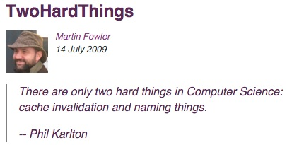
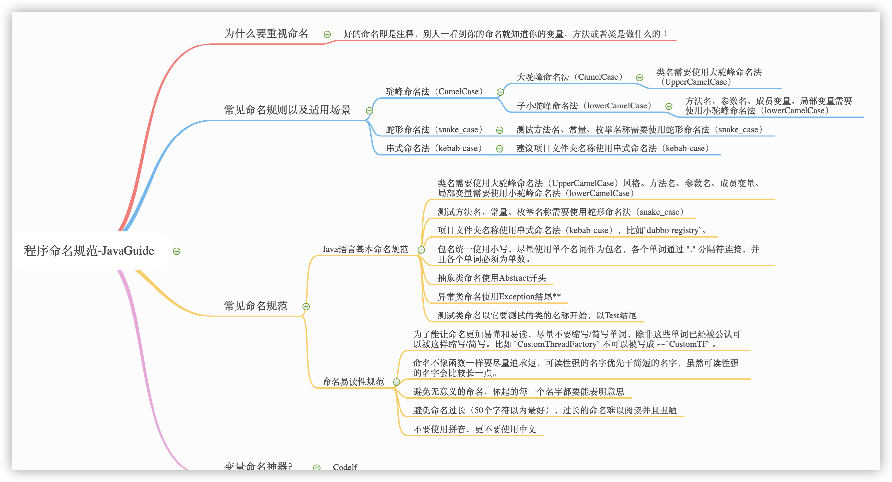

编程过程中，有太多太多让我们头疼的事情了，比如命名、维护其他人的代码、写测试、与其他人沟通交流等等。就连世界级软件大师 **Martin Fowler** 大神都说过 CS 领域有两大最难的事情，一是**缓存失效**，一是**程序命名**（@ [https://martinfowler.com/bliki/TwoHardThings.html](https://martinfowler.com/bliki/TwoHardThings.html)）。



今天 Guide 就单独拎出 “**命名**” 来聊聊，据说之前在 Quora 网站，由接近 5000 名程序员票选出来的最难的事情就是“命名”。

这篇文章配合我之前发的 [《编码 5 分钟，命名 2 小时？史上最全的 Java 命名规范参考！》](https://mp.weixin.qq.com/s?__biz=Mzg2OTA0Njk0OA==&mid=2247486449&idx=1&sn=c3b502529ff991c7180281bcc22877af&chksm=cea2443af9d5cd2c1c87049ed15ccf6f88275419c7dbe542406166a703b27d0f3ecf2af901f8&token=999884676&lang=zh_CN#rd) 这篇文章阅读效果更佳哦！

## 为什么需要重视命名？

**好的命名即是注释，别人一看到你的命名就知道你的变量、方法或者类是做什么的！** 好的命名对于其他人（包括你自己）理解你的代码有着很大的帮助！

简单举个例子说明一下命名的重要性。

《Clean Code》这本书明确指出：

> **好的代码本身就是注释，我们要尽量规范和美化自己的代码来减少不必要的注释。**
>
> **若编程语言足够有表达力，就不需要注释，尽量通过代码来阐述。**
>
> 举个例子：
>
> 去掉下面复杂的注释，只需要创建一个与注释所言同一事物的函数即可
>
> ```java
> // check to see if the employee is eligible for full benefits
> if ((employee.flags & HOURLY_FLAG) && (employee.age > 65))
> ```
>
> 应替换为
>
> ```java
> if (employee.isEligibleForFullBenefits())
> ```

## 常见命名规则以及适用场景

这里只介绍 3 种最常见的命名规范。

### 驼峰命名法（CamelCase）

驼峰命名法应该我们最常见的一个，这种命名方式使用大小写混合的格式来区别各个单词，并且单词之间不使用空格隔开或者连接字符连接的命名方式

#### 大驼峰命名法（CamelCase）

**类名需要使用大驼峰命名法（UpperCamelCase）**

正例：

```java
ServiceDiscovery、ServiceInstance、LruCacheFactory
```

反例：

```java
serviceDiscovery、Serviceinstance、LRUCacheFactory
```

#### 小驼峰命名法（lowerCamelCase）

**方法名、参数名、成员变量、局部变量需要使用小驼峰命名法（lowerCamelCase）。**

正例：

```java
getUserInfo()、createCustomThreadPool()、setNameFormat(String nameFormat)
Uservice userService;
```

反例：

```java
GetUserInfo()、CreateCustomThreadPool()、setNameFormat(String NameFormat)
Uservice user_service
```

### 蛇形命名法（snake_case）

**测试方法名、常量、枚举名称需要使用蛇形命名法（snake_case）**

在蛇形命名法中，各个单词之间通过下划线“\_”连接，比如`should_get_200_status_code_when_request_is_valid`、`CLIENT_CONNECT_SERVER_FAILURE`。

蛇形命名法的优势是命名所需要的单词比较多的时候，比如我把上面的命名通过小驼峰命名法给大家看一下：“shouldGet200StatusCodoWhenRequestIsValid”。**感觉如何？ 相比于使用蛇形命名法（snake_case）来说是不是不那么易读？\*\***

正例：

```java
@Test
void should_get_200_status_code_when_request_is_valid() {
  ......
}
```

反例：

```java
@Test
void shouldGet200StatusCodoWhenRequestIsValid() {
  ......
}
```

### 串式命名法（kebab-case）

在串式命名法中，各个单词之间通过下划线“-”连接，比如`dubbo-registry`。

建议项目文件夹名称使用串式命名法（kebab-case），比如 dubbo 项目的各个模块的命名是下面这样的。


## 常见命名规范

### Java 语言基本命名规范

**1.类名需要使用大驼峰命名法（UpperCamelCase）风格。方法名、参数名、成员变量、局部变量需要使用小驼峰命名法（lowerCamelCase）。**

**2.测试方法名、常量、枚举名称需要使用蛇形命名法（snake_case）**，比如`should_get_200_status_code_when_request_is_valid`、`CLIENT_CONNECT_SERVER_FAILURE`。并且，**测试方法名称要求全部小写，常量以及枚举名称需要全部大写。**

**3.项目文件夹名称使用串式命名法（kebab-case），比如`dubbo-registry`。**

**4.包名统一使用小写，尽量使用单个名词作为包名，各个单词通过 "." 分隔符连接，并且各个单词必须为单数。**

正例： `org.apache.dubbo.common.threadlocal`

反例： ~~`org.apache.dubbo.common.threadLocal`~~

**5.抽象类命名使用 Abstract 开头**。

```java
//为远程传输部分抽象出来的一个抽象类（出处：Dubbo源码）
public abstract class AbstractClient extends AbstractEndpoint implements Client {

}
```

**6.异常类命名使用 Exception 结尾。**

```java
//自定义的 NoSuchMethodException（出处：Dubbo源码）
public class NoSuchMethodException extends RuntimeException {
    private static final long serialVersionUID = -2725364246023268766L;

    public NoSuchMethodException() {
        super();
    }

    public NoSuchMethodException(String msg) {
        super(msg);
    }
}
```

**7.测试类命名以它要测试的类的名称开始，以 Test 结尾。**

```java
//为 AnnotationUtils 类写的测试类（出处：Dubbo源码）
public class AnnotationUtilsTest {
  ......
}
```

POJO 类中布尔类型的变量，都不要加 is 前缀，否则部分框架解析会引起序列化错误。

如果模块、接口、类、方法使用了设计模式，在命名时需体现出具体模式。

### 命名易读性规范

**1.为了能让命名更加易懂和易读，尽量不要缩写/简写单词，除非这些单词已经被公认可以被这样缩写/简写。比如 `CustomThreadFactory` 不可以被写成 ~~`CustomTF` 。**

**2.命名不像函数一样要尽量追求短，可读性强的名字优先于简短的名字，虽然可读性强的名字会比较长一点。** 这个对应我们上面说的第 1 点。

**3.避免无意义的命名，你起的每一个名字都要能表明意思。**

正例：`UserService userService;` `int userCount`;

反例: ~~`UserService service`~~ ~~`int count`~~

**4.避免命名过长（50 个字符以内最好），过长的命名难以阅读并且丑陋。**

5.**不要使用拼音，更不要使用中文。** 注意：像 alibaba 、wuhan、taobao 这种国际通用名词可以当做英文来看待。

正例：discount

反例：~~dazhe~~

## Codelf:变量命名神器?

这是一个由国人开发的网站，网上有很多人称其为变量命名神器， Guide 在实际使用了几天之后感觉没那么好用。小伙伴们可以自行体验一下，然后再给出自己的判断。

Codelf 提供了在线网站版本，网址：[https://unbug.github.io/codelf/](https://unbug.github.io/codelf/)，具体使用情况如下：

我选择了 Java 编程语言，然后搜索了“序列化”这个关键词，然后它就返回了很多关于序列化的命名。


并且，Codelf 还提供了 VS code 插件，看这个评价，看来大家还是很喜欢这款命名工具的。


## 总结

Guide 制作了一个涵盖上面所有重要内容的思维导图，便于小伙伴们日后查阅。



## 其他推荐阅读

1. 《阿里巴巴 Java 开发手册》
2. 《Clean Code》
3. Google Java 代码指南：https://google.github.io/styleguide/javaguide.html#s5.1-identifier-name
4. 告别编码5分钟，命名2小时！史上最全的Java命名规范参考：https://www.cnblogs.com/liqiangchn/p/12000361.html 


