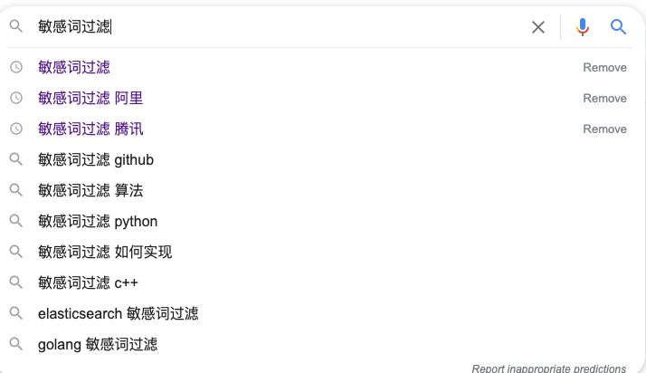
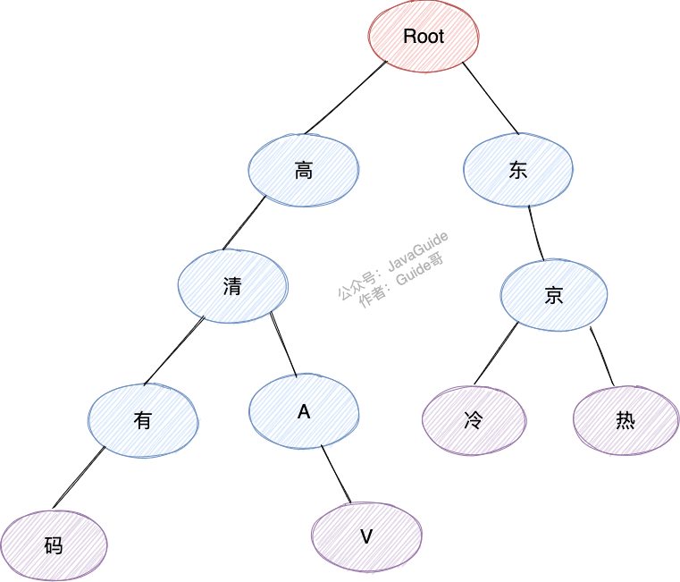
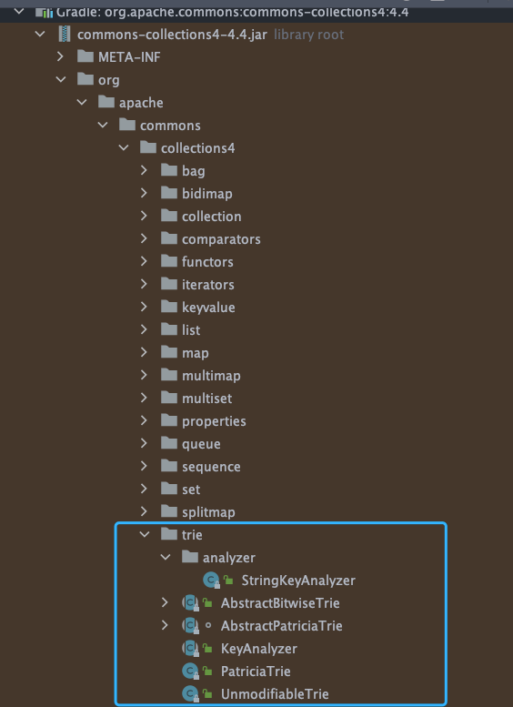

我们的系统需要对用户输入的文本进行敏感词过滤如色情、政治、暴力相关的词汇。

敏感词过滤用的使用比较多的 **Trie 树算法** 和 **DFA 算法**。

## Trie 树

**Trie 树** 也称为字典树、单词查找树，哈系数的一种变种，通常被用于字符串匹配，用来解决在一组字符串集合中快速查找某个字符串的问题。像浏览器搜索的关键词提示一般就是基于 Trie 树来做的。



假如我们的敏感词库中有以下敏感词：

- 高清有码
- 高清AV
- 东京冷
- 东京热

我们构造出来的敏感词Trie树就是下面这样的：




当我们要查找对应的字符串“东京热”的话，我们会把这个字符串切割成单个的字符“东”、“京”、“热”，然后我们从 Trie 树的根节点开始匹配。

可以看出， **Trie 树的核心原理其实很简单，就是通过公共前缀来提高字符串匹配效率。**

[Apache Commons Collecions](https://mvnrepository.com/artifact/org.apache.commons/commons-collections4) 这个库中就有 Trie 树实现：



```java
Trie<String, String> trie = new PatriciaTrie<>();
trie.put("Abigail", "student");
trie.put("Abi", "doctor");
trie.put("Annabel", "teacher");
trie.put("Christina", "student");
trie.put("Chris", "doctor");
Assertions.assertTrue(trie.containsKey("Abigail"));
assertEquals("{Abi=doctor, Abigail=student}", trie.prefixMap("Abi").toString());
assertEquals("{Chris=doctor, Christina=student}", trie.prefixMap("Chr").toString());
```

Aho-Corasick（AC）自动机是一种建立在Trie 树上的一种改进算法，是一种多模式匹配算法，由贝尔实验室的研究人员Alfred V. Aho 和 Margaret J.Corasick 发明。

AC自动机算法使用Trie 树来存放模式串的前缀，通过失败匹配指针（失配指针）来处理匹配失败的跳转。

相关阅读：[地铁十分钟 | AC自动机](https://zhuanlan.zhihu.com/p/146369212)

## DFA

DFA（Deterministic Finite Automaton)即确定有穷自动机。


