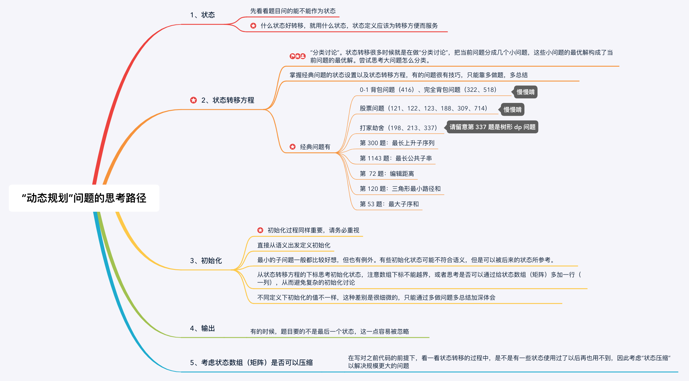

# 动态规划
### 动态规划的定义

### leetcode 动态规划的xmind的大纲

动态规划：多阶段决策过程，每步求解的问题是后面阶段求解问题的子问题。每步决策将依赖于以前步骤的决策结果。
适用条件：问题要满足优化原则或者最优子结构性质，即：一个最优决策序列的任何子序列本身一定是相对于子序列的初始和结束状态的最优决策序列。

可以这么认为：每一个子问题最优，会导致最终结果最优。

步骤1： 子问题划分（得到状态）
步骤2： 根据子问题之间的依赖关系，得到优化函数的递推公式（得到转换方程）

